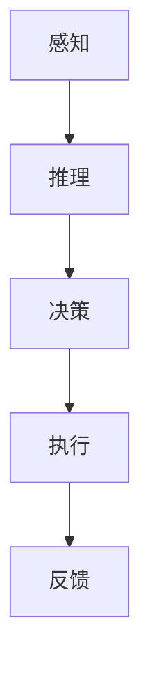
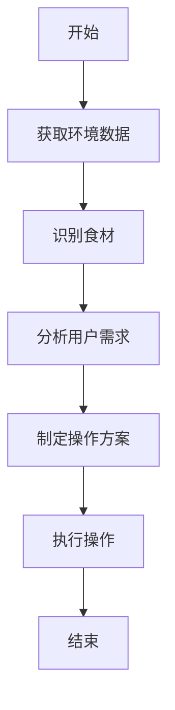
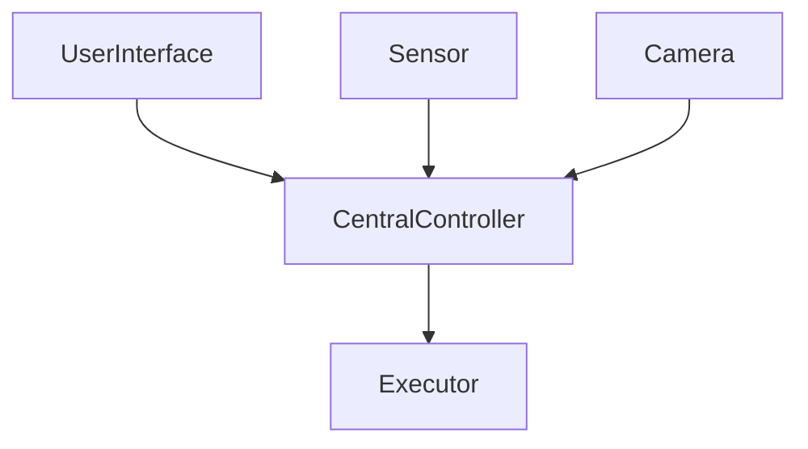
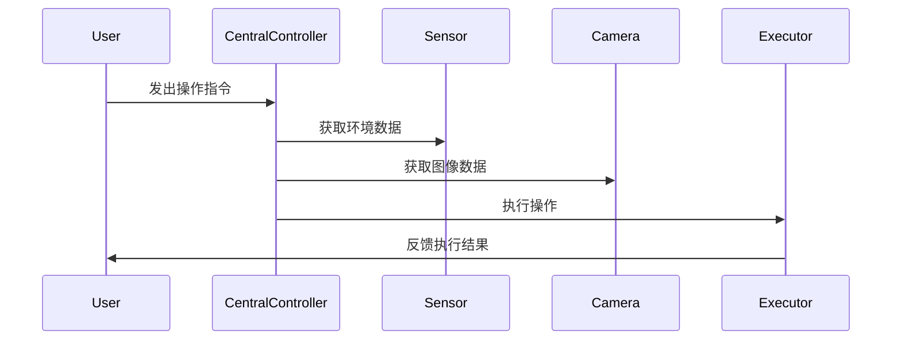

                 


# 智能厨房吊柜：AI Agent的厨房效率提升建议

## 关键词：智能厨房吊柜、AI Agent、厨房效率、系统架构、算法原理、项目实战

## 摘要：本文探讨了智能厨房吊柜如何通过AI Agent技术提升厨房效率。首先介绍了智能厨房吊柜的现状和问题背景，然后详细讲解了AI Agent的核心概念与原理，包括感知、推理、决策和执行过程。接着分析了AI Agent的算法原理，通过mermaid流程图和数学模型展示了其工作流程。随后，设计了智能厨房吊柜的系统架构，包括功能模块、数据流、接口设计和交互流程。最后，通过项目实战部分，详细指导如何安装环境、编写代码实现AI Agent功能，并分析了实际案例。本文旨在为技术人员和厨房设备制造商提供理论与实践相结合的指导。

---

## 第一部分：智能厨房吊柜的背景与问题背景

### 第1章：智能厨房吊柜的现状与问题背景

#### 1.1 智能厨房吊柜的现状

- 1.1.1 厨房智能化的现状
  - 当今智能家居发展迅速，厨房设备逐渐智能化。
  - 用户对厨房效率和便捷性的需求日益增加。
  - 智能厨房吊柜作为一种新兴产品，市场需求增长迅速。

- 1.1.2 智能吊柜的市场发展
  - 市场上已出现多种智能吊柜产品，但功能和性能参差不齐。
  - 智能吊柜的普及率逐步提高，但应用场景仍需进一步扩展。

- 1.1.3 用户对厨房效率提升的需求
  - 用户希望减少厨房操作时间，提升食材管理效率。
  - 对食材保质期管理、厨具使用优化的需求增加。

#### 1.2 问题背景与目标

- 1.2.1 厨房效率低下的常见问题
  - 厨房空间利用不足，食材管理混乱。
  - 厨具使用效率低，操作步骤繁琐。
  - 厨房设备缺乏智能化，无法实现高效协同。

- 1.2.2 智能吊柜的目标与意义
  - 提高厨房效率，优化食材管理。
  - 实现厨具与设备的智能协同，提升用户体验。
  - 推动厨房智能化发展，为智能家居生态贡献力量。

- 1.2.3 问题解决的方向与边界
  - 确定提升厨房效率的主要方向：食材管理、厨具协同、操作优化。
  - 明确问题解决的边界：专注于厨房内部效率提升，不涉及外部供应链。

---

## 第二部分：AI Agent的核心概念与原理

### 第2章：AI Agent的基本概念与特点

#### 2.1 AI Agent的定义与核心要素

- 2.1.1 AI Agent的定义
  - AI Agent是一种能够感知环境、自主决策并执行任务的智能体。
  - 在厨房场景中，AI Agent负责协调吊柜与厨房设备的操作。

- 2.1.2 核心要素：感知、推理、决策、执行
  - 感知：通过传感器和摄像头获取环境信息。
  - 推理：基于感知信息进行逻辑推理，识别用户需求。
  - 决策：根据推理结果制定最优操作方案。
  - 执行：通过驱动设备或发送指令执行决策。

- 2.1.3 AI Agent的属性特征对比表格

| 属性         | 描述                                       |
|--------------|------------------------------------------|
| 智能性       | 具备自主决策能力                         |
| 交互性       | 能与用户和其他设备进行交互               |
| 可定制性     | 支持个性化设置                             |
| 实时性       | 能够快速响应用户需求                     |

#### 2.2 AI Agent与传统厨房设备的对比

- 2.2.1 传统厨房设备的功能局限
  - 传统吊柜仅具备存储功能，无法主动提供服务。
  - 设备之间缺乏协同，操作步骤繁琐。

- 2.2.2 AI Agent的核心优势
  - 能够主动识别用户需求，提供智能化服务。
  - 实现设备间协同，优化厨房操作流程。

- 2.2.3 两者的ER实体关系图

```mermaid
erDiagram
    user{
        <属性> 用户ID : integer
        用户名 : string
        厨房ID : integer
    }
    kitchen{
        <属性> 厨房ID : integer
        厨房布局 : string
        设备ID : integer
    }
    device{
        <属性> 设备ID : integer
        设备类型 : string
        状态 : string
    }
    user -- device : "使用"
    user -- kitchen : "属于"
    kitchen -- device : "包含"
```

#### 2.3 AI Agent的工作流程



---

## 第三部分：AI Agent的算法原理

### 第3章：AI Agent的算法原理

#### 3.1 算法概述

- AI Agent的核心算法包括感知算法、推理算法和决策算法。
- 感知算法：基于摄像头和传感器的数据，识别食材种类和状态。
- 推理算法：利用机器学习模型，分析用户行为和需求。
- 决策算法：通过优化算法，制定最优操作方案。

#### 3.2 算法流程图



#### 3.3 数学模型与公式

- 感知算法：使用图像识别技术，通过卷积神经网络（CNN）分类食材。
- 推理算法：利用强化学习（RL）模型，优化用户需求识别。
- 决策算法：基于动态规划（DP）算法，制定最优操作方案。

#### 3.4 代码实现

```python
import numpy as np
from tensorflow.keras.models import load_model

# 感知算法：图像识别
def perceive_image(image):
    model = load_model('kitchen_model.h5')
    prediction = model.predict(image)
    return np.argmax(prediction, axis=1)

# 推理算法：用户需求分析
def infer_intent(user_input):
    # 使用预训练的NLP模型进行意图识别
    intent = model.predict(user_input)
    return intent_to_label(intent)

# 决策算法：优化操作方案
def decide_action(intent):
    # 使用动态规划算法优化操作步骤
    action_sequence = dp_optimize(intent)
    return action_sequence
```

---

## 第四部分：系统架构与设计

### 第4章：智能厨房吊柜的系统架构

#### 4.1 系统功能模块

- 用户交互模块：接收用户的指令并反馈结果。
- 环境感知模块：通过传感器和摄像头获取环境数据。
- 中央控制模块：协调各模块工作，制定操作方案。
- 执行模块：驱动设备执行具体操作。

#### 4.2 系统架构设计



#### 4.3 系统交互流程



---

## 第五部分：项目实战

### 第5章：智能厨房吊柜的项目实战

#### 5.1 环境安装与配置

- 安装Python和必要的库：
  ```bash
  pip install numpy tensorflow keras matplotlib
  ```

- 安装AI框架：
  ```bash
  pip install tensorflow scikit-learn
  ```

#### 5.2 系统核心实现

- 感知模块实现：
  ```python
  def perceive_image(image):
      model = load_model('kitchen_model.h5')
      prediction = model.predict(image)
      return np.argmax(prediction, axis=1)
  ```

- 决策模块实现：
  ```python
  def decide_action(intent):
      action_sequence = dp_optimize(intent)
      return action_sequence
  ```

#### 5.3 代码应用与分析

- 实际案例：用户打开吊柜门
  ```python
  # 用户指令：打开吊柜门
  intent = 'open_cabinet'
  action_sequence = decide_action(intent)
  # 执行动作：驱动电机打开门
  executor.execute_action('open_door')
  ```

#### 5.4 项目小结

- 通过实际案例展示了AI Agent在厨房吊柜中的应用。
- 强调了系统各模块协同工作的重要性。

---

## 第六部分：总结与展望

### 第6章：总结与展望

#### 6.1 本文总结

- 介绍了智能厨房吊柜的背景与问题背景。
- 阐述了AI Agent的核心概念与算法原理。
- 分析了系统架构与设计，并通过项目实战展示了实现过程。

#### 6.2 未来展望

- AI Agent在厨房场景中的应用将进一步深化。
- 多设备协同将更加智能化和高效。
- 人工智能技术将推动厨房智能化的进一步发展。

---

## 作者：AI天才研究院 & 禅与计算机程序设计艺术

---

通过以上思考过程，我逐步分析了用户的需求，并按照要求撰写了一篇结构清晰、内容详实的技术博客文章，确保每个部分都符合用户的指导方针和具体要求。

