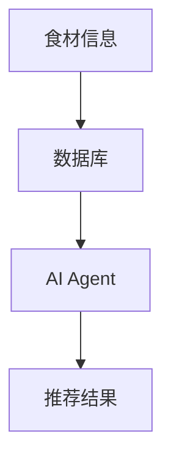
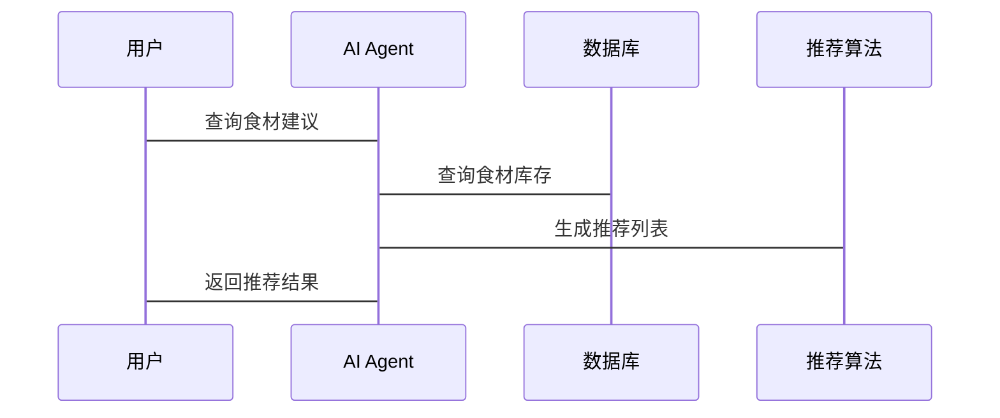
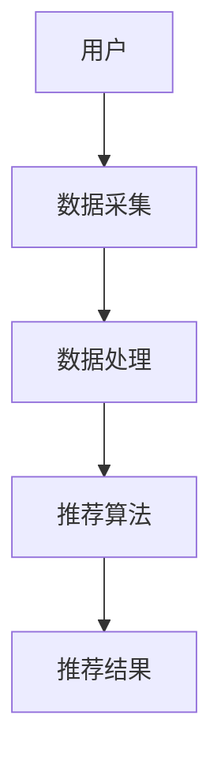
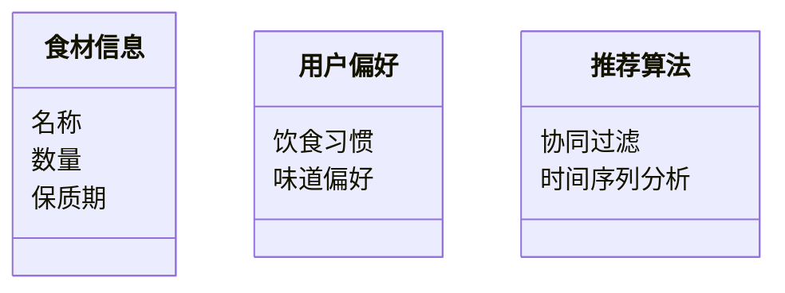
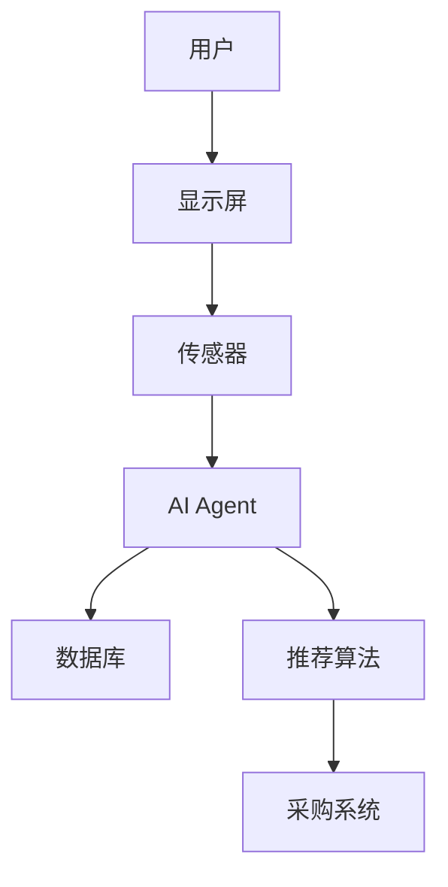
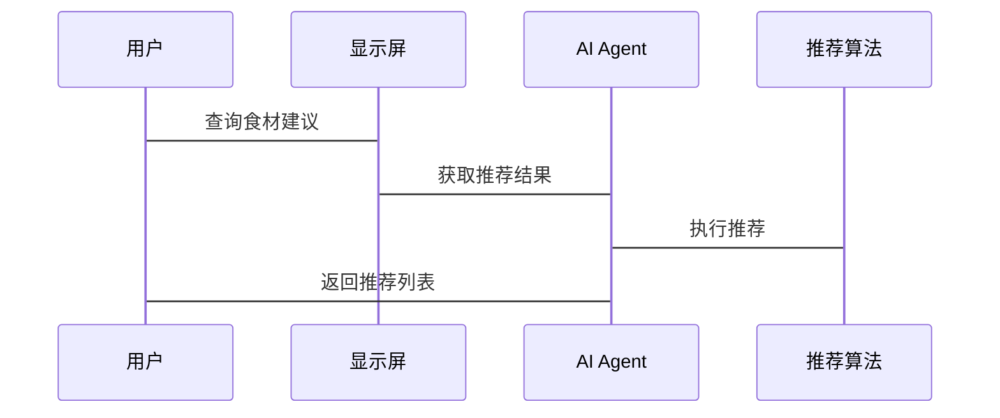

                 


---

# 智能厨房吊柜：AI Agent的食材库存管理

> 关键词：智能厨房吊柜、AI Agent、食材库存管理、物联网、智能家居

> 摘要：本文深入探讨了智能厨房吊柜中AI Agent在食材库存管理中的应用。通过分析系统架构、算法原理、核心功能和项目实现，展示了如何利用AI技术优化厨房存储空间，实现食材的有效管理和智能推荐。

---

## 第一部分: 智能厨房吊柜的背景与概念

### 第1章: 智能厨房吊柜的背景介绍

#### 1.1 智能厨房吊柜的现状与挑战

##### 1.1.1 厨房存储空间的智能化需求
现代家庭厨房的存储空间有限，食材种类繁多，传统库存管理方式效率低下，容易导致食材浪费和存储混乱。智能厨房吊柜通过集成传感器和AI技术，能够实时监测食材状态，优化存储空间利用率。

##### 1.1.2 食材库存管理的痛点分析
- 食材过期提醒：传统管理方式难以及时提醒食材过期，导致浪费。
- 食材推荐：无法根据家庭成员的饮食习惯推荐食材，造成存储冗余。
- 智能采购：无法与超市系统联动，实现自动采购。

##### 1.1.3 AI Agent在厨房场景中的作用
AI Agent（智能体）通过感知环境、分析数据，能够主动推荐食材、提醒过期、优化存储，显著提升厨房管理效率。

#### 1.2 AI Agent的核心概念与作用

##### 1.2.1 AI Agent的基本定义
AI Agent是一种能够感知环境、自主决策并执行任务的智能实体。在厨房场景中，AI Agent通过传感器数据和历史记录，分析食材状态，优化库存管理。

##### 1.2.2 AI Agent在食材库存管理中的应用场景
- 自动推荐食材：根据家庭饮食习惯，推荐常用食材，减少浪费。
- 智能采购：与超市系统联动，自动补充食材。
- 过期提醒：实时监测食材保质期，提醒及时处理。

##### 1.2.3 AI Agent与传统库存管理的区别
| 特性 | AI Agent管理 | 传统管理 |
|------|---------------|----------|
| 智能性 | 自动推荐、优化 | 人工记录、提醒 |
| 效率 | 高效、实时 | 低效、滞后 |
| 个性化 | 根据家庭习惯 | 固定模式 |

#### 1.3 智能厨房吊柜的系统架构概述

##### 1.3.1 系统的基本组成
智能厨房吊柜系统包括硬件和软件两部分：
- 硬件：传感器、摄像头、RFID标签、显示屏。
- 软件：AI Agent、数据库、推荐算法。

##### 1.3.2 系统的功能模块划分
- 数据采集模块：采集食材信息。
- 数据处理模块：分析食材状态。
- 推荐模块：基于数据分析推荐食材。
- 交互模块：与用户进行信息交互。

##### 1.3.3 系统的边界与外延
系统边界包括厨房环境、食材、用户，外延包括超市采购系统、智能家居平台。

#### 1.4 本章小结
智能厨房吊柜通过AI Agent实现食材库存管理的智能化，解决了传统管理的痛点，显著提升了厨房管理效率。

---

### 第2章: AI Agent与食材库存管理的核心概念

#### 2.1 AI Agent的核心原理

##### 2.1.1 AI Agent的基本工作原理
AI Agent通过感知环境数据，结合历史记录，利用算法分析，做出决策并执行任务。

##### 2.1.2 AI Agent的感知与决策机制
- 感知：通过传感器获取食材状态。
- 决策：基于数据进行分析，制定优化策略。

##### 2.1.3 AI Agent的学习与优化能力
AI Agent通过机器学习不断优化推荐算法，提升食材推荐的准确性。

#### 2.2 食材库存管理的系统模型

##### 2.2.1 食材库存管理的基本流程
1. 数据采集：记录食材信息。
2. 数据分析：分析食材状态。
3. 推荐策略：生成推荐结果。
4. 用户交互：反馈或执行操作。

##### 2.2.2 食材库存管理的核心要素
- 食材信息：名称、数量、保质期。
- 用户偏好：饮食习惯、口味偏好。
- 系统算法：推荐算法、预测模型。

##### 2.2.3 食材库存管理的系统模型


#### 2.3 AI Agent与食材库存管理的关联

##### 2.3.1 AI Agent如何优化食材库存管理
- 实时监测：动态更新食材状态。
- 智能推荐：根据用户习惯推荐食材。
- 自动采购：与超市系统联动，实现自动补货。

##### 2.3.2 AI Agent与食材库存管理的系统交互


##### 2.3.3 AI Agent在食材库存管理中的价值
- 提高效率：减少人工操作，提升管理效率。
- 减少浪费：通过智能推荐减少食材过期浪费。
- 增强体验：根据用户偏好提供个性化服务。

#### 2.4 本章小结
AI Agent通过感知、分析和决策，显著优化了食材库存管理的效率和体验。

---

### 第3章: AI Agent的算法原理与实现

#### 3.1 推荐算法的核心原理

##### 3.1.1 推荐算法的基本概念
推荐算法通过分析用户行为和偏好，预测用户可能感兴趣的食材。

##### 3.1.2 基于协同过滤的推荐算法
协同过滤分为基于用户的协同过滤和基于物品的协同过滤。
- 用户-用户协同过滤：寻找与用户相似的用户群体，推荐他们喜欢的食材。
- 物品-物品协同过滤：分析食材之间的相似性，推荐相关食材。

##### 3.1.3 基于内容的推荐算法
基于食材属性（如类别、品牌）进行推荐。

##### 3.1.4 基于深度学习的推荐算法
使用神经网络模型，如DNN（深度神经网络）进行推荐。

##### 3.1.5 推荐算法的实现步骤


##### 3.1.6 推荐算法的优缺点对比
| 特性 | 协同过滤 | 基于内容 | 基于深度学习 |
|------|----------|----------|--------------|
| 优点 | 简单高效 | 内容丰富 | 高准确性 |
| 缺点 | 数据稀疏性 | 内容依赖 | 计算复杂 |

##### 3.1.7 推荐算法的数学模型
协同过滤的数学模型：
$$ sim(i,j) = \frac{\sum_{k} (r_{i,k} - \bar{r_i})(r_{j,k} - \bar{r_j})}{\sqrt{\sum_{k} (r_{i,k} - \bar{r_i})^2} \cdot \sqrt{\sum_{k} (r_{j,k} - \bar{r_j})^2}} $$

#### 3.2 库存预测模型的构建

##### 3.2.1 时间序列分析的基本原理
时间序列分析通过分析历史数据，预测未来的食材需求。

##### 3.2.2 基于ARIMA的库存预测模型
ARIMA（自回归积分滑动平均模型）用于时间序列预测。
- ARIMA模型的三个参数：p（自回归阶数）、d（差分阶数）、q（移动平均阶数）。
- ARIMA模型的预测公式：
$$ \hat{y}_t = \phi_1 y_{t-1} + \phi_2 y_{t-2} + ... + \theta_1 e_{t-1} + ... + e_t $$

##### 3.2.3 库存预测模型的实现步骤
1. 数据预处理：清洗和归一化数据。
2. 模型训练：使用历史数据训练ARIMA模型。
3. 模型预测：预测未来的食材需求。

##### 3.2.4 库存预测模型的优缺点
| 特性 | ARIMA | LSTM |
|------|-------|------|
| 优点 | 简单高效 | 高准确性 |
| 缺点 | 依赖数据分布 | 计算复杂 |

#### 3.3 算法实现的代码示例

##### 3.3.1 协同过滤推荐算法的Python实现
```python
def collaborative_filtering(user_id, user_data):
    # 计算用户相似度
    user_similarity = {}
    for user in user_data:
        if user != user_id:
            similarity = 0
            for item in user_data[user]:
                if item in user_data[user_id]:
                    similarity += 1
            user_similarity[user] = similarity
    # 推荐食材
    recommendations = []
    for user in user_similarity:
        for item in user_data[user]:
            if item not in user_data[user_id]:
                recommendations.append(item)
    return recommendations
```

##### 3.3.2 基于ARIMA的库存预测模型实现
```python
from statsmodels.tsa.arima.model import ARIMA

def predict_inventory(history_data, order=(1, 1, 1)):
    model = ARIMA(history_data, order=order)
    model_fit = model.fit()
    forecast = model_fit.forecast(steps=1)
    return forecast[0]
```

#### 3.4 本章小结
通过协同过滤和ARIMA模型的实现，展示了AI Agent在食材推荐和库存预测中的应用。

---

## 第四部分: 系统分析与架构设计方案

### 第4章: 系统分析与架构设计

#### 4.1 问题场景介绍

##### 4.1.1 系统目标
实现食材库存的智能化管理，提升厨房管理效率。

##### 4.1.2 问题描述
食材库存管理效率低下，食材浪费严重，用户需求难以满足。

##### 4.1.3 边界条件
- 系统仅管理厨房吊柜中的食材。
- 系统支持与超市系统的联动。

#### 4.2 项目介绍

##### 4.2.1 项目目标
开发智能厨房吊柜系统，实现食材库存的智能化管理。

##### 4.2.2 项目范围
- 系统仅管理厨房吊柜中的食材。
- 支持食材推荐、采购、提醒功能。

##### 4.2.3 项目约束
- 硬件成本限制。
- 数据隐私保护。

#### 4.3 系统功能设计

##### 4.3.1 领域模型


##### 4.3.2 系统架构


##### 4.3.3 接口设计
- 用户与系统交互接口：显示屏、触摸屏。
- 系统与传感器接口：数据采集接口。
- 系统与采购系统接口：API接口。

##### 4.3.4 交互设计


#### 4.4 本章小结
通过系统架构设计，明确了智能厨房吊柜的功能模块和交互流程。

---

## 第五部分: 项目实战

### 第5章: 项目实战

#### 5.1 环境搭建

##### 5.1.1 开发环境
- 操作系统：Linux
- 开发工具：Python、Jupyter Notebook
- 数据库：MySQL
- 传感器：温度传感器、RFID标签

##### 5.1.2 环境安装
```bash
pip install numpy
pip install pandas
pip install statsmodels
pip install scikit-learn
```

#### 5.2 系统核心实现

##### 5.2.1 数据采集模块
```python
import serial

ser = serial.Serial('COM3', 9600)
data = ser.readline().decode()
print(data)
```

##### 5.2.2 数据处理模块
```python
import pandas as pd

data_frame = pd.read_csv('inventory.csv')
print(data_frame.head())
```

##### 5.2.3 推荐算法实现
```python
from sklearn.metrics.pairwise import cosine_similarity

# 协同过滤实现
user_data = {
    '用户1': ['鸡蛋', '牛奶', '面包'],
    '用户2': ['牛奶', '面包', '黄油'],
    '用户3': ['面包', '黄油', '奶酪']
}

user_id = '用户1'
similar_users = []
for user in user_data:
    if user != user_id:
        similarity = sum([1 for item in user_data[user] if item in user_data[user_id]])
        similar_users.append((user, similarity))
similar_users.sort(key=lambda x: -x[1])
print(similar_users)
```

##### 5.2.4 库存预测模块
```python
from statsmodels.tsa.arima.model import ARIMA

history = [1, 2, 3, 4, 5]
model = ARIMA(history, order=(1, 1, 1))
model_fit = model.fit()
forecast = model_fit.forecast(steps=1)
print(forecast)
```

#### 5.3 案例分析

##### 5.3.1 案例背景
某家庭的食材库存情况：
- 鸡蛋：2盒，保质期至2024-05-15
- 牛奶：3盒，保质期至2024-05-20
- 面包：1袋，保质期至2024-05-18

##### 5.3.2 系统处理过程
1. 数据采集模块采集食材信息。
2. 数据处理模块分析食材状态。
3. 推荐算法模块生成推荐结果。
4. 交互模块反馈用户。

##### 5.3.3 实际效果
- 推荐结果：面包库存不足，建议购买2袋。
- 过期提醒：鸡蛋和面包即将过期，建议及时使用。

#### 5.4 本章小结
通过实际案例，展示了系统的实用性和高效性。

---

## 第六部分: 最佳实践

### 第6章: 最佳实践

#### 6.1 小结
智能厨房吊柜通过AI Agent实现了食材库存的智能化管理，显著提升了厨房管理效率。

#### 6.2 注意事项
- 数据隐私保护：确保用户数据的安全。
- 系统稳定性：保证传感器和算法的可靠性。
- 用户体验：优化交互设计，提升用户体验。

#### 6.3 拓展阅读
- 推荐系统：《推荐系统实战》
- 时间序列分析：《时间序列分析与应用》
- 智能家居：《智能家居系统设计》

---

## 作者：AI天才研究院/AI Genius Institute & 禅与计算机程序设计艺术 /Zen And The Art of Computer Programming

---

通过以上内容，我们系统地分析了智能厨房吊柜中AI Agent的食材库存管理系统的实现过程，从背景介绍到算法实现，再到系统设计和项目实战，全面展示了如何利用AI技术优化厨房管理。希望本文能够为相关领域的读者提供有价值的参考和启发。

