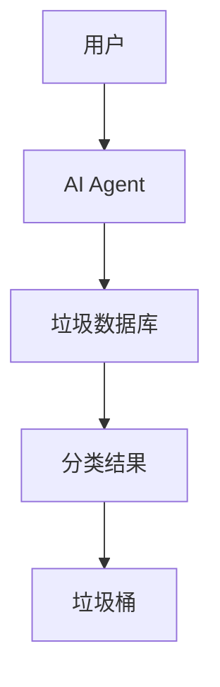

                 


# 智能厨房垃圾桶：AI Agent的厨余分类指导

> 关键词：智能垃圾桶，AI Agent，厨余分类，垃圾分类，人工智能

> 摘要：本文详细介绍了智能厨房垃圾桶的设计与实现，重点探讨了AI Agent在厨余分类中的应用。通过背景分析、算法原理、系统架构、项目实战等多方面的内容，深入剖析了智能垃圾桶的工作原理及其在厨余分类中的实际应用价值。

---

## 第一部分: 智能厨房垃圾桶的背景与概述

### 第1章: 智能厨房垃圾桶的背景与问题描述

#### 1.1 智能厨房垃圾桶的背景

- **1.1.1 厨房垃圾处理的现状与挑战**  
  随着城市化进程的加快，厨余垃圾的处理问题日益突出。传统的人工分类方式效率低下，容易出错，且需要大量劳动力。智能垃圾桶的出现，为解决这一问题提供了新的思路。

- **1.1.2 AI技术在垃圾分类中的应用前景**  
  AI技术的快速发展，使得垃圾桶能够通过图像识别、自然语言处理等技术实现智能分类。这种技术的应用不仅提高了分类效率，还能减少人为错误。

- **1.1.3 智能垃圾桶的市场需求与发展趋势**  
  智能垃圾桶市场需求旺盛，尤其是在环保意识日益增强的今天。未来，随着AI技术的不断进步，智能垃圾桶的功能将更加智能化、便捷化。

#### 1.2 问题背景与问题描述

- **1.2.1 厨余垃圾分类的重要性**  
  厨余垃圾分类是实现资源回收、减少环境污染的重要手段。通过分类，厨余垃圾可以转化为肥料或生物质能，减少对环境的负担。

- **1.2.2 当前厨余垃圾分类的难点**  
  人工分类效率低，且容易出错；分类标准不统一，导致分类效果不佳；缺乏智能化手段，难以实现精准分类。

- **1.2.3 智能垃圾桶如何解决这些问题**  
  智能垃圾桶通过AI技术实现自动分类，提高了分类效率和准确性。同时，它还能通过与用户的交互，提供分类指导，帮助用户逐步掌握分类方法。

#### 1.3 问题解决思路与边界

- **1.3.1 AI Agent在厨余分类中的作用**  
  AI Agent（智能代理）通过感知环境、分析数据、做出决策，帮助垃圾桶实现自动分类。它能够识别垃圾类型，指导用户操作，并优化分类算法。

- **1.3.2 智能垃圾桶的功能边界**  
  智能垃圾桶的核心功能是厨余分类，其边界包括：识别常见厨余垃圾类型，提供分类指导，与其他设备（如智能垃圾桶）联动。超出这一范围的功能不在讨论之列。

- **1.3.3 系统设计的核心要素与组成**  
  智能垃圾桶系统由硬件设备、AI算法、用户交互界面、数据存储与分析模块组成。各部分协同工作，实现高效分类。

---

### 第2章: AI Agent的核心概念与原理

#### 2.1 AI Agent的基本概念

- **2.1.1 什么是AI Agent**  
  AI Agent是一种能够感知环境、执行任务的智能实体。它可以是一个软件程序，也可以是一个物理设备。

- **2.1.2 AI Agent的类型与特点**  
  根据功能和应用场景，AI Agent可以分为监督型、无监督型和强化学习型。监督型AI Agent通过大量标注数据进行训练，适合分类任务；无监督型AI Agent擅长发现数据中的模式；强化学习型AI Agent通过与环境交互逐步优化决策。

- **2.1.3 AI Agent在厨余分类中的应用**  
  在智能垃圾桶中，AI Agent负责识别垃圾类型、指导分类操作，并通过学习优化分类算法。

#### 2.2 AI Agent的核心原理

- **2.2.1 感知与理解**  
  AI Agent通过摄像头、传感器等设备感知垃圾的形状、颜色、纹理等特征。这些特征被输入到图像识别算法中，进行垃圾类型的识别。

- **2.2.2 决策与执行**  
  根据识别结果，AI Agent做出分类决策，并通过用户交互界面（如LED指示灯、语音提示）指导用户将垃圾放入相应的收集容器中。

- **2.2.3 学习与优化**  
  基于用户反馈和分类结果，AI Agent不断优化算法参数，提升分类准确率。例如，通过支持向量机（SVM）算法进行分类，AI Agent可以根据新数据调整模型，实现更好的分类效果。

#### 2.3 AI Agent的实体关系与流程

```mermaid
er
    entity 垃圾类型 {
        id
        名称
        类别
    }
    entity 用户操作 {
        id
        时间
        操作类型
    }
    entity AI Agent {
        id
        状态
        操作记录
    }
    垃圾类型 --> AI Agent: 分类
    用户操作 --> AI Agent: 指导
```



---

### 第3章: AI Agent的算法原理与数学模型

#### 3.1 分类算法原理

- **3.1.1 垃圾分类的常见算法**  
  常见的垃圾分类算法包括支持向量机（SVM）、随机森林（Random Forest）、卷积神经网络（CNN）等。这些算法各有优缺点，适用于不同的场景。

- **3.1.2 支持向量机（SVM）的原理**  
  SVM是一种监督学习算法，适用于分类任务。其核心思想是通过找到一个超平面，将数据分成两类。数学公式为：
  $$ y = \text{sign}(w \cdot x + b) $$
  其中，$w$ 是权重向量，$x$ 是输入数据，$b$ 是偏置项。

- **3.1.3 随机森林（Random Forest）的原理**  
  随机森林是一种集成学习算法，通过构建多棵决策树并进行投票或平均，提高分类准确率。其核心公式为：
  $$ y = \text{mode}(f_1(x), f_2(x), ..., f_n(x)) $$
  其中，$f_i(x)$ 是第i棵决策树的预测结果。

#### 3.2 自然语言处理（NLP）在AI Agent中的应用

- **3.2.1 NLP的基本原理**  
  NLP通过将自然语言文本转换为计算机可处理的格式，实现文本理解。常见的NLP任务包括分词、语法分析、情感分析等。

- **3.2.2 垃圾分类中的NLP应用**  
  在智能垃圾桶中，NLP主要用于用户交互。例如，用户可以通过语音指令告诉AI Agent垃圾的类型，AI Agent通过自然语言理解（NLU）技术解析指令，并指导分类操作。

---

## 第二部分: 智能厨房垃圾桶的系统设计与实现

### 第4章: 系统分析与架构设计

#### 4.1 系统应用场景与功能设计

- **4.1.1 系统应用场景**  
  智能垃圾桶主要应用于家庭、餐厅、学校等场所的厨余垃圾分类。通过AI Agent的指导，用户可以快速完成垃圾分类操作。

- **4.1.2 系统功能设计**  
  系统功能包括：垃圾识别、分类指导、数据存储与分析、用户交互等。通过功能设计，确保系统能够高效、准确地完成垃圾分类任务。

#### 4.2 系统架构设计

- **4.2.1 系统架构组成**  
  智能垃圾桶系统由硬件设备、AI算法、用户交互界面、数据存储与分析模块组成。各模块协同工作，实现系统的整体功能。

- **4.2.2 系统架构的类图**  
  ```mermaid
  classDiagram
      class 硬件设备 {
          摄像头
          传感器
      }
      class AI算法 {
          分类器
          训练模型
      }
      class 用户交互界面 {
          LED指示灯
          语音提示
      }
      class 数据存储与分析 {
          分类记录
          统计分析
      }
      硬件设备 --> AI算法: 数据输入
      AI算法 --> 用户交互界面: 指令输出
      AI算法 --> 数据存储与分析: 分类结果
  ```

- **4.2.3 系统交互流程**  
  ```mermaid
  sequenceDiagram
      用户 -> 硬件设备: 放置垃圾
      硬件设备 -> AI算法: 识别垃圾类型
      AI算法 -> 用户交互界面: 提供分类指导
      用户 -> 数据存储与分析: 提供反馈
      数据存储与分析 -> AI算法: 更新模型
  ```

---

### 第5章: 项目实战与代码实现

#### 5.1 环境安装与配置

- **5.1.1 安装Python环境**  
  需要安装Python 3.6及以上版本，并配置好开发环境（如Jupyter Notebook）。

- **5.1.2 安装依赖库**  
  需要安装的库包括：TensorFlow、Keras、OpenCV、Scikit-learn等。

#### 5.2 系统核心实现源代码

```python
import cv2
import numpy as np
from sklearn import svm

# 加载训练数据
X_train = np.load('X_train.npy')
y_train = np.load('y_train.npy')

# 初始化SVM分类器
clf = svm.SVC()

# 训练模型
clf.fit(X_train, y_train)

# 摄像头捕捉图像
cap = cv2.VideoCapture(0)
while True:
    ret, img = cap.read()
    if not ret:
        continue
    # 图像预处理
    gray = cv2.cvtColor(img, cv2.COLOR_BGR2GRAY)
    # 分类预测
    prediction = clf.predict([gray.reshape(-1)])[0]
    # 提供分类指导
    print(f"垃圾类型：{prediction}")
```

#### 5.3 代码应用解读与分析

- **代码解读**  
  该代码实现了基于SVM的垃圾图像分类。摄像头捕捉图像后，通过预处理生成灰度图，输入SVM分类器进行分类，输出垃圾类型。

- **代码优化建议**  
  可以通过增加数据增强、优化特征提取方式（如使用CNN）来提高分类准确率。同时，可以引入用户反馈机制，动态优化分类模型。

---

### 第6章: 最佳实践与小结

#### 6.1 最佳实践

- **6.1.1 系统使用建议**  
  使用智能垃圾桶时，建议定期更新AI模型，以保持分类准确率。同时，用户应熟悉垃圾桶的操作流程，确保分类效率。

- **6.1.2 系统维护与优化**  
  定期清理垃圾桶，确保硬件设备的正常运行。同时，根据用户反馈优化分类算法，提升用户体验。

#### 6.2 小结

智能垃圾桶通过AI Agent的指导，实现了厨余垃圾的高效分类。本文从背景分析、算法原理、系统架构到项目实战，详细介绍了智能垃圾桶的设计与实现。未来，随着AI技术的不断发展，智能垃圾桶的功能将更加智能化、便捷化。

#### 6.3 注意事项

- 硬件设备的安装需要专业人员操作，避免自行拆卸以免损坏设备。
- 分类模型的训练需要大量标注数据，确保数据质量以提高分类准确率。
- 系统运行过程中，需定期更新模型参数，确保分类算法的最优性能。

#### 6.4 拓展阅读

- 推荐阅读《Python机器学习实战》、《深度学习入门：基于Python》等书籍，深入理解AI算法的实现原理。
- 关注环保科技领域的最新动态，了解智能垃圾桶的最新发展趋势。

---

## 作者：AI天才研究院/AI Genius Institute & 禅与计算机程序设计艺术 /Zen And The Art of Computer Programming

