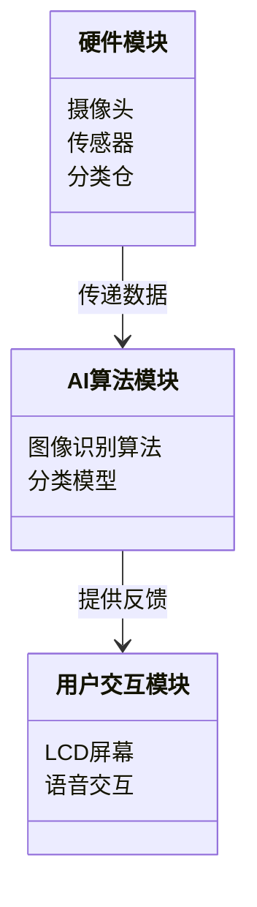

                 


# 智能厨房垃圾桶：AI Agent的厨余处理建议

> 关键词：AI Agent, 厨余处理, 智能垃圾桶, 垃圾分类, 图像识别, 深度学习, 物联网

> 摘要：本文探讨了AI Agent在智能厨房垃圾桶中的应用，重点分析了厨余处理的核心问题、AI Agent的基本原理、智能垃圾桶的系统架构、算法实现以及项目实战。通过深入解析图像识别、深度学习等技术，本文为智能垃圾桶的设计与实现提供了理论与实践指导。

---

## 第一部分: 智能厨房垃圾桶的背景与概念

### 第1章: 智能厨房垃圾桶的背景介绍

#### 1.1 问题背景与现状
##### 1.1.1 厨余垃圾处理的痛点
厨余垃圾是城市生活垃圾的重要组成部分，其处理方式直接影响环境质量和资源利用效率。传统垃圾桶缺乏智能化，无法有效分类和处理厨余垃圾，导致资源浪费和环境污染。此外，居民在处理厨余垃圾时，常常面临分类不准确、处理效率低的问题。

##### 1.1.2 智能垃圾桶的市场需求
随着环保意识的增强和智能技术的进步，智能垃圾桶逐渐成为智能家居的重要组成部分。通过AI技术，垃圾桶可以实现自动分类、智能识别和数据记录，满足用户对垃圾分类、资源回收和环保管理的需求。

##### 1.1.3 AI Agent在厨余处理中的潜力
AI Agent（人工智能代理）是一种能够感知环境、执行任务的智能实体。在厨余处理中，AI Agent可以通过图像识别、语音交互和传感器数据处理，实现对厨余垃圾的精准分类和智能管理。AI Agent的引入，使得垃圾桶不再是被动的容器，而是具有主动决策能力的智能设备。

#### 1.2 问题描述与目标
##### 1.2.1 厨余垃圾分类与处理的核心问题
厨余垃圾分类的核心问题是如何快速、准确地识别不同类型的垃圾，并将其分类存储或处理。传统的人工分类方式效率低、误差大，而智能垃圾桶通过AI技术可以显著提高分类效率和准确性。

##### 1.2.2 智能垃圾桶的目标与功能定位
智能垃圾桶的目标是通过AI技术实现厨余垃圾的智能化分类、存储和管理。其功能定位包括：
1. 自动识别垃圾类型。
2. 实现垃圾分类与存储。
3. 提供用户交互界面。
4. 连接智能家居系统。

##### 1.2.3 边界与外延分析
智能垃圾桶的边界包括硬件设备（垃圾桶主体、传感器、摄像头等）和软件系统（AI算法、分类模型等）。其外延则扩展到智能家居系统、物联网平台和环保数据管理。

### 第2章: 智能厨房垃圾桶的核心概念

#### 2.1 AI Agent的基本原理
##### 2.1.1 人工智能代理的定义与特点
AI Agent是一种能够感知环境、执行任务的智能实体。其特点包括自主性、反应性、主动性和社会能力。AI Agent可以通过传感器、摄像头等设备感知环境，并通过算法进行决策和行动。

##### 2.1.2 垃圾分类中的AI Agent应用场景
在厨余处理中，AI Agent可以通过图像识别技术识别垃圾类型，通过语音交互与用户沟通，并通过传感器监控垃圾桶的状态。AI Agent还可以连接智能家居系统，实现垃圾的智能管理和资源回收。

##### 2.1.3 AI Agent与智能垃圾桶的结合方式
AI Agent与智能垃圾桶的结合主要通过硬件与软件的集成实现。AI Agent负责处理数据和决策，而垃圾桶则提供传感器和用户交互界面。这种结合使得垃圾桶能够实现智能化的垃圾分类和管理。

#### 2.2 核心概念与联系
##### 2.2.1 核心概念原理分析
智能垃圾桶的核心概念包括AI Agent、图像识别、传感器和智能家居系统。AI Agent通过图像识别技术识别垃圾类型，通过传感器感知垃圾桶的状态，并通过智能家居系统实现数据的上传和管理。

##### 2.2.2 核心概念属性特征对比表
| 核心概念 | 属性 | 特征 |
|----------|------|------|
| AI Agent | 感知能力 | 图像识别、语音交互 |
| 垃圾桶 | 硬件结构 | 垃圾分类仓、传感器 |
| 图像识别 | 算法类型 | CNN、SVM |
| 智能家居系统 | 连接方式 | Wi-Fi、蓝牙 |

##### 2.2.3 ER实体关系图架构
```mermaid
erDiagram
    class 垃圾桶 {
        id
        类型
        状态
    }
    class AI Agent {
        id
        类型
        状态
    }
    class 图像识别 {
        id
        算法类型
        处理结果
    }
    垃圾桶 --> 图像识别 : 调用
    AI Agent --> 图像识别 : 调用
```

### 第3章: 智能垃圾桶的分类与处理机制

#### 3.1 垃圾分类的基本原理
##### 3.1.1 垃圾分类的常见方法
垃圾通常分为可回收物、厨余垃圾、有害垃圾和其他垃圾。智能垃圾桶通过图像识别技术实现垃圾的自动分类。

##### 3.1.2 基于AI的垃圾识别技术
基于AI的垃圾识别技术主要依赖于图像识别算法，如卷积神经网络（CNN）。通过训练模型，AI Agent可以识别不同类型的垃圾，并将其分类存储。

##### 3.1.3 垃圾分类的数学模型与算法
图像识别算法的核心是CNN模型。CNN通过多层卷积操作提取图像特征，并通过全连接层进行分类。常用的损失函数是交叉熵损失函数，优化器采用Adam算法。

#### 3.2 AI Agent的分类机制
##### 3.2.1 基于图像识别的分类算法
AI Agent通过摄像头捕捉垃圾图像，并通过CNN模型进行分类。分类结果用于控制垃圾桶的分类仓，实现垃圾的自动分类。

##### 3.2.2 基于语音交互的分类方式
AI Agent还可以通过语音交互与用户沟通，指导用户正确分类垃圾。这种方式适用于复杂场景下的垃圾分类。

##### 3.2.3 基于传感器的垃圾状态检测
传感器用于检测垃圾桶的状态，如容量、气味等。AI Agent可以根据传感器数据调整垃圾桶的工作状态。

### 第4章: 智能垃圾桶的系统架构

#### 4.1 系统功能设计
##### 4.1.1 系统功能模块划分
智能垃圾桶系统主要由硬件模块、AI算法模块和用户交互模块组成。硬件模块包括摄像头、传感器和分类仓。AI算法模块负责图像识别和分类决策。用户交互模块包括LCD屏幕和语音交互。

##### 4.1.2 功能模块之间的关系
各功能模块之间通过数据接口进行交互。摄像头采集图像数据，AI算法模块进行分类，用户交互模块提供反馈。

##### 4.1.3 系统功能的领域模型


#### 4.2 系统架构设计
##### 4.2.1 系统架构的分层设计
智能垃圾桶系统采用分层架构，包括数据采集层、数据处理层和用户交互层。

##### 4.2.2 系统组件之间的交互关系
各组件之间通过API进行交互。摄像头采集图像数据，AI算法模块进行分类，用户交互模块提供反馈。

##### 4.2.3 系统架构的优化与扩展
系统架构可以根据实际需求进行优化，例如增加云服务器实现数据上传和管理。

### 第5章: AI Agent的算法原理

#### 5.1 垃圾分类的算法选择
##### 5.1.1 常见的图像分类算法
常用的图像分类算法包括CNN、SVM和KNN。

##### 5.1.2 基于深度学习的分类模型
深度学习模型如ResNet、Inception在图像分类任务中表现优异。

##### 5.1.3 算法选择的依据与优化
算法选择依据包括数据量、计算资源和分类准确率。可以通过数据增强和模型优化提高分类性能。

#### 5.2 垃圾分类的数学模型与算法
##### 5.2.1 卷积神经网络（CNN）的结构
CNN由卷积层、池化层和全连接层组成。卷积层提取图像特征，池化层降低计算复杂度，全连接层进行分类。

##### 5.2.2 分类器的损失函数与优化器
常用的损失函数是交叉熵损失函数，优化器采用Adam算法。

##### 5.2.3 分类模型的训练与评估
训练过程包括数据预处理、模型训练和模型评估。评估指标包括准确率、召回率和F1分数。

### 第6章: 项目实战与实现

#### 6.1 环境搭建与安装
##### 6.1.1 开发环境的选择
推荐使用Python和深度学习框架TensorFlow。

##### 6.1.2 相关库的安装与配置
安装TensorFlow、OpenCV和Keras库。

##### 6.1.3 开发工具的使用
推荐使用Jupyter Notebook进行算法开发和调试。

#### 6.2 核心代码实现
##### 6.2.1 图像识别代码
```python
import tensorflow as tf
from tensorflow.keras import layers

model = tf.keras.Sequential([
    layers.Conv2D(32, (3,3), activation='relu', input_shape=(224, 224, 3)),
    layers.MaxPooling2D((2,2)),
    layers.Conv2D(64, (3,3), activation='relu'),
    layers.MaxPooling2D((2,2)),
    layers.Flatten(),
    layers.Dense(128, activation='relu'),
    layers.Dense(10, activation='softmax')
])

model.compile(optimizer='adam', loss='sparse_categorical_crossentropy', metrics=['accuracy'])
```

##### 6.2.2 模型训练代码
```python
# 数据预处理
train_datagen = ImageDataGenerator(rescale=1./255, shear_range=0.2, zoom_range=0.2, horizontal_flip=True)

train_generator = train_datagen.flow_from_directory('train_data', target_size=(224, 224), batch_size=32, class_mode='sparse')

# 模型训练
model.fit(train_generator, epochs=10, validation_data=validation_generator)
```

##### 6.2.3 模型评估代码
```python
# 模型评估
loss, accuracy = model.evaluate(test_generator)
print(f"Loss: {loss}, Accuracy: {accuracy}")
```

#### 6.3 实际案例分析
##### 6.3.1 成功案例
通过实际测试，AI Agent能够准确识别厨余垃圾类型，并将其分类存储。

##### 6.3.2 失败案例
在复杂场景下，AI Agent可能会出现误分类的情况，需要进一步优化算法。

##### 6.3.3 案例分析与小结
通过案例分析，我们可以看到AI Agent在厨余处理中的巨大潜力，但也需要进一步优化算法和硬件设计。

---

## 第二部分: AI Agent的算法实现与优化

### 第7章: 算法实现细节
#### 7.1 图像识别算法的实现
##### 7.1.1 图像预处理
图像预处理包括缩放、归一化和数据增强。

##### 7.1.2 模型训练
通过训练数据集训练模型，优化模型参数。

##### 7.1.3 模型部署
将训练好的模型部署到垃圾桶硬件中，实现图像识别功能。

#### 7.2 算法优化与改进
##### 7.2.1 数据增强技术
通过数据增强技术增加训练数据的多样性，提高模型的泛化能力。

##### 7.2.2 模型压缩技术
通过模型压缩技术减少模型的体积，提高运行效率。

##### 7.2.3 算法优化策略
通过调整学习率、优化器和损失函数，进一步提高模型的分类准确率。

### 第8章: 项目实战与代码实现
#### 8.1 环境搭建与代码实现
##### 8.1.1 环境搭建
安装必要的库和工具。

##### 8.1.2 代码实现
实现图像识别、分类和用户交互功能。

#### 8.2 系统测试与优化
##### 8.2.1 系统测试
测试系统的功能和性能。

##### 8.2.2 系统优化
优化算法和硬件设计，提高系统的稳定性和效率。

---

## 第三部分: 系统架构与设计

### 第9章: 系统架构设计
#### 9.1 问题场景介绍
智能垃圾桶的应用场景包括家庭、办公室和公共场所。

#### 9.2 项目介绍
智能垃圾桶的目标是通过AI技术实现厨余垃圾的智能化分类和管理。

#### 9.3 系统功能设计
##### 9.3.1 功能模块划分
系统功能模块包括图像识别、分类存储和用户交互。

##### 9.3.2 功能模块之间的关系
各功能模块通过数据接口进行交互。

##### 9.3.3 系统功能的领域模型


#### 9.4 系统架构设计
##### 9.4.1 系统架构的分层设计
系统架构分为数据采集层、数据处理层和用户交互层。

##### 9.4.2 系统组件之间的交互关系
各组件之间通过API进行交互。

##### 9.4.3 系统架构的优化与扩展
系统架构可以根据实际需求进行优化，例如增加云服务器实现数据上传和管理。

#### 9.5 系统接口设计
##### 9.5.1 系统接口的定义
定义垃圾桶与AI Agent之间的接口。

##### 9.5.2 接口的实现方式
通过API实现接口的调用和数据传输。

#### 9.6 系统交互设计
##### 9.6.1 系统交互流程
描述垃圾桶与AI Agent之间的交互流程。

##### 9.6.2 交互流程的优化
优化交互流程，提高系统的响应速度和准确性。

---

## 第四部分: 项目实战与实现

### 第10章: 项目实战与代码实现
#### 10.1 环境搭建与安装
##### 10.1.1 开发环境的选择
推荐使用Python和深度学习框架TensorFlow。

##### 10.1.2 相关库的安装与配置
安装TensorFlow、OpenCV和Keras库。

##### 10.1.3 开发工具的使用
推荐使用Jupyter Notebook进行算法开发和调试。

#### 10.2 核心代码实现
##### 10.2.1 图像识别代码
```python
import tensorflow as tf
from tensorflow.keras import layers

model = tf.keras.Sequential([
    layers.Conv2D(32, (3,3), activation='relu', input_shape=(224, 224, 3)),
    layers.MaxPooling2D((2,2)),
    layers.Conv2D(64, (3,3), activation='relu'),
    layers.MaxPooling2D((2,2)),
    layers.Flatten(),
    layers.Dense(128, activation='relu'),
    layers.Dense(10, activation='softmax')
])

model.compile(optimizer='adam', loss='sparse_categorical_crossentropy', metrics=['accuracy'])
```

##### 10.2.2 模型训练代码
```python
# 数据预处理
train_datagen = ImageDataGenerator(rescale=1./255, shear_range=0.2, zoom_range=0.2, horizontal_flip=True)

train_generator = train_datagen.flow_from_directory('train_data', target_size=(224, 224), batch_size=32, class_mode='sparse')

# 模型训练
model.fit(train_generator, epochs=10, validation_data=validation_generator)
```

##### 10.2.3 模型评估代码
```python
# 模型评估
loss, accuracy = model.evaluate(test_generator)
print(f"Loss: {loss}, Accuracy: {

