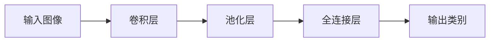
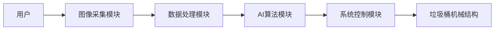
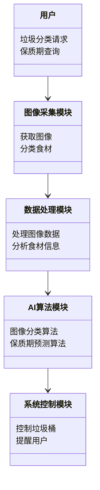
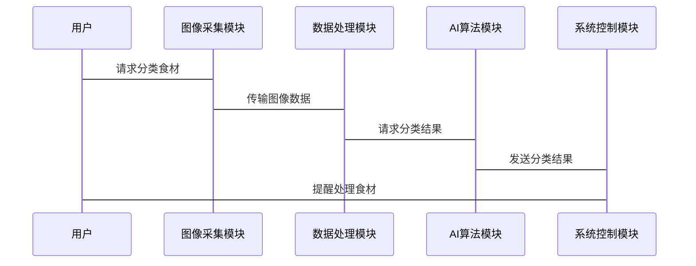

                 


# 智能厨房垃圾桶：AI Agent的食材利用建议

## 关键词：智能厨房垃圾桶, AI Agent, 食材管理, 垃圾分类, 保质期预测

## 摘要：  
智能厨房垃圾桶是一种结合人工智能技术的智能设备，能够通过AI Agent（智能代理）自动识别食材种类、预测保质期、提供建议，并优化食材利用率。本文从背景、原理、算法、系统架构、项目实战等多个角度，全面分析智能厨房垃圾桶的设计与实现，探讨如何通过AI技术提升厨房管理效率，减少食材浪费，实现智能化、环保化的厨房管理。

---

# 第1章 智能厨房垃圾桶的背景与概念

## 1.1 智能厨房垃圾桶的背景介绍

随着生活水平的提高，人们对厨房管理的需求日益增长。然而，食材浪费、垃圾桶管理不善等问题仍然普遍存在。据统计，全球每年浪费的食材高达数百万吨，其中很大一部分是因为食材保存不当或过期导致的。智能厨房垃圾桶作为一种新兴的智能家居设备，能够通过AI技术解决这些问题，提升厨房管理的效率和环保性。

### 1.1.1 食材浪费问题的现状  
食材浪费是一个全球性问题。根据联合国粮农组织的数据，全球每年浪费的食材高达13亿吨，其中厨房是食材浪费的主要发生地之一。造成浪费的原因包括食材分类不当、保存方法不合理、过期未及时处理等。

### 1.1.2 智能垃圾桶的出现背景  
传统垃圾桶的功能单一，仅能进行物理分类，无法识别食材种类和保质期。随着人工智能技术的快速发展，智能垃圾桶应运而生，能够通过AI技术实现食材的智能分类、保质期预测和利用建议。

### 1.1.3 AI Agent在厨房管理中的作用  
AI Agent（智能代理）是一种能够感知环境、自主决策并执行任务的智能系统。在厨房管理中，AI Agent可以通过图像识别、语音交互等方式，帮助用户优化食材利用率，减少浪费。

---

## 1.2 AI Agent的基本概念

### 1.2.1 什么是AI Agent  
AI Agent是一种能够通过感知环境、分析数据、做出决策并执行任务的智能系统。它具有自主性、反应性、目标导向性和社会性等特征。

### 1.2.2 AI Agent的核心特征  
1. **自主性**：AI Agent能够自主决策，无需人工干预。  
2. **反应性**：能够实时感知环境变化并做出反应。  
3. **目标导向性**：具有明确的目标，能够优化任务执行效率。  
4. **社会性**：能够与其他系统或用户进行交互。

### 1.2.3 AI Agent与传统垃圾桶的区别  
AI Agent垃圾桶与传统垃圾桶的主要区别在于智能化程度。AI Agent垃圾桶能够通过传感器、摄像头等设备感知食材信息，利用AI算法优化垃圾桶的功能，例如自动分类、智能提醒等。

---

## 1.3 智能厨房垃圾桶的功能与优势

### 1.3.1 垃圾分类功能  
AI Agent垃圾桶能够通过图像识别技术自动识别食材种类，实现精准分类。

### 1.3.2 食材保质期管理  
通过AI算法预测食材的保质期，提醒用户及时处理即将过期的食材。

### 1.3.3 AI Agent的食材利用建议  
AI Agent可以根据用户的饮食习惯和食材存量，提供建议，例如推荐使用某种食材制作的菜谱，避免浪费。

---

## 1.4 本章小结  
本章介绍了智能厨房垃圾桶的背景、AI Agent的基本概念以及智能垃圾桶的功能与优势。通过AI Agent技术，智能厨房垃圾桶能够实现食材的智能化管理，减少浪费，提升厨房管理效率。

---

# 第2章 AI Agent的核心原理

## 2.1 AI Agent的工作原理

### 2.1.1 感知层  
AI Agent通过传感器、摄像头等设备感知环境信息，例如食材的种类、数量、保质期等。

### 2.1.2 决策层  
AI Agent利用机器学习算法对感知到的信息进行分析，做出决策，例如是否需要提醒用户处理某种食材。

### 2.1.3 执行层  
AI Agent根据决策结果执行任务，例如自动分类食材、提醒用户使用某种食材等。

---

## 2.2 AI Agent的感知机制

### 2.2.1 图像识别技术  
AI Agent通过摄像头拍摄食材照片，利用卷积神经网络（CNN）进行图像分类，识别食材种类。

### 2.2.2 语音交互技术  
AI Agent可以通过语音交互与用户沟通，例如用户询问某种食材的保质期，AI Agent通过语音识别技术回答用户的问题。

### 2.2.3 数据采集与分析  
AI Agent通过传感器采集食材的温度、湿度等信息，结合历史数据进行分析，预测食材的保质期。

---

## 2.3 AI Agent的决策机制

### 2.3.1 机器学习算法  
AI Agent利用监督学习、无监督学习等算法对食材信息进行分类和预测。

### 2.3.2 数据分析与预测  
通过时间序列分析、回归分析等方法，预测食材的保质期和用量趋势。

### 2.3.3 决策优化策略  
基于遗传算法、强化学习等技术，优化AI Agent的决策策略，提升管理效率。

---

## 2.4 AI Agent的执行机制

### 2.4.1 系统控制  
AI Agent通过控制垃圾桶的机械结构，实现食材的自动分类和存储。

### 2.4.2 用户反馈  
AI Agent可以通过手机APP、语音助手等方式向用户发送提醒信息，获取用户的反馈。

### 2.4.3 自适应调整  
根据用户的反馈和环境变化，AI Agent能够自适应调整其行为策略，优化垃圾桶的管理效果。

---

## 2.5 本章小结  
本章详细讲解了AI Agent的核心原理，包括感知、决策和执行三个主要环节。通过多种先进技术的结合，AI Agent能够实现智能化的厨房管理。

---

# 第3章 AI Agent的算法原理与数学模型

## 3.1 算法概述

### 3.1.1 机器学习算法  
AI Agent的核心算法包括支持向量机（SVM）、随机森林（Random Forest）等监督学习算法，以及K-means等无监督学习算法。

### 3.1.2 深度学习算法  
利用卷积神经网络（CNN）、长短期记忆网络（LSTM）等深度学习算法，进行图像分类和时间序列预测。

### 3.1.3 自然语言处理算法  
通过自然语言处理技术，实现用户的语音交互需求。

---

## 3.2 图像识别算法

### 3.2.1 图像分类流程  
AI Agent通过摄像头采集食材图像，利用CNN进行图像特征提取和分类，识别食材种类。

### 3.2.2 基于卷积神经网络的图像分类  
以下是一个简单的CNN模型示意图：



### 3.2.3 图像识别的数学模型  
以下是常用的CNN损失函数：

$$ L = -\frac{1}{n}\sum_{i=1}^{n} y_i \log(p_i) + (1 - y_i)\log(1 - p_i) $$

其中，$y_i$ 是真实标签，$p_i$ 是预测概率。

---

## 3.3 保质期预测算法

### 3.3.1 时间序列分析  
通过ARIMA模型对食材的保质期进行预测：

$$ ARIMA(p, d, q) $$

其中，$p$ 是自回归阶数，$d$ 是差分阶数，$q$ 是移动平均阶数。

### 3.3.2 基于回归模型的预测  
利用线性回归模型预测食材的保质期：

$$ y = \beta_0 + \beta_1x_1 + \beta_2x_2 + \dots + \beta_nx_n $$

其中，$y$ 是预测结果，$x_i$ 是输入特征，$\beta_i$ 是回归系数。

### 3.3.3 保质期预测的数学公式  
以下是一个简单的保质期预测公式：

$$ \text{保质期} = \text{当前日期} + \text{预测天数} $$

---

## 3.4 AI Agent的决策优化算法

### 3.4.1 基于强化学习的决策优化  
利用Q-learning算法进行决策优化：

$$ Q(s, a) = Q(s, a) + \alpha [r + \gamma \max Q(s', a') - Q(s, a)] $$

其中，$s$ 是状态，$a$ 是动作，$r$ 是奖励，$\gamma$ 是折扣因子，$\alpha$ 是学习率。

### 3.4.2 马尔可夫决策过程  
马尔可夫决策过程（MDP）用于描述AI Agent的决策过程：

$$ \text{状态} \rightarrow \text{动作} \rightarrow \text{奖励} \rightarrow \text{新状态} $$

---

## 3.5 本章小结  
本章详细讲解了AI Agent的算法原理，包括图像识别、保质期预测和决策优化等核心算法，并通过数学公式和流程图展示了算法的具体实现。

---

# 第4章 智能厨房垃圾桶的系统架构设计

## 4.1 系统架构设计概述

### 4.1.1 系统功能模块  
智能厨房垃圾桶的主要功能模块包括：  
1. 图像采集模块  
2. 数据处理模块  
3. AI算法模块  
4. 用户交互模块  
5. 系统控制模块  

### 4.1.2 系统架构图  
以下是系统的总体架构图：



---

## 4.2 系统功能设计

### 4.2.1 领域模型类图  
以下是系统的领域模型类图：



---

## 4.3 系统交互设计

### 4.3.1 交互流程  
以下是系统的交互流程图：



---

## 4.4 本章小结  
本章详细讲解了智能厨房垃圾桶的系统架构设计，包括功能模块划分、类图设计和系统交互流程图。

---

# 第5章 项目实战：智能厨房垃圾桶的实现

## 5.1 环境安装与配置

### 5.1.1 开发环境  
- 操作系统：Linux/Windows/MacOS  
- 开发工具：Python、TensorFlow、Keras、OpenCV  

### 5.1.2 依赖库安装  
```bash
pip install tensorflow numpy opencv-python matplotlib
```

---

## 5.2 核心代码实现

### 5.2.1 图像分类代码  
以下是基于CNN的图像分类代码：

```python
import tensorflow as tf
from tensorflow.keras import layers

# 数据预处理
train_ds, val_ds = tf.keras.datasets.cifar10.load_data()

model = tf.keras.Sequential([
    layers.Conv2D(32, (3,3), activation='relu', input_shape=(32,32,3)),
    layers.MaxPooling2D((2,2)),
    layers.Conv2D(64, (3,3), activation='relu'),
    layers.MaxPooling2D((2,2)),
    layers.Flatten(),
    layers.Dense(64, activation='relu'),
    layers.Dense(10, activation='softmax')
])

model.compile(optimizer='adam', loss='sparse_categorical_crossentropy', metrics=['accuracy'])
model.fit(train_ds, validation_data=val_ds, epochs=10)
```

### 5.2.2 保质期预测代码  
以下是基于LSTM的保质期预测代码：

```python
import numpy as np
from tensorflow.keras import layers

# 数据预处理
data = np.random.rand(100, 10)  # 示例数据

model = tf.keras.Sequential([
    layers.LSTM(64, input_shape=(None, 10)),
    layers.Dense(1)
])

model.compile(optimizer='adam', loss='mean_squared_error')
model.fit(data, np.random.rand(100,1), epochs=5)
```

---

## 5.3 实际案例分析

### 5.3.1 案例背景  
假设用户购买了一批新鲜蔬菜，AI Agent垃圾桶能够通过图像识别和保质期预测，建议用户尽快使用某种蔬菜制作沙拉。

### 5.3.2 系统实现  
AI Agent垃圾桶通过摄像头识别蔬菜种类，利用LSTM模型预测蔬菜的保质期，并通过手机APP提醒用户。

---

## 5.4 项目小结  
本章通过实际案例展示了智能厨房垃圾桶的实现过程，包括环境配置、核心代码实现和系统交互设计。

---

# 第6章 最佳实践与注意事项

## 6.1 小结与总结

### 6.1.1 本章总结  
智能厨房垃圾桶通过AI Agent技术，实现了食材的智能化管理，减少了浪费，提升了厨房管理效率。

### 6.1.2 系统优势  
1. **智能化**：AI Agent能够自主感知、决策和执行。  
2. **环保性**：减少食材浪费，促进可持续发展。  
3. **便捷性**：通过智能提醒和自动化管理，提升用户体验。

---

## 6.2 注意事项

### 6.2.1 系统维护  
定期更新AI算法模型，确保系统的准确性和高效性。

### 6.2.2 用户隐私  
确保用户数据的安全性，保护用户的隐私。

### 6.2.3 系统兼容性  
确保垃圾桶与各种智能家居设备的兼容性，提升系统的可扩展性。

---

## 6.3 拓展阅读

### 6.3.1 推荐书籍  
1. 《深度学习》—— Ian Goodfellow  
2. 《机器学习实战》—— 周志华  

### 6.3.2 推荐博客  
1. TensorFlow官方博客  
2. PyTorch官方博客  

---

# 作者信息

作者：AI天才研究院（AI Genius Institute） & 禅与计算机程序设计艺术（Zen And The Art of Computer Programming）

---

以上是《智能厨房垃圾桶：AI Agent的食材利用建议》的技术博客文章的详细目录和内容概要。希望这篇文章能够为读者提供清晰的思路和深入的技术分析，帮助大家更好地理解智能厨房垃圾桶的设计与实现。

