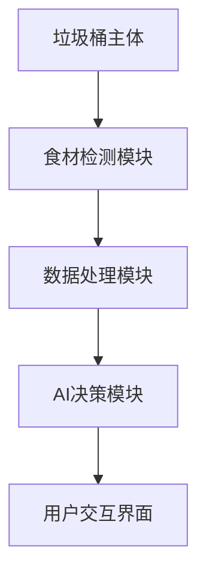
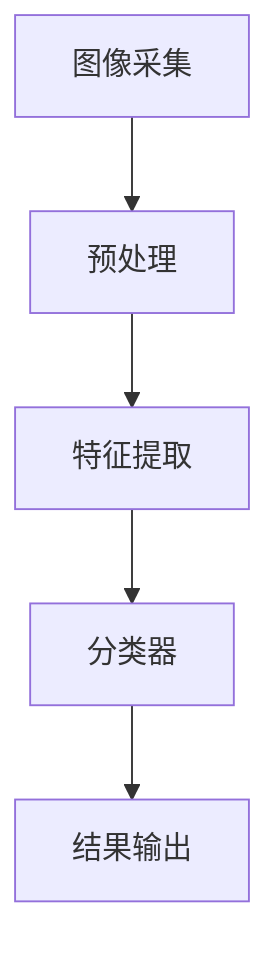
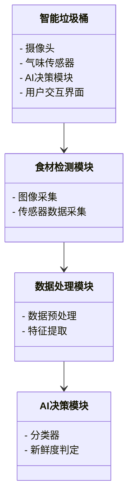
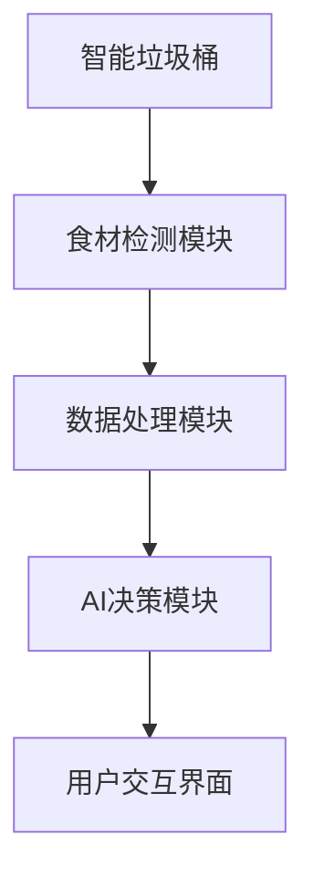
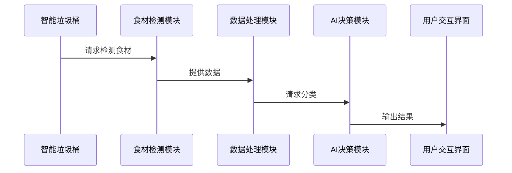

                 


# 智能厨房垃圾桶：AI Agent的食材新鲜度检测

## 关键词：智能垃圾桶, AI Agent, 食材新鲜度, 图像识别, 机器学习, 物联网, 智能家居

## 摘要：本文深入探讨了智能厨房垃圾桶中AI Agent实现食材新鲜度检测的技术细节。通过背景介绍、核心概念、算法原理、系统架构和项目实战的全面分析，展示了如何利用AI技术提升厨房管理效率，减少食材浪费，并为智能家居的未来发展提供新的思路。

---

# 第一部分: 智能厨房垃圾桶的背景与核心概念

## 第1章: 智能厨房垃圾桶的背景与问题描述

### 1.1 食材新鲜度检测的重要性

#### 1.1.1 食材新鲜度对健康的影响
食材的新鲜度直接关系到食品的安全性和营养价值。新鲜度下降可能导致细菌滋生、营养流失，甚至引发食物中毒。因此，及时检测食材新鲜度对保障家庭健康至关重要。

#### 1.1.2 食材浪费的现状与挑战
根据统计，全球每年浪费的食物约有13亿吨，其中家庭浪费占很大比例。智能垃圾桶通过实时检测食材新鲜度，可以帮助用户更好地管理食材，减少浪费。

#### 1.1.3 智能垃圾桶的应用场景
智能垃圾桶不仅是传统垃圾桶的升级版，更是智能家居的重要组成部分。它通过AI技术实现食材分类、新鲜度检测、自动提醒等功能，为家庭厨房管理提供智能化解决方案。

### 1.2 AI Agent在智能垃圾桶中的作用

#### 1.2.1 AI Agent的基本概念
AI Agent（智能体）是一种能够感知环境、自主决策并执行任务的智能系统。在智能垃圾桶中，AI Agent负责采集食材信息、分析数据并做出判断。

#### 1.2.2 AI Agent在食材新鲜度检测中的优势
AI Agent能够通过图像识别、传感器数据和机器学习算法，快速、准确地检测食材新鲜度。相比传统的人工检查，AI Agent具有高效、客观的优势。

#### 1.2.3 智能垃圾桶的智能化发展趋势
随着AI技术的进步，智能垃圾桶将越来越智能化。未来的垃圾桶不仅能检测食材新鲜度，还能与其他智能家居设备联动，实现自动化管理。

### 1.3 问题背景与解决方案

#### 1.3.1 食材新鲜度检测的难点
食材种类繁多，新鲜度的判断标准因种类而异。例如，水果、蔬菜、肉类的检测方法不同，增加了检测的复杂性。

#### 1.3.2 智能垃圾桶的创新解决方案
通过AI技术，智能垃圾桶可以实现多模态数据融合检测，例如结合图像识别和气味传感器，提高检测的准确性和鲁棒性。

#### 1.3.3 边界与外延分析
智能垃圾桶的核心功能是食材检测，但其外延可以扩展到垃圾分类、资源回收等领域，形成完整的智能家居生态。

### 1.4 核心概念与系统架构

#### 1.4.1 食材新鲜度检测的核心要素
- **感知层**：图像采集、气味传感器、湿度传感器。
- **计算层**：数据预处理、特征提取、模型训练。
- **决策层**：新鲜度判定、用户通知。

#### 1.4.2 AI Agent的系统架构图（Mermaid）


### 1.5 本章小结
本章介绍了智能厨房垃圾桶的背景、AI Agent的核心作用，以及食材新鲜度检测的难点和解决方案。通过系统架构图，读者可以清晰地理解智能垃圾桶的工作流程。

---

## 第2章: AI Agent的核心原理与技术

### 2.1 AI Agent的基本原理

#### 2.1.1 感知层：食材特征采集
AI Agent通过摄像头、气味传感器等设备采集食材的图像、颜色、气味等特征信息。

#### 2.1.2 计算层：数据处理与分析
数据经过预处理、特征提取后，输入到机器学习模型中进行分类或回归分析。

#### 2.1.3 决策层：新鲜度判定
AI Agent根据分析结果做出判断，决定是否需要提醒用户处理食材。

### 2.2 食材新鲜度检测的关键技术

#### 2.2.1 基于图像识别的检测方法
- **图像采集**：使用RGB摄像头拍摄食材图像。
- **预处理**：调整亮度、对比度，去除噪声。
- **特征提取**：使用CNN提取食材的纹理、形状特征。
- **分类器训练**：基于深度学习模型（如ResNet）训练分类器。

#### 2.2.2 基于传感器的数据分析
- **气味传感器**：检测食材释放的气体（如硫化氢、氨气）。
- **湿度传感器**：监测食材表面的湿度变化。

#### 2.2.3 基于机器学习的分类算法
- **支持向量机（SVM）**：适用于小规模数据分类。
- **随机森林**：适合多特征的数据分类。
- **深度学习模型**：如卷积神经网络（CNN）适用于图像分类任务。

### 2.3 AI Agent的核心算法

#### 2.3.1 图像识别算法（Mermaid流程图）


#### 2.3.2 分类器的损失函数（Latex公式）
$$ L = -\frac{1}{n}\sum_{i=1}^{n} y_i \log(p_i) + (1 - y_i)\log(1 - p_i) $$

### 2.4 算法数学模型与公式

#### 2.4.1 分类器的损失函数
$$ L = -\frac{1}{n}\sum_{i=1}^{n} y_i \log(p_i) + (1 - y_i)\log(1 - p_i) $$

#### 2.4.2 分类器的优化目标
$$ \text{优化目标} = \min L + \lambda \cdot \text{正则化项} $$

### 2.5 本章小结
本章详细介绍了AI Agent的核心原理和技术，包括感知层、计算层和决策层的工作流程，以及基于图像识别和机器学习的检测算法。

---

## 第3章: 系统分析与架构设计

### 3.1 系统功能设计

#### 3.1.1 领域模型类图（Mermaid）


### 3.2 系统架构设计

#### 3.2.1 系统架构图（Mermaid）


### 3.3 系统接口设计

#### 3.3.1 接口定义
- **输入接口**：摄像头、传感器。
- **输出接口**：显示屏、通知提醒。

#### 3.3.2 接口交互流程（Mermaid）


### 3.4 本章小结
本章通过系统功能设计、架构设计和接口设计，展示了智能垃圾桶的整体结构和各模块之间的交互流程。

---

## 第4章: 项目实战

### 4.1 环境安装

#### 4.1.1 硬件环境
- 摄像头模块（如Raspberry Pi Camera）
- 气味传感器模块
- 微控制器（如Raspberry Pi）

#### 4.1.2 软件环境
- Python 3.8+
- OpenCV库
- TensorFlow库

### 4.2 核心代码实现

#### 4.2.1 图像采集与预处理代码
```python
import cv2

def capture_image():
    # 初始化摄像头
    cap = cv2.VideoCapture(0)
    ret, frame = cap.read()
    if ret:
        cv2.imwrite("fruit.jpg", frame)
    cap.release()

capture_image()
```

#### 4.2.2 特征提取与分类代码
```python
import tensorflow as tf
import numpy as np

model = tf.keras.models.load_model("freshness_model.h5")

def predict_image(image_path):
    image = cv2.imread(image_path)
    image = cv2.resize(image, (224, 224))
    image = image / 255.0
    image = np.expand_dims(image, axis=0)
    prediction = model.predict(image)
    return prediction[0][0]

print(predict_image("fruit.jpg"))  # 输出0或1，0表示新鲜，1表示不新鲜
```

### 4.3 案例分析

#### 4.3.1 案例1：苹果新鲜度检测
- **输入**：新鲜苹果图像。
- **输出**：预测结果为0.95，表示苹果新鲜。

#### 4.3.2 案例2：牛奶保质期检测
- **输入**：牛奶瓶图像。
- **输出**：预测结果为0.80，表示牛奶接近变质。

### 4.4 本章小结
本章通过实际项目代码，展示了如何实现食材新鲜度检测的功能，帮助读者更好地理解AI Agent的应用。

---

## 第5章: 最佳实践与总结

### 5.1 最佳实践 Tips
- **传感器选择**：根据食材特性选择合适的传感器。
- **模型优化**：定期更新模型，提高检测准确率。
- **用户反馈**：收集用户反馈，优化交互体验。

### 5.2 小结
本文详细介绍了智能厨房垃圾桶中AI Agent实现食材新鲜度检测的技术细节，从背景介绍到系统设计，再到项目实战，为读者提供了全面的指导。

### 5.3 注意事项
- 避免过度依赖单一传感器，建议多模态数据融合。
- 定期校准传感器，确保检测精度。

### 5.4 拓展阅读
- 智能家居的发展趋势。
- AI在食品检测中的其他应用。

---

## 作者：AI天才研究院/AI Genius Institute & 禅与计算机程序设计艺术 /Zen And The Art of Computer Programming

---

本文通过系统化的分析和实践，深入探讨了智能厨房垃圾桶中AI Agent实现食材新鲜度检测的技术细节，为智能家居的未来发展提供了新的思路。

