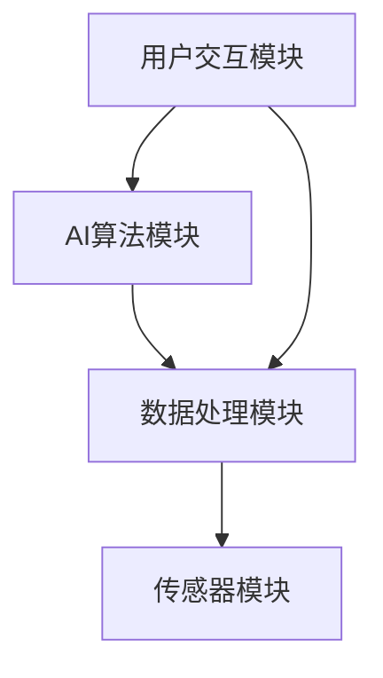
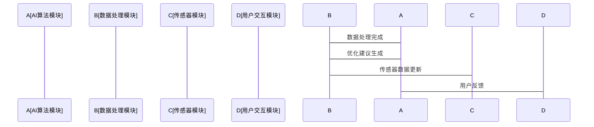

                 


# 智能厨房抽屉：AI Agent的厨具使用优化建议

> 关键词：智能厨房抽屉，AI Agent，厨具管理，算法优化，系统设计

> 摘要：本文将详细介绍如何通过AI Agent优化智能厨房抽屉的厨具管理。从AI Agent的基本原理到算法实现，从系统架构设计到项目实战，本文将全面解析智能厨房抽屉的技术实现和优化建议，为读者提供一套高效、智能的厨具管理解决方案。

---

# 目录

1. [智能厨房抽屉与AI Agent的背景介绍](#智能厨房抽屉与AI-Agent的背景介绍)
2. [AI Agent与智能厨房抽屉的核心概念](#AI-Agent与智能厨房抽屉的核心概念)
3. [智能厨房抽屉AI Agent的算法原理](#智能厨房抽屉AI-Agent的算法原理)
4. [智能厨房抽屉AI Agent的系统架构设计](#智能厨房抽屉AI-Agent的系统架构设计)
5. [智能厨房抽屉AI Agent的项目实战](#智能厨房抽屉AI-Agent的项目实战)
6. [智能厨房抽屉AI Agent的最佳实践与总结](#智能厨房抽屉AI-Agent的最佳实践与总结)

---

## 1. 智能厨房抽屉与AI Agent的背景介绍

### 1.1 智能厨房抽屉的概念与背景

厨房是家庭生活的重要场所，而厨房抽屉则是存放厨具的主要工具。传统的厨房抽屉管理存在以下问题：
- 厨具随意摆放，导致空间浪费。
- 使用时需要翻找，效率低下。
- 厨具位置混乱，容易丢失或损坏。

为了优化厨具管理，智能厨房抽屉应运而生。通过结合AI技术，智能厨房抽屉可以实现对厨具的智能识别、分类和优化管理。

### 1.2 AI Agent的基本原理

AI Agent（智能代理）是一种能够感知环境并采取行动以实现目标的计算机程序。其核心功能包括：
- **感知环境**：通过传感器或数据输入获取信息。
- **决策与行动**：基于感知的信息，通过算法做出决策并执行动作。

在智能厨房抽屉中，AI Agent的主要任务是对厨具的使用情况进行实时监测，并提供建议和优化方案。

### 1.3 智能厨房抽屉的应用场景与优势

#### 1.3.1 应用场景
- **日常使用**：帮助用户快速找到所需厨具，减少翻找时间。
- **库存管理**：实时监测厨具数量和位置，避免重复购买或丢失。
- **使用建议**：根据用户的使用习惯，推荐最优的厨具摆放位置。

#### 1.3.2 优势
- **提高效率**：通过智能化管理，显著提升厨具使用的效率。
- **减少浪费**：避免因摆放不当导致的厨具损坏或丢失。
- **节能环保**：通过优化空间利用，减少能源浪费。

---

## 2. AI Agent与智能厨房抽屉的核心概念

### 2.1 AI Agent的核心概念与原理

#### 2.1.1 AI Agent的定义与分类
AI Agent可以根据应用场景分为多种类型，包括：
- **基于规则的AI Agent**：通过预定义的规则进行决策。
- **基于机器学习的AI Agent**：通过数据训练模型进行决策。
- **基于强化学习的AI Agent**：通过与环境互动逐步优化决策。

#### 2.1.2 AI Agent的功能模块
AI Agent的核心功能模块包括：
- **感知模块**：负责采集环境数据。
- **决策模块**：负责根据数据做出决策。
- **执行模块**：负责执行决策动作。

### 2.2 智能厨房抽屉的系统架构

#### 2.2.1 系统功能模块
智能厨房抽屉的系统架构包括以下功能模块：
- **传感器模块**：用于检测厨具的位置和状态。
- **数据处理模块**：对传感器数据进行处理和分析。
- **AI算法模块**：基于数据生成优化建议。
- **用户交互模块**：与用户进行信息交互。

#### 2.2.2 系统核心算法与数据流
系统的核心算法包括：
- **基于规则的算法**：用于简单的分类和排序。
- **基于机器学习的算法**：用于复杂的模式识别。
- **基于强化学习的算法**：用于优化决策过程。

---

## 3. 智能厨房抽屉AI Agent的算法原理

### 3.1 算法原理概述

#### 3.1.1 基于规则的AI Agent
基于规则的AI Agent通过预定义的规则进行决策。例如，当检测到某个厨具的位置混乱时，系统会根据规则进行调整。

#### 3.1.2 基于机器学习的AI Agent
基于机器学习的AI Agent通过训练模型来优化决策。例如，使用聚类算法对厨具进行分类。

#### 3.1.3 基于强化学习的AI Agent
基于强化学习的AI Agent通过与环境的互动逐步优化决策。例如，系统会根据用户的反馈调整厨具的摆放位置。

### 3.2 算法实现流程

#### 3.2.1 数据采集与预处理
系统通过传感器采集厨具的位置和状态数据，并对数据进行清洗和归一化处理。

#### 3.2.2 算法选择与模型训练
根据具体需求选择合适的算法，并进行模型训练。例如，使用K-means算法进行聚类分析。

#### 3.2.3 算法优化与调参
通过交叉验证和网格搜索等方法优化算法参数，提升模型性能。

### 3.3 算法实现的数学模型

#### 3.3.1 基于规则的算法模型
$$ \text{规则：如果抽屉空间不足，则移动较旧的厨具到其他位置} $$

#### 3.3.2 基于机器学习的数学公式
$$ \text{聚类中心} = \text{argmax}(\sum_{i=1}^{n} \text{distance}(x_i, c)) $$

#### 3.3.3 基于强化学习的数学模型
$$ Q(s, a) = r + \gamma \max_{a'} Q(s', a') $$

### 3.4 算法实现的代码示例

#### 3.4.1 基于规则的实现
```python
def rule_based_optimization(current_state):
    if is_space_insufficient(current_state):
        return move_old_item_to_other_location(current_state)
    else:
        return current_state
```

#### 3.4.2 基于机器学习的实现
```python
from sklearn.cluster import KMeans

def machine_learning_optimization(data):
    model = KMeans(n_clusters=3)
    model.fit(data)
    return model.predict(data)
```

#### 3.4.3 基于强化学习的实现
```python
def reinforce_learning_optimization(state):
    action = select_action(state)
    next_state = get_next_state(state, action)
    reward = calculate_reward(state, action, next_state)
    update_Q_table(reward)
    return next_state
```

---

## 4. 智能厨房抽屉AI Agent的系统架构设计

### 4.1 系统功能设计

#### 4.1.1 系统功能模块
- **传感器模块**：负责采集厨具的位置和状态。
- **数据处理模块**：对传感器数据进行清洗和转换。
- **AI算法模块**：基于数据生成优化建议。
- **用户交互模块**：与用户进行信息交互。

#### 4.1.2 系统功能流程
1. 传感器模块采集厨具数据。
2. 数据处理模块对数据进行预处理。
3. AI算法模块生成优化建议。
4. 用户交互模块将建议展示给用户。

### 4.2 系统架构设计

#### 4.2.1 系统架构图


#### 4.2.2 系统接口设计
- **输入接口**：传感器数据和用户输入。
- **输出接口**：优化建议和状态反馈。

#### 4.2.3 系统交互流程


---

## 5. 智能厨房抽屉AI Agent的项目实战

### 5.1 环境搭建

#### 5.1.1 安装Python
```bash
python --version
pip install numpy scikit-learn
```

#### 5.1.2 环境配置
```bash
mkdir project
cd project
touch main.py
touch data.csv
```

### 5.2 核心实现

#### 5.2.1 传感器数据采集
```python
import csv
import os

def save_sensor_data(data, filename):
    with open(filename, 'w') as f:
        writer = csv.writer(f)
        writer.writerow(['x', 'y', 'z'])
        for point in data:
            writer.writerow(point)
```

#### 5.2.2 数据处理
```python
import pandas as pd

def process_data(filename):
    data = pd.read_csv(filename)
    # 数据清洗与预处理
    return data
```

#### 5.2.3 AI算法实现
```python
from sklearn.cluster import KMeans

def optimize_storage(data):
    model = KMeans(n_clusters=3)
    model.fit(data)
    return model.predict(data)
```

### 5.3 测试与优化

#### 5.3.1 测试用例
```python
data = [
    (1, 2, 3),
    (4, 5, 6),
    (7, 8, 9)
]
save_sensor_data(data, 'data.csv')
processed_data = process_data('data.csv')
optimized = optimize_storage(processed_data)
print(optimized)
```

#### 5.3.2 性能优化
- **数据预处理**：使用并行处理加速数据处理。
- **算法优化**：使用分布式计算优化模型训练。

---

## 6. 智能厨房抽屉AI Agent的最佳实践与总结

### 6.1 最佳实践

#### 6.1.1 数据隐私
- 确保传感器数据的安全性，避免用户隐私泄露。

#### 6.1.2 系统维护
- 定期更新传感器和算法模型，保持系统性能。

### 6.2 小结

通过本文的详细讲解，我们了解了智能厨房抽屉AI Agent的技术实现和优化建议。从算法原理到系统设计，从项目实战到最佳实践，我们为读者提供了一套完整的解决方案。

### 6.3 注意事项

- **数据准确性**：确保传感器数据的准确性，避免误判。
- **系统稳定性**：定期检查系统稳定性，避免故障。
- **用户反馈**：及时收集用户反馈，持续优化系统。

### 6.4 拓展阅读

- **AI Agent相关书籍**：《人工智能：一种现代的方法》
- **机器学习相关书籍**：《机器学习实战》
- **系统架构相关书籍**：《设计模式：可复用面向对象软件的基础》

---

作者：AI天才研究院/AI Genius Institute & 禅与计算机程序设计艺术 /Zen And The Art of Computer Programming

