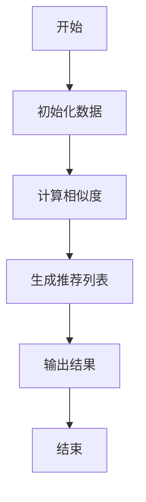
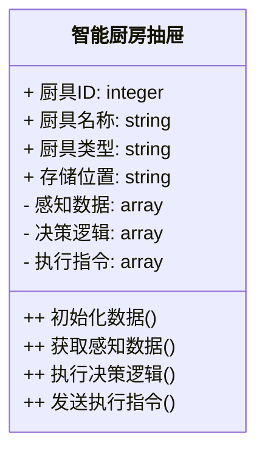
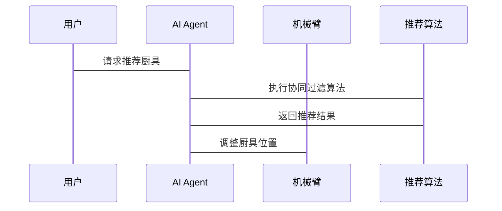

                 


# 智能厨房抽屉：AI Agent的厨具使用建议

> 关键词：智能厨房抽屉，AI Agent，厨具管理，推荐算法，系统架构

> 摘要：本文探讨了AI Agent在厨房抽屉中的应用，结合推荐算法和系统架构设计，提出了一种智能化的厨具管理解决方案。文章从背景分析、核心概念、算法原理、系统架构、项目实战等多个方面进行了详细阐述，最后给出了最佳实践建议。

---

## 第1章 智能厨房抽屉的背景与问题背景

### 1.1 智能厨房抽屉的现状与挑战

#### 1.1.1 厨房抽屉的传统使用问题
传统的厨房抽屉主要用于存储厨具，但在实际使用中存在以下问题：
- **空间利用不足**：厨具种类繁多，但抽屉空间有限，导致存储混乱。
- **管理效率低下**：用户需要手动查找和归位厨具，费时费力。
- **缺乏智能化**：无法根据用户习惯提供智能化的使用建议。

#### 1.1.2 智能化带来的新机遇
随着人工智能（AI）技术的发展，智能厨房抽屉可以通过传感器、摄像头和AI算法实现智能化管理，为用户带来更便捷的使用体验。

#### 1.1.3 当前市场中的智能厨房设备现状
当前市场中，智能厨房设备主要集中在以下几个方面：
- 智能灶具：支持语音控制和自动调节。
- 智能冰箱：具备食材管理、食谱推荐功能。
- 智能橱柜：支持人脸识别和自动开关。

然而，这些设备主要集中在烹饪和食材管理领域，而对厨具管理的关注较少。

### 1.2 问题背景与需求分析

#### 1.2.1 厨具管理中的常见问题
- **查找困难**：用户需要花费大量时间寻找所需的厨具。
- **管理混乱**：不同类型的厨具混杂存放，导致使用不便。
- **维护困难**：缺乏定期清洁和维护的提醒机制。

#### 1.2.2 用户需求分析
用户在厨房抽屉使用中需要以下功能：
- 自动识别厨具种类和位置。
- 根据使用频率推荐厨具。
- 提供智能化的使用建议（如清洁提醒）。

#### 1.2.3 智能厨房抽屉的解决思路
通过引入AI Agent技术，实现厨具的智能化管理，提升用户体验。

---

## 第2章 AI Agent的核心概念与原理

### 2.1 AI Agent的基本原理

#### 2.1.1 AI Agent的感知模块
AI Agent通过以下传感器实现感知：
- **摄像头**：用于识别厨具种类和位置。
- **重量传感器**：用于检测厨具的使用状态。

#### 2.1.2 AI Agent的决策模块
决策模块基于以下算法实现：
- **协同过滤算法**：根据用户使用频率推荐厨具。
- **规则引擎**：根据厨具类型制定使用建议。

#### 2.1.3 AI Agent的执行模块
执行模块通过以下方式实现：
- **机械臂**：自动调整厨具位置。
- **LED提示灯**：提醒用户归还厨具。

### 2.2 核心概念对比分析

#### 2.2.1 概念属性对比表格
| 概念 | 属性 | 描述 |
|------|------|------|
| AI Agent | 智能性 | 基于AI算法实现自动化决策 |
| 厨房抽屉 | 物理性 | 实现厨具的存储与管理 |

#### 2.2.2 ER实体关系图
```mermaid
erd
    entity 智能厨房抽屉 {
        key 厨具ID
        属性 厨具名称, 厨具类型, 存储位置
    }
    entity AI Agent {
        key AgentID
        属性 感知数据, 决策逻辑, 执行指令
    }
    智能厨房抽屉 --> AI Agent: 使用AI Agent进行管理
```

### 2.3 本章小结

---

## 第3章 智能厨房抽屉的推荐算法原理

### 3.1 推荐算法概述

#### 3.1.1 基于规则的推荐算法
- **规则引擎**：根据厨具类型制定使用建议（例如，刀具需要定期清洁）。

#### 3.1.2 基于机器学习的推荐算法
- **协同过滤算法**：根据用户使用频率推荐厨具。

#### 3.1.3 混合推荐算法
- 结合规则引擎和协同过滤算法，提供更精准的推荐。

### 3.2 推荐算法的数学模型

#### 3.2.1 基于协同过滤的推荐算法
$$相似度计算公式：sim(i,j) = \frac{\sum_{k=1}^n r_{ik}r_{jk}}{\sqrt{\sum_{k=1}^n r_{ik}^2} \sqrt{\sum_{k=1}^n r_{jk}^2}}$$

#### 3.2.2 基于内容的推荐算法
$$相似度计算公式：sim(i,j) = \frac{\sum_{k=1}^n w_k (t_i,k) (t_j,k)}{\sum_{k=1}^n w_k}$$

### 3.3 算法实现流程


---

## 第4章 系统分析与架构设计

### 4.1 问题场景介绍
- **用户场景**：用户希望快速找到所需的厨具，并获得智能化的使用建议。
- **技术场景**：通过AI Agent实现厨具的智能化管理。

### 4.2 系统功能设计

#### 4.2.1 领域模型


#### 4.2.2 系统架构设计


#### 4.2.3 系统接口设计
- **输入接口**：摄像头、重量传感器。
- **输出接口**：机械臂、LED提示灯。

#### 4.2.4 系统交互流程


---

## 第5章 项目实战

### 5.1 环境安装
- **硬件环境**：摄像头、机械臂、LED提示灯。
- **软件环境**：Python 3.8，TensorFlow 2.0。

### 5.2 核心代码实现

#### 5.2.1 推荐算法实现
```python
import numpy as np

def calculate_similarity(user_data, item_data):
    # 协同过滤算法实现
    similarity = np.dot(user_data, item_data) / (np.linalg.norm(user_data) * np.linalg.norm(item_data))
    return similarity
```

#### 5.2.2 AI Agent实现
```python
class AI-Agent:
    def __init__(self):
        self.perception_data = []
        self.decision_logic = []
        self.execution_commands = []

    def process_request(self, request):
        # 根据感知数据生成决策逻辑
        self.decision_logic = self.generate_recommendation(request)
        # 执行决策逻辑
        self.execute_commands(self.decision_logic)
```

### 5.3 案例分析
- **案例1**：用户频繁使用刀具，AI Agent会推荐优先使用刀具，并提醒用户定期清洁。

### 5.4 项目小结

---

## 第6章 最佳实践与注意事项

### 6.1 最佳实践
- **数据隐私保护**：确保用户数据的安全性。
- **用户体验优化**：提供简洁直观的用户界面。

### 6.2 注意事项
- **算法优化**：定期更新推荐算法，提升推荐准确率。
- **系统维护**：定期检查硬件设备，确保正常运行。

---

## 第7章 总结与展望

### 7.1 总结
通过引入AI Agent技术，智能厨房抽屉能够实现智能化的厨具管理，显著提升用户体验。

### 7.2 展望
未来，智能厨房抽屉将与更多智能家居设备联动，形成完整的厨房智能化解决方案。

---

## 作者

作者：AI天才研究院/AI Genius Institute & 禅与计算机程序设计艺术 /Zen And The Art of Computer Programming

---

通过以上目录结构，您可以根据需要进一步扩展每个章节的内容，添加具体的代码实现、详细的技术分析和实际案例。

