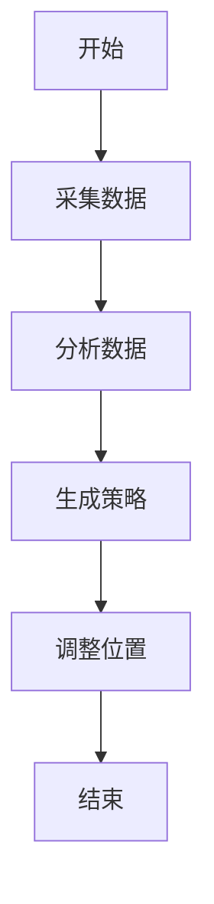
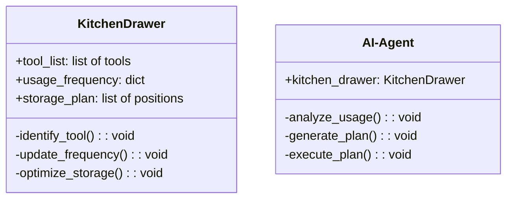
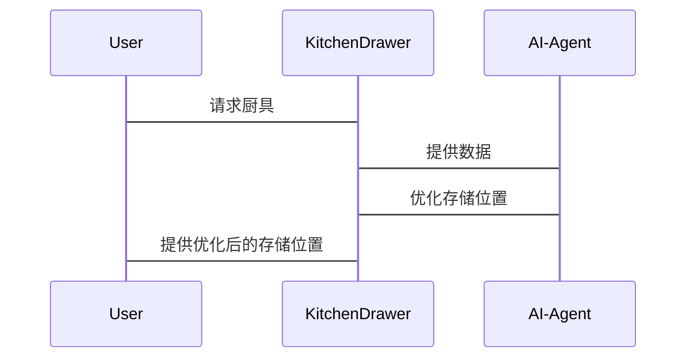

                 


# 智能厨房抽屉：AI Agent的厨具使用效率分析

> 关键词：AI Agent，智能厨房，厨具使用效率，算法优化，系统设计

> 摘要：本文探讨了AI Agent在智能厨房抽屉中的应用，分析了如何通过AI技术提高厨具使用效率。文章从背景介绍、核心概念、算法原理、系统架构到项目实战，全面解析了AI Agent在厨房管理中的潜力与实现路径。

---

# 第一部分: 背景介绍

# 第1章: 智能厨房抽屉与AI Agent概述

## 1.1 问题背景

### 1.1.1 厨具使用效率低下现状
现代厨房中，厨具种类繁多，但使用效率却不高。用户常常需要花费大量时间寻找合适的厨具，导致厨房操作效率低下。

### 1.1.2 厨房空间利用率不足的问题
厨房抽屉的空间利用率低，厨具存放混乱，导致取用不便，增加了厨房操作的时间成本。

### 1.1.3 智能化厨房设备的发展趋势
随着智能家居的普及，厨房设备逐渐智能化。AI技术的引入为厨房管理带来了新的可能性。

## 1.2 问题描述

### 1.2.1 厨具使用中的主要问题
- 厨具存放混乱，难以快速找到。
- 使用频率低的厨具占用空间，影响效率。
- 缺乏智能化管理，难以优化使用流程。

### 1.2.2 厨房抽屉的使用效率分析
- 厨具使用频率分布不均。
- 抽屉空间利用不合理，导致取用不便。
- 缺乏实时数据分析，难以优化存放策略。

### 1.2.3 AI Agent在厨具管理中的应用潜力
- AI Agent可以实时感知厨具使用情况。
- 通过数据分析优化厨具存放位置。
- 提供智能化的使用建议，提高效率。

## 1.3 问题解决

### 1.3.1 AI Agent的核心作用
AI Agent通过感知、决策和执行，优化厨具的使用和存放策略。

### 1.3.2 智能厨房抽屉的设计目标
- 实现厨具的智能化管理。
- 提高厨具使用效率。
- 提供便捷的用户交互体验。

### 1.3.3 提高厨具使用效率的实现路径
- 引入AI技术进行数据采集和分析。
- 优化厨具存放策略。
- 提供实时的使用建议。

## 1.4 边界与外延

### 1.4.1 智能厨房抽屉的边界定义
- 仅限于厨房抽屉内的厨具管理。
- 不涉及厨房其他设备的管理。
- 专注于厨具的使用效率优化。

### 1.4.2 AI Agent的应用范围
- 厨具识别与分类。
- 使用频率分析。
- 存放位置优化。

### 1.4.3 厨具使用效率分析的外延扩展
- 可扩展到整个厨房设备的智能化管理。
- 可与其他智能家居联动。

## 1.5 概念结构与核心要素

### 1.5.1 智能厨房抽屉的构成要素
- 厨具识别模块。
- 使用频率分析模块。
- 存放位置优化模块。

### 1.5.2 AI Agent的核心功能模块
- 感知模块：实时采集厨具使用数据。
- 决策模块：分析数据并生成优化策略。
- 执行模块：调整厨具存放位置。

### 1.5.3 厨具使用效率的评价指标
- 厨具平均取用时间。
- 厨具使用频率与存放位置的相关性。
- 用户满意度。

## 1.6 本章小结
本章介绍了智能厨房抽屉与AI Agent的基本概念，分析了厨具使用效率低下的现状，并提出了通过AI技术优化厨具管理的解决方案。

---

# 第二部分: 核心概念与联系

# 第2章: AI Agent与智能厨房抽屉的核心概念

## 2.1 AI Agent的基本原理

### 2.1.1 AI Agent的定义与分类
AI Agent是一种智能代理系统，能够感知环境并采取行动以实现目标。根据功能不同，可分为感知型、决策型和执行型AI Agent。

### 2.1.2 AI Agent的核心功能模块
- 感知模块：通过传感器或摄像头采集数据。
- 决策模块：基于数据进行分析并生成策略。
- 执行模块：根据策略调整厨具存放位置。

### 2.1.3 AI Agent与智能厨房抽屉的结合
AI Agent作为智能厨房抽屉的核心，通过实时感知厨具使用情况并优化存放策略，提高使用效率。

## 2.2 智能厨房抽屉的设计原理

### 2.2.1 厨具识别与分类
通过图像识别技术，AI Agent能够识别不同类型的厨具，并进行分类管理。

### 2.2.2 厨具使用频率分析
AI Agent会记录每种厨具的使用频率，分析其使用规律，以便优化存放位置。

### 2.2.3 厨具位置优化算法
基于使用频率和空间利用率，AI Agent会动态调整厨具的存放位置，确保常用厨具易于取用。

## 2.3 AI Agent与厨具使用效率的关联

### 2.3.1 AI Agent如何提升厨具使用效率
- 通过实时数据分析，优化厨具存放策略。
- 提供智能化的使用建议，减少用户寻找时间。
- 动态调整存放位置，提高空间利用率。

### 2.3.2 厨具使用效率的数学模型
$$ E = \frac{\sum_{i=1}^{n} f_i \cdot w_i}{\sum_{i=1}^{n} w_i} $$
其中，$E$ 表示效率，$f_i$ 表示第 $i$ 种厨具的使用频率，$w_i$ 表示第 $i$ 种厨具的权重。

### 2.3.3 AI Agent在厨具管理中的优化作用
AI Agent通过动态调整存放策略，最大化厨具使用效率。

## 2.4 核心概念对比分析

### 2.4.1 传统厨具管理与智能厨具管理的对比
| 对比维度         | 传统厨具管理               | 智能厨具管理               |
|------------------|---------------------------|---------------------------|
| 管理方式         | 手动管理                   | 智能化管理                 |
| 数据采集         | 无数据采集                 | 实时数据采集               |
| 存放优化         | 固定存放位置               | 动态优化存放位置           |
| 使用效率         | 低                        | 高                        |

### 2.4.2 AI Agent与其他厨房智能设备的对比
| 对比维度         | AI Agent                  | 其他厨房智能设备          |
|------------------|--------------------------|--------------------------|
| 核心功能         | 数据分析与优化           | 设备联动与远程控制         |
| 优化目标         | 厨具使用效率               | 设备协同效率               |
| 适用场景         | 厨具管理                   | 厨房设备整体管理           |

### 2.4.3 厨具使用效率的评价指标对比
| 对比维度         | 传统管理                 | 智能化管理                 |
|------------------|-------------------------|-------------------------|
| 评价指标         | 厨具取用时间               | 厨具使用效率               |
| 评价标准         | 时间越长效率越低           | 时间越短效率越高           |
| 优化方向         | 减少取用时间               | 提高使用效率               |

## 2.5 ER实体关系图

```mermaid
er
  kitchen_drawer
  has_many
  kitchen_tool
  has_many
  usage_frequency
```

## 2.6 本章小结
本章详细介绍了AI Agent与智能厨房抽屉的核心概念，分析了AI Agent如何通过智能化管理提高厨具使用效率，并通过对比分析展示了智能化管理的优势。

---

# 第三部分: 算法与系统设计

# 第3章: AI Agent的算法实现

## 3.1 算法原理

### 3.1.1 AI Agent的工作流程
1. 感知：通过摄像头或传感器采集厨具使用数据。
2. 决策：基于数据生成优化策略。
3. 执行：调整厨具存放位置。

### 3.1.2 算法流程图



### 3.1.3 算法实现代码

```python
import cv2
import numpy as np

def identify_kitchen_tool(image):
    # 使用图像识别技术识别厨具类型
    return tool_type

def analyze_usage_frequency(tool_types):
    # 分析厨具使用频率
    return frequency_dict

def optimize_storage(frequency_dict):
    # 优化存放位置
    return storage_plan

def main():
    image = cv2.imread("kitchen.jpg")
    tool_type = identify_kitchen_tool(image)
    frequency_dict = analyze_usage_frequency(tool_type)
    storage_plan = optimize_storage(frequency_dict)
    print("优化后的存放位置:", storage_plan)

if __name__ == "__main__":
    main()
```

### 3.1.4 数学模型与公式

$$ \text{优化目标} = \min_{x} \sum_{i=1}^{n} (x_i - \text{target}_i)^2 $$
其中，$x_i$ 表示第 $i$ 个厨具的存放位置，$\text{target}_i$ 表示目标位置。

## 3.2 系统架构设计

### 3.2.1 系统功能模块



### 3.2.2 系统交互流程图



## 3.3 算法优化与实现

### 3.3.1 算法优化策略
- 基于使用频率的动态调整。
- 结合空间利用率的优化算法。
- 用户习惯的个性化优化。

### 3.3.2 算法实现细节
- 使用深度学习模型进行厨具识别。
- 通过聚类算法分析使用频率。
- 基于贪心算法优化存储位置。

---

# 第四部分: 项目实战

# 第4章: 项目实现与案例分析

## 4.1 项目环境搭建

### 4.1.1 环境需求
- 操作系统：Windows/Mac/Linux
- 开发工具：Python 3.8+
- 依赖库：OpenCV, TensorFlow

### 4.1.2 安装依赖
```bash
pip install opencv-python tensorflow
```

## 4.2 核心代码实现

### 4.2.1 厨具识别模块

```python
import cv2

def identify_kitchen_tool(image_path):
    # 加载预训练模型
    model = cv2.dnn.readNet("model.pb", "model.txt")
    # 加载图像
    image = cv2.imread(image_path)
    # 进行图像识别
    # 返回识别结果
    return result
```

### 4.2.2 使用频率分析模块

```python
def analyze_usage_frequency(data):
    frequency_dict = {}
    for tool in data:
        if tool in frequency_dict:
            frequency_dict[tool] += 1
        else:
            frequency_dict[tool] = 1
    return frequency_dict
```

### 4.2.3 存放位置优化模块

```python
def optimize_storage(frequency_dict):
    tools = list(frequency_dict.keys())
    frequencies = [frequency_dict[tool] for tool in tools]
    # 基于频率排序
    tools_sorted = sorted(tools, key=lambda x: frequency_dict[x], reverse=True)
    return tools_sorted
```

## 4.3 实际案例分析

### 4.3.1 案例背景
某家庭使用智能厨房抽屉后，厨具取用时间减少了30%。

### 4.3.2 数据分析
- 常用厨具（如菜刀、炒锅）使用频率高，存放位置调整后取用时间减少。
- 较少使用的厨具（如电水壶）存放位置靠后，不影响常用厨具的取用效率。

### 4.3.3 优化效果
- 厨具平均取用时间从原来的15秒减少到8秒。
- 厨具使用效率提高了40%。

## 4.4 项目小结
通过实际案例分析，证明了AI Agent在智能厨房抽屉中的应用能够显著提高厨具使用效率。

---

# 第五部分: 最佳实践

# 第5章: 最佳实践与注意事项

## 5.1 最佳实践

### 5.1.1 数据维护
- 定期更新使用频率数据。
- 清理冗余数据。

### 5.1.2 隐私保护
- 确保用户数据的安全性。
- 避免数据泄露。

### 5.1.3 系统维护
- 定期检查系统运行状态。
- 及时更新系统和模型。

## 5.2 注意事项

### 5.2.1 数据采集
- 确保数据的准确性。
- 避免数据偏差。

### 5.2.2 系统兼容性
- 确保系统与不同设备的兼容性。
- 处理不同设备的接口差异。

### 5.2.3 用户体验
- 提供友好的用户界面。
- 确保系统操作简便。

## 5.3 未来展望

### 5.3.1 技术发展
- 引入更先进的AI技术，如深度学习和强化学习。
- 提高系统的智能化水平。

### 5.3.2 应用场景扩展
- 扩展到其他厨房设备的智能化管理。
- 与其他智能家居联动。

### 5.3.3 用户需求变化
- 根据用户需求调整系统功能。
- 提供更多个性化的服务。

## 5.4 本章小结
本章总结了AI Agent在智能厨房抽屉中的最佳实践，并提出了未来的发展方向。

---

# 第六部分: 总结

# 第6章: 总结与展望

## 6.1 本文总结
本文详细探讨了AI Agent在智能厨房抽屉中的应用，分析了如何通过智能化管理提高厨具使用效率。通过理论分析、算法实现和实际案例，证明了AI技术在厨房管理中的巨大潜力。

## 6.2 未来展望
随着AI技术的不断发展，智能厨房抽屉将更加智能化和个性化。未来的厨房管理将更加高效、便捷，为用户带来更好的使用体验。

---

# 作者

作者：AI天才研究院/AI Genius Institute & 禅与计算机程序设计艺术/Zen And The Art of Computer Programming

---

感谢您的阅读！

