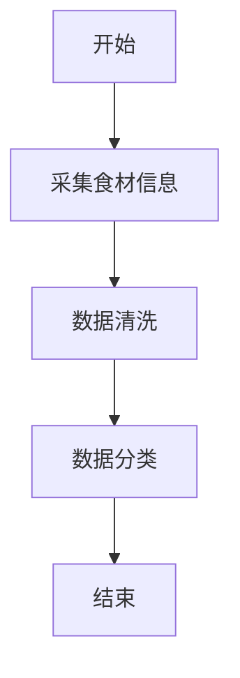
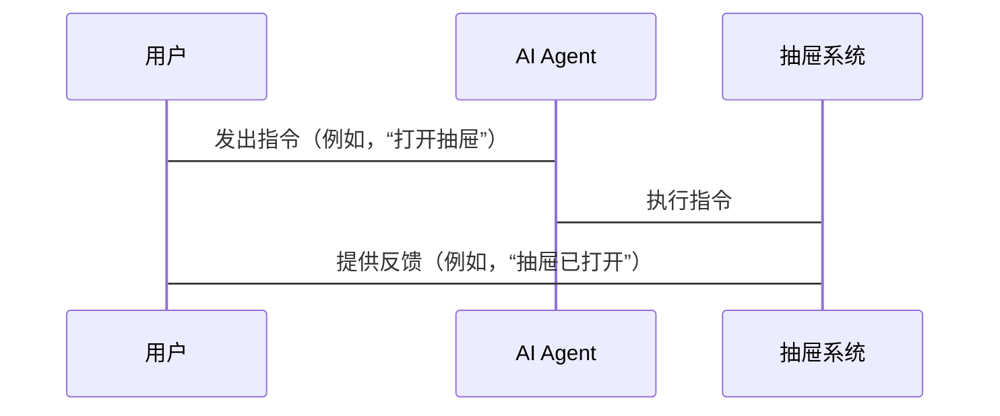

                 


```markdown
# 智能厨房抽屉：AI Agent的烹饪工具使用建议

> 关键词：智能厨房，AI Agent，烹饪工具，智能化厨房设备，人工智能助手

> 摘要：本文探讨了AI Agent在智能厨房抽屉中的应用，分析了其工作原理、系统架构，并提供了实际案例和使用建议，帮助读者理解如何通过智能化工具提升烹饪效率。

---

# 第一部分: 智能厨房抽屉的背景与概念

## 第1章: 智能厨房抽屉的背景与问题背景

### 1.1 厨房工具的智能化趋势

#### 1.1.1 厨房工具的发展历程
- 传统厨房工具：刀、铲、锅等手动工具的演变。
- 现代厨房工具：电动化、自动化设备的普及。
- 智能化厨房工具：AI Agent驱动的智能设备出现，标志着厨房工具进入智能化阶段。

#### 1.1.2 智能化厨房工具的现状
- 市场上已出现的智能厨房设备，如智能烤箱、智能搅拌机。
- 当前设备的功能特点：联网、远程控制、定时提醒。

#### 1.1.3 AI Agent在厨房工具中的应用前景
- AI Agent如何提升厨房工具的智能化水平。
- 未来的厨房工具可能具备的功能：智能推荐食谱、自动调整烹饪参数、语音控制等。

### 1.2 智能厨房抽屉的定义与问题描述

#### 1.2.1 智能厨房抽屉的定义
- 智能厨房抽屉：一种集成AI Agent的厨房存储与管理设备。
- 其他相关概念：智能橱柜、智能储物柜。

#### 1.2.2 智能厨房抽屉的核心功能
- 存储与管理：食材分类、存储优化。
- 智能推荐：根据食材推荐食谱。
- 自动补货：根据使用情况提醒购买食材。
- 语音控制：通过语音指令操作抽屉。

#### 1.2.3 当前厨房工具使用中的问题与痛点
- 食材管理混乱：食材存放无序，查找困难。
- 食谱选择困难：面对众多食谱，难以选择合适的。
- 烹饪时间过长：缺乏智能化辅助，烹饪效率低。

#### 1.2.4 智能厨房抽屉的边界与外延
- 边界：仅限于抽屉部分，不涉及其他厨房设备。
- 外延：可与其他智能厨房设备联动，如智能灶台、智能烤箱。

#### 1.2.5 智能厨房抽屉的核心要素组成
- 存储空间：分隔式设计，便于分类存储。
- 传感器：监测食材状态。
- AI Agent：处理数据，提供智能化服务。
- 用户界面：便于用户操作和查看信息。

---

## 第2章: AI Agent与智能厨房抽屉的核心概念

### 2.1 AI Agent的基本概念

#### 2.1.1 AI Agent的定义
- AI Agent：具备感知和决策能力的智能体。
- 核心能力：信息处理、决策制定、任务执行。

#### 2.1.2 AI Agent的核心属性与特征
- 感知能力：通过传感器获取环境信息。
- 决策能力：基于数据进行判断。
- 学习能力：通过经验优化决策。
- 交互能力：与用户或设备进行信息交换。

#### 2.1.3 AI Agent与传统厨房工具的区别
- 传统工具：依赖人工操作，不具备智能决策能力。
- AI Agent：具备自主决策和执行能力。

### 2.2 智能厨房抽屉与AI Agent的关系

#### 2.2.1 智能厨房抽屉的功能实现依赖AI Agent
- AI Agent负责处理食材数据，推荐食谱。
- 通过AI Agent优化存储空间利用。

#### 2.2.2 AI Agent在智能厨房抽屉中的具体应用场景
- 根据食材剩余情况推荐食谱。
- 自动记录食材使用情况，提醒补货。
- 通过语音指令操作抽屉。

#### 2.2.3 AI Agent与智能厨房抽屉的交互流程
1. 用户通过语音或App发出指令。
2. AI Agent接收指令，分析当前状态。
3. 执行操作，如开启抽屉、调整存储布局。
4. 提供反馈，如操作结果或建议。

### 2.3 智能厨房抽屉的核心概念对比

#### 2.3.1 AI Agent与传统厨房工具的功能对比
| 功能 | AI Agent | 传统厨房工具 |
|------|----------|--------------|
| 信息处理 | 自动分析食材 | 人工记录食材 |
| 决策能力 | 推荐最优食谱 | 依赖人工选择 |
| 交互方式 | 语音/App控制 | 手动操作 |

#### 2.3.2 智能厨房抽屉与传统厨房抽屉的功能对比
| 功能 | 智能厨房抽屉 | 传统厨房抽屉 |
|------|--------------|----------------|
| 存储管理 | 智能分类存储 | 手动分类存储 |
| 信息处理 | 推荐食谱 | 无 |
| 自动控制 | 语音/App控制 | 手动操作 |
| 数据分析 | 分析食材使用情况 | 无 |

#### 2.3.3 AI Agent在智能厨房抽屉中的作用与价值
- 提高厨房管理效率。
- 减少食材浪费。
- 提供智能化服务，提升用户体验。

---

## 第3章: AI Agent在智能厨房抽屉中的工作原理

### 3.1 AI Agent的基本工作流程

#### 3.1.1 信息采集与处理
- 传感器采集食材信息：种类、数量、保质期。
- 数据预处理：清洗、归类。

#### 3.1.2 数据分析与决策
- 基于机器学习模型推荐食谱。
- 根据使用频率优化存储布局。

#### 3.1.3 任务执行与反馈
- 根据指令执行操作，如开启抽屉。
- 提供反馈，如操作结果、建议。

---

### 3.2 AI Agent的算法原理

#### 3.2.1 信息采集与处理


#### 3.2.2 数据分析与决策
```python
# 示例代码：基于机器学习的食谱推荐
from sklearn.neighbors import NearestNeighbors
import numpy as np

# 数据处理
食材数据 = ... # 加载食材数据
食材特征 = ... # 提取食材特征

# 训练模型
model = NearestNeighbors(n_neighbors=3).fit(食材特征)

# 查询推荐食谱
query = ... # 用户输入的食材
neighbors = model.kneighbors(query, return_distance=False)

# 输出推荐结果
推荐食谱 = 食材数据.iloc[neighbors[0]]
print("推荐食谱：", 推荐食谱)
```

#### 3.2.3 任务执行与反馈


---

## 第4章: 智能厨房抽屉的系统架构与设计

### 4.1 系统架构设计

#### 4.1.1 功能模块设计
```mermaid
classDiagram
    class 用户界面 {
        输入指令
        显示反馈
    }
    class 传感器 {
        监测食材状态
    }
    class AI Agent {
        处理数据
        执行任务
    }
    class 存储系统 {
        管理食材存储
    }
    用户界面 <---> AI Agent
    AI Agent <---> 传感器
    AI Agent <---> 存储系统
```

#### 4.1.2 数据流设计
```mermaid
flowchart TD
    用户界面 --> AI Agent
    AI Agent --> 传感器
    传感器 --> AI Agent
    AI Agent --> 存储系统
    存储系统 --> 用户界面
```

---

## 第5章: 项目实战与案例分析

### 5.1 环境安装与配置

#### 5.1.1 安装Python与相关库
```bash
pip install numpy scikit-learn mermaid4jupyter
```

#### 5.1.2 安装AI Agent框架
```bash
pip install transformers
```

### 5.2 系统核心实现

#### 5.2.1 AI Agent实现
```python
# 示例代码：AI Agent的核心逻辑
import numpy as np
from sklearn.neighbors import NearestNeighbors

class AIAgent:
    def __init__(self, 食材特征):
        self.model = NearestNeighbors(n_neighbors=3).fit(食材特征)

    def 推荐食谱(self, query):
        neighbors = self.model.kneighbors(query, return_distance=False)
        return 食材特征.iloc[neighbors[0]]

# 初始化并使用AI Agent
食材特征 = ... # 加载食材特征数据
ai_agent = AIAgent(食材特征)
推荐结果 = ai_agent.推荐食谱(输入查询)
print("推荐结果：", 推荐结果)
```

#### 5.2.2 系统交互实现
```python
# 示例代码：用户与AI Agent的交互
def handle_command(command):
    if command == "打开抽屉":
        print("抽屉已打开")
    elif command == "关闭抽屉":
        print("抽屉已关闭")
    else:
        print("无效指令")

# 用户输入
command = input("请输入指令：")
handle_command(command)
```

### 5.3 案例分析

#### 5.3.1 食材管理案例
- 用户存储了鸡胸肉、牛肉、鱼等食材。
- AI Agent推荐使用鸡胸肉制作鸡胸肉沙拉。
- 根据食材使用情况优化存储布局。

#### 5.3.2 自动补货案例
- 系统监测到牛奶存量不足。
- 提醒用户购买牛奶。
- 自动更新库存记录。

---

## 第6章: 最佳实践与小结

### 6.1 最佳实践

#### 6.1.1 使用建议
- 定期更新食材数据，确保推荐准确性。
- 保持设备正常运行，及时维护传感器。
- 学习使用高级功能，提升使用体验。

#### 6.1.2 注意事项
- 注意数据隐私，防止食材信息泄露。
- 定期检查系统更新，确保功能完善。

### 6.2 小结

本文详细介绍了AI Agent在智能厨房抽屉中的应用，从背景到系统设计，再到实际案例，全面阐述了其工作原理和使用价值。通过本文的学习，读者可以深入了解如何利用AI技术优化厨房管理，提升烹饪效率。

---

作者：AI天才研究院/AI Genius Institute & 禅与计算机程序设计艺术 /Zen And The Art of Computer Programming
```

