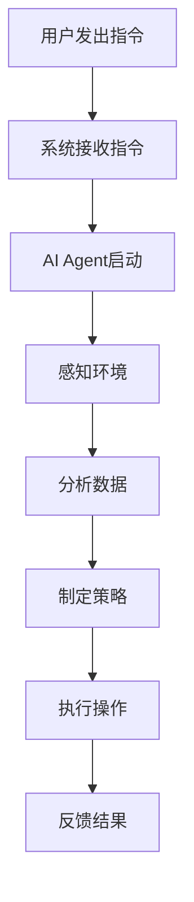
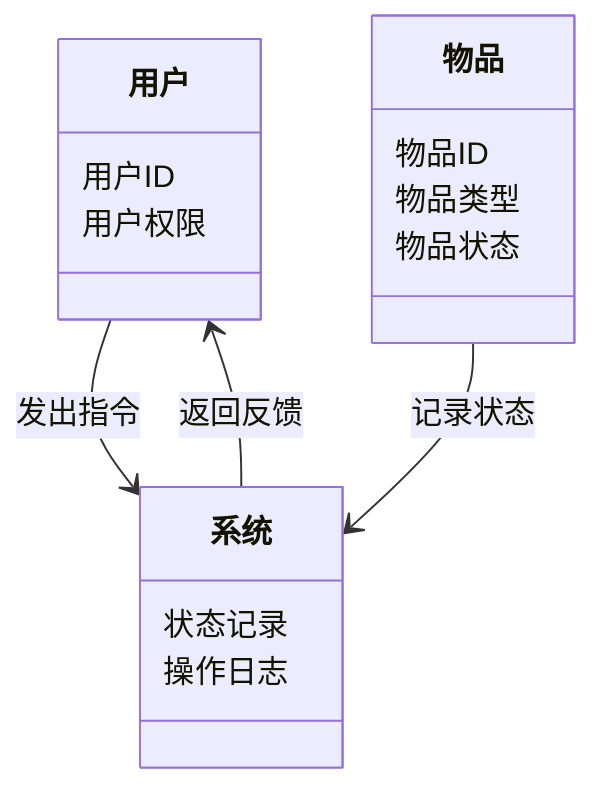
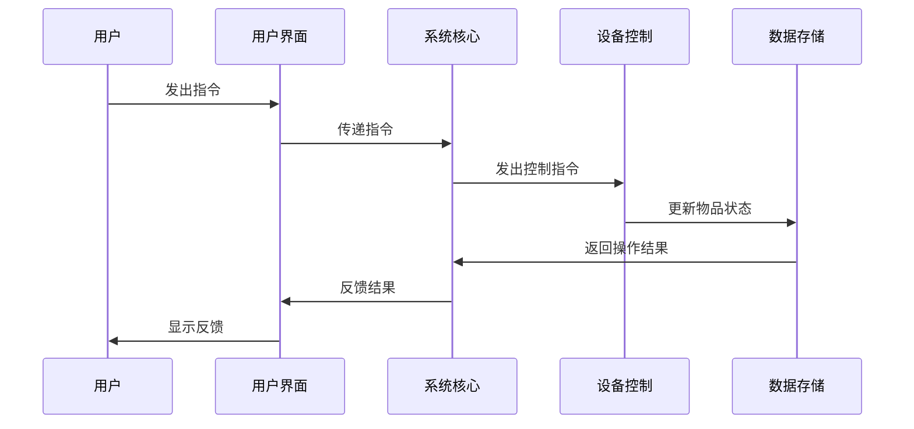

                 


```markdown
# 智能厨房抽屉：AI Agent的物品管理系统

> 关键词：智能厨房抽屉、AI Agent、物联网、物品管理、智能家居、智能系统

> 摘要：本文深入探讨了智能厨房抽屉的AI Agent物品管理系统，从系统背景、核心概念、算法原理、系统架构到项目实战，全面剖析了该系统的实现细节与应用场景，帮助读者理解如何利用AI技术提升厨房管理效率。

---

## 第1章: 背景介绍与问题背景

### 1.1 智能厨房抽屉的应用场景

#### 1.1.1 厨房物品管理的痛点
厨房是家庭生活的重要场所，但厨房物品管理常常面临以下痛点：
- **物品存放无序**：食材、厨具等物品随意摆放，查找困难。
- **管理效率低下**：传统抽屉缺乏智能化，无法记录物品状态。
- **资源浪费**：食材过期、厨具丢失等问题导致资源浪费。

#### 1.1.2 智能厨房抽屉的定义与目标
智能厨房抽屉是一种结合AI技术的厨房物品管理设备，目标是通过AI Agent实现物品的智能化管理，提升厨房管理效率，减少资源浪费。

#### 1.1.3 AI Agent在厨房管理中的作用
AI Agent（智能代理）通过感知环境、理解需求、执行操作，帮助用户实现厨房物品的智能化管理。

### 1.2 问题描述与解决方法

#### 1.2.1 厨房物品管理的常见问题
- 物品查找耗时
- 物品状态无法实时追踪
- 管理规则难以定制化

#### 1.2.2 智能厨房抽屉如何解决问题
智能厨房抽屉通过AI Agent实现以下功能：
- 实时记录物品状态
- 自动分类管理
- 智能推荐使用计划

#### 1.2.3 系统边界与外延
- **系统边界**：仅管理厨房抽屉内的物品。
- **外延扩展**：可与其他智能家居设备联动。

### 1.3 概念结构与核心要素

#### 1.3.1 系统核心要素组成
- 用户：系统的主要使用者
- 物品：待管理的厨房物品
- 设备：智能厨房抽屉硬件
- 数据：物品状态、操作记录

#### 1.3.2 系统功能模块划分
- 数据采集模块
- 信息处理模块
- 用户交互模块
- 执行控制模块

---

## 第2章: 核心概念与联系

### 2.1 AI Agent的基本原理

#### 2.1.1 AI Agent的定义与特点
AI Agent是一种能够感知环境、执行任务的智能实体，具有以下特点：
- **自主性**：无需人工干预
- **反应性**：实时响应环境变化
- **目标导向**：以实现特定目标为导向

#### 2.1.2 AI Agent的核心算法
AI Agent的核心算法包括：
- 感知算法：用于识别环境信息
- 决策算法：用于制定行动策略
- 执行算法：用于完成具体操作

#### 2.1.3 AI Agent与物联网的结合
AI Agent通过与物联网设备联动，实现对厨房物品的智能化管理。

### 2.2 物品管理系统的概念模型

#### 2.2.1 物品管理系统的功能模块
- **数据采集**：采集物品状态信息
- **信息处理**：分析物品数据
- **用户交互**：与用户进行信息交换
- **执行控制**：控制设备完成操作

#### 2.2.2 系统与用户的关系
- 用户通过系统实现厨房物品的智能化管理
- 系统通过AI Agent实时响应用户需求

#### 2.2.3 系统与外部设备的交互
- 系统与智能家居设备联动，扩展管理范围

### 2.3 核心概念对比与ER实体关系图

#### 2.3.1 AI Agent与传统自动化设备的对比

| 属性 | AI Agent | 传统自动化设备 |
|------|----------|----------------|
| 智能性 | 高       | 低             |
| 灵活性 | 高       | 低             |
| 适应性 | 高       | 低             |

#### 2.3.2 实体关系图（Mermaid）

```mermaid
er
    actor 用户
    actor 系统
    actor 物品
    actor 设备
    system 智能厨房抽屉系统
    (用户)->(系统): 发出指令
    (系统)->(设备): 控制设备
    (设备)->(系统): 返回状态
    (系统)->(物品): 管理物品
```

---

## 第3章: 算法原理与数学模型

### 3.1 AI Agent的核心算法

#### 3.1.1 算法流程（Mermaid）



#### 3.1.2 核心算法实现（Python代码）

```python
def ai_agent_logic(system_state, user_input):
    # 感知环境
    environment =感知系统状态(system_state)
    # 分析数据
    analysis = 分析数据(environment)
    # 制定策略
    strategy = 制定策略(analysis, user_input)
    # 执行操作
    action = 执行操作(strategy)
    return action
```

#### 3.1.3 算法数学模型（LaTeX公式）
AI Agent的决策过程可以表示为：

$$
\text{决策} = f(\text{环境}, \text{用户输入})
$$

其中，$f$ 是AI Agent的核心算法函数。

---

## 第4章: 系统分析与架构设计

### 4.1 问题场景介绍

#### 4.1.1 系统介绍
智能厨房抽屉系统是一个基于AI Agent的物品管理系统，旨在提升厨房物品管理效率。

#### 4.1.2 系统功能需求
- 实时物品管理
- 智能推荐使用计划
- 多用户支持
- 数据同步与备份

### 4.2 系统架构设计

#### 4.2.1 领域模型（Mermaid）



#### 4.2.2 系统架构（Mermaid）


### 4.3 系统接口设计

#### 4.3.1 系统交互流程（Mermaid）



---

## 第5章: 项目实战

### 5.1 环境安装

#### 5.1.1 系统环境
- 操作系统：Linux/Windows/MacOS
- 开发工具：Python、Jupyter Notebook
- 依赖库：numpy、pandas、scikit-learn

#### 5.1.2 硬件设备
- 智能厨房抽屉硬件
- 传感器模块
- 控制模块

### 5.2 系统核心实现（Python代码）

#### 5.2.1 数据采集模块

```python
import numpy as np
import pandas as pd

def collect_data():
    # 模拟传感器数据
    data = np.random.rand(10, 3)
    df = pd.DataFrame(data, columns=['时间', '温度', '湿度'])
    return df
```

#### 5.2.2 信息处理模块

```python
from sklearn import svm

def process_data(data):
    # 数据预处理
    X = data.drop('时间', axis=1)
    y = data['状态']
    model = svm.SVC()
    model.fit(X, y)
    return model
```

#### 5.2.3 用户交互模块

```python
def user_interaction():
    while True:
        command = input("请输入指令：")
        print(f"系统已接收指令：{command}")
```

### 5.3 代码应用解读与分析

#### 5.3.1 数据采集模块解读
- 使用numpy和pandas库采集传感器数据
- 生成包含时间、温度、湿度的数据框

#### 5.3.2 信息处理模块解读
- 使用scikit-learn库中的SVM算法进行数据分类
- 训练模型并返回模型实例

#### 5.3.3 用户交互模块解读
- 提供用户输入界面，接收用户指令
- 实现用户与系统核心的交互

### 5.4 实际案例分析

#### 5.4.1 案例背景
某用户安装智能厨房抽屉系统，希望通过系统实现食材管理。

#### 5.4.2 系统实现
- 采集食材状态数据
- 分析数据并制定使用计划
- 提供智能推荐

#### 5.4.3 系统运行结果
- 实时更新食材状态
- 智能推荐使用计划
- 提高厨房管理效率

### 5.5 项目小结

#### 5.5.1 核心代码总结
- 数据采集模块：实现传感器数据的采集与存储
- 信息处理模块：利用机器学习算法进行数据分析
- 用户交互模块：实现用户与系统的交互

#### 5.5.2 项目总结
通过本项目，我们实现了智能厨房抽屉的AI Agent物品管理系统，验证了AI技术在厨房管理中的应用价值。

---

## 第6章: 最佳实践与小结

### 6.1 小结

#### 6.1.1 核心内容回顾
- AI Agent的基本原理
- 系统架构设计
- 项目实战与实现

### 6.2 注意事项

#### 6.2.1 系统安全
- 确保用户数据安全
- 防止系统被恶意攻击

#### 6.2.2 系统维护
- 定期更新系统软件
- 维护硬件设备

### 6.3 拓展阅读

#### 6.3.1 推荐书籍
- 《AI Agent与智能系统》
- 《物联网技术与应用》

#### 6.3.2 技术博客
- AI Agent相关技术博客
- 物联网技术博客

---

## 作者

作者：AI天才研究院/AI Genius Institute & 禅与计算机程序设计艺术 /Zen And The Art of Computer Programming
```

