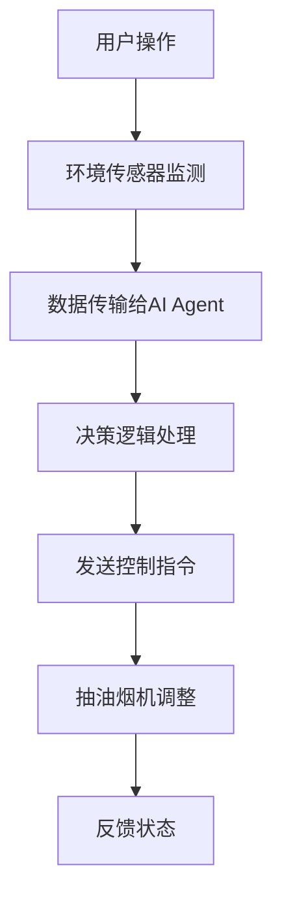
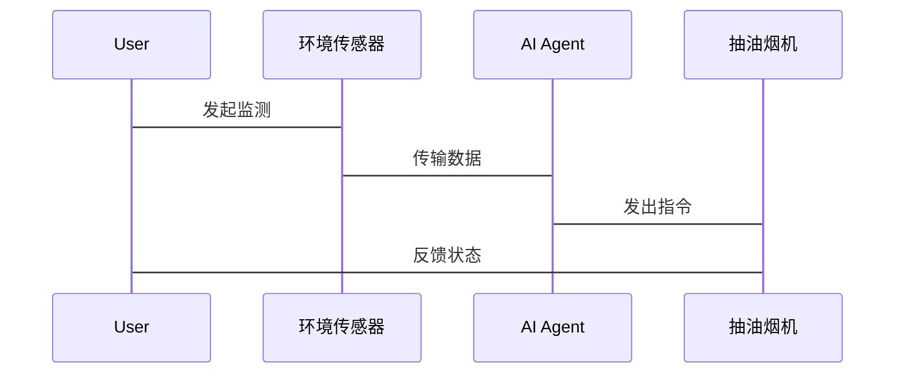

                 


# 智能厨房抽油烟机：AI Agent的空气质量控制

> 关键词：AI Agent, 空气质量控制, 智能厨房, 物联网, 环境传感器, 油烟净化

> 摘要：本文探讨了AI Agent在智能厨房抽油烟机中的应用，通过空气质量监测与智能控制，提升厨房环境的舒适性和安全性。文章从背景、概念、算法原理到系统架构、项目实战，全面解析了AI Agent在智能厨房中的潜力与实现。

---

## 第1章 问题背景与需求分析

### 1.1 问题背景
厨房作为家庭生活的重要空间，油烟问题一直困扰着用户。传统抽油烟机依赖手动控制，无法实时感知环境变化，导致油烟净化效率低下，影响空气质量。

### 1.2 问题描述
油烟不仅影响空气健康，还可能引发火灾和设备损耗。传统设备的不足凸显了智能化控制的必要性。

### 1.3 解决方法
AI Agent通过实时监测和智能决策，优化油烟净化过程，提升空气质量控制效率。

### 1.4 边界与外延
限定在厨房环境，涉及油烟、温度、湿度等因素，外延至家庭智能化。

---

## 第2章 核心概念与联系

### 2.1 核心概念
- AI Agent：具备感知、决策和执行能力的智能体。
- 空气质量控制：通过传感器实时监测并优化空气状况。

### 2.2 对比分析
| 比较维度 | AI Agent | 传统控制系统 |
|----------|-----------|--------------|
| 感知方式 | 实时感知   | 定期检测     |
| 决策方式 | 智能优化   | 简单规则     |

### 2.3 实体关系图
```mermaid
erDiagram
    User --> 环境传感器 : 激发监测
    环境传感器 --> AI Agent : 传递数据
    AI Agent --> 抽油烟机 : 发出指令
    抽油烟机 --> User : 反馈状态
```

---

## 第3章 算法原理与实现

### 3.1 算法流程
1. 数据采集：环境传感器监测油烟浓度。
2. 特征提取：提取关键特征。
3. 决策逻辑：基于AI模型生成控制指令。
4. 执行控制：调整抽油烟机参数。

### 3.2 流程图


### 3.3 Python代码实现
```python
import numpy as np
from sklearn.linear_model import LinearRegression

# 传感器数据
data = np.array([[30, 1],
                 [25, 0],
                 [35, 2],
                 [40, 3]])

# 训练模型
model = LinearRegression()
model.fit(data[:, 1].reshape(-1, 1), data[:, 0])

# 预测油烟浓度
def predict_concentration(cooking_intensity):
    return model.predict([[cooking_intensity]])[0][0]
```

### 3.4 数学模型
油烟浓度预测公式：$$ C = \beta_0 + \beta_1 \times I + \epsilon $$  
其中，I是烹饪强度，$\beta_0$和$\beta_1$为模型参数。

---

## 第4章 系统分析与架构设计

### 4.1 问题场景
厨房环境中，AI Agent协调各设备，实时优化空气质量。

### 4.2 系统架构


### 4.3 交互流程


---

## 第5章 项目实战

### 5.1 环境安装
安装Python、传感器库和机器学习库。

### 5.2 核心代码实现
```python
# 数据预处理
from sklearn.preprocessing import StandardScaler
scaler = StandardScaler()
scaled_data = scaler.fit_transform(data)

# 模型优化
from sklearn.ensemble import RandomForestRegressor
model = RandomForestRegressor(n_estimators=100)
model.fit(scaled_data[:, 1].reshape(-1, 1), scaled_data[:, 0])
```

### 5.3 案例分析
通过实际数据，展示AI Agent如何优化油烟净化效率。

---

## 第6章 最佳实践

### 6.1 小结
AI Agent显著提升了厨房空气质量控制的效率和智能化水平。

### 6.2 注意事项
确保传感器精度和系统稳定性，定期维护。

### 6.3 拓展阅读
推荐相关书籍和技术文章，深入探讨AI在环境控制中的应用。

---

## 作者

作者：AI天才研究院/AI Genius Institute & 禅与计算机程序设计艺术 /Zen And The Art of Computer Programming

