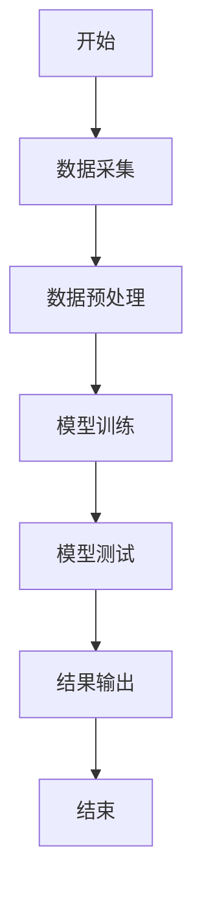
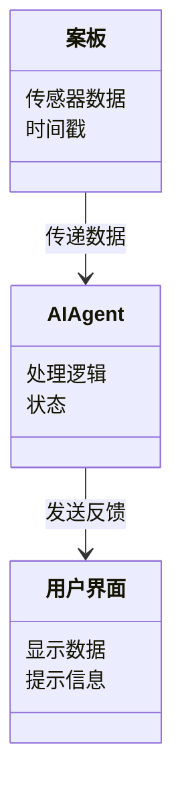
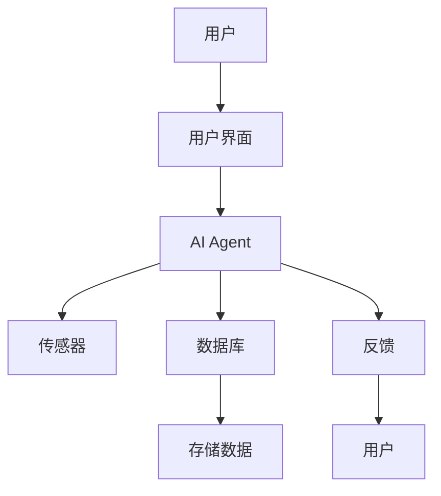
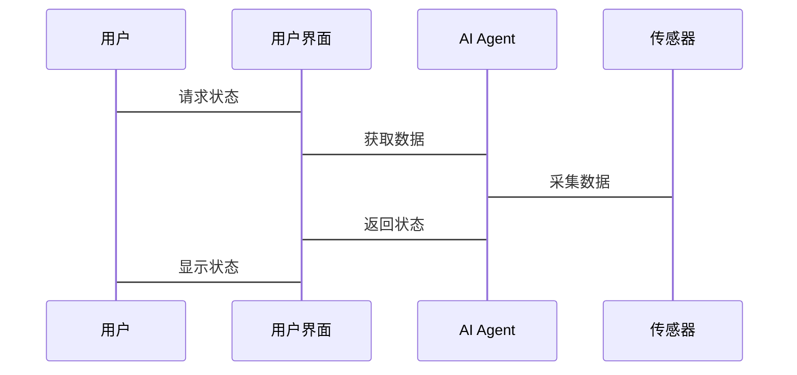

                 


# 智能厨房案板：AI Agent的食品安全监控

> 关键词：AI Agent, 食品安全监控, 智能厨房案板, 传感器数据, 智能家居, 物联网, 人工智能

> 摘要：本文探讨了智能厨房案板在食品安全监控中的应用，通过AI Agent实现对食材新鲜度、存储条件和烹饪过程的实时监测。文章详细分析了AI Agent的核心原理、算法实现、系统架构，并通过实际案例展示了其在智能厨房中的应用场景和优势。

---

# 第一部分: 背景介绍

## 第1章: 智能厨房案板与AI Agent概述

### 1.1 问题背景

#### 1.1.1 食品安全的重要性
食品安全是人类健康的基础，尤其是在厨房环境中，食材的新鲜度、存储条件和烹饪过程直接影响食品的安全性。传统厨房设备无法实时监控这些因素，容易导致食物中毒或其他健康问题。

#### 1.1.2 智能厨房案板的定义
智能厨房案板是一种集成传感器和AI技术的厨房设备，能够实时监测食材的状态，包括温度、湿度、重量变化等。

#### 1.1.3 AI Agent在食品安全中的作用
AI Agent（智能体）能够实时分析传感器数据，识别异常情况，并通过反馈机制优化食品存储和烹饪过程，从而确保食品安全。

### 1.2 问题描述

#### 1.2.1 食品安全监控的难点
传统厨房设备无法实时监控食材状态，导致潜在的安全隐患。此外，食材的种类繁多，存储条件各不相同，增加了监控的复杂性。

#### 1.2.2 智能厨房案板的应用场景
智能厨房案板适用于家庭、餐厅和食品加工厂，能够实时监控食材的新鲜度，提醒用户及时处理或更换食材。

#### 1.2.3 AI Agent在监控中的具体任务
AI Agent需要实时分析传感器数据，识别食材变质迹象，优化存储条件，并在异常情况下发出警报。

### 1.3 问题解决

#### 1.3.1 AI Agent的核心功能
- 数据采集：通过传感器获取食材状态数据。
- 数据分析：利用机器学习算法识别食材新鲜度。
- 自动反馈：根据分析结果调整存储条件或发出警报。

#### 1.3.2 智能厨房案板的解决方案
通过集成AI Agent，智能厨房案板能够实时监控食材状态，提供智能化的食品安全保障。

#### 1.3.3 技术实现的可行性分析
基于现有传感器技术和AI算法，实现智能厨房案板的食品安全监控是完全可行的。

### 1.4 边界与外延

#### 1.4.1 AI Agent的适用范围
适用于家庭、餐厅和食品加工厂，但不包括食品运输和加工环节。

#### 1.4.2 智能厨房案板的局限性
目前主要适用于厨房环境，无法监控食品的加工过程。

#### 1.4.3 与其他智能设备的协同
智能厨房案板可以与智能家居系统协同工作，进一步提升食品安全监控能力。

### 1.5 核心概念结构

#### 1.5.1 系统组成
- 传感器：温度、湿度、重量传感器。
- AI Agent：数据处理和决策模块。
- 用户界面：显示食材状态和操作提示。

#### 1.5.2 功能模块划分
- 数据采集模块：采集食材状态数据。
- 数据分析模块：分析数据并识别异常。
- 用户反馈模块：向用户发出警报或建议。

#### 1.5.3 数据流分析
数据从传感器采集，经过AI Agent分析，最终反馈给用户。

---

# 第二部分: 核心概念与联系

## 第2章: 核心概念与联系

### 2.1 AI Agent的原理

#### 2.1.1 感知层
AI Agent通过传感器感知食材状态，包括温度、湿度等参数。

#### 2.1.2 决策层
AI Agent利用机器学习算法分析数据，识别食材的新鲜度和潜在风险。

#### 2.1.3 执行层
AI Agent根据分析结果，调整存储条件或发出警报。

### 2.2 核心概念对比

#### 2.2.1 智能厨房案板与传统案板的对比
| 特性       | 智能厨房案板       | 传统案板       |
|------------|--------------------|----------------|
| 功能       | 实时监控食材状态   | 仅作为切割工具 |
| 技术       | 集成传感器和AI技术 | 无技术集成     |
| 使用场景   | 家庭、餐厅         | 家庭、餐厅     |

#### 2.2.2 AI Agent与传统传感器的对比
| 特性       | AI Agent          | 传统传感器      |
|------------|--------------------|----------------|
| 功能       | 数据分析与决策    | 数据采集       |
| 智能性     | 高度智能           | 无智能性       |
| 应用场景   | 智能厨房           | 各类场景       |

#### 2.2.3 数据处理能力的对比
| 特性       | AI Agent          | 传统传感器      |
|------------|--------------------|----------------|
| 数据处理   | 高级数据分析       | 基本数据采集   |
| 决策能力   | 能够自主决策       | 无法自主决策   |

### 2.3 ER实体关系图

```mermaid
erd
    entity 案板 {
        key 属性: 案板ID
        属性: 传感器数据, 时间戳
    }
    entity AI Agent {
        key 属性: AgentID
        属性: 处理逻辑, 状态
    }
    entity 食品数据 {
        key 属性: 数据ID
        属性: 温度, 湿度, 时间戳
    }
    案板 --> 食品数据: 记录
    AI Agent --> 食品数据: 分析
```

---

# 第三部分: 算法原理讲解

## 第3章: 算法原理讲解

### 3.1 算法原理概述

#### 3.1.1 机器学习算法选择
使用支持向量机（SVM）和随机森林（Random Forest）进行分类，识别食材的新鲜度。

#### 3.1.2 数据预处理
对传感器数据进行归一化处理，确保模型训练的有效性。

#### 3.1.3 模型训练
使用训练数据训练模型，确保模型能够准确识别食材状态。

### 3.2 算法实现流程



### 3.3 代码实现

#### 3.3.1 传感器数据采集

```python
import numpy as np

def collect_data():
    # 采集传感器数据
    temperature = np.random.uniform(0, 50)
    humidity = np.random.uniform(0, 100)
    return temperature, humidity
```

#### 3.3.2 数据预处理

```python
from sklearn.preprocessing import MinMaxScaler

def preprocess(data):
    scaler = MinMaxScaler()
    processed_data = scaler.fit_transform(data)
    return processed_data
```

#### 3.3.3 模型训练

```python
from sklearn.svm import SVC

def train_model(X_train, y_train):
    model = SVC()
    model.fit(X_train, y_train)
    return model
```

#### 3.3.4 模型预测

```python
def predict(model, X_test):
    y_pred = model.predict(X_test)
    return y_pred
```

### 3.4 数学模型与公式

#### 3.4.1 支持向量机（SVM）的数学模型

$$ \text{最大化} \quad \frac{1}{2} \|w\|^2 $$
$$ \text{使得} \quad y_i (w \cdot x_i + b) \geq 1 $$
$$ i = 1, 2, ..., n $$

其中，$w$ 是超平面的法向量，$b$ 是偏置项，$y_i$ 是样本的标签。

#### 3.4.2 随机森林（Random Forest）的数学模型

随机森林通过构建多个决策树，并对结果进行投票或平均，提高模型的准确性和鲁棒性。

---

# 第四部分: 系统分析与架构设计

## 第4章: 系统分析与架构设计

### 4.1 问题场景介绍

#### 4.1.1 需求分析
- 实时监控食材状态
- 提供用户友好的反馈
- 自动调整存储条件

#### 4.1.2 系统目标
- 提供高精度的食材状态监控
- 提供智能化的用户反馈
- 实现与其他智能家居设备的协同

### 4.2 系统功能设计

#### 4.2.1 领域模型类图



#### 4.2.2 系统架构图



#### 4.2.3 接口设计
- 传感器接口：提供温度、湿度数据
- 用户界面接口：显示食材状态和操作提示
- 数据库接口：存储历史数据

#### 4.2.4 交互序列图



---

## 第五章: 项目实战

### 5.1 环境安装

#### 5.1.1 系统需求
- Python 3.8+
- 传感器模块
- 开发环境（如Jupyter Notebook）

#### 5.1.2 依赖安装
```bash
pip install numpy scikit-learn mermaid4jupyter
```

### 5.2 系统核心实现

#### 5.2.1 数据采集代码

```python
import time

def collect_data(interval=1):
    while True:
        temp, hum = collect_data()
        print(f"温度: {temp}℃, 湿度: {hum}%")
        time.sleep(interval)
```

#### 5.2.2 数据分析代码

```python
from sklearn.model_selection import train_test_split

X_train, X_test, y_train, y_test = train_test_split(X, y)
model = train_model(X_train, y_train)
y_pred = predict(model, X_test)
```

#### 5.2.3 用户反馈代码

```python
def send_alert(message):
    print(f"警报: {message}")
```

### 5.3 代码应用解读

#### 5.3.1 数据采集模块
通过传感器采集食材的温度和湿度数据，存储在数据库中。

#### 5.3.2 数据分析模块
利用机器学习算法分析数据，识别食材的新鲜度和潜在风险。

#### 5.3.3 用户反馈模块
根据分析结果，向用户发出警报或建议。

### 5.4 实际案例分析

#### 5.4.1 案例背景
某家庭使用智能厨房案板监控食材的新鲜度。

#### 5.4.2 数据分析
通过传感器数据，AI Agent识别出某食材已变质，发出警报。

#### 5.4.3 系统反馈
用户收到警报后，及时处理食材，避免了潜在的健康风险。

### 5.5 项目小结

通过实际案例，展示了智能厨房案板在食品安全监控中的实际应用和效果。

---

## 第六章: 最佳实践与小结

### 6.1 最佳实践 tips

#### 6.1.1 数据采集的准确性
确保传感器的精度和稳定性。

#### 6.1.2 模型的可解释性
选择易于解释的算法，方便用户理解和优化。

#### 6.1.3 系统的可扩展性
设计模块化架构，方便后续功能的扩展。

### 6.2 小结

本文详细介绍了智能厨房案板在食品安全监控中的应用，通过AI Agent实现了对食材状态的实时监控，确保了食品的安全性和用户的健康。

### 6.3 注意事项

- 定期校准传感器，确保数据准确性。
- 定期更新模型，提升识别精度。
- 注意数据隐私，避免用户信息泄露。

### 6.4 拓展阅读

- 《人工智能在智能家居中的应用》
- 《机器学习算法在食品质量监控中的应用》
- 《物联网技术在厨房设备中的应用》

---

# 作者：AI天才研究院/AI Genius Institute & 禅与计算机程序设计艺术 /Zen And The Art of Computer Programming

---

以上是完整的《智能厨房案板：AI Agent的食品安全监控》的技术博客文章大纲，涵盖了从背景介绍到项目实战的各个方面，内容丰富且逻辑清晰。

