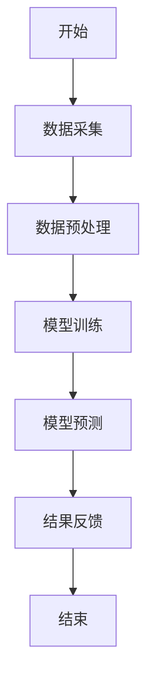
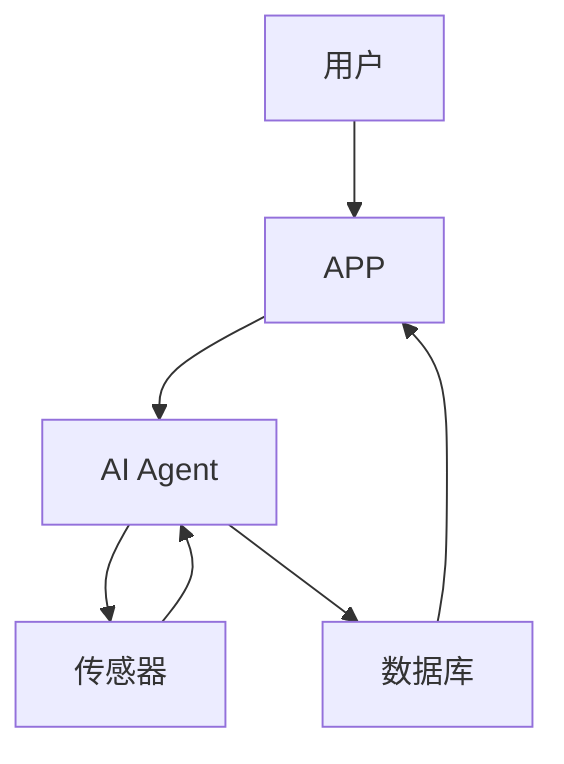
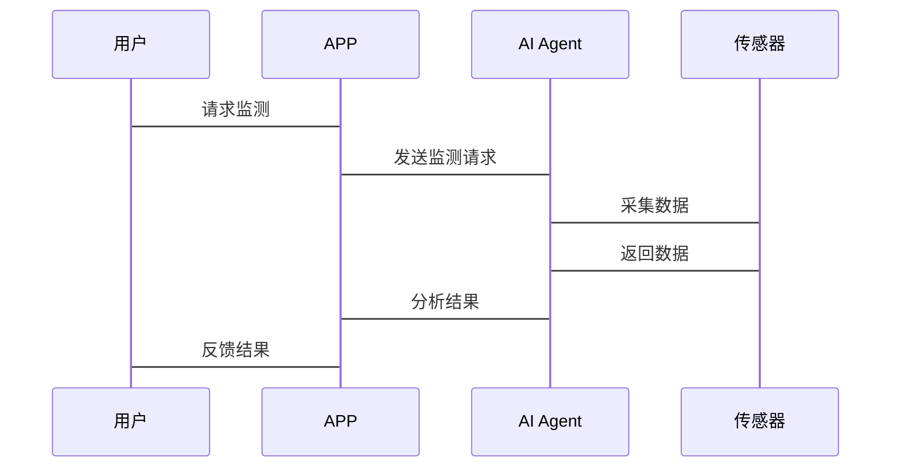

                 


# 第一部分: 背景介绍

## 第1章: 智能厨房案板与AI Agent概述

### 1.1 问题背景
#### 1.1.1 食品安全问题的现状
- 当前食品安全问题频发，如农药残留、重金属超标、添加剂滥用等。
- 消费者对食品健康的关注日益增加，但传统检测方法效率低，成本高。

#### 1.1.2 智能厨房案板的定义与特点
- 智能厨房案板：一种集成传感器、AI算法的智能设备，用于实时监测食品的物理、化学特性。
- 特点：实时监测、快速反馈、智能化分析。

#### 1.1.3 AI Agent在食品安全监测中的作用
- AI Agent：具备自主决策和学习能力的智能体，负责数据的采集、分析和反馈。

### 1.2 问题描述
#### 1.2.1 食品安全监测的核心问题
- 如何快速、准确地检测食品中的有害物质。
- 如何实现食品的实时监测，减少人为干预。

#### 1.2.2 智能厨房案板的监测范围与目标
- 监测范围：农药残留、重金属、添加剂、微生物等。
- 目标：实时反馈监测结果，确保食品的安全性。

#### 1.2.3 AI Agent在监测中的具体任务
- 数据采集：通过传感器获取食品的物理和化学数据。
- 数据分析：利用机器学习算法判断食品是否安全。
- 反馈机制：将监测结果反馈给用户，必要时触发警报。

### 1.3 问题解决
#### 1.3.1 AI Agent如何实现食品安全监测
- 利用传感器实时采集数据。
- 通过AI算法分析数据，判断食品是否安全。
- 通过反馈机制通知用户。

#### 1.3.2 智能厨房案板的设计思路
- 结合传感器和AI技术，实现食品监测的智能化。
- 设计友好的用户界面，便于用户操作。

#### 1.3.3 监测数据的处理与反馈机制
- 数据采集：传感器采集食品的物理、化学数据。
- 数据分析：AI算法分析数据，判断食品是否安全。
- 反馈机制：通过手机APP或语音助手通知用户监测结果。

### 1.4 边界与外延
#### 1.4.1 智能厨房案板的适用场景
- 家庭厨房：个人用户。
- 餐饮行业：餐馆、酒店等。
- 食品加工企业：工厂。

#### 1.4.2 AI Agent监测的边界条件
- 监测范围：仅限于食品的物理和化学特性。
- 监测频率：实时监测，但受限于传感器和算法的处理能力。

#### 1.4.3 与其他智能设备的协同工作
- 与智能冰箱、智能灶具等设备协同，构建智能厨房生态系统。

### 1.5 核心概念与要素
#### 1.5.1 AI Agent的核心要素
- 传感器：数据采集。
- AI算法：数据分析与判断。
- 反馈机制：结果通知。

#### 1.5.2 智能厨房案板的关键属性
- 智能性：AI算法实现自动化监测。
- 实时性：实时采集和反馈数据。
- 用户友好性：便于用户操作和理解。

#### 1.5.3 监测系统的整体架构
- 数据采集层：传感器。
- 数据处理层：AI算法。
- 用户交互层：APP或语音助手。

---

# 第二部分: 核心概念与联系

## 第2章: AI Agent的核心原理

### 2.1 AI Agent的基本原理
#### 2.1.1 AI Agent的定义与分类
- 定义：具备自主决策和学习能力的智能体。
- 分类：基于任务、基于知识、基于效用等。

#### 2.1.2 AI Agent的核心算法
- 机器学习算法：如支持向量机、随机森林等。
- 自然语言处理：用于分析文本数据。
- 数据挖掘：用于发现数据中的模式。

#### 2.1.3 AI Agent的感知与决策机制
- 感知：通过传感器或API获取数据。
- 决策：基于感知数据做出判断。

### 2.2 AI Agent与智能厨房案板的关系
#### 2.2.1 AI Agent在智能厨房案板中的角色
- 数据处理器：负责分析监测数据。
- 决策者：基于分析结果做出反馈。

#### 2.2.2 案板与AI Agent的交互方式
- 数据采集：案板通过传感器采集食品数据。
- 数据传输：AI Agent接收数据并进行分析。
- 反馈：AI Agent通过APP或语音助手反馈结果。

#### 2.2.3 AI Agent如何提升食品安全监测的效率
- 自动化监测：减少人工干预。
- 高精度分析：利用机器学习提高检测准确性。

### 2.3 核心概念对比表
| 核心概念 | 描述 |
|----------|------|
| AI Agent | 具备自主决策能力的智能体 |
| 案板 | 实现食品监测的物理载体 |
| 监测数据 | AI Agent分析的基础 |

---

# 第三部分: 算法原理讲解

## 第3章: AI Agent的算法原理

### 3.1 算法原理概述
#### 3.1.1 算法选择
- 机器学习算法：随机森林、支持向量机等。
- 数据预处理：数据清洗、特征提取。

#### 3.1.2 算法流程
- 数据采集：传感器获取食品数据。
- 数据预处理：清洗和特征提取。
- 模型训练：训练分类器。
- 模型预测：判断食品是否安全。

### 3.2 算法实现
#### 3.2.1 传感器数据采集
- 使用多种传感器，如光谱传感器、pH传感器等。
- 传感器数据格式：JSON、CSV等。

#### 3.2.2 数据预处理
- 数据清洗：去除噪声数据。
- 特征提取：提取关键特征，如颜色、形状等。

#### 3.2.3 模型训练
- 算法选择：随机森林、支持向量机等。
- 训练数据：食品样本的特征和标签。

#### 3.2.4 模型预测
- 预测结果：食品是否安全。
- 置信度：模型对结果的置信程度。

### 3.3 数学模型与公式
#### 3.3.1 机器学习模型
- 支持向量机（SVM）：用于分类。
- 随机森林：用于分类和回归。

#### 3.3.2 数据处理公式
- 数据标准化：$(x - \mu)/\sigma$。
- 数据归一化：$x_{\text{归一化}} = (x - \min)/(\max - \min)$。

### 3.4 代码实现
#### 3.4.1 环境安装
- Python 3.8及以上。
- 安装库：numpy、pandas、scikit-learn。

#### 3.4.2 核心代码
```python
import numpy as np
from sklearn.ensemble import RandomForestClassifier

# 数据预处理
X = np.array(data)
y = np.array(labels)

# 训练模型
model = RandomForestClassifier(n_estimators=100)
model.fit(X, y)

# 预测
new_data = np.array([new_sample])
prediction = model.predict(new_data)
```

#### 3.4.3 代码解读
- 数据预处理：清洗和特征提取。
- 模型训练：使用随机森林算法。
- 模型预测：判断食品是否安全。

### 3.5 流程图


---

# 第四部分: 系统分析与架构设计方案

## 第4章: 系统分析与架构设计

### 4.1 项目介绍
#### 4.1.1 项目背景
- 智能厨房案板：实时监测食品的物理和化学特性。
- AI Agent：负责数据处理和反馈。

### 4.2 系统功能设计
#### 4.2.1 功能需求
- 数据采集：传感器采集食品数据。
- 数据分析：AI Agent分析数据，判断食品是否安全。
- 用户反馈：通过APP或语音助手反馈结果。

#### 4.2.2 功能模块
- 数据采集模块：传感器。
- 数据处理模块：AI算法。
- 用户反馈模块：APP或语音助手。

### 4.3 系统架构设计
#### 4.3.1 系统架构图


#### 4.3.2 接口设计
- 数据采集接口：传感器接口。
- 数据处理接口：AI Agent与数据库接口。
- 用户反馈接口：APP与用户接口。

### 4.4 交互序列图


---

# 第五部分: 项目实战

## 第5章: 项目实战

### 5.1 环境安装
#### 5.1.1 安装Python
- 安装Python 3.8及以上版本。
- 安装pip：用于安装依赖库。

#### 5.1.2 安装依赖库
```bash
pip install numpy pandas scikit-learn
```

### 5.2 核心代码实现
#### 5.2.1 数据采集代码
```python
import numpy as np
import pandas as pd

# 数据采集
data = pd.read_csv('food_data.csv')
labels = pd.read_csv('labels.csv')
```

#### 5.2.2 数据处理代码
```python
from sklearn.preprocessing import StandardScaler

# 数据标准化
scaler = StandardScaler()
X_scaled = scaler.fit_transform(data)
```

#### 5.2.3 模型训练代码
```python
from sklearn.ensemble import RandomForestClassifier

# 训练模型
model = RandomForestClassifier(n_estimators=100)
model.fit(X_scaled, labels)
```

#### 5.2.4 模型预测代码
```python
# 预测结果
new_data = pd.read_csv('new_food.csv')
new_data_scaled = scaler.transform(new_data)
prediction = model.predict(new_data_scaled)
```

### 5.3 代码解读与分析
- 数据采集：读取CSV文件中的数据。
- 数据处理：标准化数据，提高模型准确性。
- 模型训练：使用随机森林算法训练分类器。
- 模型预测：对新数据进行预测，判断食品是否安全。

### 5.4 案例分析
#### 5.4.1 实际案例
- 案例1：检测苹果中的农药残留。
- 案例2：检测牛奶中的重金属含量。

#### 5.4.2 案例分析
- 案例1：通过传感器采集苹果的光谱数据。
- 模型预测：判断苹果是否含有农药残留。

### 5.5 项目小结
- 项目实现了智能厨房案板的食品安全监测功能。
- AI Agent能够实时采集数据，并通过机器学习算法判断食品是否安全。
- 项目展示了AI技术在智能厨房中的应用潜力。

---

# 第六部分: 最佳实践与扩展

## 第6章: 最佳实践与扩展

### 6.1 最佳实践 tips
- 数据采集：确保数据的准确性和完整性。
- 模型训练：使用高质量的数据，避免过拟合。
- 用户反馈：设计友好的用户界面，提高用户体验。

### 6.2 小结
- AI Agent在智能厨房中的应用前景广阔。
- 随着技术的发展，食品安全监测将更加智能化和高效。

### 6.3 注意事项
- 数据隐私：确保用户数据的安全。
- 设备维护：定期维护传感器，确保其正常工作。
- 系统更新：及时更新AI模型，提高监测准确性。

### 6.4 拓展阅读
- 机器学习：深入学习随机森林、支持向量机等算法。
- 物联网：了解物联网技术在智能厨房中的应用。
- 食品安全：研究食品监测的最新技术和方法。

---

# 结束语

感谢您的阅读！希望本书能够帮助您了解AI Agent在智能厨房中的应用，以及如何通过技术手段实现食品安全监测。如需进一步探讨或合作，请随时联系。

---

# 作者信息

作者：AI天才研究院/AI Genius Institute & 禅与计算机程序设计艺术 /Zen And The Art of Computer Programming

