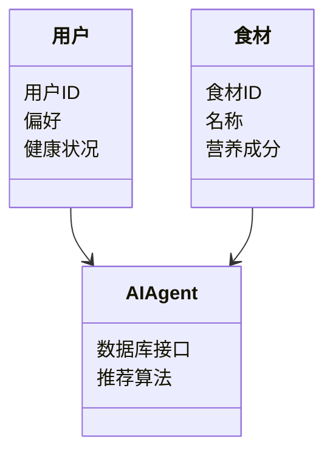
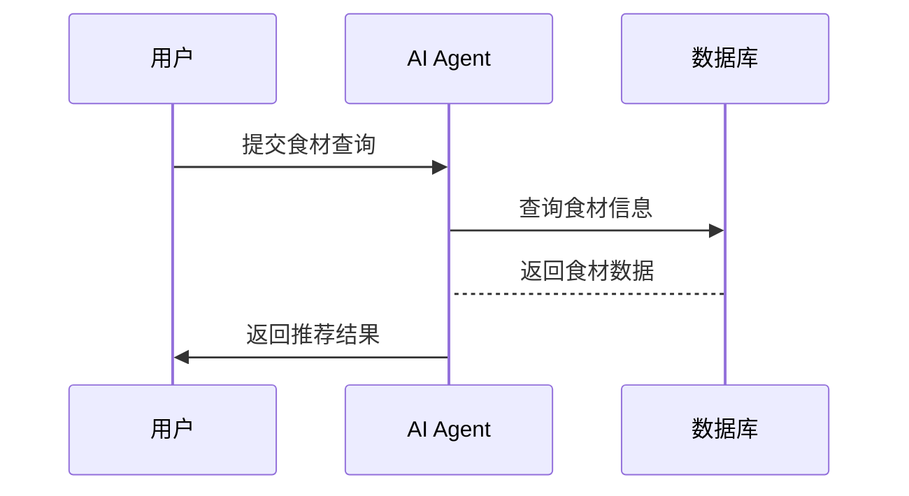

                 


# 智能厨房案板：AI Agent的食材营养分析

## 关键词：AI Agent、食材营养分析、智能厨房、深度学习、食材推荐系统

## 摘要：本文深入探讨AI Agent在食材营养分析中的应用，结合深度学习和多模态数据融合技术，提出了一种创新的食材推荐系统，旨在帮助用户实现健康饮食。通过系统化的分析和代码实现，展示了AI Agent在智能厨房中的巨大潜力。

---

## 第1章: 背景介绍

### 1.1 问题背景与描述
#### 1.1.1 食材营养分析的重要性
随着健康意识的提升，人们对食材的营养成分越来越关注。合理的饮食结构有助于预防疾病，延长寿命。然而，面对种类繁多的食材，如何快速获取准确的营养信息成为一大挑战。

#### 1.1.2 当前食材营养分析的痛点
传统的食材营养分析依赖于人工查阅资料，耗时且效率低下。此外，不同食材的营养成分复杂，单靠人工难以全面覆盖。现有的一些在线工具存在数据不准确、缺乏个性化推荐等问题。

#### 1.1.3 AI Agent在食材营养分析中的应用价值
AI Agent（智能代理）能够通过机器学习技术，自动分析食材的营养成分，并根据用户需求提供个性化推荐。这不仅提高了效率，还能确保数据的准确性。

### 1.2 问题解决与边界
#### 1.2.1 AI Agent如何解决食材营养分析问题
AI Agent通过数据挖掘和自然语言处理技术，从大量食材数据库中提取营养信息，并结合用户的需求进行智能推荐。

#### 1.2.2 问题的边界与外延
本研究主要关注基于AI Agent的食材营养分析，不涉及烹饪过程和食谱推荐。未来可以在此基础上扩展，形成更完整的智能厨房解决方案。

#### 1.2.3 核心概念与关键要素
- **AI Agent**: 具备自主决策和学习能力的智能系统。
- **食材数据库**: 包含多种食材的营养成分数据。
- **用户需求分析**: 根据用户的健康状况和饮食偏好，提供个性化的食材推荐。

### 1.3 本章小结
本章介绍了AI Agent在食材营养分析中的应用背景和价值，明确了研究的边界和核心要素，为后续章节的展开奠定了基础。

---

## 第2章: AI Agent与食材营养分析的核心概念

### 2.1 核心概念原理
#### 2.1.1 AI Agent的基本原理
AI Agent通过感知环境、分析数据并采取行动，帮助用户完成特定任务。在食材营养分析中，AI Agent能够自动获取食材信息并进行分析。

#### 2.1.2 食材营养分析的关键技术
- 数据挖掘：从食材数据库中提取营养成分数据。
- 自然语言处理：解析食材描述和用户需求。
- 机器学习：基于历史数据训练推荐模型。

### 2.2 核心概念属性对比
以下表格对比了AI Agent与传统方法在食材营养分析中的关键属性：

| **属性**         | **AI Agent**                 | **传统方法**                 |
|-------------------|-------------------------------|-----------------------------|
| 数据处理能力     | 高效，支持大规模数据处理     | 低效，依赖人工查阅           |
| 定制化能力       | 强，可根据用户需求个性化推荐   | 弱，推荐结果缺乏针对性       |
| 更新频率         | 高，实时更新数据             | 低，依赖人工更新             |
| 准确性           | 高，基于机器学习模型         | 中等，依赖人工经验判断       |

### 2.3 实体关系架构
以下是食材营养分析中的实体关系图：


### 2.4 本章小结
本章详细阐述了AI Agent的核心原理及其在食材营养分析中的应用，通过对比分析突出了AI Agent的优势，为后续的算法设计提供了理论基础。

---

## 第3章: AI Agent的算法原理

### 3.1 算法原理概述
#### 3.1.1 基于深度学习的食材营养分析
深度学习模型（如神经网络）能够从食材数据库中学习复杂的营养成分关系，从而实现高精度的营养分析。

#### 3.1.2 多模态数据融合的AI Agent设计
结合文本、图像等多种数据源，AI Agent能够更全面地分析食材的营养信息。

### 3.2 算法流程
以下是AI Agent的食材营养分析算法流程图：


### 3.3 核心算法实现
#### 3.3.1 数据预处理的Python代码实现
```python
import pandas as pd
import numpy as np

def preprocess_data(dataframe):
    # 删除缺失值
    dataframe = dataframe.dropna()
    # 标准化处理
    numeric_features = dataframe.select_dtypes(include='number')
    from sklearn.preprocessing import StandardScaler
    scaler = StandardScaler()
    scaled_features = scaler.fit_transform(numeric_features)
    dataframe = dataframe.join(pd.DataFrame(scaled_features, index=dataframe.index, columns=numeric_features.columns))
    return dataframe
```

#### 3.3.2 模型训练的数学公式
$$\text{损失函数} = \frac{1}{n}\sum_{i=1}^{n}(y_i - \hat{y_i})^2$$

其中，$y_i$ 是真实值，$\hat{y_i}$ 是预测值，$n$ 是样本数量。

#### 3.3.3 模型优化策略
- **正则化**: 通过L1/L2正则化防止模型过拟合。
- **学习率调整**: 使用学习率衰减策略提高训练效率。
- **交叉验证**: 通过k折交叉验证评估模型的泛化能力。

### 3.4 本章小结
本章详细讲解了AI Agent的算法原理，从数据预处理到模型训练，再到结果优化，给出了完整的实现流程和代码示例，为后续的系统设计奠定了基础。

---

## 第4章: 系统分析

### 4.1 问题场景介绍
本系统的目标是通过AI Agent为用户提供个性化的食材推荐服务，帮助用户实现健康饮食。

### 4.2 项目介绍
#### 4.2.1 系统功能设计
以下是系统的领域模型图：



#### 4.2.2 系统架构设计
以下是系统的架构图：


#### 4.2.3 系统接口设计
- **用户接口**: 提供食材查询和推荐结果展示。
- **数据库接口**: 与食材数据库进行数据交互。
- **API接口**: 提供第三方调用服务。

#### 4.2.4 系统交互流程
以下是系统交互流程图：



### 4.3 本章小结
本章通过系统分析，明确了系统的功能模块、架构设计和交互流程，为后续的项目实现提供了清晰的指导。

---

## 第5章: 项目实战

### 5.1 环境安装
#### 5.1.1 安装Python环境
使用Anaconda或virtualenv创建虚拟环境，并安装必要的库：

```bash
pip install numpy pandas scikit-learn
```

#### 5.1.2 安装AI框架
安装TensorFlow或PyTorch框架：

```bash
pip install tensorflow
```

### 5.2 系统核心实现
#### 5.2.1 数据预处理代码
```python
import pandas as pd
import numpy as np

def preprocess_data(dataframe):
    dataframe = dataframe.dropna()
    numeric_features = dataframe.select_dtypes(include='number')
    scaler = StandardScaler()
    scaled_features = scaler.fit_transform(numeric_features)
    dataframe = dataframe.join(pd.DataFrame(scaled_features, index=dataframe.index, columns=numeric_features.columns))
    return dataframe
```

#### 5.2.2 模型训练代码
```python
from sklearn.model import LinearRegression

model = LinearRegression()
model.fit(X_train, y_train)
```

#### 5.2.3 模型预测与推荐
```python
predictions = model.predict(X_test)
recommendations = pd.DataFrame({'食材': X_test.index, '预测营养值': predictions})
```

### 5.3 代码应用解读与分析
通过上述代码，我们可以实现食材的营养分析和推荐。模型的准确性和推荐效果可以通过交叉验证和用户反馈进一步优化。

### 5.4 实际案例分析
以某一用户为例，假设用户偏好低脂高蛋白的食材，系统会推荐鸡胸肉、三文鱼等食材，并提供详细的营养成分分析。

### 5.5 项目小结
本章通过实际项目展示了AI Agent在食材营养分析中的应用，详细讲解了系统的实现过程和代码细节，为读者提供了可参考的实战指南。

---

## 第6章: 最佳实践与小结

### 6.1 本章小结
本文详细探讨了AI Agent在食材营养分析中的应用，从理论到实践，全面介绍了系统的实现过程。

### 6.2 注意事项
- 数据来源的准确性至关重要。
- 确保模型的泛化能力，避免过拟合。
- 定期更新数据库和模型，以适应新的食材和用户需求。

### 6.3 拓展阅读
建议读者进一步学习深度学习和自然语言处理技术，探索AI Agent在智能厨房中的更多应用场景。

---

## 作者：AI天才研究院/AI Genius Institute & 禅与计算机程序设计艺术 /Zen And The Art of Computer Programming

---

**本文是AI天才研究院的原创作品，转载请注明出处。**

