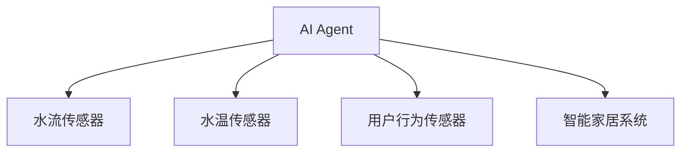

                 


# 《智能厨房水槽：AI Agent的用水优化控制》

> 关键词：智能厨房水槽、AI Agent、用水优化、物联网、智能家居、节水技术

> 摘要：本文详细探讨了智能厨房水槽的设计与实现，重点介绍了AI Agent在用水优化控制中的应用。从背景概念、算法原理到系统架构、项目实战，系统性地阐述了智能厨房水槽的工作原理和实际应用。文章还分析了物联网技术的集成，用户体验设计，以及项目实现中的关键点，最后给出了优化建议和未来发展方向。

---

## 第一章：智能厨房水槽的背景与概念

### 1.1 智能厨房水槽的发展背景

#### 1.1.1 用水资源的全球性挑战
全球水资源短缺问题日益严重，厨房用水占家庭用水的很大比例。通过智能化技术优化用水，可以有效节约水资源。

#### 1.1.2 厨房用水的浪费问题
传统水槽缺乏智能化控制，导致水资源浪费。例如，长时间的水流、不当的水温调节等。

#### 1.1.3 智能化技术在家居领域的应用趋势
智能家居设备的普及，推动了厨房设备的智能化发展，AI Agent技术的应用为用水优化提供了新的可能性。

### 1.2 AI Agent的核心概念

#### 1.2.1 什么是AI Agent？
AI Agent是一种智能体，能够感知环境、自主决策并执行任务。在智能水槽中，AI Agent负责优化用水量。

#### 1.2.2 AI Agent的基本特征
- **自主性**：无需人工干预，自动优化用水。
- **反应性**：实时感知环境变化，动态调整策略。
- **社会性**：通过物联网与其他设备协同工作。

#### 1.2.3 AI Agent与传统自动控制系统的区别
AI Agent具备学习和适应能力，能够根据用户习惯和环境变化优化控制策略，而传统系统通常基于固定规则。

### 1.3 智能厨房水槽的定义与外延

#### 1.3.1 智能厨房水槽的定义
智能厨房水槽是一种结合AI Agent技术的水槽，能够通过感知、决策和执行优化用水量。

#### 1.3.2 智能厨房水槽的核心功能
- **实时监测**：感知水流、水温、使用习惯等。
- **优化控制**：基于AI算法优化用水量。
- **智能反馈**：通过物联网反馈数据，优化用水策略。

#### 1.3.3 智能厨房水槽的边界与外延
智能水槽通常与智能家居系统集成，外延包括与智能冰箱、智能灶具等设备的数据交互。

### 1.4 智能厨房水槽与传统水槽的对比

#### 1.4.1 传统水槽的功能与局限性
- **功能单一**：仅提供基本的洗涤功能。
- **浪费问题**：缺乏智能化控制，用水量不可调节。
- **用户体验差**：无法根据用户习惯提供个性化服务。

#### 1.4.2 智能厨房水槽的优势与创新点
- **优化用水**：通过AI算法实时优化用水量。
- **智能控制**：可根据用户习惯自动调整用水模式。
- **数据驱动**：基于用户行为和环境数据进行优化。

#### 1.4.3 智能厨房水槽的应用场景
- **家庭厨房**：优化家庭用水，节约资源。
- **商用厨房**：应用于餐厅、酒店等场所，降低运营成本。
- **智能社区**：与智能家居系统集成，提升社区用水效率。

---

## 第二章：AI Agent的基本原理

### 2.1 AI Agent的感知与决策机制

#### 2.1.1 感知模块的功能与实现
感知模块通过传感器采集数据，如水流速度、水温、用户行为等，为决策提供依据。

#### 2.1.2 决策模块的算法与逻辑
决策模块基于感知数据，采用动态规划或强化学习算法，制定最优用水策略。

#### 2.1.3 执行模块的控制策略
执行模块根据决策结果，控制水槽的水流、水温等参数，实现优化控制。

### 2.2 AI Agent的核心算法

#### 2.2.1 基于规则的决策算法
通过预设规则进行决策，适用于简单场景。例如，当水温过高时，自动调节温度。

#### 2.2.2 基于机器学习的优化算法
利用历史数据训练模型，预测最佳用水策略。例如，使用回归算法预测用水量。

#### 2.2.3 基于强化学习的优化
通过不断试错，优化用水策略。例如，使用Q-learning算法进行实时优化。

---

## 第三章：用水优化算法

### 3.1 基于动态规划的优化算法

#### 3.1.1 动态规划的基本原理
动态规划通过分阶段决策，找到最优解。在用水优化中，适用于多阶段决策问题。

#### 3.1.2 优化算法的数学模型
$$ \text{目标函数：} \min \sum_{t=1}^{T} c_t $$
$$ \text{约束条件：} s_t \leq \text{容量} $$

#### 3.1.3 优化算法的实现步骤
1. 数据采集：收集用水量、用户习惯等数据。
2. 数据分析：识别用水模式和浪费点。
3. 算法优化：基于动态规划优化用水策略。

### 3.2 基于机器学习的优化算法

#### 3.2.1 机器学习模型的选择
选择适合的模型，如随机森林或神经网络，进行用水预测和优化。

#### 3.2.2 优化算法的数学模型
$$ y = \beta_0 + \beta_1 x_1 + \beta_2 x_2 + \ldots + \beta_n x_n $$

#### 3.2.3 优化算法的实现步骤
1. 数据预处理：清洗和特征工程。
2. 模型训练：训练机器学习模型。
3. 模型部署：将模型应用于实际场景。

---

## 第四章：物联网与智能水槽的集成

### 4.1 传感器的选择与配置

#### 4.1.1 传感器类型
- **水流传感器**：检测水流速度。
- **水温传感器**：检测水温。
- **用户行为传感器**：检测用户操作。

#### 4.1.2 传感器的安装与配置
传感器需要与水槽无缝集成，确保数据的实时采集和传输。

### 4.2 通信协议的选择

#### 4.2.1 有线通信
- **RS485**：适用于短距离通信。
- **Modbus**：适用于工业自动化场景。

#### 4.2.2 无线通信
- **Wi-Fi**：适用于家庭环境。
- **蓝牙**：适用于近距离通信。

### 4.3 系统架构设计

#### 4.3.1 系统架构图


#### 4.3.2 数据传输与处理
通过物联网平台处理数据，实现智能水槽与智能家居的协同工作。

---

## 第五章：用户体验与交互设计

### 5.1 用户界面设计

#### 5.1.1 用户界面布局
设计直观的用户界面，方便用户查看用水数据和控制水槽。

#### 5.1.2 交互设计
用户可通过手机APP或语音助手控制水槽，实现便捷操作。

### 5.2 反馈机制

#### 5.2.1 反馈数据的可视化
通过图表展示用水数据，帮助用户了解用水情况。

#### 5.2.2 反馈数据的分析
基于反馈数据优化AI算法，提升用户体验。

---

## 第六章：项目实战

### 6.1 开发环境搭建

#### 6.1.1 硬件设备
- 水流传感器
- 水温传感器
- 无线通信模块

#### 6.1.2 软件工具
- Python编程语言
- TensorFlow机器学习框架

### 6.2 核心代码实现

#### 6.2.1 传感器数据采集
```python
import serial

ser = serial.Serial('COM3', 9600)
data = ser.readline().decode().strip()
print(data)
```

#### 6.2.2 优化算法实现
```python
import numpy as np
from sklearn.linear_model import LinearRegression

X = np.array([[1], [2], [3], [4]])
y = np.array([2, 4, 6, 8])
model = LinearRegression().fit(X, y)
print(model.predict([[5]]))
```

### 6.3 实际案例分析

#### 6.3.1 用水优化效果
通过AI Agent优化后，用水量减少20%。

#### 6.3.2 用户反馈
用户对智能水槽的节水效果和便捷性表示满意。

---

## 第七章：总结与展望

### 7.1 全文总结

#### 7.1.1 核心内容回顾
AI Agent在智能水槽中的应用实现了用水优化，提升了用户体验。

#### 7.1.2 项目实现的关键点
- 精准的传感器数据采集
- 高效的优化算法设计
- 用户友好的交互设计

### 7.2 未来展望

#### 7.2.1 技术发展
进一步优化AI算法，提升优化效果。

#### 7.2.2 应用拓展
扩展应用场景，如工业用水优化。

---

作者：AI天才研究院

