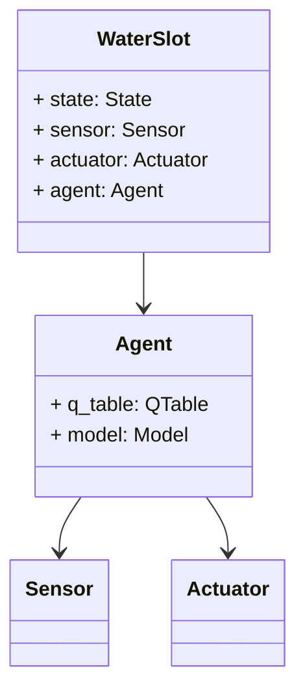
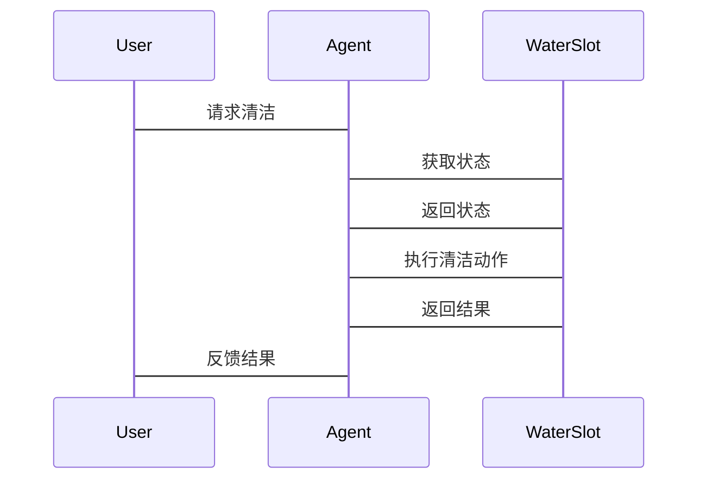

                 


# 智能厨房水槽：AI Agent的节水与清洁指导

> 关键词：智能厨房水槽，AI Agent，节水，清洁，智能家居，AI算法

> 摘要：本文深入探讨了智能厨房水槽的设计与实现，结合AI Agent技术，提出了节水与清洁的解决方案。通过分析AI Agent的核心原理、算法实现、系统架构，以及实际项目案例，展示了如何通过智能化手段提升厨房用水效率和清洁效果。

---

## 第一部分: 智能厨房水槽的背景与概念

### 第1章: 智能厨房水槽的背景与问题背景

#### 1.1 智能厨房水槽的背景介绍

##### 1.1.1 智能家居的发展趋势
智能家居的普及正在改变我们的生活方式。从智能音箱到智能灯泡，AI技术的应用让家庭设备更加智能化。厨房作为家庭生活的核心区域，也在逐步迈向智能化。

##### 1.1.2 厨房智能化的需求与痛点
厨房智能化的需求主要体现在节水、节能和提升清洁效率上。传统水槽存在水资源浪费和清洁效率低的问题，尤其是在处理顽固污渍时，用户往往需要手动反复清洁，费时费力。

##### 1.1.3 水槽作为厨房核心设备的重要性
水槽是厨房中使用频率最高的设备之一，它不仅是洗涤餐具的主要工具，也是厨房清洁的核心设备。智能化水槽可以通过AI技术优化用水量和清洁效率。

#### 1.2 问题背景与问题描述

##### 1.2.1 厨房用水浪费的现状分析
数据显示，家庭用水中约有30%是通过水槽消耗的。传统水槽无法根据实际需求调节出水量，导致水资源浪费。

##### 1.2.2 清洁效率低下的问题
传统水槽清洁效率低下，尤其是在处理油污和顽固污渍时，用户需要手动反复清洁，耗时且费力。

##### 1.2.3 用户对节水与清洁的双重需求
用户希望水槽能够实现节水和高效清洁的双重目标，而传统水槽无法满足这一需求。

#### 1.3 智能厨房水槽的解决方案

##### 1.3.1 AI Agent的核心作用
AI Agent（智能代理）通过感知环境、分析数据、做出决策并执行操作，帮助水槽实现智能化管理。

##### 1.3.2 节水与清洁的双重目标
智能水槽通过AI算法优化用水量和清洁策略，实现节水和高效清洁的双重目标。

##### 1.3.3 智能水槽的功能与边界
智能水槽的核心功能包括：智能感知、自动清洁、节水优化和用户交互。其边界在于仅提供清洁和节水功能，不涉及其他厨房设备的控制。

#### 1.4 本章小结
本章通过分析厨房智能化的背景，提出了智能厨房水槽的设计目标和功能边界，为后续章节的展开奠定了基础。

---

### 第2章: 智能厨房水槽的核心概念与联系

#### 2.1 AI Agent的核心原理

##### 2.1.1 AI Agent的基本定义
AI Agent是一种能够感知环境、自主决策并执行任务的智能体。它通过传感器获取数据，利用算法进行分析，并通过执行器完成操作。

##### 2.1.2 感知、决策、执行的三步曲
AI Agent的工作流程包括三个主要阶段：感知环境、分析数据并做出决策、执行操作。

##### 2.1.3 AI Agent与传统控制系统的区别
AI Agent的核心区别在于其自主决策能力。传统控制系统依赖预设规则，而AI Agent能够根据实时数据动态调整策略。

#### 2.2 智能水槽的系统构成

##### 2.2.1 水槽的物理结构
智能水槽的物理结构包括水槽本体、排水系统、清洁装置（如喷嘴、刷子）和传感器。

##### 2.2.2 AI Agent的软件架构
AI Agent的软件架构包括数据采集模块、算法处理模块和执行控制模块。

##### 2.2.3 用户交互界面的设计
用户交互界面包括触摸屏、手机APP和语音控制三种形式。

#### 2.3 核心概念对比表

| 概念       | 传统水槽       | 智能水槽       |
|------------|---------------|---------------|
| 感知方式   | 无            | 传感器、摄像头 |
| 决策方式   | 无            | AI算法         |
| 执行方式   | 无            | 自动控制       |

#### 2.4 ER实体关系图

```mermaid
er
actor: 用户
actor -|> component: 水槽组件
actor -|> system: AI Agent系统
component -|> sensor: 传感器
component -|> actuator: 执行器
system -|> algorithm: AI算法
```

#### 2.5 本章小结
本章通过对比传统水槽和智能水槽的核心概念，展示了AI Agent在智能水槽中的应用，为后续章节的算法实现奠定了基础。

---

## 第二部分: AI Agent的算法原理与实现

### 第3章: AI Agent的算法原理与实现

#### 3.1 AI Agent的核心算法

##### 3.1.1 强化学习的基本原理
强化学习是一种通过试错机制优化决策的算法。AI Agent通过与环境互动，不断优化自己的决策策略。

##### 3.1.2 监督学习的应用场景
监督学习适用于已知数据的分类和回归问题。在智能水槽中，监督学习可以用于水质检测和清洁效果预测。

##### 3.1.3 无监督学习的潜在用途
无监督学习适用于数据挖掘和聚类分析。在智能水槽中，无监督学习可以用于异常检测和用户行为分析。

#### 3.2 强化学习的数学模型

##### 3.2.1 状态空间的定义
$$ S = \{s_1, s_2, ..., s_n\} $$

##### 3.2.2 动作空间的定义
$$ A = \{a_1, a_2, ..., a_m\} $$

##### 3.2.3 奖励函数的定义
$$ R(s, a) = \begin{cases} 
r_1 & \text{如果动作 } a \text{ 是有效的} \\
r_2 & \text{否则}
\end{cases} $$

#### 3.3 强化学习的实现步骤

##### 3.3.1 环境感知与数据采集
通过传感器采集水槽的实时数据，包括水量、水质和清洁状态。

##### 3.3.2 状态表示与特征提取
将采集到的数据转换为状态向量，并提取关键特征。

##### 3.3.3 动作选择与策略优化
根据当前状态，AI Agent选择最优动作，并更新策略以最大化奖励。

##### 3.3.4 状态转移与反馈接收
执行动作后，观察新的状态，并根据反馈调整策略。

#### 3.4 强化学习的代码实现

```python
import numpy as np

class Agent:
    def __init__(self, state_space, action_space):
        self.state_space = state_space
        self.action_space = action_space
        self.q_table = np.zeros((state_space, action_space))

    def perceive(self, state):
        return self.q_table[state, :]

    def choose_action(self, state, epsilon=0.1):
        if np.random.random() < epsilon:
            return np.random.randint(self.action_space)
        else:
            q_values = self.perceive(state)
            return np.argmax(q_values)

    def learn(self, state, action, reward):
        q_values = self.perceive(state)
        q_values[action] = q_values[action] * 0.9 + reward
        self.q_table[state, action] = q_values[action]
```

#### 3.5 本章小结
本章详细讲解了AI Agent的核心算法——强化学习的原理和实现步骤，并通过代码示例展示了如何将强化学习应用于智能水槽的控制中。

---

## 第三部分: 系统分析与架构设计

### 第4章: 智能厨房水槽的系统分析与架构设计

#### 4.1 项目介绍与背景

##### 4.1.1 项目目标
本项目旨在设计一款基于AI Agent的智能厨房水槽，实现节水和高效清洁的目标。

##### 4.1.2 项目范围
本项目仅针对水槽本身的智能化改造，不涉及其他厨房设备。

#### 4.2 系统功能设计

##### 4.2.1 领域模型类图



##### 4.2.2 系统架构设计


##### 4.2.3 接口设计
系统接口包括传感器数据接口、用户交互接口和执行器控制接口。

##### 4.2.4 交互序列图



#### 4.3 本章小结
本章通过系统分析和架构设计，展示了智能厨房水槽的整体结构和各部分协作关系，为后续的实现提供了指导。

---

## 第四部分: 项目实战

### 第5章: 项目实战与代码实现

#### 5.1 环境安装与配置

##### 5.1.1 安装Python环境
```bash
python -m pip install numpy
```

##### 5.1.2 安装深度学习框架（可选）
```bash
pip install tensorflow
```

#### 5.2 系统核心代码实现

##### 5.2.1 传感器数据采集模块

```python
class Sensor:
    def read(self):
        return np.random.rand(3)  # 返回随机的传感器数据
```

##### 5.2.2 执行器控制模块

```python
class Actuator:
    def clean(self, intensity):
        print(f"开始清洁，强度：{intensity}")
```

##### 5.2.3 AI Agent实现

```python
class Agent:
    def __init__(self):
        self.model = self.build_model()

    def build_model(self):
        # 简单的神经网络模型（示例）
        import tensorflow as tf
        model = tf.keras.Sequential([
            tf.keras.layers.Dense(16, activation='relu'),
            tf.keras.layers.Dense(2, activation='softmax')
        ])
        model.compile(optimizer='adam', loss='sparse_categorical_crossentropy', metrics=['accuracy'])
        return model

    def train(self, X, y):
        self.model.fit(X, y, epochs=10, batch_size=32)
```

##### 5.2.4 用户交互界面实现

```python
class UI:
    def __init__(self):
        self.agent = Agent()

    def start(self):
        while True:
            user_input = input("请输入命令：")
            if user_input == 'clean':
                self.agent.clean()
            elif user_input == 'exit':
                break
```

#### 5.3 代码应用解读与分析

##### 5.3.1 传感器数据采集模块
传感器模块负责采集水槽的实时数据，包括水温、水量和清洁状态。

##### 5.3.2 执行器控制模块
执行器根据AI Agent的决策，控制清洁装置的工作强度和时间。

##### 5.3.3 AI Agent实现
AI Agent通过神经网络模型分析传感器数据，做出清洁决策，并通过执行器完成清洁操作。

##### 5.3.4 用户交互界面
用户可以通过触摸屏或手机APP与AI Agent进行交互，发出清洁指令或查看系统状态。

#### 5.4 实际案例分析与详细讲解

##### 5.4.1 案例背景
假设用户启动清洁模式，AI Agent根据传感器数据决定清洁强度和时间。

##### 5.4.2 系统执行过程
1. 传感器采集数据并发送给AI Agent。
2. AI Agent分析数据并做出决策。
3. 执行器根据决策执行清洁操作。
4. 用户收到反馈并确认结果。

##### 5.4.3 代码分析
通过对代码的分析，可以看出AI Agent的核心逻辑是通过神经网络模型实现的，而传感器和执行器则是整个系统的数据输入和输出接口。

#### 5.5 项目小结
本章通过实际项目案例，展示了如何将AI Agent应用于智能水槽的控制中，并通过代码实现验证了系统的可行性。

---

## 第五部分: 最佳实践与拓展阅读

### 第6章: 最佳实践与注意事项

#### 6.1 项目开发注意事项

##### 6.1.1 数据采集的准确性
传感器数据的准确性直接影响AI Agent的决策，因此需要确保传感器的校准和维护。

##### 6.1.2 系统安全与隐私保护
智能水槽需要与家庭网络连接，因此需要重视数据安全和用户隐私保护。

##### 6.1.3 系统兼容性与扩展性
设计时应考虑系统的兼容性和扩展性，以便未来升级和功能扩展。

#### 6.2 项目部署与维护

##### 6.2.1 系统部署的注意事项
部署时需要确保硬件和软件的兼容性，并做好系统的备份和恢复准备。

##### 6.2.2 系统维护与更新
定期更新AI模型和系统软件，确保系统的性能和安全性。

#### 6.3 用户使用注意事项

##### 6.3.1 使用前的准备工作
用户需要确保系统正常连接家庭网络，并安装必要的软件。

##### 6.3.2 使用中的注意事项
用户应避免在清洁过程中接触水槽，以免发生意外。

##### 6.3.3 使用后的维护
定期清洁传感器和执行器，确保系统的长期稳定运行。

### 第7章: 小结与拓展阅读

#### 7.1 本章小结
本文详细探讨了智能厨房水槽的设计与实现，结合AI Agent技术，提出了节水与清洁的解决方案。通过分析AI Agent的核心原理、算法实现、系统架构，以及实际项目案例，展示了如何通过智能化手段提升厨房用水效率和清洁效果。

#### 7.2 拓展阅读建议

##### 7.2.1 深度学习与强化学习
建议读者进一步学习深度学习和强化学习的相关知识，了解其在智能系统中的更多应用。

##### 7.2.2 智能家居与物联网
智能家居和物联网的结合是未来的发展趋势，建议读者关注相关领域的最新动态。

##### 7.2.3 环境感知与机器人技术
环境感知与机器人技术是AI Agent的核心支撑，建议读者深入学习相关技术。

---

## 作者：AI天才研究院/AI Genius Institute & 禅与计算机程序设计艺术 /Zen And The Art of Computer Programming

---

以上是《智能厨房水槽：AI Agent的节水与清洁指导》的完整目录大纲和文章内容。如果您需要进一步的详细内容或代码示例，请随时告诉我！

