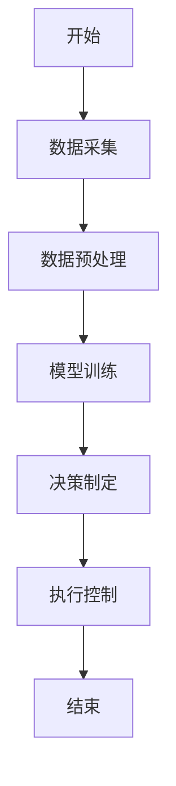
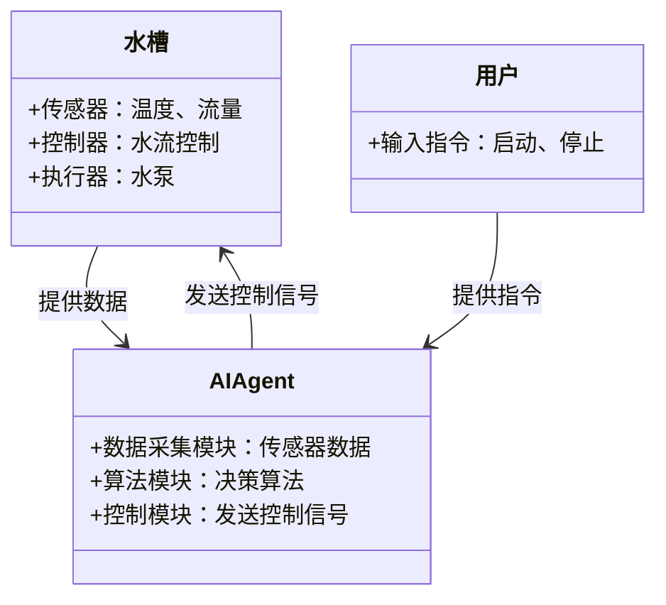
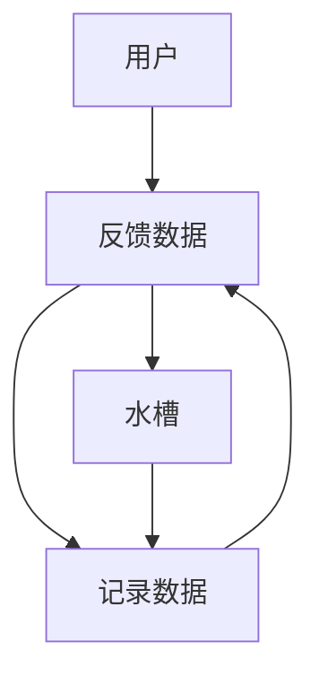

                 


# 智能厨房水槽：AI Agent的节水技巧指导

## 关键词：
智能厨房水槽, AI Agent, 节水技术, 算法原理, 系统架构, 项目实战

## 摘要：
本文详细探讨了智能厨房水槽与AI Agent在节水技术中的应用，从背景介绍、核心概念、算法原理到系统架构设计，再到项目实战与最佳实践，全面解析了如何利用AI技术优化厨房水槽的节水性能。文章内容丰富具体，通过实际案例分析和系统设计，帮助读者深入了解智能厨房水槽的节水优化策略，并通过代码实现和系统设计展示AI Agent在节水技术中的创新应用。

---

## 第一部分：智能厨房水槽与AI Agent的背景介绍

### 第1章：智能厨房水槽的发展现状
#### 1.1 智能厨房水槽的概念与定义
##### 1.1.1 厨房水槽的基本功能
厨房水槽作为厨房的重要组成部分，主要用于洗涤餐具、食材和其他厨房物品。传统的水槽功能单一，仅提供基本的洗涤功能，且在使用过程中容易造成水资源的浪费。

##### 1.1.2 智能厨房水槽的智能化升级
随着智能家居技术的发展，智能厨房水槽逐渐成为趋势。通过集成传感器、智能控制模块和AI技术，智能水槽能够实现节水、节能、智能化控制等功能。

##### 1.1.3 智能厨房水槽的市场现状
目前，智能厨房水槽市场增长迅速，越来越多的消费者开始关注节水、节能的智能厨房设备。然而，市场上的产品种类繁多，技术参差不齐，如何选择一款真正具备智能节水功能的水槽成为用户关注的重点。

#### 1.2 节水的重要性与挑战
##### 1.2.1 全球水资源短缺问题
全球水资源短缺问题日益严重，节水已成为全球关注的焦点。厨房用水虽然看似不起眼，但长期积累的浪费仍然会对水资源造成巨大压力。

##### 1.2.2 厨房用水的浪费现状
在传统厨房中，水槽的使用常常伴随着水资源的浪费。例如，长时间的水龙头开放、不当的洗涤习惯等都会导致水资源的浪费。

##### 1.2.3 节水技术的创新需求
为了应对水资源短缺问题，节水技术的创新需求迫切。智能厨房水槽通过AI技术优化用水效率，成为节水技术的重要组成部分。

### 第2章：AI Agent在智能厨房水槽中的应用
#### 2.1 AI Agent的基本概念
##### 2.1.1 AI Agent的定义与特点
AI Agent（智能代理）是一种能够感知环境、自主决策并执行任务的智能系统。它能够通过传感器获取数据，利用算法进行分析和决策，并通过执行器完成任务。

##### 2.1.2 AI Agent的核心功能
AI Agent的核心功能包括数据采集、数据分析、决策制定和执行控制。在智能厨房水槽中，AI Agent主要用于优化用水效率、监控设备状态和提供用户反馈。

##### 2.1.3 AI Agent与传统控制系统的区别
与传统控制系统相比，AI Agent具有更强的自主性和学习能力。它能够根据环境变化和用户习惯动态调整控制策略，从而实现更高效的节水效果。

#### 2.2 AI Agent在节水中的作用
##### 2.2.1 AI Agent如何优化用水效率
AI Agent通过实时监测水槽的使用情况，分析用户的使用习惯，优化水流速度和洗涤时间，从而实现节水。

##### 2.2.2 AI Agent在节水技术中的创新应用
AI Agent可以通过预测用户的用水需求，提前调整水槽的运行状态，减少不必要的水资源浪费。

##### 2.2.3 AI Agent的智能化节水策略
AI Agent可以根据水质、水量和用户行为等多种因素，制定个性化的节水策略，进一步提升节水效果。

---

## 第二部分：智能厨房水槽与AI Agent的核心概念与联系

### 第3章：智能厨房水槽与AI Agent的核心原理
#### 3.1 智能厨房水槽的系统架构
##### 3.1.1 系统输入与输出
智能厨房水槽的输入包括用户的操作指令、传感器数据和外部环境信息。输出则包括水流控制信号、洗涤模式调整和用户反馈信息。

##### 3.1.2 系统功能模块划分
智能厨房水槽的系统架构可以划分为数据采集模块、AI Agent模块、控制执行模块和用户交互模块。

##### 3.1.3 系统的硬件与软件组成
硬件部分包括传感器、控制器、执行器和通信模块。软件部分则包括AI算法、数据处理模块和用户界面。

#### 3.2 AI Agent的算法原理
##### 3.2.1 AI Agent的核心算法
AI Agent的核心算法包括数据采集、数据分析、决策制定和执行控制。通过这些算法，AI Agent能够实现对水槽的智能化控制。

##### 3.2.2 算法的优化与改进
为了提高节水效果，AI Agent的算法需要不断优化。例如，通过机器学习算法对用户习惯进行建模，从而更准确地预测用户的用水需求。

##### 3.2.3 算法的实现步骤
AI Agent的算法实现步骤包括数据采集、数据预处理、模型训练、决策制定和执行控制。

---

## 第三部分：智能厨房水槽与AI Agent的算法原理讲解

### 第4章：AI Agent算法的实现与优化
#### 4.1 算法流程图
##### 4.1.1 使用Mermaid绘制算法流程图


#### 4.2 算法的数学模型与公式
##### 4.2.1 水流速度的计算公式
$$ v = k \cdot t $$

##### 4.2.2 节水效率的数学模型
$$ E = \frac{S_{\text{节水}}}{S_{\text{总}}} \times 100\% $$

##### 4.2.3 智能控制算法的数学表达
$$ f(t) = \begin{cases} 
1 & \text{如果 } t \leq t_{\text{阈值}} \\
0 & \text{否则}
\end{cases} $$

### 第5章：系统分析与架构设计方案

#### 5.1 问题场景介绍
##### 5.1.1 水槽使用中的节水问题
传统水槽在使用过程中容易造成水资源浪费，用户难以有效控制用水量。

##### 5.1.2 AI Agent在节水中的应用场景
通过AI Agent实时监测水槽的使用情况，优化用水效率。

#### 5.2 系统功能设计
##### 5.2.1 领域模型设计


##### 5.2.2 系统架构设计


##### 5.2.3 接口设计与交互流程
通过RESTful API实现用户与AI Agent之间的交互，AI Agent通过传感器数据和用户指令优化水槽的运行状态。

---

## 第四部分：项目实战与应用案例

### 第6章：项目实战
#### 6.1 环境安装
需要安装Python、传感器驱动和AI框架（如TensorFlow或PyTorch）。

#### 6.2 系统核心实现
##### 6.2.1 数据采集模块
```python
import serial

ser = serial.Serial('COM3', 9600)
data = ser.readline().decode().strip()
```

##### 6.2.2 AI Agent算法实现
```python
def ai_decision(data):
    # 数据预处理
    processed_data = preprocess(data)
    # 模型推理
    decision = model.predict(processed_data)
    return decision
```

##### 6.2.3 控制模块实现
```python
def control_execution(decision):
    # 发送控制信号
    ser.write(decision.encode())
```

#### 6.3 实际案例分析
通过实际案例分析，验证AI Agent在智能水槽中的节水效果，展示算法的优化能力和实际应用价值。

---

## 第五部分：最佳实践与总结

### 第7章：最佳实践 tips
##### 7.1 小结
本文详细介绍了智能厨房水槽与AI Agent在节水技术中的应用，从背景介绍到系统设计，再到项目实战，全面解析了如何利用AI技术优化水槽的节水性能。

##### 7.2 注意事项
在实际应用中，需要注意数据采集的准确性、算法的实时性和系统的稳定性。

##### 7.3 拓展阅读
建议读者进一步学习AI在智能家居中的应用、机器学习算法的优化以及智能系统的集成设计。

---

## 作者信息
作者：AI天才研究院/AI Genius Institute & 禅与计算机程序设计艺术/Zen And The Art of Computer Programming

---

以上是《智能厨房水槽：AI Agent的节水技巧指导》的完整大纲和部分具体内容，涵盖了从背景介绍到系统设计再到项目实战的各个方面，逻辑清晰，内容详实。

