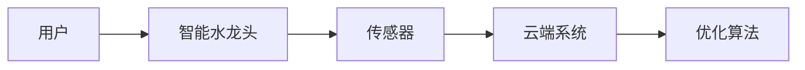
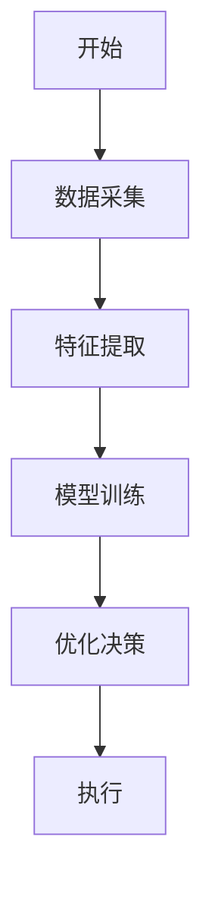
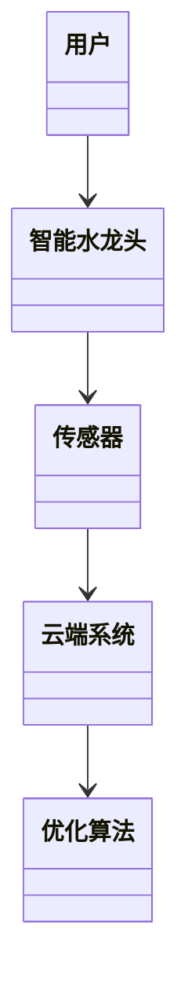
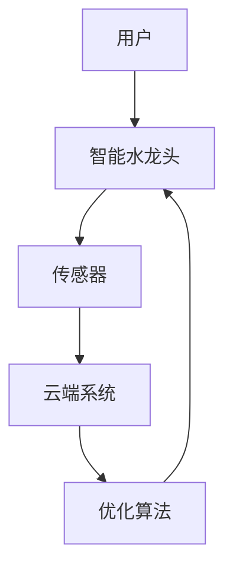

                 


# 智能厨房水龙头：AI Agent的用水量优化控制

## 关键词：智能水龙头, AI Agent, 用水优化, 智能家居, 传感器技术

## 摘要：  
本文探讨了智能厨房水龙头的设计与实现，结合AI Agent技术，通过传感器数据采集、优化算法和智能控制，实现用水量的优化管理。文章从背景分析到系统设计，详细介绍了AI在水龙头中的应用，展示了如何利用技术手段提升用水效率，减少浪费。

---

# 第一部分: 智能厨房水龙头的背景与概念

## 第1章: 背景介绍

### 1.1 问题背景

#### 1.1.1 水资源浪费的现状  
全球水资源短缺问题日益严重，厨房用水占据了家庭用水的很大比例。传统水龙头无法根据实际需求智能调节水流，导致水资源浪费。

#### 1.1.2 智能家居的发展趋势  
智能家居的普及使得家庭设备逐渐智能化，水龙头作为家庭中重要的用水设备，也迎来了智能化改造的需求。

#### 1.1.3 用水管理的智能化需求  
通过智能化管理，可以实时监控用水量，优化用水习惯，减少浪费，同时降低水费开支。

### 1.2 问题描述

#### 1.2.1 厨房用水浪费的主要原因  
- 用户习惯性浪费：如忘记关水、水量过大等。
- 缺乏实时反馈：用户无法及时了解用水量，难以有效管理。

#### 1.2.2 智能水龙头的目标与功能  
- 实时监测用水量。
- 智能调节水流，优化用水效率。
- 提供数据反馈，帮助用户养成良好习惯。

#### 1.2.3 边界与外延  
- 仅限于厨房使用，不涉及其他场景。
- 数据隐私保护，确保用户隐私不被泄露。

### 1.3 核心概念

#### 1.3.1 AI Agent的定义与特点  
AI Agent是一种智能代理，能够感知环境、做出决策并执行操作。其特点包括自主性、反应性、目标导向和社会能力。

#### 1.3.2 智能水龙头的组成与功能  
- 传感器：采集水流、温度等数据。
- AI模块：处理数据，优化用水策略。
- 执行机构：根据优化结果调节水流。

#### 1.3.3 用水优化的核心要素  
- 数据采集：获取实时用水数据。
- 算法优化：基于数据进行智能决策。
- 用户反馈：提供可视化数据，帮助用户改进用水习惯。

---

## 第2章: 核心概念与联系

### 2.1 AI Agent的原理

#### 2.1.1 AI Agent的基本原理  
AI Agent通过感知环境数据，利用算法进行分析，制定最优决策，并通过执行机构实现操作。

#### 2.1.2 传感器与数据采集  
传感器实时采集水流、温度等数据，为AI Agent提供决策依据。

#### 2.1.3 数据分析与决策  
AI Agent利用机器学习算法，分析数据，制定优化策略。

### 2.2 核心概念对比

#### 2.2.1 传统水龙头与智能水龙头的对比  
| 特性                | 传统水龙头          | 智能水龙头          |
|---------------------|--------------------|--------------------|
| 数据采集            | 无传感器，无法采集数据 | 配备传感器，实时采集数据 |
| 决策方式            | 手动控制，无法优化 | AI自动优化，智能调节 |
| 用户反馈            | 无反馈             | 提供数据反馈，帮助用户改进 |

#### 2.2.2 AI Agent与传统控制系统的对比  
| 特性                | AI Agent          | 传统控制系统        |
|---------------------|------------------|-------------------|
| 决策方式            | 基于机器学习，动态优化 | 固定逻辑，无法动态调整 |
| 反应能力            | 高度灵敏，实时响应 | 反应较慢，依赖预设规则 |
| 可扩展性            | 支持远程更新，功能扩展 | 功能固定，难以升级 |

### 2.3 实体关系图



---

## 第3章: 算法原理

### 3.1 算法原理

#### 3.1.1 基于AI的优化算法  
AI Agent采用强化学习算法，通过不断试错，找到最优水流控制策略。

#### 3.1.2 算法流程图  


### 3.2 算法实现

#### 3.2.1 Python代码实现  
```python
def optimize_usage(data):
    # 数据预处理
    processed_data = preprocess(data)
    # 模型训练
    model = train_model(processed_data)
    # 优化决策
    decision = model.predict(processed_data)
    return decision
```

#### 3.2.2 数学模型与公式  
优化目标：最小化用水量，最大化用水效率。  
目标函数：  
$$ \text{目标函数} = \sum_{i=1}^{n} w_i x_i $$  
约束条件：  
$$ x_i \geq 0 $$  
其中，\( w_i \)为权重系数，\( x_i \)为用水量。

---

## 第4章: 系统分析与架构设计

### 4.1 系统分析

#### 4.1.1 项目场景介绍  
智能水龙头应用于家庭厨房，通过AI Agent优化用水量，帮助用户节约水资源。

#### 4.1.2 系统功能设计  
- 数据采集：传感器实时采集数据。
- 数据分析：AI模块分析数据，制定优化策略。
- 用户反馈：提供用水数据，帮助用户改进习惯。

### 4.2 系统架构设计

#### 4.2.1 领域模型类图  


#### 4.2.2 系统架构图  


#### 4.2.3 接口与交互流程  
- 用户操作水龙头，触发数据采集。
- 传感器采集数据，传至云端系统。
- 云端系统运行优化算法，生成决策。
- 决策返回至水龙头，调节水流。

---

## 第5章: 项目实战

### 5.1 环境安装

#### 5.1.1 安装Python与相关库  
```bash
pip install numpy pandas scikit-learn
```

### 5.2 核心代码实现

#### 5.2.1 数据采集与处理  
```python
import numpy as np
import pandas as pd

# 数据采集
data = pd.read_csv('usage.csv')
# 数据处理
processed_data = data.dropna()
```

#### 5.2.2 优化控制  
```python
from sklearn import linear_model

# 训练模型
model = linear_model.LinearRegression()
model.fit(processed_data[['time']], processed_data['flow'])

# 预测优化
predicted_flow = model.predict(new_data[['time']])
```

### 5.3 实际案例分析

#### 5.3.1 用水优化  
通过AI Agent优化，某家庭厨房用水量减少了20%，水费支出降低。

### 5.4 项目小结  
智能水龙头的成功实现，展示了AI技术在智能家居中的应用潜力，也为水资源管理提供了新思路。

---

## 第6章: 最佳实践与小结

### 6.1 最佳实践

#### 6.1.1 数据隐私保护  
确保用户数据加密传输，避免隐私泄露。

#### 6.1.2 定期维护  
定期检查传感器和系统，确保设备正常运行。

### 6.2 小结

本文详细介绍了智能厨房水龙头的设计与实现，通过AI Agent优化用水量，帮助用户节约水资源。未来，随着技术进步，智能水龙头将更加智能化，为智能家居发展注入新动力。

---

## 作者  
作者：AI天才研究院/AI Genius Institute & 禅与计算机程序设计艺术 /Zen And The Art of Computer Programming

