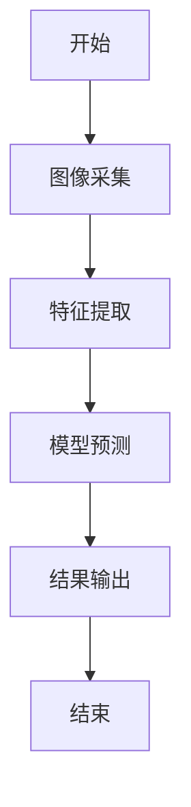
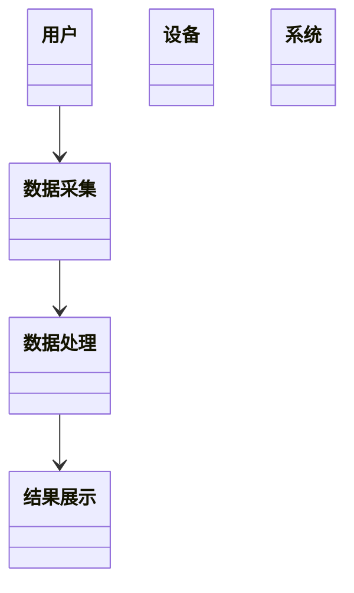
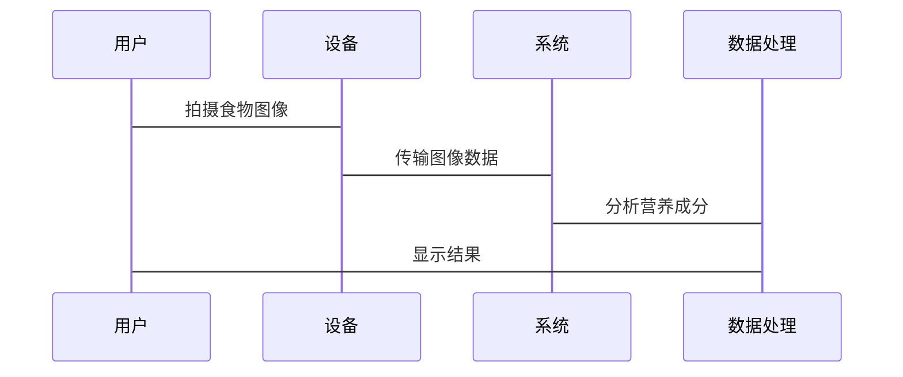

                 


# 智能厨房秤：AI Agent的营养成分分析

## 关键词：智能厨房秤，AI Agent，营养成分分析，图像识别，机器学习，健康饮食，数据处理

## 摘要：  
本文探讨了智能厨房秤与AI Agent结合的营养成分分析技术。通过图像识别和机器学习，智能厨房秤能实时分析食物的营养成分，帮助用户改善饮食健康。文章深入分析了技术原理、算法实现和实际应用，为读者提供全面的技术视角。

---

# 第1章: 智能厨房秤与AI Agent的背景介绍

## 1.1 智能厨房秤的发展历程  
### 1.1.1 传统厨房秤的功能与局限性  
传统厨房秤仅能称重，无法提供营养成分分析，限制了其使用场景。  

### 1.1.2 智能化时代的厨房秤革新  
随着AI技术的发展，智能厨房秤加入了图像识别、机器学习等功能，成为智能厨房助手。  

### 1.1.3 AI技术在厨房秤中的应用前景  
AI技术使厨房秤能够分析食物成分，提供健康建议，提升用户体验。  

## 1.2 AI Agent的基本概念  
### 1.2.1 什么是AI Agent  
AI Agent是具有感知和决策能力的智能体，能够执行任务并适应环境。  

### 1.2.2 AI Agent的核心特征  
- 感知能力：通过传感器或摄像头获取数据。  
- 决策能力：基于数据做出最优决策。  
- 交互能力：与用户或系统进行实时互动。  

### 1.2.3 AI Agent在智能厨房秤中的角色  
AI Agent负责数据处理、营养分析和结果输出，是智能厨房秤的核心驱动力。  

## 1.3 营养成分分析的必要性  
### 1.3.1 营养成分分析的基本原理  
通过化学分析或图像识别技术，确定食物的营养成分。  

### 1.3.2 智能厨房秤在营养分析中的优势  
- 高效性：快速分析多种营养成分。  
- 准确性：AI算法提升分析精度。  

### 1.3.3 用户需求与市场潜力  
用户对健康饮食的关注推动了智能厨房秤的市场需求，市场潜力巨大。  

## 1.4 本章小结  
本章介绍了智能厨房秤的发展、AI Agent的概念及其在营养分析中的应用，为后续内容打下基础。

---

# 第2章: 智能厨房秤与AI Agent的核心概念与联系  

## 2.1 核心概念原理  
### 2.1.1 智能厨房秤的数据采集机制  
通过摄像头采集食物图像，提取颜色、形状等特征。  

### 2.1.2 AI Agent的营养分析算法  
基于机器学习模型，分析食物的热量、蛋白质等营养成分。  

### 2.1.3 数据处理与结果输出的流程  
数据采集 → 特征提取 → 模型预测 → 结果展示。  

## 2.2 核心概念属性特征对比表  
| 概念 | 属性 | 特征 |  
|------|------|------|  
| 智能厨房秤 | 数据采集 | 高精度称重、图像识别 |  
| AI Agent | 分析算法 | 机器学习、自然语言处理 |  

## 2.3 ER实体关系图（Mermaid）  

```mermaid  
erDiagram  
    actor 用户  
    actor 设备  
    actor 系统  
    device 数据采集  
    system 数据处理  
    user 结果展示  
    数据采集 --> 数据处理  
    数据处理 --> 结果展示  
```

## 2.4 本章小结  
本章通过对比分析，明确了智能厨房秤与AI Agent的核心概念及其相互关系，为后续实现提供了理论基础。

---

# 第3章: AI Agent的营养成分分析算法原理  

## 3.1 算法原理概述  
### 3.1.1 图像识别在营养分析中的应用  
使用卷积神经网络（CNN）识别食物种类和数量。  

### 3.1.2 机器学习模型的训练与优化  
通过大量数据训练模型，优化分类精度。  

### 3.1.3 算法的输入输出流程  
输入：食物图像；输出：营养成分报告。  

## 3.2 算法流程图（Mermaid）  



## 3.3 算法实现代码示例  

```python  
import cv2  
import numpy as np  

# 加载预训练模型  
model = load_model('nutrition_model.h5')  

# 图像预处理  
image = cv2.imread('food.jpg')  
image = cv2.resize(image, (224, 224))  
image = image / 255.0  
image = np.expand_dims(image, axis=0)  

# 预测营养成分  
prediction = model.predict(image)  
print('预测结果:', prediction)  
```

---

# 第4章: 智能厨房秤与AI Agent的系统分析与架构设计  

## 4.1 问题场景介绍  
用户使用智能厨房秤称重并拍照，AI Agent分析营养成分并提供建议。  

## 4.2 项目介绍  
开发一个基于AI Agent的智能厨房秤系统，实现营养成分分析功能。  

## 4.3 系统功能设计（领域模型Mermaid类图）  



## 4.4 系统架构设计（Mermaid架构图）  


## 4.5 系统接口设计  
- 用户界面：显示营养成分和建议。  
- 系统接口：接收数据并返回结果。  

## 4.6 系统交互设计（Mermaid序列图）  



---

# 第5章: 项目实战：智能厨房秤的实现与应用  

## 5.1 环境安装  
- 安装Python、TensorFlow、OpenCV等依赖库。  

## 5.2 系统核心实现源代码  

```python  
import cv2  
import numpy as np  
import tensorflow as tf  

# 加载预训练模型  
model = tf.keras.models.load_model('nutrition_model.h5')  

# 图像预处理  
def preprocess_image(image_path):  
    image = cv2.imread(image_path)  
    image = cv2.resize(image, (224, 224))  
    image = image / 255.0  
    image = np.expand_dims(image, axis=0)  
    return image  

# 营养成分分析  
def analyze_nutrition(image_path):  
    image = preprocess_image(image_path)  
    prediction = model.predict(image)  
    return prediction  

# 主函数  
def main():  
    image_path = 'food.jpg'  
    result = analyze_nutrition(image_path)  
    print('营养成分分析结果:', result)  

if __name__ == '__main__':  
    main()  
```

## 5.3 实际案例分析  
分析一个水果沙拉的营养成分，计算热量、纤维素等含量。  

## 5.4 测试与优化  
测试模型准确率，优化算法性能。  

---

# 第6章: 最佳实践与总结  

## 6.1 项目小结  
智能厨房秤结合AI Agent，通过图像识别和机器学习实现营养成分分析，为用户提供了便捷的健康饮食工具。  

## 6.2 实践中的注意事项  
- 数据质量影响模型性能。  
- 系统设计需考虑用户体验。  

## 6.3 未来改进方向  
- 提升模型精度。  
- 扩展更多营养成分分析功能。  

## 6.4 注意事项  
使用前需确保设备正常工作，数据隐私需妥善保护。  

## 6.5 拓展阅读  
推荐相关技术文献和实践案例。  

---

# 附录：常见问题解答  

## 附录A: 如何训练AI Agent模型？  
1. 收集数据。  
2. 数据预处理。  
3. 训练模型。  
4. 优化参数。  

## 附录B: 开发工具与库推荐  
- OpenCV：图像处理。  
- TensorFlow：机器学习。  

---

# 参考文献  

1. TensorFlow官方文档  
2. OpenCV官方文档  
3. 相关学术论文  

---

# 索引  

（按关键词和术语编排索引）

---

# 作者：AI天才研究院/AI Genius Institute & 禅与计算机程序设计艺术 /Zen And The Art of Computer Programming

