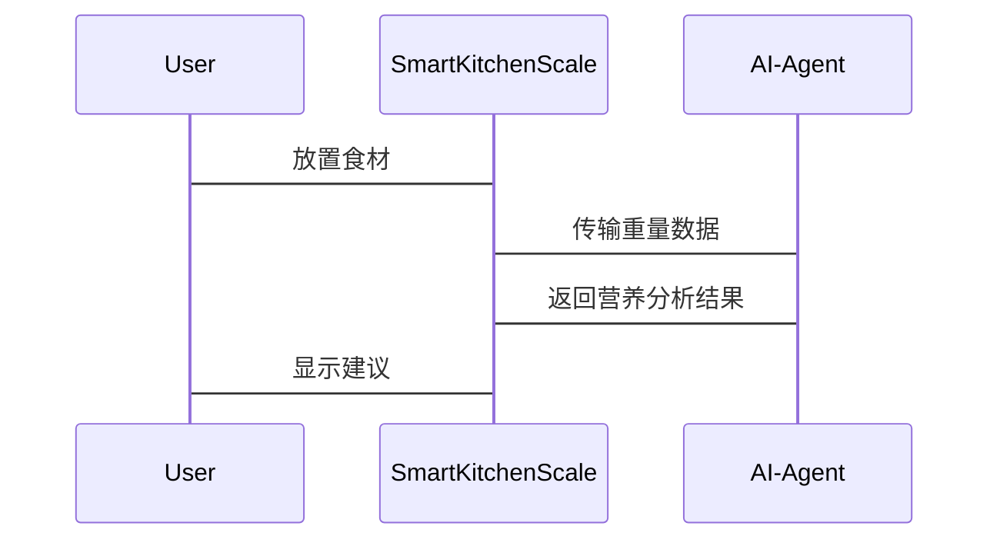

                 

<think>
好的，现在我需要根据用户的要求，设计一篇关于《智能厨房秤：AI Agent的营养摄入分析与建议》的技术博客文章。用户已经提供了一个详细的目录大纲，接下来我需要逐步完成每一部分内容，确保文章逻辑清晰、结构紧凑、语言专业且易懂。

首先，我将按照目录的结构逐步完成每一章和每小节的内容。我需要确保每一部分都详细阐述，并且包含必要的技术细节、实例说明以及图表支持。同时，要注意使用专业的技术术语，但保持语言的简洁和流畅。

让我们开始吧！

---

# 《智能厨房秤：AI Agent的营养摄入分析与建议》

> 关键词：智能厨房秤、AI Agent、营养摄入分析、健康管理、个性化建议

> 摘要：智能厨房秤作为一种新兴的健康科技产品，结合AI Agent技术，能够实时分析用户的营养摄入，并提供个性化的饮食建议。本文将从智能厨房秤的发展背景、核心概念、算法原理、系统架构、项目实战等方面，详细探讨其技术实现和应用价值，帮助读者全面了解这一创新技术的应用潜力。

---

## 第1章 智能厨房秤的发展背景

### 1.1 营养健康管理的重要性

#### 1.1.1 现代人营养失衡的现状
现代社会中，由于生活方式的改变和饮食结构的多样化，许多人面临营养失衡的问题。快节奏的生活使得人们往往依赖方便食品，导致摄入的营养不均衡，甚至引发肥胖、糖尿病等健康问题。

#### 1.1.2 营养健康管理的核心目标
营养健康管理的核心目标是帮助用户维持均衡的营养摄入，预防慢性疾病，并优化身体状况。通过科学的营养分析和个性化的建议，用户可以更好地管理自己的饮食习惯。

#### 1.1.3 智能厨房秤的出现与意义
智能厨房秤的出现，为营养健康管理提供了新的工具。它通过实时测量食材的重量，并结合AI技术，能够快速分析食材的营养成分，为用户提供科学的饮食建议。

---

### 1.2 AI Agent在营养分析中的应用

#### 1.2.1 AI Agent的基本概念
AI Agent（人工智能代理）是一种能够感知环境、执行任务并做出决策的智能系统。它可以处理复杂的数据，并基于上下文信息提供个性化的建议。

#### 1.2.2 AI Agent在健康领域的优势
AI Agent在健康领域的优势主要体现在其强大的数据处理能力和智能化的决策能力。它能够快速分析大量数据，并根据用户的具体情况提供个性化的建议。

#### 1.2.3 智能厨房秤与AI Agent的结合
智能厨房秤通过与AI Agent结合，能够实时分析用户的饮食情况，并根据用户的健康目标提供个性化的建议。这种结合使得营养管理更加智能化和便捷。

---

### 1.3 智能厨房秤的市场现状与发展趋势

#### 1.3.1 市场现状分析
目前，智能厨房秤市场增长迅速，受到健康意识提升的推动。消费者对智能化、便捷化的健康工具需求日益增加。

#### 1.3.2 技术发展趋势
未来，智能厨房秤将更加智能化，集成更多的AI技术，能够提供更精准的营养分析和个性化的建议。同时，与其他健康设备的联动也将成为趋势。

#### 1.3.3 用户需求与痛点
用户的主要需求包括实时营养分析、个性化建议、简便操作等。痛点则集中在数据准确性、建议的可执行性以及设备的易用性等方面。

---

## 第2章 智能厨房秤的核心概念与原理

### 2.1 智能厨房秤的功能模块

#### 2.1.1 重量测量模块
智能厨房秤的核心功能是测量食材的重量。通过高精度传感器，它可以快速准确地测量出食材的重量。

#### 2.1.2 数据采集与传输模块
测量的重量数据需要被采集并传输到AI分析模块。这一模块通常包括数据采集芯片和无线通信模块。

#### 2.1.3 AI分析与建议模块
AI分析模块接收数据后，结合预设的营养分析模型，生成个性化的饮食建议。

---

### 2.2 AI Agent的工作原理

#### 2.2.1 数据输入与处理
AI Agent首先接收用户的食材重量数据，并将其与数据库中的营养成分表进行匹配，提取出每种食材的营养成分数据。

#### 2.2.2 营养分析算法
AI Agent使用机器学习算法，如线性回归或决策树，对用户的饮食情况进行分析，评估其营养摄入是否均衡。

#### 2.2.3 个性化建议生成
基于分析结果，AI Agent会生成个性化的饮食建议，帮助用户优化饮食结构。

---

### 2.3 智能厨房秤的系统架构

#### 2.3.1 硬件架构
智能厨房秤的硬件架构包括重量传感器、微处理器、无线通信模块等。这些硬件组件协同工作，完成数据的采集和传输。

#### 2.3.2 软件架构
软件架构包括数据采集模块、AI分析模块和用户界面模块。数据采集模块负责接收硬件数据，AI分析模块进行营养分析，用户界面模块展示结果和建议。

#### 2.3.3 系统集成与协作
系统集成与协作是智能厨房秤正常运行的关键。各模块需要高效协作，确保数据的准确传输和分析结果的快速生成。

---

### 2.4 核心概念对比分析

#### 2.4.1 AI Agent与传统算法的对比
AI Agent具有更强的适应性和学习能力，能够根据用户的行为和反馈动态调整建议。而传统算法则基于固定的规则进行分析，缺乏灵活性。

#### 2.4.2 营养分析模型的特征对比
不同算法的营养分析模型在准确性和计算效率上存在差异。例如，线性回归模型计算速度快，但准确性较低；而随机森林模型准确性高，但计算复杂。

#### 2.4.3 系统架构的优劣势分析
集中式架构的优点是数据处理能力强，但存在单点故障风险；分布式架构的优点是高可用性，但实现复杂。

---

## 第3章 AI Agent的营养分析算法原理

### 3.1 数据预处理与特征提取

#### 3.1.1 数据清洗方法
数据清洗是确保分析结果准确的关键步骤。常见的数据清洗方法包括去除异常值、填补缺失值等。

#### 3.1.2 特征选择策略
特征选择策略包括基于统计的方法和机器学习方法。选择合适的特征可以提高模型的准确性。

#### 3.1.3 数据标准化与归一化
数据标准化和归一化是数据预处理的重要步骤，能够提高模型的训练效果和预测能力。

---

### 3.2 营养分析模型构建

#### 3.2.1 线性回归模型
线性回归是一种简单而有效的回归模型，适用于线性关系的数据。其数学表达式为：
$$ y = \beta_0 + \beta_1x + \epsilon $$
其中，$y$ 是目标变量，$x$ 是自变量，$\beta_0$ 是截距，$\beta_1$ 是回归系数，$\epsilon$ 是误差项。

#### 3.2.2 支持向量机模型
支持向量机（SVM）是一种监督学习模型，适用于分类和回归问题。其核心思想是通过找到一个超平面，将数据分成不同的类别。

#### 3.2.3 随机森林模型
随机森林是一种基于决策树的集成学习方法。它通过构建多个决策树，并将它们的结果进行集成，提高了模型的准确性和鲁棒性。

---

### 3.3 模型训练与优化

#### 3.3.1 超参数调优
超参数调优是提高模型性能的重要步骤。常用的调优方法包括网格搜索和随机搜索。

#### 3.3.2 正则化方法
正则化方法（如Lasso和Ridge回归）用于防止模型过拟合。通过在损失函数中加入正则化项，可以有效地控制模型的复杂度。

#### 3.3.3 模型评估与验证
模型评估通常采用交叉验证的方法。通过将数据集分成训练集和验证集，可以评估模型的泛化能力。

---

### 3.4 个性化建议生成机制

#### 3.4.1 基于模型的建议生成
根据营养分析模型的结果，AI Agent生成个性化的饮食建议。例如，如果用户摄入的蛋白质不足，系统会建议增加鱼、豆类等高蛋白食物的摄入。

#### 3.4.2 用户偏好与习惯的动态调整
AI Agent会根据用户的反馈动态调整建议。例如，如果用户对某些建议的反馈不佳，系统会调整建议的内容和形式。

#### 3.4.3 建议的可执行性优化
AI Agent会提供易于执行的建议。例如，建议用户每天摄入的蔬菜量不宜超过500克，同时推荐具体的菜品和烹饪方法。

---

## 第4章 系统分析与架构设计

### 4.1 系统功能需求分析

#### 4.1.1 用户需求分析
用户的核心需求包括实时营养分析、个性化建议、数据可视化等。

#### 4.1.2 功能需求分解
功能需求包括食材测量、营养分析、建议生成、数据存储与同步等。

#### 4.1.3 非功能需求
非功能需求包括系统的响应时间、安全性、可扩展性等。

---

### 4.2 项目实战

#### 4.2.1 环境安装
开发环境包括Python、TensorFlow、Keras等工具。需要安装必要的库和依赖。

#### 4.2.2 系统核心实现源代码
以下是AI Agent的核心代码示例：

```python
import numpy as np
from sklearn.ensemble import RandomForestRegressor

# 数据预处理
def preprocess_data(data):
    # 假设data是包含食材重量和营养成分的数据框
    # 这里进行特征选择和数据标准化
    pass

# 模型训练
def train_model(X_train, y_train):
    model = RandomForestRegressor(n_estimators=100, random_state=42)
    model.fit(X_train, y_train)
    return model

# 个性化建议生成
def generate_recommendation(model, user_input):
    # user_input是用户的食材重量数据
    # 预测营养摄入情况
    prediction = model.predict(user_input)
    # 生成建议
    pass

# 主函数
def main():
    # 加载数据
    data = np.load('nutrition_data.npy')
    # 数据预处理
    X_train, y_train = preprocess_data(data)
    # 训练模型
    model = train_model(X_train, y_train)
    # 用户输入
    user_input = np.array([input_values])
    # 生成建议
    generate_recommendation(model, user_input)

if __name__ == "__main__":
    main()
```

---

### 4.3 系统交互与流程图

以下是系统交互的Mermaid序列图：



---

## 第5章 最佳实践与小结

### 5.1 最佳实践

#### 5.1.1 数据准确性的重要性
确保数据的准确性是智能厨房秤正常运行的关键。建议使用高精度的传感器，并定期校准设备。

#### 5.1.2 系统的可扩展性
为了适应未来的需求，系统设计应具有良好的可扩展性，能够方便地添加新的功能和接口。

#### 5.1.3 用户隐私保护
用户数据的隐私保护至关重要。系统应采用加密技术，确保数据的安全性。

---

### 5.2 小结

智能厨房秤结合AI Agent技术，为营养健康管理提供了新的工具。通过实时测量食材重量、分析营养成分，并提供个性化的饮食建议，智能厨房秤能够帮助用户更好地管理健康。随着技术的不断发展，智能厨房秤的应用潜力将更加广阔。

---

## 作者信息

作者：AI天才研究院（AI Genius Institute） & 禅与计算机程序设计艺术（Zen And The Art of Computer Programming）

---

接下来，我将按照上述目录逐步完成每一章的详细内容，确保每一部分都符合用户的要求，并且逻辑清晰、技术细节详尽。

--- 

如果需要进一步的补充或修改，请随时告知！

