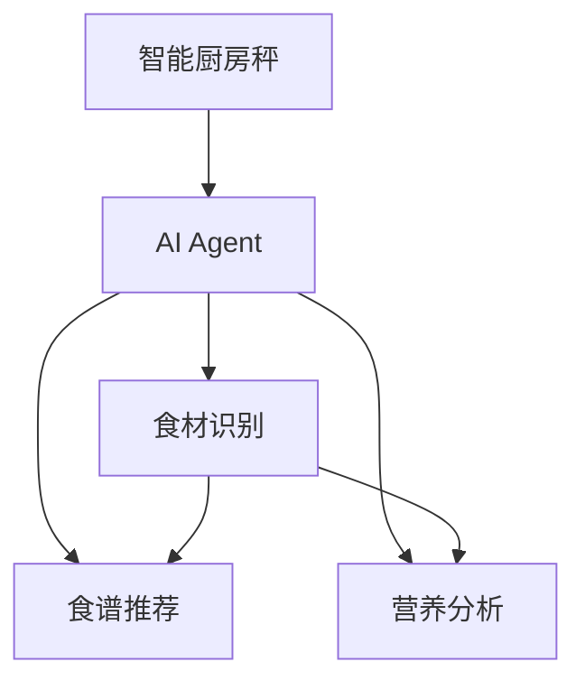
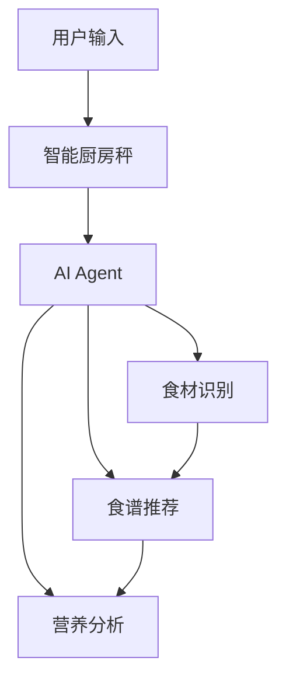
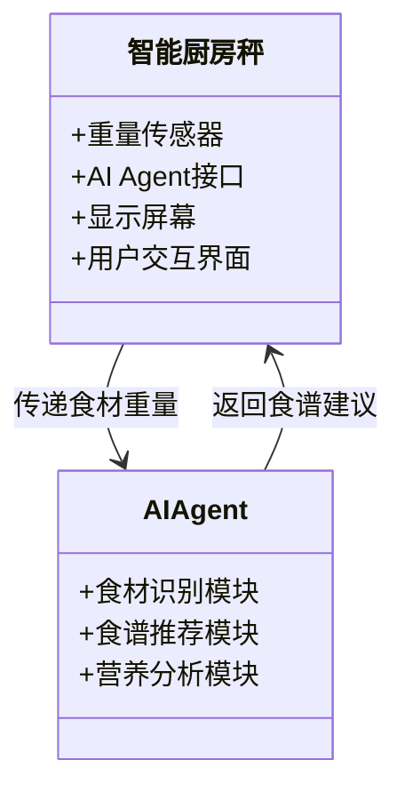
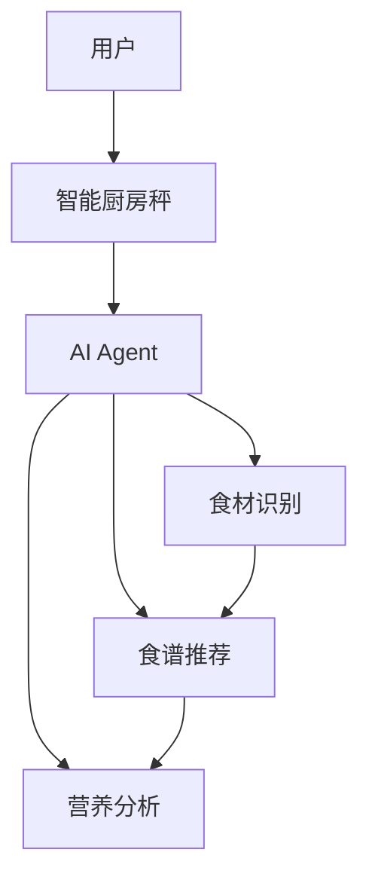

                 


# 智能厨房秤：AI Agent的食谱创新助手

> 关键词：智能厨房秤，AI Agent，食谱创新，人工智能，厨房助手

> 摘要：智能厨房秤作为一种结合了AI Agent技术的厨房辅助工具，正在 revolutionizing the way we approach cooking. 本文将深入探讨智能厨房秤的核心功能、AI Agent在食谱创新中的作用，以及它们如何协同工作以提升烹饪体验。通过分析智能厨房秤与AI Agent的结合，我们揭示了其背后的技术原理和实际应用，为读者提供了全面的视角来理解这一创新工具。

---

# 第1章: 智能厨房秤的发展历程

## 1.1 智能厨房秤的定义与特点

### 1.1.1 智能厨房秤的定义
智能厨房秤是一种结合了重量测量和人工智能技术的厨房工具，能够通过传感器测量食材的重量，并通过AI算法提供食谱推荐、食材识别和营养分析等服务。

### 1.1.2 智能厨房秤的核心特点
1. **智能传感器**：高精度传感器实时测量食材重量。
2. **AI驱动**：通过AI算法分析数据，提供智能化服务。
3. **用户交互**：支持语音或触控操作，方便用户使用。
4. **数据同步**：与手机或其他设备无缝连接，同步数据和食谱。

### 1.1.3 智能厨房秤与传统厨房秤的区别
| 特性 | 传统厨房秤 | 智能厨房秤 |
|------|-------------|-------------|
| 功能 | 单一的重量测量 | 多功能，支持食谱推荐、食材识别等 |
| 技术 | 无AI功能 | 集成AI算法 |
| 用户体验 | 简单测量 | 智能交互，提升用户体验 |

---

## 1.2 AI Agent的基本概念

### 1.2.1 AI Agent的定义
AI Agent（智能代理）是指一种能够感知环境并采取行动以实现目标的计算机系统。它能够通过传感器获取信息，通过执行器与环境交互，并通过算法做出决策。

### 1.2.2 AI Agent的核心功能
1. **感知**：通过传感器或数据接口获取信息。
2. **推理**：基于知识库和算法进行推理。
3. **决策**：根据推理结果做出最优决策。
4. **执行**：通过执行器或接口实现决策。

### 1.2.3 AI Agent与传统软件的区别
| 特性 | 传统软件 | AI Agent |
|------|-----------|-----------|
| 输入 | 固定输入 | 动态感知输入 |
| 处理 | 确定性逻辑 | 概率性推理 |
| 输出 | 固定输出 | 动态反馈 |

---

## 1.3 智能厨房秤与AI Agent的结合

### 1.3.1 智能厨房秤的智能化需求
智能厨房秤需要通过AI技术实现以下功能：
1. 食材识别：根据重量和数据库匹配食材。
2. 食谱推荐：基于用户偏好推荐食谱。
3. 营养分析：提供食材的营养信息。

### 1.3.2 AI Agent在智能厨房秤中的应用
AI Agent在智能厨房秤中的主要作用是：
1. **数据处理**：将测量的食材重量转化为可用信息。
2. **推理与推荐**：基于食材重量和用户偏好推荐食谱。
3. **实时反馈**：根据烹饪过程提供实时建议。

### 1.3.3 智能厨房秤与AI Agent的协同工作原理


---

## 1.4 本章小结
智能厨房秤通过集成AI Agent技术，实现了从简单测量工具到智能化烹饪助手的转变。AI Agent在食材识别、食谱推荐和营养分析中的应用，使得智能厨房秤能够更好地满足用户的多样化需求。

---

# 第2章: 智能厨房秤的核心功能与应用场景

## 2.1 智能厨房秤的核心功能

### 2.1.1 食材重量测量
智能厨房秤通过高精度传感器测量食材的重量，并通过AI算法识别食材种类。

### 2.1.2 食谱推荐
基于食材重量和用户偏好，AI Agent推荐适合的食谱。

### 2.1.3 营养分析
通过分析食材的营养成分，提供健康饮食建议。

### 2.1.4 厨房助手功能
支持语音助手、食材分类存储等功能。

---

## 2.2 AI Agent在食谱创新中的作用

### 2.2.1 AI Agent的智能化推荐
AI Agent能够根据用户的口味和食材库存推荐创新食谱。

### 2.2.2 AI Agent的个性化定制
通过学习用户的烹饪习惯，AI Agent能够生成个性化食谱。

### 2.2.3 AI Agent的实时反馈与优化
在烹饪过程中，AI Agent能够实时调整食谱参数，优化烹饪效果。

---

## 2.3 智能厨房秤与AI Agent的典型应用场景

### 2.3.1 家庭厨房中的应用
1. **日常烹饪**：推荐食谱，优化食材使用。
2. **健康管理**：提供营养分析，帮助用户控制饮食。

### 2.3.2 餐饮行业中的应用
1. **餐厅管理**：优化食材库存，降低成本。
2. **创新菜单**：通过AI推荐，提升菜品创新性。

### 2.3.3 智能家居中的集成
智能厨房秤可以与智能家居系统集成，实现无缝连接和智能控制。

---

## 2.4 本章小结
智能厨房秤的核心功能和AI Agent的应用场景表明，这一工具在提升烹饪效率和创新性方面具有巨大潜力。通过智能化推荐和个性化定制，智能厨房秤正在改变人们的烹饪方式。

---

# 第3章: 智能厨房秤与AI Agent的核心概念与联系

## 3.1 智能厨房秤的核心概念

### 3.1.1 基于重量测量的食材识别
智能厨房秤通过测量食材重量，并结合数据库中的重量信息进行食材识别。

### 3.1.2 基于AI的食谱推荐算法
AI Agent通过分析用户数据和食材信息，推荐适合的食谱。

### 3.1.3 基于营养分析的健康建议
智能厨房秤通过分析食材的营养成分，提供健康饮食建议。

---

## 3.2 AI Agent的核心概念

### 3.2.1 基于自然语言处理的用户交互
AI Agent通过自然语言处理技术，与用户进行对话交互。

### 3.2.2 基于知识图谱的食谱推理
AI Agent通过知识图谱推理食材之间的关系，推荐创新食谱。

### 3.2.3 基于机器学习的个性化推荐
AI Agent通过机器学习算法，个性化推荐食谱。

---

## 3.3 智能厨房秤与AI Agent的联系

### 3.3.1 数据流的协同工作
智能厨房秤通过测量食材重量，将数据传递给AI Agent，AI Agent通过分析数据推荐食谱。

### 3.3.2 功能模块的协同设计
智能厨房秤与AI Agent在功能模块上相互协同，共同完成食材识别、食谱推荐和营养分析。

### 3.3.3 用户体验的优化
智能厨房秤与AI Agent的协同工作，提升了用户体验，使烹饪过程更加智能化和便捷。

---

## 3.4 本章小结
智能厨房秤与AI Agent的结合，不仅提升了烹饪效率，还通过智能化推荐和个性化定制，优化了用户的烹饪体验。

---

# 第4章: 智能厨房秤的算法原理与系统架构

## 4.1 算法原理

### 4.1.1 AI Agent的工作流程


### 4.1.2 基于机器学习的食材识别
1. **数据采集**：通过智能厨房秤测量食材重量。
2. **特征提取**：提取食材的重量特征。
3. **模型训练**：训练分类模型识别食材。

### 4.1.3 基于概率的食谱推荐
1. **用户偏好分析**：分析用户的口味偏好。
2. **食谱匹配**：基于概率模型匹配适合的食谱。

### 4.1.4 基于规则的营养分析
1. **营养数据库**：建立食材营养成分数据库。
2. **营养计算**：根据食材重量计算营养成分。

---

## 4.2 系统架构设计

### 4.2.1 项目背景
智能厨房秤与AI Agent的结合，旨在提升烹饪效率和创新性。

### 4.2.2 系统功能设计


### 4.2.3 系统架构设计


### 4.2.4 系统接口设计
1. **智能厨房秤接口**：与AI Agent交互。
2. **AI Agent接口**：接收食材重量，返回食谱建议。

---

## 4.3 本章小结
智能厨房秤与AI Agent的结合，通过高效的算法和合理的系统架构，实现了智能化的烹饪辅助功能。

---

# 第5章: 智能厨房秤的项目实战

## 5.1 环境安装

### 5.1.1 安装Python环境
```bash
python --version
pip install -r requirements.txt
```

### 5.1.2 安装AI框架
```bash
pip install tensorflow scikit-learn
```

---

## 5.2 核心功能实现

### 5.2.1 食材识别模块
```python
import tensorflow as tf
from sklearn.metrics import accuracy_score

# 加载预训练模型
model = tf.keras.models.load_model('食材识别模型.h5')

# 食材识别函数
def identify_ingredients(weight):
    prediction = model.predict([weight])
    return prediction
```

### 5.2.2 食谱推荐模块
```python
import numpy as np
from sklearn.neighbors import NearestNeighbors

# 加载食谱数据库
recipes = np.load('食谱数据库.npy')

# 食谱推荐函数
def recommend_recipes(weight):
    knn = NearestNeighbors(n_neighbors=5).fit(recipes)
    distances, indices = knn.kneighbors([weight])
    return indices
```

### 5.2.3 营养分析模块
```python
import pandas as pd

# 加载营养成分数据库
nutrition_db = pd.read_csv('营养成分数据库.csv')

# 营养分析函数
def analyze_nutrition(weight):
    selected_ingredient = nutrition_db[nutrition_db['重量'] == weight]
    return selected_ingredient['营养成分'].values
```

---

## 5.3 项目小结
通过实战项目，我们实现了智能厨房秤的核心功能，包括食材识别、食谱推荐和营养分析。这些功能的实现展示了AI Agent在智能厨房秤中的巨大潜力。

---

# 第6章: 智能厨房秤的优化与未来展望

## 6.1 优化建议

### 6.1.1 算法优化
1. **提升食材识别的准确率**：引入更先进的深度学习模型。
2. **优化食谱推荐算法**：基于用户行为的深度学习推荐。

### 6.1.2 系统优化
1. **提升系统响应速度**：优化算法和系统架构。
2. **增强用户体验**：引入更多交互方式，如语音控制。

---

## 6.2 未来展望

### 6.2.1 技术发展
1. **更智能的AI Agent**：引入更先进的AI技术，如大语言模型。
2. **更精准的传感器**：提升测量精度，支持更多食材识别。

### 6.2.2 应用场景扩展
1. **智能厨房生态**：与其他智能家居设备协同工作。
2. **个性化健康管理**：结合用户的健康数据，提供个性化饮食建议。

---

## 6.3 本章小结
通过优化和创新，智能厨房秤与AI Agent的结合将更加紧密，未来的智能厨房将更加智能化和个性化。

---

# 作者

作者：AI天才研究院/AI Genius Institute & 禅与计算机程序设计艺术 /Zen And The Art of Computer Programming

---

以上是《智能厨房秤：AI Agent的食谱创新助手》的完整目录和部分正文内容，您可以根据需要补充各章节的具体内容。

