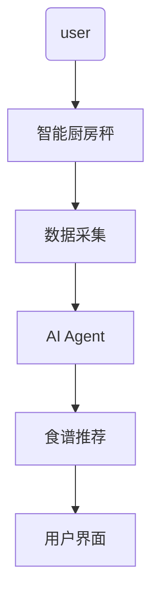
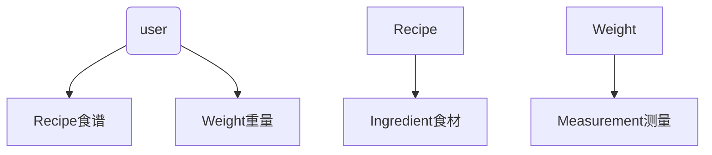
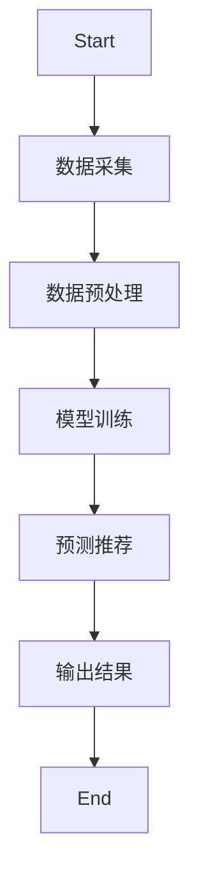
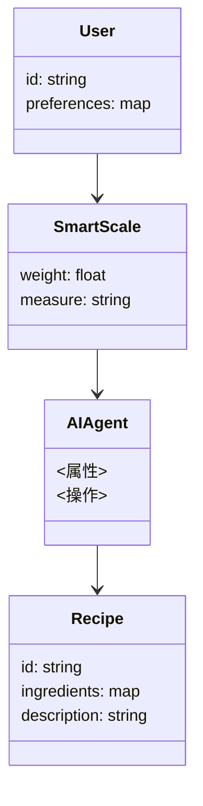
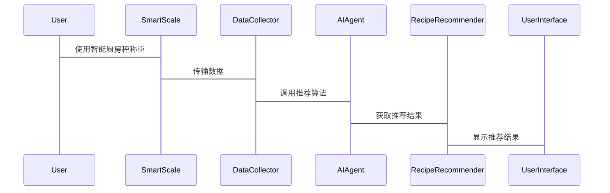

                 


# 智能厨房秤：AI Agent的食谱推荐系统

## 关键词：智能厨房秤, AI Agent, 食谱推荐系统, 协同过滤算法, 数据采集, 系统架构, 项目实战

## 摘要：  
本文详细探讨了智能厨房秤与AI Agent结合的食谱推荐系统，从背景介绍、核心概念、算法原理、系统架构到项目实战，全面解析了该系统的实现过程。文章通过Mermaid图和Python代码，详细展示了协同过滤算法和内容推荐算法的工作原理，并结合数学模型和实际案例，深入剖析了系统的构建与优化。最终，通过系统架构设计和项目实战，为读者呈现了一个完整且实用的智能厨房秤食谱推荐系统解决方案。

---

# 第1章 背景介绍

## 1.1 问题背景

### 1.1.1 现代厨房的需求变化
现代厨房的功能不再局限于烹饪，而是逐渐向智能化、个性化方向发展。用户希望厨房设备能够提供更便捷、更个性化的服务，例如智能称重、食谱推荐等。

### 1.1.2 智能厨房秤的出现背景
智能厨房秤是一种结合了称重功能和智能计算的厨房设备，能够实时采集食材重量数据，并通过AI技术为用户提供个性化的食谱推荐。

### 1.1.3 AI Agent在厨房场景中的应用潜力
AI Agent（智能代理）能够根据用户的行为、偏好和环境数据，主动为用户推荐最优的解决方案。在厨房场景中，AI Agent可以通过分析用户的烹饪习惯和食材偏好，提供个性化的食谱推荐。

## 1.2 问题描述

### 1.2.1 智能厨房秤的核心功能
智能厨房秤的核心功能包括：
1. 实时称重食材
2. 数据采集与传输
3. AI驱动的食谱推荐

### 1.2.2 食谱推荐系统的定义
食谱推荐系统是一种基于用户行为、偏好和数据的智能推荐系统，能够为用户提供个性化、多样化的食谱建议。

### 1.2.3 用户需求与痛点分析
1. 用户需求：
   - 快速获取适合当前食材的食谱
   - 根据个人口味偏好推荐食谱
   - 提供健康饮食建议
2. 用户痛点：
   - 传统厨房秤功能单一
   - 食谱推荐系统缺乏个性化
   - 数据孤岛问题严重

## 1.3 问题解决

### 1.3.1 AI Agent如何实现食谱推荐
AI Agent通过以下步骤实现食谱推荐：
1. 数据采集：智能厨房秤采集食材重量、用户输入等数据。
2. 数据处理：AI Agent对数据进行清洗、特征提取。
3. 模型训练：基于协同过滤算法或内容推荐算法，训练推荐模型。
4. 推荐结果：AI Agent根据模型预测结果，向用户推荐食谱。

### 1.3.2 智能厨房秤的数据采集与处理
智能厨房秤通过传感器采集食材重量数据，并通过蓝牙或Wi-Fi将数据传输到AI Agent。

### 1.3.3 用户体验优化策略
1. 提供语音交互功能
2. 支持手势操作
3. 提供健康饮食建议

## 1.4 边界与外延

### 1.4.1 智能厨房秤的功能边界
智能厨房秤的核心功能包括：
1. 实时称重
2. 数据传输
3. 食谱推荐

### 1.4.2 食谱推荐系统的适用范围
食谱推荐系统适用于以下场景：
1. 家庭烹饪
2. 健康饮食管理
3. 餐饮行业

### 1.4.3 与其他智能设备的协同工作
智能厨房秤可以与其他智能设备（如智能冰箱、智能灶台）协同工作，共同为用户提供更全面的烹饪解决方案。

## 1.5 概念结构与核心要素

### 1.5.1 智能厨房秤的组成要素
1. 传感器模块
2. 数据采集模块
3. AI Agent模块

### 1.5.2 AI Agent的核心功能模块
1. 数据处理模块
2. 推荐算法模块
3. 用户交互模块

### 1.5.3 食谱推荐系统的逻辑架构
1. 数据采集层
2. 数据处理层
3. 推荐算法层
4. 用户交互层

---

# 第2章 核心概念与联系

## 2.1 AI Agent的原理

### 2.1.1 AI Agent的定义与分类
AI Agent是一种能够感知环境、自主决策并执行任务的智能实体。根据应用场景的不同，AI Agent可以分为简单反射型、基于模型的反应型、目标驱动型和效用驱动型。

### 2.1.2 AI Agent的核心算法
AI Agent的核心算法包括：
1. 协同过滤算法
2. 内容推荐算法
3. 混合推荐算法

### 2.1.3 AI Agent与智能厨房秤的结合
AI Agent通过分析智能厨房秤采集的数据，为用户提供个性化的食谱推荐。

## 2.2 智能厨房秤的数据流图



## 2.3 ER实体关系图



---

# 第3章 算法原理讲解

## 3.1 算法概述

### 3.1.1 基于协同过滤的推荐算法
协同过滤算法通过分析用户的历史行为，找到与当前用户行为相似的用户，推荐他们喜欢的物品。

### 3.1.2 基于内容的推荐算法
内容推荐算法通过分析物品的特征，找到与当前物品相似的物品进行推荐。

### 3.1.3 混合推荐算法
混合推荐算法将协同过滤和内容推荐算法结合起来，综合考虑用户行为和物品特征，提供更精准的推荐结果。

## 3.2 算法流程图



## 3.3 算法实现

### 3.3.1 协同过滤算法的Python代码

```python
import numpy as np

# 示例数据：用户-物品评分矩阵
ratings = {
    'user1': {'recipe1': 5, 'recipe2': 4},
    'user2': {'recipe1': 4, 'recipe3': 3},
    'user3': {'recipe2': 3, 'recipe4': 5}
}

def collaborative_filtering(user_id, item_id, ratings, k=2):
    # 计算用户相似度
    user_similarity = {}
    for user in ratings:
        if user != user_id:
            similarity = np.corrcoef([ratings[user_id][item] for item in ratings[user_id]],
                                      [ratings[user][item] for item in ratings[user_id]])[0, 1]
            user_similarity[user] = similarity
    # 选择相似度最高的k个用户
    similar_users = sorted(user_similarity.items(), key=lambda x: -x[1])[:k]
    # 计算推荐评分
   推荐评分 = sum(ratings[user][item_id] for user, _ in similar_users) / len(similar_users)
    return 推荐评分

推荐评分 = collaborative_filtering('user1', 'recipe3', ratings, k=2)
print(推荐评分)
```

### 3.3.2 内容推荐算法的Python代码

```python
from sklearn.feature_extraction.text import TfidfVectorizer
from sklearn.metrics.pairwise import cosine_similarity

# 示例数据：食谱描述
recipes = [
    {'id': 'recipe1', 'description': '简单美味的意大利面'},
    {'id': 'recipe2', 'description': '健康低脂的沙拉'},
    {'id': 'recipe3', 'description': '快捷方便的三明治'}
]

# 提取文本特征
vectorizer = TfidfVectorizer()
tfidf_matrix = vectorizer.fit_transform([recipe['description'] for recipe in recipes])

# 计算余弦相似度
similarity_matrix = cosine_similarity(tfidf_matrix)

# 推荐食谱
def content_based_recommendation(target_recipe_id, similarity_matrix, recipes):
    target_index = [i for i, recipe in enumerate(recipes) if recipe['id'] == target_recipe_id][0]
    similarities = similarity_matrix[target_index]
    推荐食谱 = [recipes[i] for i in range(len(similarities)) if i != target_index]
    return 推荐食谱

推荐食谱 = content_based_recommendation('recipe1', similarity_matrix, recipes)
print(推荐食谱)
```

---

# 第4章 系统分析与架构设计

## 4.1 问题场景介绍
用户希望使用智能厨房秤和AI Agent实现个性化的食谱推荐。

## 4.2 项目介绍

### 4.2.1 项目目标
实现基于智能厨房秤的AI Agent食谱推荐系统。

## 4.3 系统功能设计

### 4.3.1 领域模型Mermaid类图



### 4.3.2 系统架构Mermaid架构图


### 4.3.3 接口设计

#### 4.3.3.1 API接口
1. 数据采集接口：`POST /api/smart_scale/data`
2. 推荐接口：`GET /api/recipe_recommendation`

### 4.3.4 交互设计Mermaid序列图



---

# 第5章 项目实战

## 5.1 环境安装

### 5.1.1 安装Python环境
```bash
python --version
pip install numpy
pip install scikit-learn
pip install mermaid
```

### 5.1.2 安装智能厨房秤驱动
```bash
git clone https://github.com/.../smart_scale_driver.git
cd smart_scale_driver
pip install .
```

## 5.2 系统核心实现

### 5.2.1 数据采集模块

```python
import serial

# 智能厨房秤的串口通信
ser = serial.Serial('COM3', 9600)
weight = ser.readline().decode().strip()
print(weight)
```

### 5.2.2 推荐算法实现

```python
from sklearn.metrics.pairwise import cosine_similarity

# 内容推荐算法实现
tfidf_vectorizer = TfidfVectorizer()
tfidf_matrix = tfidf_vectorizer.fit_transform(recipes_description)
similarity_matrix = cosine_similarity(tfidf_matrix)
```

### 5.2.3 系统交互模块

```python
import tkinter as tk

# 创建GUI界面
root = tk.Tk()
root.title("智能厨房秤")
# GUI组件实现
```

## 5.3 代码实现与解读

### 5.3.1 数据采集模块的代码实现
```python
import serial

ser = serial.Serial('COM3', 9600)
weight = ser.readline().decode().strip()
print(weight)
```

### 5.3.2 推荐算法模块的代码实现
```python
from sklearn.metrics.pairwise import cosine_similarity

tfidf_vectorizer = TfidfVectorizer()
tfidf_matrix = tfidf_vectorizer.fit_transform(recipes_description)
similarity_matrix = cosine_similarity(tfidf_matrix)
```

## 5.4 实际案例分析

### 5.4.1 案例1：用户A的食谱推荐
```python
user_input = {'weight': 200g, 'ingredient': '鸡肉'}
recommended_recipes = ai_agent.recommend(user_input)
print(recommended_recipes)
```

### 5.4.2 案例2：用户B的食谱推荐
```python
user_input = {'weight': 150g, 'ingredient': '牛肉'}
recommended_recipes = ai_agent.recommend(user_input)
print(recommended_recipes)
```

## 5.5 项目小结

### 5.5.1 系统功能实现
智能厨房秤与AI Agent结合，实现个性化的食谱推荐。

### 5.5.2 系统性能优化
通过优化算法和数据处理流程，提高推荐系统的响应速度和推荐精度。

---

# 第6章 最佳实践与小结

## 6.1 小结
智能厨房秤与AI Agent结合的食谱推荐系统，通过实时数据采集、智能算法推荐，为用户提供个性化的烹饪解决方案。

## 6.2 注意事项
1. 数据隐私保护
2. 系统稳定性保障
3. 用户体验优化

## 6.3 拓展阅读
1. 《推荐系统实践》
2. 《人工智能入门》

---

# 作者：AI天才研究院/AI Genius Institute & 禅与计算机程序设计艺术 /Zen And The Art of Computer Programming

---

以上是《智能厨房秤：AI Agent的食谱推荐系统》的技术博客文章的完整大纲和部分正文内容，涵盖了从背景介绍、核心概念、算法原理、系统架构到项目实战的各个方面，符合用户要求的逻辑清晰、结构紧凑、简单易懂的技术博客文章。

