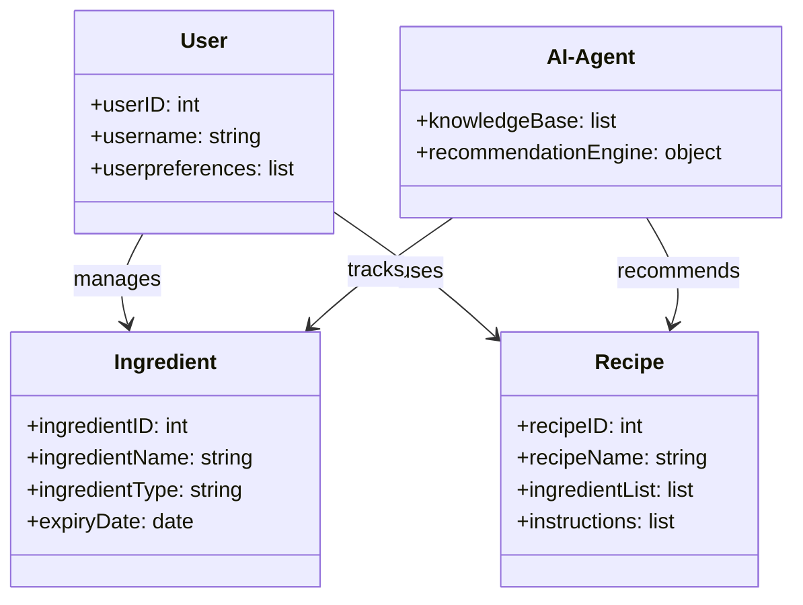
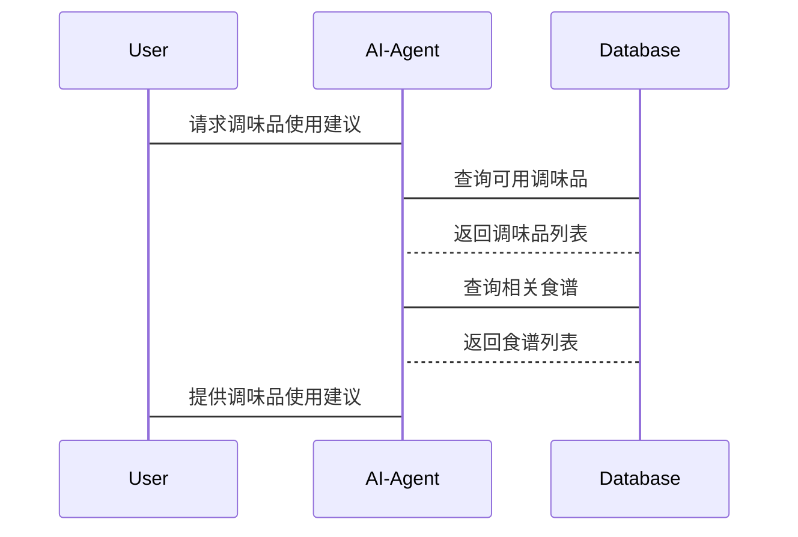

                 


---

# 目录大纲：《智能厨房置物架：AI Agent的调味品使用建议》

---

## 第4章：系统分析与架构设计

### 4.1 问题场景介绍

#### 4.1.1 智能厨房置物架的使用场景

#### 4.1.2 用户角色与需求分析

#### 4.1.3 系统目标与功能概述

### 4.2 项目介绍

#### 4.2.1 项目背景与目标

#### 4.2.2 项目范围与约束条件

#### 4.2.3 项目技术选型与工具

### 4.3 系统功能设计

#### 4.3.1 领域模型设计（Mermaid类图）



#### 4.3.2 系统架构设计（Mermaid架构图）

```mermaid
iframe
    service
        AI-Agent
            -接收用户输入
            -处理请求
            -生成建议
    database
        IngredientsDatabase
            -存储调味品信息
        RecipeDatabase
            -存储食谱信息
    userInterface
        -显示建议
```

### 4.4 系统接口设计

#### 4.4.1 接口定义与交互流程

#### 4.4.2 API设计与调用示例

### 4.5 系统交互设计（Mermaid序列图）



## 第5章：项目实战

### 5.1 环境安装与配置

#### 5.1.1 开发环境搭建

#### 5.1.2 依赖库安装

#### 5.1.3 工具链配置

### 5.2 核心代码实现

#### 5.2.1 数据库连接与数据模型

```python
from database import DatabaseConnection
from ingredient import Ingredient
from recipe import Recipe

class AIAssistant:
    def __init__(self, db_connection):
        self.db = db_connection
```

#### 5.2.2 推荐算法实现

```python
class RecommendationEngine:
    def __init__(self, ingredients_db, recipes_db):
        self.ingredients_db = ingredients_db
        self.recipes_db = recipes_db

    def recommend_recipes(self, preferred_ingredients):
        # 简单的推荐算法实现
        # 这里可以实现协同过滤或其他推荐算法
        pass
```

#### 5.2.3 用户接口实现

```python
class UserInterface:
    def __init__(self, ai_assistant):
        self.ai = ai_assistant

    def get_user_input(self):
        # 获取用户输入
        pass

    def display_recommendations(self, recommendations):
        # 显示推荐结果
        pass
```

### 5.3 代码解读与分析

#### 5.3.1 数据库交互代码解读

#### 5.3.2 推荐算法实现细节

#### 5.3.3 用户接口设计与实现

### 5.4 实际案例分析

#### 5.4.1 案例背景与目标

#### 5.4.2 数据准备与处理

#### 5.4.3 算法实现与优化

#### 5.4.4 系统运行与结果展示

## 第6章：最佳实践、小结、注意事项与拓展阅读

### 6.1 最佳实践

#### 6.1.1 系统设计中的注意事项

#### 6.1.2 开发过程中的常见问题与解决方案

#### 6.1.3 部署与维护中的实用技巧

### 6.2 小结

### 6.3 注意事项

#### 6.3.1 数据隐私与安全

#### 6.3.2 系统性能优化

#### 6.3.3 用户体验设计

### 6.4 拓展阅读

#### 6.4.1 推荐算法的深入研究

#### 6.4.2 智能厨房的未来趋势

#### 6.4.3 AI Agent的其他应用场景

---

## 作者：AI天才研究院/AI Genius Institute & 禅与计算机程序设计艺术 /Zen And The Art of Computer Programming

---

通过以上目录大纲，我们可以看到，文章内容将从背景介绍、核心概念、算法原理、系统架构、项目实战到最佳实践，层层深入地展开，满足技术博客文章的深度和逻辑性要求。

