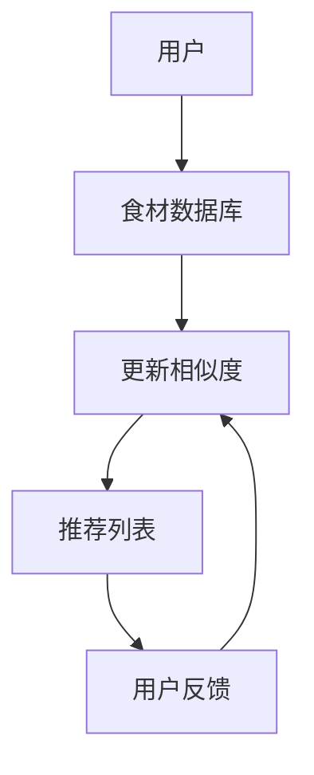
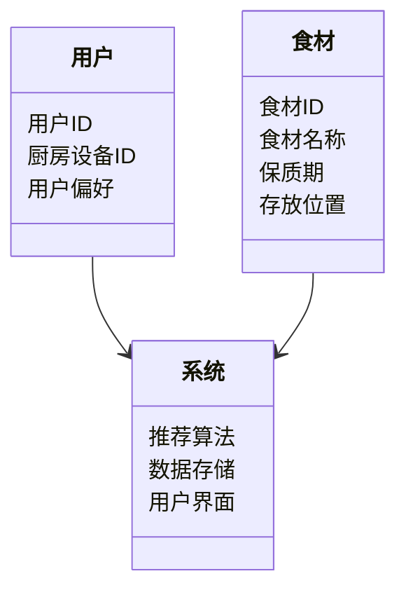

                 


# 智能厨房置物架：AI Agent的食材使用优化

> **关键词**: AI Agent, 智能厨房, 食材管理, 协同过滤, 系统架构, 项目实战

> **摘要**: 本文探讨AI Agent在智能厨房置物架中的应用，详细介绍食材管理的优化方案，从背景分析到系统设计，再到项目实战，全面解析AI Agent如何提升食材使用效率，减少浪费，实现智能化管理。

---

## 第一部分: 智能厨房置物架的背景与概念

### 第1章: 问题背景与描述

#### 1.1 问题背景

厨房是家庭生活中最常用的场所之一，但食材管理却常常面临诸多挑战。传统厨房置物架往往无法高效利用空间，导致食材存放混乱，容易浪费。同时，用户在使用食材时，常常难以快速找到所需物品，影响烹饪效率。此外，食材的保质期管理也是一个难题，过期食品可能导致健康问题或经济损失。

#### 1.2 问题描述

- **食材浪费**：食材存放不当或过期导致浪费，增加了经济负担和环境压力。
- **空间利用低效**：置物架设计不合理，导致空间浪费，取用不便。
- **管理复杂**：缺乏智能化管理工具，用户难以实时掌握食材库存情况。

#### 1.3 问题解决思路

引入AI Agent，通过智能化管理优化食材使用。AI Agent能够实时监测食材库存，推荐使用即将过期的食材，提供合理的存放建议，并根据用户习惯推荐食谱，提升管理效率。

#### 1.4 边界与外延

- **边界**：仅关注厨房置物架上的食材管理，不涉及其他厨房设备。
- **外延**：扩展到家庭智能化管理，与其他智能家居设备联动。

---

## 第二部分: AI Agent的核心原理与实现

### 第2章: AI Agent的核心原理

#### 2.1 AI Agent的基本原理

AI Agent通过感知环境、处理信息、做出决策来执行任务。在食材管理中，AI Agent通过传感器收集食材信息，分析用户行为，优化存储和使用策略。

#### 2.2 AI Agent与食材管理的结合

AI Agent通过协同过滤算法推荐食材使用，优化库存管理，提升用户体验。

#### 2.3 AI Agent的核心算法实现

**协同过滤推荐算法**：

**流程图**:



**代码实现**:

```python
def compute_similarity(user, item):
    # 计算用户与项目的相似度
    pass

def recommend(user_id):
    # 找出与用户相似的其他用户的偏好
    similar_users = find_similar_users(user_id)
    recommended_items = []
    for user in similar_users:
        recommended_items.extend(users[user]['preferences'])
    return recommended_items
```

**数学公式**:

相似度计算公式：
$$\text{similarity}(u, i) = \frac{\sum_{k \in K} (r_{u,k} - \bar{r}_u)(r_{\bar{i},k} - \bar{r}_i)}{\sqrt{\sum_{k \in K} (r_{u,k} - \bar{r}_u)^2} \sqrt{\sum_{k \in K} (r_{\bar{i},k} - \bar{r}_i)^2}}}$$

---

### 第3章: 核心概念与联系

#### 3.1 核心概念的原理分析

AI Agent通过感知环境和用户行为，优化食材管理。系统采集食材信息，分析用户需求，提供个性化推荐。

#### 3.2 核心概念的特征对比

**特征对比表**:

| 特征       | 协同过滤 | 基于内容的推荐 |
|------------|----------|----------------|
| 数据依赖   | 用户行为 | 食材属性        |
| 计算复杂度 | 较高     | 较低           |
| 个性化     | 高       | 高             |

---

## 第三部分: 系统分析与架构设计

### 第3章: 系统分析与架构设计

#### 3.1 问题场景介绍

系统需要实时采集食材信息，分析用户行为，推荐使用方案，并提供交互界面。

#### 3.2 项目介绍

**系统功能设计**:



**系统架构设计**:


**系统接口设计**:

- **数据采集模块**：通过传感器采集食材信息。
- **数据处理模块**：处理食材数据，更新数据库。
- **算法推荐模块**：根据用户行为推荐食材。
- **用户界面模块**：展示推荐结果，用户操作反馈。

---

## 第四部分: 项目实战

### 第4章: 项目实战

#### 4.1 环境安装

安装Python和相关库（如numpy, pandas, scikit-learn）。

#### 4.2 核心代码实现

```python
import numpy as np
from sklearn.metrics.pairwise import cosine_similarity

class AI_Agent:
    def __init__(self):
        self.user_profiles = {}

    def add_user(self, user_id):
        self.user_profiles[user_id] = {'preferences': {}, 'feedback': {}}

    def update_preference(self, user_id, item_id, preference):
        self.user_profiles[user_id]['preferences'][item_id] = preference

    def get_recommendations(self, user_id):
        user = self.user_profiles[user_id]
        similar_users = self.find_similar_users(user_id)
        recommendations = set()
        for u in similar_users:
            recommendations.update(self.user_profiles[u]['preferences'].keys())
        return list(recommendations)

    def find_similar_users(self, user_id):
        user_vector = self.create_user_vector(user_id)
        similarities = {}
        for u in self.user_profiles:
            if u != user_id:
                similarities[u] = cosine_similarity(user_vector, self.create_user_vector(u))
        return sorted(similarities.items(), key=lambda x: x[1], reverse=True)[:5]

    def create_user_vector(self, user_id):
        user = self.user_profiles[user_id]
        items = list(user['preferences'].keys())
        return np.array([user['preferences'][i] for i in items])
```

#### 4.3 项目小结

通过实际案例分析，AI Agent能够有效优化食材使用，减少浪费，提升管理效率。

---

## 第五部分: 最佳实践

### 第5章: 最佳实践

#### 5.1 小结

本文详细介绍了AI Agent在智能厨房置物架中的应用，从背景分析到系统设计，再到项目实现，全面解析了优化方案。

#### 5.2 注意事项

- 数据隐私保护
- 系统维护与更新
- 用户体验优化

#### 5.3 拓展阅读

- 探索更多AI算法在厨房管理中的应用
- 研究智能家居设备的联动优化

---

## 作者

**作者：AI天才研究院/AI Genius Institute & 禅与计算机程序设计艺术 /Zen And The Art of Computer Programming**

---

**全文完**

