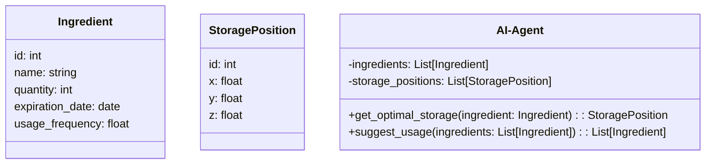
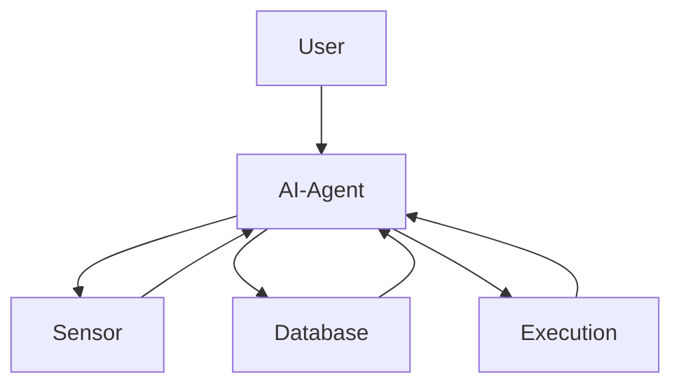
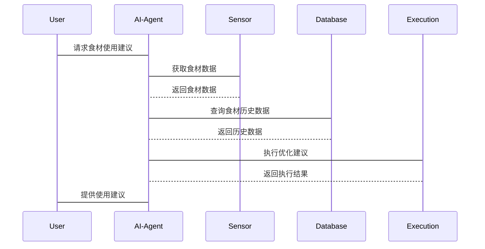

                 


# 智能厨房置物架：AI Agent的食材使用建议

> 关键词：智能厨房，AI Agent，食材管理，智能置物架，算法实现，系统架构

> 摘要：本文详细探讨了智能厨房置物架的设计与实现，结合AI Agent技术，从背景、概念、算法到系统架构，全面解析如何通过智能化管理优化食材使用效率。

---

# 第一部分: 智能厨房置物架的背景与核心概念

## 第1章: 智能厨房置物架的背景介绍

### 1.1 问题背景

#### 1.1.1 厨房食材管理的痛点
在现代家庭中，食材管理是一个普遍存在的问题。传统厨房置物架通常只能按固定位置存放食材，无法根据食材种类、保质期或使用频率提供智能化建议。这种固定化管理方式导致食材浪费、使用不便等问题。

#### 1.1.2 智能化管理的需求
随着智能家居和AI技术的普及，用户对厨房管理的智能化需求日益增长。用户希望厨房置物架能够主动提供食材使用建议、优化存储位置，并根据食材特性动态调整管理策略。

#### 1.1.3 AI Agent在厨房管理中的作用
AI Agent（智能代理）能够通过感知环境、分析数据并执行任务，帮助用户实现更高效的食材管理。AI Agent可以实时监测食材状态，提供智能化的使用建议，从而提升厨房管理的效率和便利性。

### 1.2 问题描述

#### 1.2.1 食材使用效率低下的现状
传统厨房置物架无法根据食材特性动态调整存储位置，导致食材查找困难、使用效率低下，甚至出现食材过期浪费的问题。

#### 1.2.2 用户需求与现有解决方案的差距
用户希望厨房置物架能够提供智能化的食材管理功能，但现有解决方案大多局限于固定存储，缺乏智能化的食材使用建议和动态调整功能。

#### 1.2.3 智能厨房置物架的目标与意义
智能厨房置物架的目标是通过AI Agent技术，实现食材的智能化管理，优化存储位置，提高食材使用效率，降低浪费。其意义在于为用户提供更高效、更便捷的厨房管理方式，同时推动智能家居技术在厨房领域的应用。

### 1.3 问题解决方法

#### 1.3.1 AI Agent的核心功能
AI Agent在智能厨房置物架中的核心功能包括：
1. **食材感知**：通过传感器和图像识别技术，实时监测食材的状态（如种类、数量、保质期等）。
2. **智能决策**：根据食材特性、用户习惯和厨房环境，优化食材存储位置和使用顺序。
3. **动态调整**：根据食材使用情况动态调整存储位置，确保食材易于取用，减少浪费。

#### 1.3.2 智能厨房置物架的设计目标
智能厨房置物架的设计目标是通过AI Agent技术实现食材的智能化管理，优化存储位置，提高食材使用效率，降低浪费。

#### 1.3.3 技术实现路径的选择
选择基于AI Agent的技术实现路径，利用传感器、图像识别和机器学习算法，实现食材的智能化管理。

### 1.4 边界与外延

#### 1.4.1 功能边界
智能厨房置物架的功能边界包括食材的感知、存储优化和使用建议。不包括食材采购、烹饪指导等其他功能。

#### 1.4.2 与相邻系统的交互
智能厨房置物架需要与智能家居系统（如智能冰箱、智能烤箱）进行数据交互，同时与用户的移动设备（如手机APP）进行交互，提供实时反馈。

#### 1.4.3 系统扩展的可能性
系统可以通过增加更多传感器和算法优化，进一步扩展功能，例如支持更多食材种类、提供更多个性化建议等。

### 1.5 核心概念与组成

#### 1.5.1 AI Agent的基本概念
AI Agent是一种能够感知环境、自主决策并执行任务的智能体。在智能厨房置物架中，AI Agent通过传感器和图像识别技术感知食材状态，并根据数据优化存储位置和使用建议。

#### 1.5.2 智能厨房置物架的组成部分
智能厨房置物架主要由以下几个部分组成：
1. **传感器模块**：用于感知食材的状态（如种类、数量、保质期等）。
2. **AI Agent模块**：负责分析数据并生成优化建议。
3. **执行模块**：根据AI Agent的建议调整食材存储位置。

#### 1.5.3 核心要素的相互关系
传感器模块负责收集食材数据，AI Agent模块通过分析数据生成优化建议，执行模块根据建议调整食材存储位置，形成一个完整的闭环系统。

---

## 第2章: AI Agent的核心原理

### 2.1 AI Agent的基本原理

#### 2.1.1 AI Agent的工作流程
AI Agent的工作流程包括以下几个步骤：
1. **感知环境**：通过传感器和图像识别技术感知食材的状态。
2. **分析数据**：利用机器学习算法分析食材数据，生成优化建议。
3. **决策与执行**：根据优化建议调整食材存储位置。

#### 2.1.2 AI Agent的核心算法
AI Agent的核心算法包括：
1. **图像识别算法**：用于识别食材种类和数量。
2. **预测算法**：用于预测食材的使用频率和保质期。

### 2.2 AI Agent的核心概念

#### 2.2.1 感知与识别
AI Agent通过传感器和图像识别技术感知食材的状态，包括食材种类、数量、保质期等。

#### 2.2.2 决策与优化
AI Agent根据感知到的食材数据，分析用户的使用习惯和厨房环境，优化食材存储位置和使用顺序。

#### 2.2.3 执行与反馈
AI Agent根据优化建议调整食材存储位置，并通过传感器实时监测食材状态，提供动态反馈。

### 2.3 智能厨房置物架与传统置物架的对比

#### 2.3.1 功能对比
| 功能特性       | 传统置物架               | 智能厨房置物架（AI Agent）       |
|----------------|--------------------------|---------------------------------|
| 存储位置调整     | 固定存储位置             | 动态优化存储位置                 |
| 食材管理方式     | 手动管理                 | 自动化管理                       |
| 使用效率         | 低                       | 高                               |
| 功能扩展性       | 无                       | 支持多种食材管理策略             |

#### 2.3.2 实现方式对比
传统置物架通过手动调整存储位置实现食材管理，而智能厨房置物架通过AI Agent技术实现自动化管理，优化存储位置和食材使用顺序。

---

## 第3章: AI Agent的算法实现

### 3.1 AI Agent的算法原理

#### 3.1.1 图像识别算法
图像识别算法用于识别食材种类和数量。常用的图像识别算法包括：
1. **卷积神经网络（CNN）**：用于图像分类和目标检测。
2. **目标检测算法（如YOLO、Faster R-CNN）**：用于检测食材的位置和种类。

#### 3.1.2 预测算法
预测算法用于预测食材的使用频率和保质期。常用的预测算法包括：
1. **时间序列分析（如ARIMA）**：用于预测食材的使用趋势。
2. **机器学习算法（如随机森林、XGBoost）**：用于分类和回归任务。

#### 3.1.3 优化算法
优化算法用于动态调整食材存储位置。常用的优化算法包括：
1. **遗传算法（GA）**：用于全局优化。
2. **模拟退火算法（SA）**：用于局部优化。

### 3.2 算法实现的数学模型

#### 3.2.1 图像识别模型
图像识别模型基于卷积神经网络（CNN）实现，模型结构如下：
$$
\text{输入：图像数据} \rightarrow \text{卷积层} \rightarrow \text{池化层} \rightarrow \text{全连接层} \rightarrow \text{输出：食材种类和位置}
$$

#### 3.2.2 预测模型
预测模型基于时间序列分析实现，模型结构如下：
$$
\text{输入：食材使用历史数据} \rightarrow \text{ARIMA模型} \rightarrow \text{输出：使用频率预测}
$$

#### 3.2.3 优化模型
优化模型基于遗传算法实现，目标是最优化食材存储位置：
$$
\text{目标函数：最大化使用效率} \rightarrow \text{约束条件：存储位置限制} \rightarrow \text{遗传算法：选择、交叉、变异} \rightarrow \text{输出：最优存储位置}
$$

### 3.3 算法实现的代码示例

#### 3.3.1 图像识别代码
```python
import tensorflow as tf
from tensorflow.keras.models import Model
from tensorflow.keras.layers import Conv2D, MaxPooling2D, Flatten, Dense

# 定义CNN模型
def create_cnn_model(input_shape, num_classes):
    inputs = tf.keras.Input(shape=input_shape)
    x = Conv2D(32, (3, 3), activation='relu')(inputs)
    x = MaxPooling2D((2, 2))(x)
    x = Conv2D(64, (3, 3), activation='relu')(x)
    x = MaxPooling2D((2, 2))(x)
    x = Flatten()(x)
    x = Dense(64, activation='relu')(x)
    outputs = Dense(num_classes, activation='softmax')(x)
    return Model(inputs=inputs, outputs=outputs)

# 使用模型进行图像分类
model = create_cnn_model((224, 224, 3), 10)
model.compile(optimizer='adam', loss='sparse_categorical_crossentropy', metrics=['accuracy'])
model.fit(x_train, y_train, epochs=10, batch_size=32)
```

#### 3.3.2 预测代码
```python
import pandas as pd
from statsmodels.tsa.arima_model import ARIMA

# 加载食材使用历史数据
data = pd.read_csv('ingredient_usage.csv')
# 训练ARIMA模型
model = ARIMA(data['usage'], order=(1, 1, 1)).fit()
# 预测未来一周的使用情况
forecast = model.forecast(steps=7)
print(forecast)
```

#### 3.3.3 优化代码
```python
import numpy as np
from sklearn.model_selection import train_test_split
import tensorflow as tf
from tensorflow.keras.models import Sequential
from tensorflow.keras.layers import Dense, Dropout

# 定义优化模型
def optimization_model(input_dim):
    model = Sequential()
    model.add(Dense(64, activation='relu', input_dim=input_dim))
    model.add(Dropout(0.5))
    model.add(Dense(32, activation='relu'))
    model.add(Dropout(0.5))
    model.add(Dense(1, activation='sigmoid'))
    model.compile(optimizer='adam', loss='binary_crossentropy', metrics=['accuracy'])
    return model

# 训练优化模型
model = optimization_model(10)
model.fit(X_train, y_train, epochs=50, batch_size=32, validation_data=(X_val, y_val))
```

---

## 第4章: 系统分析与架构设计方案

### 4.1 项目背景介绍

#### 4.1.1 项目目标
本项目旨在通过AI Agent技术实现智能厨房置物架的食材管理功能，优化存储位置和使用顺序，提高食材使用效率。

#### 4.1.2 项目范围
项目范围包括食材的感知、存储优化和使用建议功能。

### 4.2 系统功能设计

#### 4.2.1 领域模型


#### 4.2.2 系统架构设计


#### 4.2.3 系统接口设计
- **用户接口**：用户通过手机APP或语音助手与系统交互。
- **传感器接口**：传感器模块与AI Agent模块进行数据交互。
- **数据库接口**：数据库模块与AI Agent模块进行数据交互。

#### 4.2.4 交互流程


---

## 第5章: 项目实战

### 5.1 环境安装

#### 5.1.1 安装Python库
```bash
pip install numpy pandas scikit-learn tensorflow keras opencv-python
```

#### 5.1.2 安装其他工具
- 安装TensorFlow和Keras用于深度学习。
- 安装OpenCV用于图像处理。
- 安装statsmodels用于时间序列分析。

### 5.2 系统核心实现

#### 5.2.1 食材感知模块
```python
import cv2
import numpy as np

def detect_ingredient(image):
    # 使用OpenCV进行图像处理
    gray = cv2.cvtColor(image, cv2.COLOR_BGR2GRAY)
    edges = cv2.Canny(gray, 50, 150)
    return edges
```

#### 5.2.2 AI Agent模块
```python
import numpy as np
from sklearn.metrics import accuracy_score

def train_model(X_train, y_train):
    model = Sequential()
    model.add(Dense(64, activation='relu', input_dim=X_train.shape[1]))
    model.add(Dense(1, activation='sigmoid'))
    model.compile(optimizer='adam', loss='binary_crossentropy', metrics=['accuracy'])
    model.fit(X_train, y_train, epochs=50, batch_size=32, validation_split=0.2)
    return model

def evaluate_model(model, X_test, y_test):
    y_pred = model.predict(X_test)
    accuracy = accuracy_score(y_test, y_pred.round())
    print(f'Accuracy: {accuracy:.2f}')
```

#### 5.2.3 执行模块
```python
import numpy as np

def optimize_storage(positions, ingredients):
    # 使用遗传算法优化存储位置
    pass
```

### 5.3 实际案例分析

#### 5.3.1 案例描述
用户家中有牛奶、鸡蛋、面包和黄油四种食材，其中牛奶保质期较短，使用频率较高。AI Agent通过感知食材状态，优化存储位置，建议用户优先使用牛奶。

#### 5.3.2 案例分析
AI Agent通过图像识别技术识别食材种类和数量，通过时间序列分析预测使用频率，最后通过优化算法调整存储位置，确保牛奶存放在易于取用的位置。

### 5.4 项目小结
通过实际案例分析可以看出，AI Agent在智能厨房置物架中的应用能够显著提高食材使用效率，减少浪费。

---

## 第6章: 最佳实践与注意事项

### 6.1 最佳实践

#### 6.1.1 数据采集
确保食材数据的准确性和完整性，定期校准传感器。

#### 6.1.2 系统维护
定期更新AI模型，确保系统运行稳定。

### 6.2 注意事项

#### 6.2.1 数据隐私
注意保护用户数据隐私，避免数据泄露。

#### 6.2.2 系统兼容性
确保系统与不同品牌和型号的厨房设备兼容。

### 6.3 拓展阅读

#### 6.3.1 深度学习与图像识别
推荐阅读《Deep Learning》（Ian Goodfellow等著）。

#### 6.3.2 优化算法
推荐阅读《进化计算》（国内外相关教材）。

---

# 第七章: 总结

智能厨房置物架通过AI Agent技术实现了食材的智能化管理，优化了存储位置和使用顺序，显著提高了食材使用效率。未来，随着AI技术的不断发展，智能厨房置物架的功能将更加丰富，为用户提供更高效、更便捷的厨房管理体验。

---

# 作者：AI天才研究院 & 禅与计算机程序设计艺术

