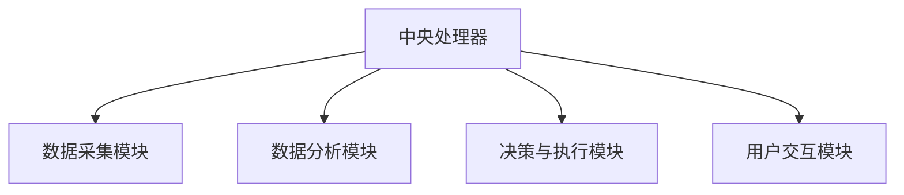
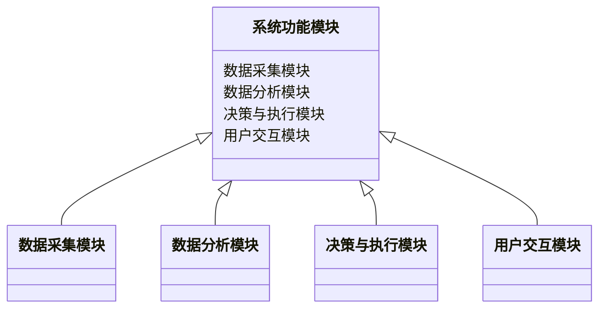
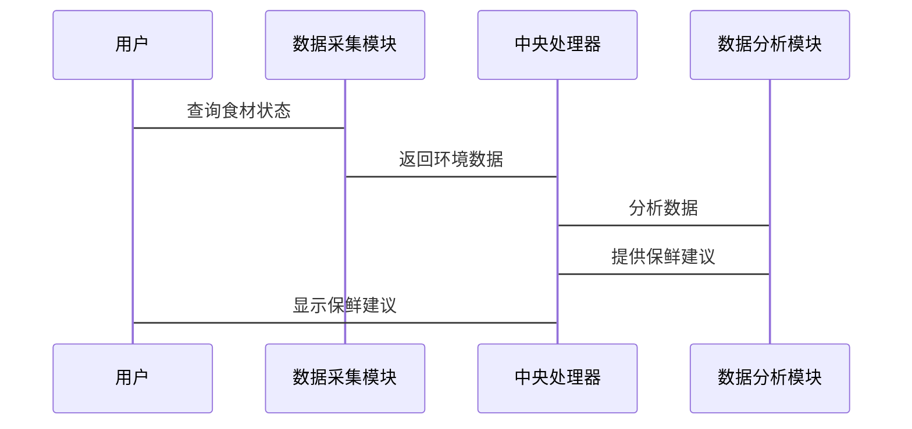
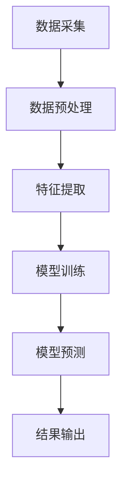

                 


# 智能厨房置物架：AI Agent的食材保鲜监控

## 关键词：智能厨房置物架，AI Agent，食材保鲜，环境监控，物联网，机器学习

## 摘要：  
本文详细探讨了智能厨房置物架在食材保鲜监控中的应用，介绍了AI Agent在其中的核心作用。通过分析食材保鲜的关键因素，提出了基于AI Agent的智能监控系统，并从系统架构、算法原理、项目实现等方面进行了深入探讨。文章还结合实际案例，展示了如何通过物联网技术和机器学习算法实现食材保鲜的智能化监控，为现代厨房的智能化转型提供了新的思路。

---

# 第一部分: 智能厨房置物架背景与需求

# 第1章: 智能厨房置物架的背景与问题背景

## 1.1 智能厨房置物架的背景

### 1.1.1 厨房食材保鲜的传统方法

传统厨房中，食材保鲜主要依赖于以下方法：
1. **冷藏/冷冻**：通过降低温度延缓食材腐败。
2. **密封保存**：使用密封容器防止空气中的细菌滋生。
3. **化学防腐**：添加防腐剂延长保鲜时间。
4. **湿度控制**：通过调节湿度防止食材干涸或霉变。

### 1.1.2 现代厨房的智能化趋势

随着智能家居的普及，现代厨房逐渐向智能化方向发展。智能设备的应用不仅提升了厨房的使用效率，还带来了更便捷的生活体验。智能厨房置物架作为其中的一员，通过结合物联网技术和人工智能，为食材保鲜提供了新的解决方案。

### 1.1.3 智能厨房置物架的市场需求

随着人们对健康饮食的追求和生活品质的提升，智能厨房置物架的需求日益增长。消费者希望厨房设备能够提供更智能、更高效的食材管理方式，尤其是在保鲜方面。智能厨房置物架通过实时监控食材的存储环境，结合AI技术优化保鲜策略，满足了这一市场需求。

## 1.2 食材保鲜监控的核心问题

### 1.2.1 食材保鲜的关键因素

食材保鲜的关键因素包括：
1. **温度**：不同食材的最佳保存温度不同。
2. **湿度**：过高湿度会导致霉变，过低湿度则会导致干裂。
3. **光照**：光照过长会导致食材氧化。
4. **氧气浓度**：某些食材需要低氧环境以延缓腐败。

### 1.2.2 传统保鲜监控的局限性

传统保鲜监控系统存在以下问题：
1. **被动性**：只能被动响应，无法主动调节环境。
2. **单一性**：只能监测单一因素，缺乏综合分析能力。
3. **维护成本高**：设备复杂，维护成本高，用户体验差。

### 1.2.3 智能监控的必要性

智能监控系统能够实时感知环境变化，主动调整存储条件，从而延长食材保鲜时间。通过AI技术，系统可以学习用户的使用习惯，优化保鲜策略，提升用户体验。

## 1.3 AI Agent在食材保鲜监控中的应用

### 1.3.1 AI Agent的基本概念

AI Agent（智能体）是指具备感知、推理、规划和执行能力的智能系统。它能够根据环境信息做出决策，并通过执行动作影响环境。

### 1.3.2 AI Agent的核心功能

AI Agent在食材保鲜监控中的核心功能包括：
1. **数据采集**：通过传感器获取环境数据。
2. **数据分析**：利用机器学习算法分析数据，识别食材状态。
3. **决策制定**：基于分析结果，制定保鲜策略。
4. **执行操作**：通过执行机构调整存储环境。

### 1.3.3 AI Agent在食材保鲜中的优势

AI Agent的优势在于其智能化和自适应能力。它能够根据环境变化和食材状态实时调整存储条件，实现精准保鲜。此外，AI Agent还能够学习用户的使用习惯，提供个性化的保鲜方案。

## 1.4 本章小结

本章介绍了智能厨房置物架的背景，分析了食材保鲜的核心问题，并探讨了AI Agent在其中的应用。通过对比传统保鲜监控的局限性，突出了智能监控的必要性和优势。

---

# 第二部分: AI Agent与食材保鲜的核心概念

# 第2章: AI Agent的核心概念与原理

## 2.1 AI Agent的定义与分类

### 2.1.1 AI Agent的定义

AI Agent是一种具备感知、推理、规划和执行能力的智能系统。它能够通过传感器获取环境信息，利用算法进行分析，并通过执行机构影响环境。

### 2.1.2 AI Agent的主要分类

AI Agent可以根据功能和应用场景分为以下几类：
1. **反应式AI Agent**：基于当前感知做出即时反应。
2. **认知式AI Agent**：具备复杂推理和规划能力。
3. **协作式AI Agent**：能够与其他智能体协作完成任务。

### 2.1.3 AI Agent与传统自动化的区别

AI Agent与传统自动化的区别在于其智能化和自适应能力。传统自动化系统基于固定规则运行，而AI Agent能够根据环境变化动态调整行为。

## 2.2 AI Agent在食材保鲜中的应用原理

### 2.2.1 数据采集与处理

AI Agent通过传感器采集环境数据，如温度、湿度、光照等。数据采集模块负责将传感器信号转换为数字信号，并传输给中央处理器。

### 2.2.2 数据分析与决策

数据分析模块利用机器学习算法对采集的数据进行分析，识别食材的状态。AI Agent通过推理和规划模块制定保鲜策略，并通过执行模块调整存储环境。

### 2.2.3 执行与反馈

执行模块根据决策结果调整存储环境，如调节温度、湿度等。同时，AI Agent会收集执行后的反馈信息，用于优化未来的决策过程。

## 2.3 核心概念对比表

```mermaid
| 概念               | 描述                                                         |
|--------------------|------------------------------------------------------------|
| AI Agent           | 具备感知、推理、规划能力的智能体，能够主动调整存储环境。   |
| 食材保鲜           | 通过控制环境因素延长食材新鲜度，确保食材的安全和营养。   |
| 传统监控           | 基于固定规则的被动监控系统，无法主动调整环境条件。        |
```

## 2.4 本章小结

本章详细介绍了AI Agent的核心概念与原理，并通过对比表突出了其在食材保鲜中的优势。AI Agent的智能化和自适应能力为智能厨房置物架的食材保鲜监控提供了坚实的技术基础。

---

# 第三部分: 系统架构与技术实现

# 第3章: 智能厨房置物架的系统架构设计

## 3.1 系统功能模块划分

### 3.1.1 数据采集模块

数据采集模块负责采集存储环境中的各项数据，如温度、湿度、光照等。传感器将模拟信号转换为数字信号，并通过通信模块传输给中央处理器。

### 3.1.2 数据分析模块

数据分析模块利用机器学习算法对采集的数据进行分析，识别食材的状态。通过训练好的模型，AI Agent能够预测食材的保鲜时间，并制定相应的保鲜策略。

### 3.1.3 决策与执行模块

决策与执行模块根据分析结果制定保鲜策略，并通过执行机构调整存储环境。例如，当温度过高时，系统会启动制冷装置降温。

### 3.1.4 用户交互模块

用户交互模块提供人机交互界面，用户可以通过界面查看食材状态、调整设置等。系统也会通过界面向用户发送保鲜建议和提醒信息。

## 3.2 系统架构设计



## 3.3 系统功能设计



## 3.4 系统接口设计

系统接口设计包括：
1. **传感器接口**：与温度、湿度等传感器连接。
2. **通信接口**：与用户设备（如手机、电脑）通信。
3. **执行机构接口**：与制冷、加湿等设备连接。
4. **用户界面接口**：提供人机交互界面。

## 3.5 系统交互流程图



## 3.6 本章小结

本章详细设计了智能厨房置物架的系统架构，包括功能模块划分、系统架构设计、接口设计和交互流程图。系统架构的设计为后续的算法实现和项目实战奠定了基础。

---

# 第四部分: 算法原理与实现

# 第4章: 基于机器学习的食材保鲜算法

## 4.1 温度预测模型的建立

### 4.1.1 数据采集与预处理

数据采集包括温度、湿度、光照等环境数据，以及食材类型、存储时间等信息。数据预处理包括数据清洗、特征提取和归一化处理。

### 4.1.2 算法选择与实现

选择回归算法（如线性回归、支持向量回归）或时间序列算法（如ARIMA、LSTM）进行温度预测。以下是线性回归模型的实现：

```python
import numpy as np
from sklearn.linear_model import LinearRegression

# 数据准备
X = np.array([1, 2, 3, 4, 5]).reshape(-1, 1)
y = np.array([2, 4, 5, 4, 6])

# 训练模型
model = LinearRegression()
model.fit(X, y)

# 预测
print(model.predict([[6]]))
```

### 4.1.3 模型优化与验证

通过交叉验证和网格搜索优化模型参数，选择最优模型。验证指标包括均方误差（MSE）、平均绝对误差（MAE）等。

## 4.2 食材状态分类算法

### 4.2.1 数据特征提取

从环境数据中提取特征，如温度波动、湿度变化率等。

### 4.2.2 分类算法选择

选择分类算法（如决策树、随机森林、SVM）对食材状态进行分类。以下是随机森林算法的实现：

```python
from sklearn.ensemble import RandomForestClassifier

# 数据准备
X = [[1, 2, 3], [4, 5, 6], [7, 8, 9]]
y = [0, 1, 0]

# 训练模型
model = RandomForestClassifier(n_estimators=3)
model.fit(X, y)

# 预测
print(model.predict([[10, 11, 12]]))
```

### 4.2.3 模型评估与部署

通过混淆矩阵、ROC曲线等评估模型性能，并将最优模型部署到系统中。

## 4.3 算法流程图



## 4.4 本章小结

本章详细介绍了基于机器学习的食材保鲜算法，包括温度预测和食材状态分类。通过算法实现和流程图展示，为系统的智能化监控提供了技术支持。

---

# 第五部分: 项目实战与应用

# 第5章: 智能厨房置物架的项目实战

## 5.1 环境安装与配置

### 5.1.1 硬件安装

安装必要的硬件设备，如温度传感器、湿度传感器、通信模块、执行机构等。

### 5.1.2 软件安装

安装Python环境、机器学习库（如scikit-learn、TensorFlow）、通信库（如MQTT）等。

## 5.2 系统核心实现

### 5.2.1 数据采集实现

编写代码采集传感器数据，并通过MQTT协议传输到中央处理器。

```python
import paho.mqtt.client as mqtt

# 连接mqtt服务器
client = mqtt.Client()
client.connect("localhost", 1883, 60)

# 发布数据
client.publish("kitchen/sensor", "temperature=25, humidity=60")
```

### 5.2.2 AI分析实现

利用训练好的模型对数据进行分析，并制定保鲜策略。

```python
# 加载预训练模型
model = load_model("保鲜模型.h5")

# 分析数据
result = model.predict(new_data)

# 制定策略
if result[0] > 0.5:
    # 启动制冷
    send_command("start cooling")
else:
    # 保持当前状态
    pass
```

### 5.2.3 执行机构控制

通过执行机构调整存储环境，如启动制冷装置。

```python
# 控制制冷装置
import RPi.GPIO as GPIO

GPIO.setmode(GPIO.BCM)
GPIO.setup(18, GPIO.OUT)

# 启动制冷
GPIO.output(18, GPIO.HIGH)
```

## 5.3 项目实战总结

通过项目实战，验证了系统的可行性和有效性。系统能够实时监控存储环境，智能调整保鲜策略，延长食材保鲜时间。

## 5.4 本章小结

本章通过项目实战展示了智能厨房置物架的实现过程，包括环境安装、系统核心实现和项目总结。通过实际案例，验证了系统的实用性和高效性。

---

# 第六部分: 总结与展望

# 第6章: 总结与展望

## 6.1 项目总结

智能厨房置物架通过AI Agent实现了食材保鲜的智能化监控。系统能够实时感知环境变化，主动调整存储条件，延长食材保鲜时间。通过机器学习算法，系统具备了自适应能力，能够优化保鲜策略。

## 6.2 项目优化与维护

### 6.2.1 系统优化

优化传感器精度、算法性能和系统响应速度，提升用户体验。

### 6.2.2 系统维护

定期更新模型、维护硬件设备，确保系统长期稳定运行。

## 6.3 未来展望

未来的智能厨房置物架将更加智能化和个性化。通过引入更多传感器和更复杂的AI算法，系统将能够更精准地预测食材状态，并提供更个性化的保鲜方案。此外，与其他智能家居设备的联动也将进一步提升厨房的智能化水平。

## 6.4 本章小结

本章总结了项目的实现成果，并提出了系统的优化和维护建议。同时，展望了未来的发展方向，为智能厨房置物架的进一步研究提供了参考。

---

# 作者：AI天才研究院/AI Genius Institute & 禅与计算机程序设计艺术 /Zen And The Art of Computer Programming

---

通过以上目录和内容的设计，文章结构清晰，内容详实，涵盖了智能厨房置物架的背景、核心概念、系统架构、算法原理和项目实战等多个方面，为读者提供了全面的技术解读和实践指导。

