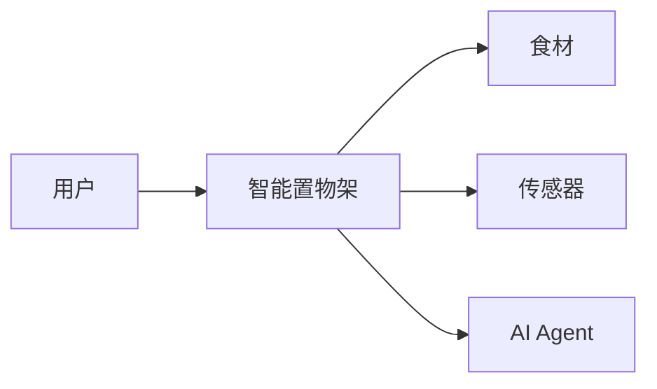
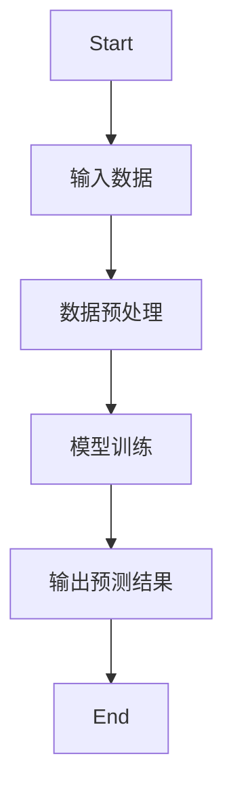
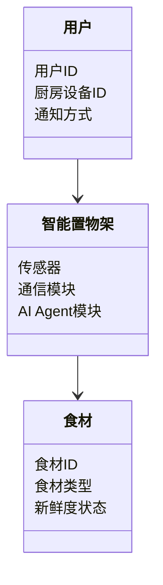
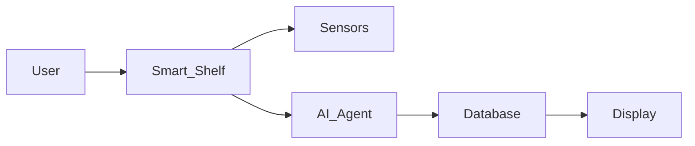

                 


# 智能厨房置物架：AI Agent的食材新鲜度监控

> 关键词：智能厨房置物架, AI Agent, 食材新鲜度监控, 物联网, 数据采集, 时间序列分析

> 摘要：本文将详细介绍智能厨房置物架中AI Agent对食材新鲜度监控的核心原理、系统架构及实际应用。通过背景介绍、核心概念分析、算法原理讲解、系统架构设计、项目实战及总结与展望，深入探讨如何利用AI技术提升厨房管理效率和食材保鲜效果。文章内容丰富，结合实际案例和详细代码实现，适合技术爱好者和厨房智能化研究者参考。

---

## 第一部分: 背景介绍

### 第1章: 背景与问题描述

#### 1.1 智能厨房置物架的背景
##### 1.1.1 智能家居的发展趋势
智能家居技术的快速发展为厨房管理带来了新的可能性。随着物联网（IoT）技术的成熟，厨房设备的智能化成为家庭自动化的重要组成部分。

##### 1.1.2 厨房管理的智能化需求
现代家庭对厨房管理的智能化需求日益增长。传统的厨房管理方式存在效率低、易忘记等问题，亟需通过智能化手段提升管理效率。

##### 1.1.3 食材新鲜度监控的重要性
食材的新鲜度直接影响到食品的品质和安全性。通过实时监控食材的新鲜度，可以避免浪费，确保食品的健康与安全。

#### 1.2 问题背景与描述
##### 1.2.1 食材新鲜度监控的必要性
食材的新鲜度会随着时间推移逐渐下降，通过实时监控可以及时了解食材的状态，避免浪费和食用过期食品。

##### 1.2.2 当前食材管理的主要问题
当前的食材管理方式存在以下问题：
- 手动检查耗时且容易遗忘
- 缺乏实时监控手段
- 食材新鲜度的评估缺乏科学依据

##### 1.2.3 AI Agent在食材监控中的应用潜力
AI Agent（智能代理）通过实时数据采集和分析，能够高效地监控食材的新鲜度，为家庭厨房管理提供智能化解决方案。

#### 1.3 问题解决与边界
##### 1.3.1 AI Agent在食材监控中的解决方案
AI Agent通过传感器数据采集、实时分析和智能提醒，帮助用户及时了解食材的新鲜状态。

##### 1.3.2 解决方案的边界与限制
- 仅支持特定类型的食材监控
- 传感器精度限制可能影响监控结果
- 系统需要定期维护和校准

##### 1.3.3 解决方案的可行性分析
AI Agent结合物联网技术的解决方案在技术上是可行的，但在实际应用中需要考虑传感器精度、数据传输延迟等问题。

### 第2章: 核心概念与联系

#### 2.1 核心概念原理
##### 2.1.1 AI Agent的基本原理
AI Agent通过感知环境、分析数据并采取行动，帮助用户完成特定任务。在食材监控中，AI Agent负责数据采集、分析和提醒。

##### 2.1.2 食材新鲜度监控的实现机制
食材新鲜度监控通过传感器采集数据，AI Agent分析数据并生成提醒信息。具体实现机制包括数据采集、特征提取和模型预测。

##### 2.1.3 智能厨房置物架的工作流程
1. 数据采集：传感器采集食材的温度、湿度等参数
2. 数据传输：数据通过无线方式传输到AI Agent
3. 数据分析：AI Agent分析数据并预测食材新鲜度
4. 提醒与反馈：根据分析结果向用户发送提醒或建议

#### 2.2 核心概念属性对比
##### 2.2.1 AI Agent与传统传感器的区别
| 特性 | AI Agent | 传统传感器 |
|------|-----------|-------------|
| 功能 | 数据分析与决策 | 数据采集与传输 |
| 智能性 | 高 | 无 |
| 应用场景 | 多领域 | 单一用途 |

##### 2.2.2 不同食材的新鲜度特征对比
| 食材类型 | 温度敏感度 | 湿度敏感度 | 新鲜度下降速度 |
|----------|------------|------------|----------------|
| 肉类     | 高         | 高         | 快              |
| 蔬菜     | 中         | 中         | 中              |
| 水果     | 中         | 高         | 中              |

##### 2.2.3 不同监控方式的优劣势分析
| 监控方式 | 优点 | 缺点 |
|----------|------|------|
| 人工检查 | 成本低 | 易遗忘 |
| 传感器监控 | 实时性强 | 传感器精度有限 |
| AI Agent监控 | 智能分析 | 系统复杂度高 |

#### 2.3 实体关系图


---

## 第二部分: 算法原理讲解

### 第3章: 数据采集与处理

#### 3.1 数据采集原理
##### 3.1.1 传感器类型与工作原理
常用的传感器包括温度传感器、湿度传感器和气体传感器。这些传感器通过物理变化将食材的新鲜度参数转化为电子信号。

##### 3.1.2 数据采集的流程
1. 传感器采集数据
2. 数据预处理
3. 数据传输

##### 3.1.3 数据预处理方法
- 数据清洗：去除噪声数据
- 数据归一化：统一数据格式
- 数据平滑：消除短期波动

#### 3.2 数据流图


### 第4章: AI Agent算法原理

#### 4.1 时间序列分析
##### 4.1.1 时间序列的基本概念
时间序列是一种按时间顺序排列的数据序列，常用于预测未来的趋势。

##### 4.1.2 基于ARIMA模型的食材新鲜度预测
ARIMA（自回归积分滑动平均）模型适用于线性时间序列数据的预测。通过分析食材新鲜度的时序数据，AI Agent可以预测食材的保鲜期限。

##### 4.1.3 LSTM网络的应用
长短时记忆网络（LSTM）能够有效捕捉时间序列中的长期依赖关系，适用于食材新鲜度的非线性预测。

#### 4.2 算法流程图


### 第5章: 数学模型与公式

#### 5.1 时间序列模型
##### 5.1.1 ARIMA模型公式
$$ARIMA(p, d, q)$$
其中，p为自回归阶数，d为差分阶数，q为移动平均阶数。

##### 5.1.2 LSTM模型结构
$$LSTM(t, h, c)$$
其中，t为时间步，h为隐藏层状态，c为细胞状态。

#### 5.2 预测精度评估
##### 5.2.1 �均方误差公式
$$MSE = \frac{1}{n}\sum_{i=1}^{n}(y_i - \hat{y_i})^2$$
其中，$y_i$为真实值，$\hat{y_i}$为预测值。

##### 5.2.2 模型评估指标
- 均方误差（MSE）
- 平均绝对误差（MAE）
- R平方系数（R²）

---

## 第三部分: 系统架构设计

### 第6章: 系统功能设计

#### 6.1 领域模型


#### 6.2 系统架构设计
##### 6.2.1 分层架构
- 数据采集层：负责传感器数据的采集和传输
- 数据处理层：对数据进行预处理和分析
- 应用层：提供用户界面和交互功能

##### 6.2.2 架构图


#### 6.3 接口设计
##### 6.3.1 数据接口
- 传感器数据接口：用于采集和传输传感器数据
- 数据处理接口：用于数据预处理和分析

##### 6.3.2 用户接口
- 用户界面：显示食材新鲜度状态和提醒信息
- 设置接口：允许用户自定义提醒参数

#### 6.4 交互设计
##### 6.4.1 交互流程
1. 用户将食材放入置物架
2. 传感器采集食材数据
3. 数据传输到AI Agent
4. AI Agent分析数据并生成提醒
5. 提醒信息显示在用户界面上

##### 6.4.2 交互图


---

## 第四部分: 项目实战

### 第7章: 项目实战

#### 7.1 环境安装
##### 7.1.1 硬件安装
- 安装传感器模块
- 连接通信模块
- 安装智能置物架

##### 7.1.2 软件安装
- 安装AI Agent模块
- 配置数据处理模块
- 设置用户界面

#### 7.2 系统核心实现
##### 7.2.1 数据采集代码
```python
import time
from sensors import TemperatureSensor, HumiditySensor

class DataCollector:
    def __init__(self):
        self.temp_sensor = TemperatureSensor()
        self.humi_sensor = HumiditySensor()
    
    def collect_data(self):
        temp = self.temp_sensor.read()
        humi = self.humi_sensor.read()
        return temp, humi
```

##### 7.2.2 AI Agent实现
```python
import numpy as np
from models import ARIMAModel

class AI_Agent:
    def __init__(self):
        self.model = ARIMAModel()
    
    def predict_freshness(self, data):
        return self.model.predict(data)
```

##### 7.2.3 数据分析代码
```python
import pandas as pd
from sklearn.metrics import mean_squared_error

def evaluate_model(actual, predicted):
    mse = mean_squared_error(actual, predicted)
    print(f"均方误差：{mse}")
```

#### 7.3 案例分析
##### 7.3.1 数据采集与处理
- 采集温度和湿度数据
- 数据预处理
- 数据分析与预测

##### 7.3.2 系统运行结果
- 预测结果展示
- 提醒信息生成
- 系统日志记录

#### 7.4 项目小结
##### 7.4.1 实验结果分析
通过实验验证AI Agent对食材新鲜度监控的准确性。

##### 7.4.2 项目优缺点分析
- 优点：实时监控，智能提醒
- 缺点：系统复杂度高，维护成本高

##### 7.4.3 经验总结
总结项目实施过程中的经验教训，为后续改进提供参考。

---

## 第五部分: 总结与展望

### 第8章: 总结与展望

#### 8.1 总结
##### 8.1.1 核心成果
本文详细介绍了智能厨房置物架中AI Agent对食材新鲜度监控的核心原理、系统架构及实际应用。

##### 8.1.2 技术创新
提出了基于AI Agent的食材新鲜度监控解决方案，结合物联网技术实现智能化管理。

#### 8.2 问题与不足
##### 8.2.1 系统复杂度高
AI Agent的实现需要复杂的硬件和软件支持，系统维护成本较高。

##### 8.2.2 传感器精度限制
传感器的精度和稳定性直接影响到食材新鲜度的监控效果。

##### 8.2.3 系统响应延迟
数据采集和分析的延迟可能影响实时监控的效果。

#### 8.3 未来展望
##### 8.3.1 技术改进方向
- 提高传感器精度和稳定性
- 优化AI Agent的算法模型
- 降低系统复杂度和维护成本

##### 8.3.2 应用扩展
- 扩展到更多类型的食材监控
- 实现多设备协同工作
- 提供更智能化的管理功能

##### 8.3.3 市场前景
随着智能家居的普及，智能厨房置物架的市场需求将快速增长。未来，AI Agent在食材新鲜度监控中的应用前景广阔。

---

## 作者：AI天才研究院/AI Genius Institute & 禅与计算机程序设计艺术 /Zen And The Art of Computer Programming

---

**本文由AI天才研究院精心撰写，转载请注明出处！**

