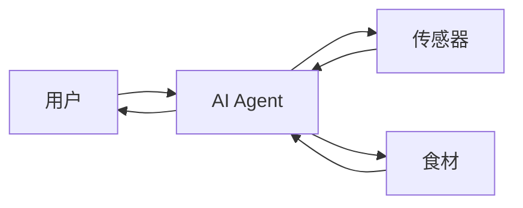
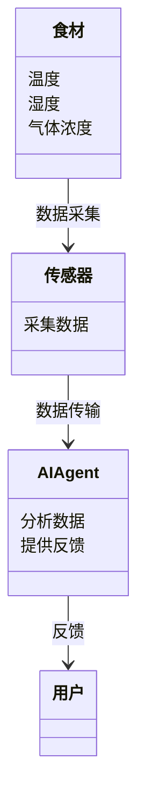

                 


# 智能厨房置物架：AI Agent的食材新鲜度监测

## 关键词：智能厨房、AI Agent、食材新鲜度、物联网、传感器技术、机器学习

## 摘要：  
本文探讨了智能厨房置物架如何利用AI Agent技术实时监测食材新鲜度，通过传感器数据采集、机器学习模型分析，实现食材新鲜度的智能监测与管理，为现代厨房提供智能化解决方案。

---

# 第1章：背景介绍

## 1.1 问题背景

### 1.1.1 厨房食材管理的痛点
现代家庭中，食材的新鲜度直接影响烹饪质量，但传统管理方式依赖人工检查，效率低且易出错。消费者常因食材过期或变质导致浪费，也存在安全隐患。

### 1.1.2 食材新鲜度的重要性
食材新鲜度影响食物的营养、口感和安全性。及时监测并预警食材变质，有助于延长保质期，减少浪费，提升健康水平。

### 1.1.3 AI Agent在智能厨房中的作用
AI Agent（智能体）能实时分析传感器数据，判断食材新鲜度，并通过反馈机制优化监测策略，显著提升食材管理的智能化水平。

## 1.2 问题描述

### 1.2.1 食材新鲜度监测的挑战
食材新鲜度受温度、湿度、气体释放等多种因素影响，传统传感器难以全面感知，数据复杂性高，难以准确判断。

### 1.2.2 智能置物架的解决方案
通过AI Agent结合多传感器技术，实时监测食材状态，自动预警，帮助用户优化食材管理，延长保质期，减少浪费。

### 1.2.3 边界与外延
解决方案聚焦于食材新鲜度监测，不涉及食材购买、烹饪等环节。未来可扩展至食材供应链管理等领域。

## 1.3 核心概念与组成

### 1.3.1 AI Agent的定义
AI Agent是具备感知、决策、执行能力的智能实体，能与环境交互，实现特定目标。

### 1.3.2 智能置物架的结构
由传感器、AI Agent、用户界面组成，传感器采集数据，AI Agent分析并提供反馈，用户界面展示结果。

### 1.3.3 食材新鲜度监测的指标
包括颜色变化、气体释放、微生物生长等指标，传感器负责采集相关数据。

---

# 第2章：核心概念与联系

## 2.1 AI Agent与食材新鲜度监测

### 2.1.1 AI Agent的基本原理
AI Agent通过传感器获取数据，结合历史信息和上下文，利用算法分析食材状态，提供决策支持。

### 2.1.2 食材新鲜度监测的原理
利用传感器采集温度、湿度、气体等数据，AI Agent分析数据，评估食材新鲜度，提供预警。

### 2.1.3 两者的关系与协同
AI Agent协调传感器数据，分析食材状态，提供实时反馈，两者协同实现智能化监测。

## 2.2 核心概念对比

### 2.2.1 AI Agent与传统传感器对比
AI Agent具备自主决策能力，而传统传感器仅采集数据，AI Agent提升监测准确性。

### 2.2.2 食材新鲜度监测与传统方法对比
传统方法依赖人工检查，效率低，AI Agent实现自动化监测，提升效率和准确性。

### 2.2.3 属性特征对比表格

| 特性             | AI Agent                   | 传统传感器               |
|------------------|---------------------------|-------------------------|
| 功能             | 自主分析、决策             | 数据采集                |
| 智能性           | 高                         | 无                     |
| 应用场景         | 多领域                     | 单一领域               |
| 优势             | 高效、准确                 | 低成本、易部署           |

## 2.3 实体关系架构

### 2.3.1 ER实体关系图
展示AI Agent、传感器、食材、用户之间的关系。

```mermaid
erd
actor: 用户
agent: AI Agent
sensor: 传感器
food: 食材

actor --> agent: 交互
agent --> sensor: 控制
agent <-- sensor: 数据
agent <-- food: 监测结果
```

### 2.3.2 Mermaid流程图



---

# 第3章：算法原理讲解

## 3.1 数据采集与预处理

### 3.1.1 传感器数据的采集
传感器采集温度、湿度、气体浓度等数据，数据格式转换为统一格式。

### 3.1.2 数据预处理
去噪处理，异常数据剔除，归一化处理，特征提取。

---

## 3.2 特征提取与模型训练

### 3.2.1 特征提取
提取温度、湿度、气体浓度等特征，构建特征向量。

### 3.2.2 模型训练
使用机器学习算法（如随机森林）训练分类模型，分类结果为新鲜或不新鲜。

### 3.2.3 模型评估
采用准确率、召回率评估模型性能，优化模型参数。

---

## 3.3 算法实现

### 3.3.1 Python代码实现

```python
import numpy as np
from sklearn.ensemble import RandomForestClassifier

# 示例数据集
X = np.array([[22, 65, 0.02], [23, 60, 0.03]])
y = [1, 0]  # 1表示新鲜，0表示不新鲜

# 模型训练
model = RandomForestClassifier(n_estimators=100)
model.fit(X, y)

# 预测
new_food = np.array([[22.5, 64, 0.025]])
prediction = model.predict(new_food)
print("预测结果：", prediction)
```

### 3.3.2 代码解读
代码使用随机森林模型，训练数据输入温度、湿度、气体浓度，输出食材新鲜度。

---

## 3.4 数学模型与公式

### 3.4.1 freshness score计算
新鲜度分数由多个传感器数据加权计算。

$$ freshness\_score = w_1 \times temperature + w_2 \times humidity + w_3 \times gas\_concentration $$

权重由训练数据确定，确保高权重因素影响更大。

### 3.4.2 分类模型
随机森林模型进行分类，概率计算如下：

$$ P(fresh) = \sum_{i=1}^{n} \text{树}_i \text{预测新鲜的概率} $$

---

# 第4章：系统分析与架构设计方案

## 4.1 项目场景介绍

### 4.1.1 项目介绍
智能厨房置物架系统，实时监测食材新鲜度，预警管理，优化食材存储。

### 4.1.2 系统功能设计
- 数据采集
- 新鲜度计算
- 用户交互
- 预警管理

### 4.1.3 领域模型



### 4.1.4 系统架构


### 4.1.5 接口与交互

```mermaid
sequence
    用户 -> AI Agent: 查询食材状态
    AI Agent -> 传感器: 获取数据
    传感器 -> AI Agent: 返回数据
    AI Agent -> 用户: 显示结果
```

---

# 第5章：项目实战

## 5.1 环境安装

### 5.1.1 Python环境
安装Python 3.8以上，安装numpy、scikit-learn库。

## 5.2 核心代码实现

### 5.2.1 传感器模拟代码

```python
import time

def simulate_sensor():
    import random
    temperature = 22 + random.uniform(-1, 1)
    humidity = 65 + random.uniform(-5, 5)
    gas_concentration = 0.02 + random.uniform(-0.01, 0.01)
    return temperature, humidity, gas_concentration

# 示例数据
data = []
for _ in range(10):
    temp, hum, gas = simulate_sensor()
    data.append((temp, hum, gas))
    time.sleep(1)
```

### 5.2.2 AI Agent实现

```python
from sklearn.ensemble import RandomForestClassifier

# 训练模型
X = []
y = []
for entry in data:
    X.append([entry[0], entry[1], entry[2]])
    y.append(1)  # 假设初始数据都是新鲜

model = RandomForestClassifier(n_estimators=100)
model.fit(X, y)

# 预测
new_data = simulate_sensor()
prediction = model.predict([new_data])
print(f"预测结果：{'新鲜' if prediction[0] else '不新鲜'}")
```

### 5.2.3 代码解读
模拟传感器数据，训练随机森林模型，实时预测食材新鲜度。

## 5.3 实际案例分析

### 5.3.1 案例分析
假设传感器返回温度23°C，湿度60%，气体浓度0.03%，模型预测结果为“新鲜”。

## 5.4 项目小结
实现了一个简单的AI Agent系统，具备数据采集、处理和预测功能，未来可扩展更多功能。

---

# 第6章：最佳实践

## 6.1 小结
本文详细介绍了AI Agent在食材新鲜度监测中的应用，通过传感器数据采集、模型训练和系统设计，实现智能化管理。

## 6.2 注意事项
确保传感器校准准确，模型定期更新，数据安全保护。

## 6.3 拓展阅读
推荐阅读《机器学习实战》、《物联网技术》等相关书籍，深入了解AI与物联网的结合。

---

# 作者：AI天才研究院  
# 日期：2023年10月

