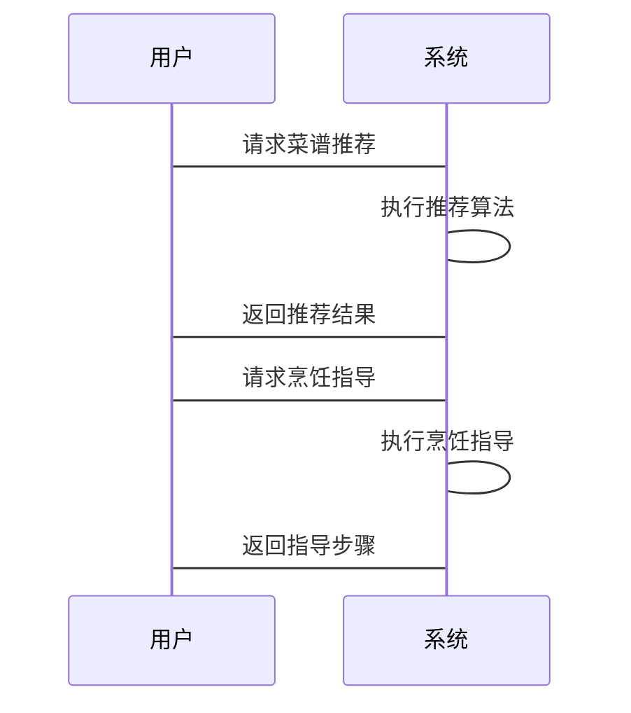

                 


# 智能厨房：AI Agent的菜谱推荐与烹饪指导

> 关键词：智能厨房，AI Agent，菜谱推荐，烹饪指导，推荐算法，协同过滤，机器学习

> 摘要：本文深入探讨了AI Agent在智能厨房中的应用，特别是菜谱推荐与烹饪指导的技术细节。通过分析AI Agent的核心原理、推荐算法的数学模型、系统架构设计，以及实际项目的实现，本文为读者提供了全面的技术见解。

---

## 第1章: 智能厨房的概念与背景

### 1.1 智能厨房的定义与特点

智能厨房是将人工智能技术融入厨房设备，以实现智能化操作和优化烹饪过程的新型厨房环境。其特点包括：
- **智能化**：通过AI技术实现自动推荐菜谱和优化烹饪步骤。
- **数据驱动**：基于用户数据和菜谱数据库提供个性化服务。
- **交互性**：支持多模态交互，如语音和视觉指令。

### 1.2 AI Agent的基本概念

AI Agent（智能代理）是一种能够感知环境并采取行动以实现目标的实体。在智能厨房中，AI Agent负责处理用户的请求、推荐菜谱和指导烹饪过程。

### 1.3 菜谱推荐与烹饪指导的背景

随着人们对个性化和便捷生活的追求，智能厨房通过AI技术提供菜谱推荐和烹饪指导，解决了传统烹饪中的效率低下和资源浪费问题。

---

## 第2章: AI Agent在智能厨房中的应用

### 2.1 菜谱推荐的核心问题

菜谱推荐涉及用户需求分析、菜谱数据特征提取和推荐算法选择。通过协同过滤和基于内容的推荐算法，AI Agent能够为用户提供个性化建议。

### 2.2 烹饪指导的关键技术

烹饪指导技术包括烹饪步骤优化、实时反馈和调味调整。AI Agent通过分析用户行为和环境数据，提供实时指导和优化建议。

### 2.3 智能厨房的用户交互设计

智能厨房采用多模态交互设计，支持语音和视觉指令，优化用户体验。用户反馈机制帮助系统不断改进推荐算法和指导策略。

---

## 第3章: AI Agent的原理与模型

### 3.1 AI Agent的核心原理

AI Agent通过信息收集与处理、用户行为分析和数据驱动的决策为用户提供服务。其工作流程包括数据采集、特征提取、模型训练和结果输出。

### 3.2 菜谱推荐的算法模型

菜谱推荐算法包括协同过滤、基于内容的推荐和混合推荐模型。协同过滤基于用户行为相似性推荐菜谱，基于内容的推荐利用菜谱特征进行匹配。

### 3.3 烹饪指导的实体关系图

```mermaid
er
actor: 用户
model: AI Agent
database: 菜谱数据库
steps: 烹饪步骤
ingredients: 食材清单
```

---

## 第4章: 推荐算法的数学模型

### 4.1 协同过滤算法

协同过滤基于用户相似性推荐菜谱。计算用户相似性矩阵，通过矩阵分解进行推荐。公式如下：

$$相似度(u, v) = \frac{\sum_{i \in u} r_{u,i} \cdot r_{v,i}}{\sqrt{\sum_{i \in u} r_{u,i}^2} \cdot \sqrt{\sum_{i \in v} r_{v,i}^2}}$$

### 4.2 基于内容的推荐

基于内容的推荐利用菜谱的特征向量进行匹配。通过计算余弦相似度确定推荐结果：

$$相似度(s1, s2) = \frac{\sum_{i=1}^{n} w_i \cdot s1_i \cdot s2_i}{\sqrt{\sum_{i=1}^{n} w_i^2 \cdot s1_i^2} \cdot \sqrt{\sum_{i=1}^{n} w_i^2 \cdot s2_i^2}}$$

### 4.3 混合推荐模型

混合推荐模型结合协同过滤和基于内容的推荐，通过加权平均生成最终推荐结果：

$$R(u, i) = \alpha \cdot CF(u, i) + (1-\alpha) \cdot CB(u, i)$$

---

## 第5章: 菜谱推荐系统的实现

### 5.1 系统架构设计

系统架构包括用户模块、菜谱数据库、推荐模块和交互模块。系统功能涵盖用户注册、菜谱推荐和烹饪指导。

### 5.2 核心代码实现

推荐系统的Python代码如下：

```python
import numpy as np

def collaborative_filtering(user_ratings, user_ids, item_ids):
    # 计算相似度矩阵
    user_num = len(user_ids)
    item_num = len(item_ids)
    ratings_matrix = np.zeros((user_num, item_num))
    
    for u in range(user_num):
        for i in user_ratings[user_ids[u]]:
            ratings_matrix[u][i] = user_ratings[user_ids[u]][i]
    
    # SVD分解
    U, sigma, V = np.linalg.svd(ratings_matrix)
    rank = min(user_num, item_num)
    U_rank = U[:, :rank]
    V_rank = V[:rank, :]
    sigma_rank = sigma[:rank]
    
    # 计算预测评分
    predicted_ratings = np.dot(U_rank, np.dot(np.diag(sigma_rank), V_rank))
    return predicted_ratings

# 示例数据
user_ratings = {
    'user1': {1:5, 2:4},
    'user2': {1:4, 3:5}
}

user_ids = ['user1', 'user2']
item_ids = [1,2,3]

predicted_ratings = collaborative_filtering(user_ratings, user_ids, item_ids)
print(predicted_ratings)
```

### 5.3 系统功能设计

系统功能包括用户注册、菜谱推荐和烹饪指导。系统交互流程如图：



---

## 第6章: 最佳实践与小结

### 6.1 最佳实践

- **数据隐私**：确保用户数据的隐私和安全。
- **模型优化**：定期更新推荐模型，提高推荐准确性。
- **用户体验**：优化交互设计，提升用户体验。

### 6.2 小结

本文详细探讨了AI Agent在智能厨房中的应用，重点分析了菜谱推荐和烹饪指导的技术实现。通过数学模型和实际案例，展示了如何利用AI技术优化厨房操作。

### 6.3 注意事项

- 确保系统稳定性，避免推荐错误。
- 提供多种交互方式，满足不同用户需求。

### 6.4 拓展阅读

进一步了解深度学习在推荐系统中的应用，探索更先进的推荐算法。

---

作者：AI天才研究院 & 禅与计算机程序设计艺术

