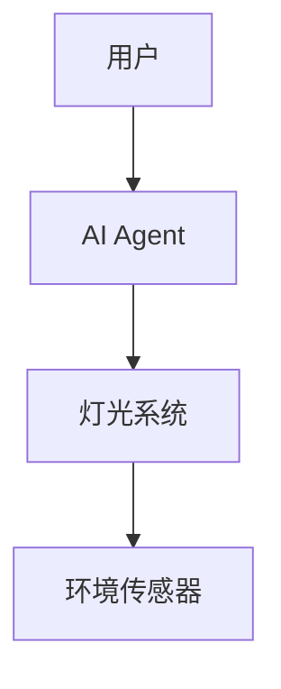
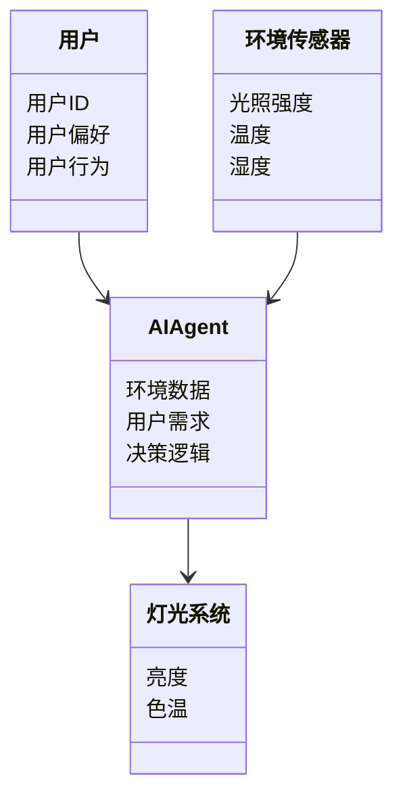
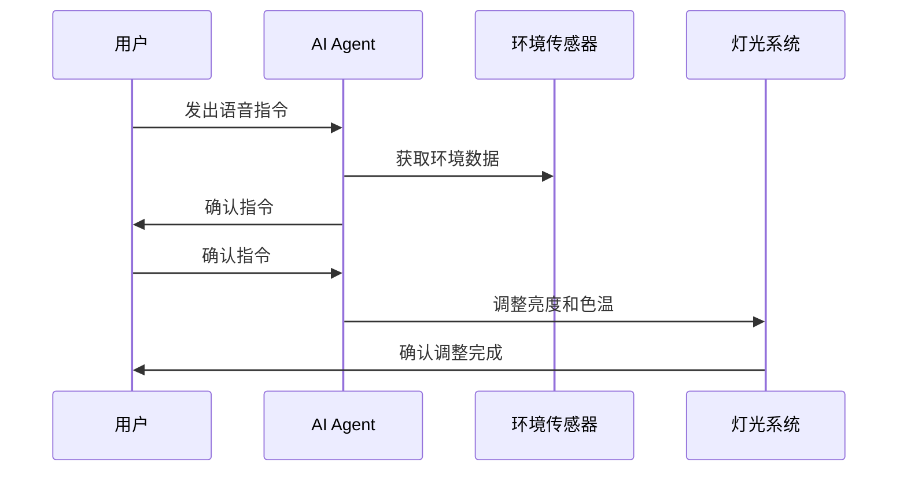

                 


# 智能台灯：AI Agent的个性化照明方案

## 关键词：智能台灯，AI Agent，个性化照明，环境感知，多模态交互

## 摘要：  
本文探讨了AI Agent在智能台灯中的应用，分析了个性化照明的需求与实现方法。通过多模态交互技术，AI Agent能够感知环境和用户需求，动态调整照明方案，提升用户体验。本文详细讲解了AI Agent的核心算法、系统架构设计及实际项目实现，为智能照明系统提供了新的思路。

---

# 第一部分: 背景与概念

# 第1章: 背景介绍

## 1.1 问题背景

### 1.1.1 传统照明系统的局限性
传统照明系统通常基于固定的预设模式运行，无法根据环境变化和用户需求进行实时调整，存在以下问题：
- **缺乏智能化**：无法感知环境光照强度、用户行为和情绪。
- **个性化不足**：无法满足不同用户的个性化需求。
- **能源浪费**：无法优化能源使用，造成不必要的电力消耗。

### 1.1.2 智能化照明的需求
随着物联网和人工智能技术的发展，智能照明系统逐渐成为智能家居的重要组成部分。用户对智能照明的需求主要集中在以下方面：
- **自动化控制**：根据环境和时间自动调节亮度和色温。
- **个性化体验**：根据用户习惯和情绪提供定制化的照明方案。
- **节能环保**：通过智能调节减少能源浪费。

### 1.1.3 个性化照明的意义
个性化照明不仅提升了用户体验，还能优化环境适应性。通过AI Agent实现个性化照明，可以显著提升用户的生活质量，同时降低能源消耗。

## 1.2 问题描述

### 1.2.1 照明系统智能化的挑战
- **环境感知复杂**：需要同时处理光照强度、温度、湿度等多种环境数据。
- **用户需求多样**：不同用户对光照的需求差异大，难以统一满足。
- **实时性要求高**：需要快速响应用户的指令和环境变化。

### 1.2.2 用户个性化需求的多样性
用户对光照的需求因人而异，主要体现在以下几个方面：
- **亮度偏好**：不同用户对亮度的需求不同，有的喜欢明亮的环境，有的则喜欢柔和的光线。
- **色温调节**：不同场景和时间需要不同的色温，例如阅读时需要高亮度和冷色调，休息时需要低亮度和暖色调。
- **场景适应**：不同场景（如工作、娱乐、睡眠）需要不同的照明方案。

### 1.2.3 AI Agent在照明系统中的应用潜力
AI Agent（智能体）是一种能够感知环境、自主决策、执行任务的智能系统。将其应用于照明系统，可以实现以下目标：
- **智能感知**：通过传感器实时感知环境和用户需求。
- **自主决策**：基于感知数据和用户需求，制定最优的照明方案。
- **动态调整**：根据环境变化和用户反馈，实时调整照明参数。

## 1.3 问题解决

### 1.3.1 AI Agent的核心作用
AI Agent在智能台灯中的核心作用体现在以下几个方面：
- **环境感知**：通过传感器实时采集环境数据，如光照强度、温度、湿度等。
- **用户需求分析**：通过分析用户的交互指令和行为模式，了解用户的偏好和需求。
- **决策与执行**：基于环境数据和用户需求，制定个性化的照明方案，并通过灯光系统执行。

### 1.3.2 个性化照明方案的设计思路
个性化照明方案的设计需要综合考虑以下几个方面：
- **用户画像**：根据用户的使用习惯和偏好，建立用户画像。
- **环境数据**：采集和分析环境数据，为照明方案提供依据。
- **动态调整**：根据环境变化和用户反馈，动态调整照明参数。

### 1.3.3 智能台灯的实现路径
实现智能台灯的个性化照明方案，可以按照以下步骤进行：
1. **环境感知**：部署光照传感器、温度传感器等设备，实时采集环境数据。
2. **用户需求分析**：通过用户交互和行为分析，了解用户的个性化需求。
3. **AI Agent决策**：基于环境数据和用户需求，AI Agent制定最优的照明方案。
4. **动态调整**：根据实时反馈，动态优化照明参数，确保最佳用户体验。

## 1.4 边界与外延

### 1.4.1 智能台灯的功能边界
智能台灯的功能主要集中在以下几个方面：
- **环境感知**：采集光照强度、温度、湿度等环境数据。
- **用户交互**：支持语音、手势等多种交互方式。
- **动态调节**：根据环境数据和用户需求，动态调整亮度和色温。

### 1.4.2 AI Agent的应用范围
AI Agent不仅适用于智能台灯，还可以应用于其他智能设备和系统，如智能家居、自动驾驶等。

### 1.4.3 个性化照明的实现范围
个性化照明的实现范围包括：
- **亮度调节**：根据用户需求和环境数据，实时调整亮度。
- **色温调节**：根据场景和时间，动态调整色温。
- **场景适应**：根据用户行为和环境变化，自动切换不同的照明模式。

## 1.5 概念结构与核心要素

### 1.5.1 核心概念组成
智能台灯的核心概念包括：
- **环境传感器**：用于采集环境数据。
- **AI Agent**：用于感知、决策和执行。
- **灯光系统**：用于执行照明方案。

### 1.5.2 关键技术分析
- **多模态交互技术**：支持多种交互方式，如语音、手势等。
- **环境感知技术**：通过传感器实时采集环境数据。
- **AI决策算法**：基于环境数据和用户需求，制定最优的照明方案。

### 1.5.3 系统架构要素
系统架构要素包括：
- **用户交互界面**：支持多种交互方式。
- **环境传感器**：采集环境数据。
- **AI Agent**：处理数据并制定照明方案。
- **灯光系统**：执行照明方案。

---

# 第二部分: 核心概念与联系

# 第2章: AI Agent与智能台灯

## 2.1 AI Agent的基本原理

### 2.1.1 AI Agent的定义与特点
AI Agent是一种能够感知环境、自主决策、执行任务的智能系统。其特点包括：
- **自主性**：能够自主决策和执行任务。
- **反应性**：能够实时感知环境并做出反应。
- **学习能力**：能够通过学习优化决策算法。

### 2.1.2 AI Agent的核心算法
AI Agent的核心算法包括：
- **机器学习算法**：用于模式识别和预测。
- **自然语言处理算法**：用于理解和生成自然语言。
- **决策算法**：用于制定最优的决策方案。

### 2.1.3 AI Agent在智能台灯中的应用
AI Agent在智能台灯中的应用体现在以下几个方面：
- **环境感知**：通过传感器实时采集环境数据。
- **用户需求分析**：通过分析用户的交互指令和行为模式，了解用户的偏好和需求。
- **决策与执行**：基于环境数据和用户需求，制定个性化的照明方案，并通过灯光系统执行。

## 2.2 多模态交互技术

### 2.2.1 多模态交互的定义
多模态交互是指通过多种交互方式（如语音、手势、触摸等）实现人机交互的技术。

### 2.2.2 声控与光感交互
- **声控交互**：用户通过语音指令控制智能台灯。
- **光感交互**：用户通过触摸或手势控制智能台灯。

### 2.2.3 用户行为分析
通过分析用户的交互行为，可以了解用户的偏好和需求，例如：
- **使用频率**：用户每天使用智能台灯的时间和频率。
- **操作习惯**：用户常用的操作方式和时间。

## 2.3 个性化照明方案的实现

### 2.3.1 个性化需求分析
个性化需求分析包括以下几个方面：
- **用户画像**：根据用户的使用习惯和偏好，建立用户画像。
- **环境数据**：采集和分析环境数据，为照明方案提供依据。
- **用户反馈**：根据用户的反馈，动态调整照明方案。

### 2.3.2 AI Agent的决策逻辑
AI Agent的决策逻辑包括以下几个步骤：
1. **环境感知**：采集环境数据，如光照强度、温度、湿度等。
2. **用户需求分析**：分析用户的交互指令和行为模式，了解用户的个性化需求。
3. **决策制定**：基于环境数据和用户需求，制定最优的照明方案。
4. **执行与反馈**：通过灯光系统执行照明方案，并根据用户反馈进行动态调整。

### 2.3.3 照明方案的动态调整
照明方案的动态调整包括以下几个方面：
- **亮度调节**：根据环境数据和用户需求，实时调整亮度。
- **色温调节**：根据场景和时间，动态调整色温。
- **场景适应**：根据用户行为和环境变化，自动切换不同的照明模式。

## 2.4 核心概念联系

### 2.4.1 ER实体关系图
以下是智能台灯系统的核心实体关系图：



---

# 第三部分: 算法原理讲解

# 第3章: 算法原理

## 3.1 算法核心原理

### 3.1.1 环境感知算法
环境感知算法用于采集和分析环境数据，包括光照强度、温度、湿度等。常用的环境感知算法包括：
- **光照强度检测**：通过光照传感器检测环境光照强度。
- **温度检测**：通过温度传感器检测环境温度。
- **湿度检测**：通过湿度传感器检测环境湿度。

### 3.1.2 用户需求分析算法
用户需求分析算法用于分析用户的交互指令和行为模式，了解用户的个性化需求。常用的用户需求分析算法包括：
- **自然语言处理算法**：用于分析用户的语音指令。
- **用户行为分析算法**：用于分析用户的交互行为和操作习惯。

### 3.1.3 AI Agent决策算法
AI Agent决策算法用于基于环境数据和用户需求，制定最优的照明方案。常用的AI Agent决策算法包括：
- **强化学习算法**：通过奖励机制优化决策策略。
- **监督学习算法**：基于用户反馈优化决策模型。

## 3.2 算法实现细节

### 3.2.1 环境感知算法实现
以下是环境感知算法的Python代码示例：

```python
import RPi.GPIO as GPIO
import time

# 定义光照传感器引脚
light_sensor_pin = 18

# 初始化GPIO
GPIO.setmode(GPIO.BCM)
GPIO.setup(light_sensor_pin, GPIO.IN)

# 定义函数，获取光照强度
def get_light_intensity():
    return GPIO.input(light_sensor_pin)

# 获取光照强度
light_intensity = get_light_intensity()
print(f"当前光照强度：{light_intensity}")
```

### 3.2.2 用户需求分析算法实现
以下是用户需求分析算法的Python代码示例：

```python
import speech_recognition as sr

# 初始化语音识别器
recognizer = sr.Recognizer()

# 定义函数，获取用户指令
def get_user_command():
    with sr.Microphone() as source:
        print("请说出您的指令...")
        audio = recognizer.listen(source)
        try:
            return recognizer.recognize_google(audio)
        except sr.UnknownValueError:
            return None

# 获取用户指令
user_command = get_user_command()
print(f"用户指令：{user_command}")
```

### 3.2.3 AI Agent决策算法实现
以下是AI Agent决策算法的Python代码示例：

```python
def decide_lighting方案(current_light, userPreference):
    if current_light < 50:
        return "increase_brightness"
    elif current_light > 100:
        return "decrease_brightness"
    else:
        return "保持当前亮度"

# 示例调用
current_light = 75
userPreference = "阅读"
decision = decide_lighting方案(current_light, userPreference)
print(f"AI Agent决策：{decision}")
```

## 3.3 算法数学模型

### 3.3.1 环境感知模型
环境感知模型用于分析环境数据，其数学模型如下：

$$
\text{环境数据} = \text{传感器数据} \times \text{传感器灵敏度}
$$

### 3.3.2 用户需求分析模型
用户需求分析模型用于分析用户的个性化需求，其数学模型如下：

$$
\text{用户需求} = \text{用户行为} + \text{用户偏好}
$$

### 3.3.3 AI Agent决策模型
AI Agent决策模型用于制定最优的照明方案，其数学模型如下：

$$
\text{决策} = \text{环境数据} \times \text{用户需求} \times \text{权重}
$$

---

# 第四部分: 系统分析与架构设计

# 第4章: 系统分析与架构设计

## 4.1 系统功能设计

### 4.1.1 领域模型
以下是智能台灯系统的领域模型：



### 4.1.2 系统架构设计
以下是智能台灯系统的架构设计：


### 4.1.3 系统接口设计
系统接口设计包括以下几个方面：
- **用户交互接口**：支持语音、手势等多种交互方式。
- **环境传感器接口**：支持多种传感器的数据采集。
- **灯光系统接口**：支持亮度和色温的调节。

### 4.1.4 系统交互流程
以下是系统交互流程的Mermaid序列图：



## 4.2 系统实现与优化

### 4.2.1 系统实现细节
系统实现细节包括以下几个方面：
- **环境数据采集**：通过传感器实时采集环境数据。
- **用户需求分析**：通过分析用户的交互指令和行为模式，了解用户的个性化需求。
- **AI Agent决策**：基于环境数据和用户需求，制定最优的照明方案。
- **灯光系统控制**：根据决策结果，调整亮度和色温。

### 4.2.2 系统优化策略
系统优化策略包括以下几个方面：
- **算法优化**：通过优化AI Agent的决策算法，提高系统的响应速度和准确性。
- **硬件优化**：通过优化传感器和灯光系统的硬件设计，提高系统的可靠性和稳定性。
- **用户体验优化**：通过优化用户交互界面和操作流程，提高用户的使用体验。

---

# 第五部分: 项目实战

# 第5章: 项目实战

## 5.1 环境搭建

### 5.1.1 开发环境安装
以下是开发环境安装步骤：
1. **安装Python**：安装Python 3.x及以上版本。
2. **安装依赖库**：安装所需的依赖库，如GPIO库、语音识别库等。
3. **安装开发工具**：安装IDE和调试工具，如PyCharm、Visual Studio Code等。

### 5.1.2 传感器安装
以下是环境传感器的安装步骤：
1. **选择传感器**：根据需求选择合适的传感器，如光照传感器、温度传感器等。
2. **连接传感器**：将传感器连接到开发板，如Raspberry Pi。
3. **测试传感器**：通过代码测试传感器的正常工作。

## 5.2 核心系统实现

### 5.2.1 环境数据采集实现
以下是环境数据采集的Python代码示例：

```python
import RPi.GPIO as GPIO
import time

# 定义光照传感器引脚
light_sensor_pin = 18

# 初始化GPIO
GPIO.setmode(GPIO.BCM)
GPIO.setup(light_sensor_pin, GPIO.IN)

# 定义函数，获取光照强度
def get_light_intensity():
    return GPIO.input(light_sensor_pin)

# 获取光照强度
light_intensity = get_light_intensity()
print(f"当前光照强度：{light_intensity}")
```

### 5.2.2 用户需求分析实现
以下是用户需求分析的Python代码示例：

```python
import speech_recognition as sr

# 初始化语音识别器
recognizer = sr.Recognizer()

# 定义函数，获取用户指令
def get_user_command():
    with sr.Microphone() as source:
        print("请说出您的指令...")
        audio = recognizer.listen(source)
        try:
            return recognizer.recognize_google(audio)
        except sr.UnknownValueError:
            return None

# 获取用户指令
user_command = get_user_command()
print(f"用户指令：{user_command}")
```

### 5.2.3 AI Agent决策实现
以下是AI Agent决策的Python代码示例：

```python
def decide_lighting方案(current_light, userPreference):
    if current_light < 50:
        return "increase_brightness"
    elif current_light > 100:
        return "decrease_brightness"
    else:
        return "保持当前亮度"

# 示例调用
current_light = 75
userPreference = "阅读"
decision = decide_lighting方案(current_light, userPreference)
print(f"AI Agent决策：{decision}")
```

## 5.3 系统测试与优化

### 5.3.1 系统测试
系统测试包括以下几个方面：
- **功能测试**：测试系统的基本功能，如环境数据采集、用户交互、灯光调节等。
- **性能测试**：测试系统的响应速度和稳定性。
- **用户体验测试**：测试用户的使用体验，收集用户的反馈意见。

### 5.3.2 系统优化
系统优化包括以下几个方面：
- **算法优化**：通过优化AI Agent的决策算法，提高系统的响应速度和准确性。
- **硬件优化**：通过优化传感器和灯光系统的硬件设计，提高系统的可靠性和稳定性。
- **用户体验优化**：通过优化用户交互界面和操作流程，提高用户的使用体验。

---

# 第六部分: 总结与展望

# 第6章: 总结与展望

## 6.1 项目总结

### 6.1.1 核心功能总结
智能台灯的核心功能包括：
- **环境感知**：通过传感器实时采集环境数据。
- **用户需求分析**：通过分析用户的交互指令和行为模式，了解用户的个性化需求。
- **AI Agent决策**：基于环境数据和用户需求，制定最优的照明方案。
- **灯光系统控制**：根据决策结果，调整亮度和色温。

### 6.1.2 实现过程总结
实现智能台灯的过程包括以下几个方面：
1. **环境感知**：通过传感器实时采集环境数据。
2. **用户需求分析**：通过分析用户的交互指令和行为模式，了解用户的个性化需求。
3. **AI Agent决策**：基于环境数据和用户需求，制定最优的照明方案。
4. **灯光系统控制**：根据决策结果，调整亮度和色温。

## 6.2 项目小结

### 6.2.1 最佳实践 tips
- **算法优化**：通过优化AI Agent的决策算法，提高系统的响应速度和准确性。
- **硬件优化**：通过优化传感器和灯光系统的硬件设计，提高系统的可靠性和稳定性。
- **用户体验优化**：通过优化用户交互界面和操作流程，提高用户的使用体验。

### 6.2.2 注意事项
- **数据安全**：注意保护用户的隐私数据，防止数据泄露。
- **系统稳定性**：确保系统的稳定性和可靠性，避免因系统故障影响用户体验。
- **用户教育**：提供用户教育，帮助用户更好地理解和使用智能台灯。

## 6.3 未来展望

### 6.3.1 研究方向
未来的研究方向包括：
- **算法优化**：进一步优化AI Agent的决策算法，提高系统的智能性和响应速度。
- **硬件创新**：开发更先进的传感器和灯光系统，提高系统的感知能力和执行能力。
- **用户体验优化**：通过优化用户交互界面和操作流程，提高用户的使用体验。

### 6.3.2 技术趋势
未来的技术趋势包括：
- **AI Agent的智能化**：AI Agent将更加智能化，能够自主学习和优化决策算法。
- **多模态交互的普及**：多模态交互技术将更加普及，支持更多种类的交互方式。
- **系统的集成化**：智能台灯将更加集成化，与其他智能家居设备协同工作，提供更全面的智能化服务。

---

# 作者：AI天才研究院/AI Genius Institute & 禅与计算机程序设计艺术 /Zen And The Art of Computer Programming

