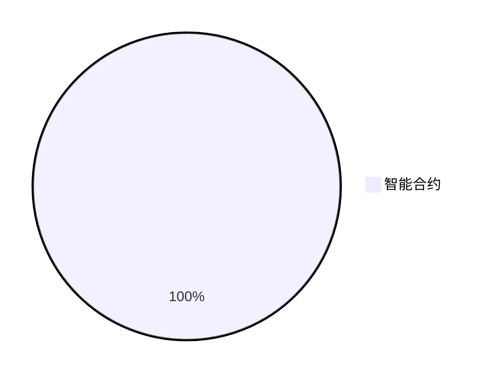
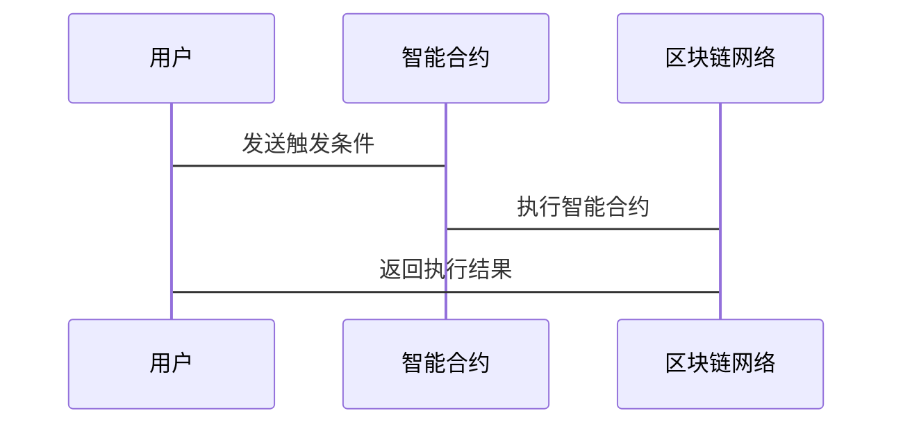

                 


# 智能合约 AI Agent：LLM 在区块链应用中的角色

---

## 关键词：
智能合约, AI Agent, LLM, 区块链, 智能合约自动化, 人工智能, 区块链技术

---

## 摘要：
本文深入探讨了大型语言模型（LLM）在智能合约和AI Agent领域中的应用，分析了LLM在区块链技术中的核心角色，以及其对智能合约自动化、法律合规、金融交易等领域的影响。文章从智能合约与AI Agent的基本概念出发，结合LLM的算法原理、系统架构和实际案例，详细阐述了LLM在区块链应用中的潜力与挑战，为技术开发者和研究人员提供了深刻的理论与实践指导。

---

# 第一部分: 智能合约与AI Agent概述

## 第1章: 智能合约与AI Agent的定义与背景

### 1.1 智能合约的定义与特点
智能合约是一种基于区块链技术的自动执行合同，其特点是去中心化、不可篡改和自动执行。以下是智能合约的核心特点：
- **去中心化**：智能合约运行在区块链上，无需中心机构的干预。
- **自动执行**：通过预设的代码逻辑，智能合约可以在满足特定条件时自动执行。
- **不可篡改**：区块链的特性确保智能合约代码的安全性和不可篡改性。
- **透明性**：智能合约的执行过程对所有参与者透明，且可追溯。

### 1.2 AI Agent的基本概念
AI Agent是一种能够感知环境并采取行动以实现目标的智能实体。以下是AI Agent的核心功能：
- **感知环境**：通过传感器或其他数据源获取环境信息。
- **决策与推理**：基于获取的信息进行推理和决策。
- **自主行动**：根据决策结果采取行动，无需人工干预。

### 1.3 LLM在智能合约中的作用
LLM（Large Language Model）是一种基于深度学习的自然语言处理模型，具有强大的语言理解和生成能力。以下是LLM在智能合约中的主要作用：
- **合同生成**：LLM可以自动生成符合法律要求的智能合约模板。
- **合同审查**：LLM可以自动检查合同中的潜在问题和风险。
- **智能交互**：LLM可以作为AI Agent的交互界面，提供自然语言的用户交互。

### 1.4 区块链技术的概述
区块链是一种分布式账本技术，通过去中心化的方式记录数据，确保数据的安全性和不可篡改性。以下是区块链的核心特点：
- **去中心化**：数据分布在多个节点上，无单点故障。
- **不可篡改**：通过加密算法和共识机制确保数据的安全性。
- **可追溯**：所有交易记录可以追溯，确保透明性。

---

## 第2章: LLM与智能合约的核心概念

### 2.1 LLM的基本原理
LLM基于Transformer架构，通过自注意力机制和前馈神经网络实现强大的语言处理能力。以下是LLM的核心原理：
- **自注意力机制**：模型可以关注输入序列中的重要部分，从而更好地理解上下文。
- **前馈网络**：模型通过多层前馈网络对输入进行非线性变换，生成输出。

### 2.2 智能合约的执行机制
智能合约的执行机制包括编译、部署和执行三个阶段。以下是每个阶段的详细说明：
- **编译阶段**：将智能合约代码编译为可执行的 bytecode。
- **部署阶段**：将 bytecode 部署到区块链网络中。
- **执行阶段**：根据触发条件，智能合约自动执行预设的逻辑。

### 2.3 LLM与智能合约的结合模型
LLM可以作为智能合约的执行引擎，通过自然语言理解和生成能力，实现智能合约的自动化和智能化。以下是结合模型的核心特点：
- **智能化交互**：LLM可以与用户进行自然语言交互，理解用户需求并生成相应的智能合约。
- **自动化执行**：LLM可以自动分析合同条款并执行相应的操作，减少人工干预。

### 2.4 核心概念对比分析
以下是LLM与传统编程语言、智能合约与传统合同、LLM与区块链技术的对比分析：
- **LLM与传统编程语言**：LLM通过自然语言处理实现代码生成和优化，而传统编程语言需要人工编写代码。
- **智能合约与传统合同**：智能合约基于区块链技术实现自动执行，而传统合同需要人工审核和执行。
- **LLM与区块链技术**：LLM提供强大的数据处理能力，区块链提供安全的数据存储和传输机制。

---

## 第3章: LLM的算法原理

### 3.1 LLM的模型结构
LLM的模型结构基于Transformer架构，包括编码器和解码器两个部分。以下是模型结构的详细说明：
- **编码器**：将输入序列转换为上下文表示。
- **解码器**：根据编码器输出生成目标序列。

### 3.2 LLM的输入输出机制
LLM的输入输出机制包括以下步骤：
1. **输入处理**：将输入文本转换为模型可以处理的格式。
2. **编码器处理**：编码器对输入文本进行编码，生成上下文表示。
3. **解码器处理**：解码器根据编码器输出生成目标序列。

### 3.3 LLM的推理与生成能力
LLM通过自注意力机制和前馈网络实现强大的推理和生成能力。以下是生成过程的详细说明：
- **自注意力机制**：模型可以关注输入序列中的重要部分，从而更好地理解上下文。
- **前馈网络**：模型通过多层前馈网络对输入进行非线性变换，生成输出。

---

## 第4章: 智能合约的系统架构

### 4.1 智能合约的系统功能设计
智能合约的系统功能设计包括以下模块：
- **编译器**：将智能合约代码编译为可执行的 bytecode。
- **部署工具**：将 bytecode 部署到区块链网络中。
- **执行引擎**：根据触发条件执行智能合约。

### 4.2 智能合约的系统架构设计
以下是智能合约的系统架构设计图：



### 4.3 智能合约的接口设计
智能合约的接口设计包括以下内容：
- **输入接口**：接收外部触发条件。
- **输出接口**：输出智能合约的执行结果。

### 4.4 智能合约的交互设计
以下是智能合约的交互设计图：



---

## 第5章: LLM在智能合约中的项目实战

### 5.1 项目环境安装
以下是项目环境安装的详细步骤：
1. 安装Python 3.x。
2. 安装TensorFlow和Keras库。
3. 安装区块链开发框架（如Ethereum）。

### 5.2 项目核心实现
以下是项目的核心实现代码：

```python
def compile_contract(contract_code):
    # 编译智能合约
    compiled_code = compile(contract_code)
    return compiled_code

def deploy_contract(compiled_code):
    # 部署智能合约
    deployed_contract = deploy(compiled_code)
    return deployed_contract

def execute_contract(deployed_contract, trigger_conditions):
    # 执行智能合约
    result = execute(deployed_contract, trigger_conditions)
    return result
```

### 5.3 项目小结
本项目通过LLM和智能合约的结合，实现了智能合约的自动化和智能化。通过自然语言理解和生成能力，LLM可以自动生成和执行智能合约，减少人工干预，提高效率。

---

## 作者信息

作者：AI天才研究院/AI Genius Institute & 禅与计算机程序设计艺术 /Zen And The Art of Computer Programming

