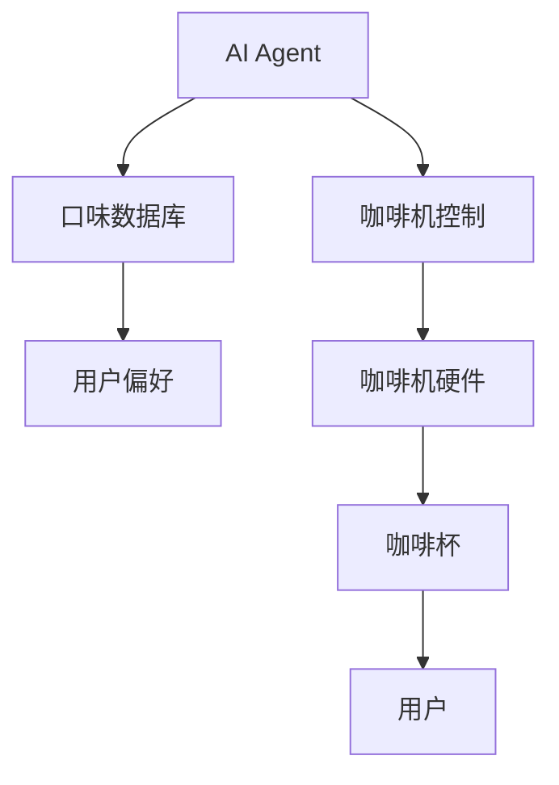
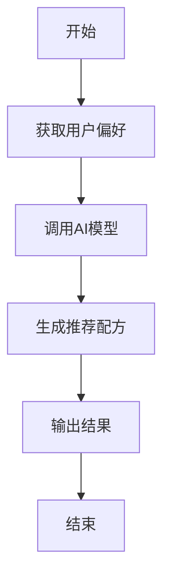
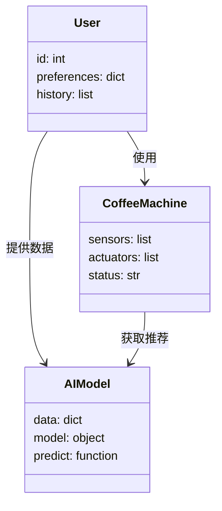
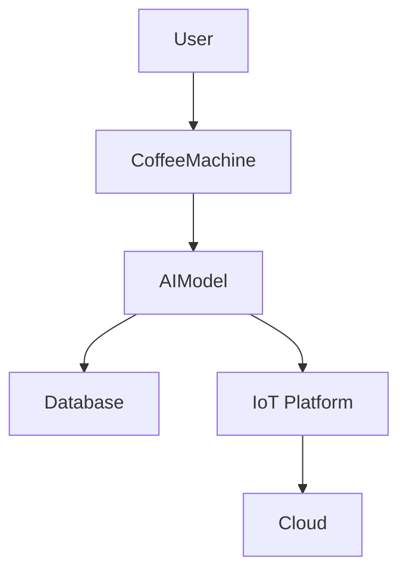
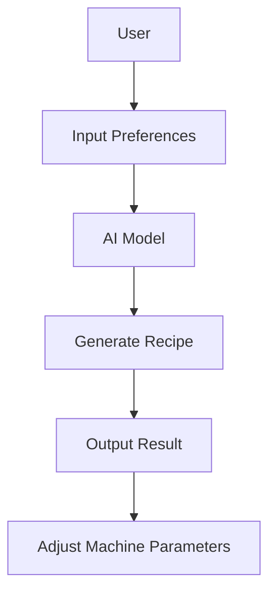

                 


# 智能咖啡机：AI Agent的个性化口味定制

> 关键词：AI Agent，智能咖啡机，个性化口味，算法原理，系统架构，项目实战

> 摘要：本文探讨了如何利用AI Agent技术实现智能咖啡机的个性化口味定制。通过分析AI Agent的核心原理、系统架构设计、算法实现以及实际项目案例，展示了如何通过技术手段满足用户的个性化需求，提升咖啡饮用体验。

---

## 第1章: AI Agent与智能咖啡机的背景

### 1.1 AI Agent的基本概念

#### 1.1.1 AI Agent的定义
AI Agent（人工智能代理）是指能够感知环境、自主决策并执行任务的智能实体。它通过传感器获取信息，利用算法进行分析和推理，并通过执行器与外部环境交互。

#### 1.1.2 AI Agent的核心特征
1. **自主性**：能够在没有人工干预的情况下独立运行。
2. **反应性**：能够实时感知环境变化并做出相应反应。
3. **目标导向**：具有明确的目标，并根据目标调整行为。
4. **学习能力**：能够通过经验或数据优化自身的决策能力。

#### 1.1.3 AI Agent的应用场景
- 智能助手（如Siri、Alexa）
- 推荐系统（如Netflix的电影推荐）
- 自动驾驶系统
- 智能客服

### 1.2 智能咖啡机的背景与现状

#### 1.2.1 咖啡机的历史发展
- 传统咖啡机：手动操作，功能单一。
- 半自动咖啡机：部分自动化，但仍需人工干预。
- 全自动咖啡机：具备自动化功能，但仍缺乏个性化。

#### 1.2.2 智能咖啡机的定义
智能咖啡机是一种结合了物联网和人工智能技术，能够实现自动制作、个性化推荐和智能控制的咖啡机。

#### 1.2.3 当前智能咖啡机的技术特点
- **物联网连接**：支持远程控制和数据传输。
- **传感器技术**：能够感知咖啡豆、水源等的状态。
- **自动化控制**：实现从选料到制作的全自动流程。

### 1.3 个性化口味定制的背景

#### 1.3.1 个性化口味的需求
- 不同用户对咖啡的偏好不同，如浓度、温度、风味等。
- 用户需求日益多样化，传统咖啡机无法满足个性化需求。

#### 1.3.2 传统咖啡机的局限性
- 功能单一，无法根据用户偏好调整。
- 缺乏数据支持，无法提供个性化推荐。
- 使用体验不够智能化，难以满足用户需求。

#### 1.3.3 AI技术在咖啡机中的应用潜力
- 通过AI算法分析用户数据，提供个性化推荐。
- 利用传感器和物联网技术实现精准控制。
- 通过学习用户行为优化咖啡制作流程。

---

## 第2章: 问题背景与目标

### 2.1 问题背景

#### 2.1.1 当前咖啡机的口味定制问题
- **缺乏个性化**：大多数咖啡机仅提供固定模式，无法满足用户个性化需求。
- **操作复杂**：用户需要手动调整参数，使用体验较差。
- **数据孤岛**：各咖啡机之间数据无法互通，难以形成完整的用户画像。

#### 2.1.2 用户需求与现有技术的差距
- 用户希望获得个性化的咖啡体验，但现有技术无法实现。
- 市场上缺乏真正智能化、个性化的咖啡机。

#### 2.1.3 个性化口味定制的必要性
- 提升用户体验，增强用户满意度。
- 通过个性化推荐增加咖啡机的使用频率。
- 推动咖啡机市场的技术升级和创新。

### 2.2 问题描述

#### 2.2.1 个性化口味定制的核心问题
- 如何通过AI技术分析用户的偏好，生成个性化咖啡配方。
- 如何实现咖啡机与用户的实时交互，动态调整咖啡制作参数。

#### 2.2.2 AI Agent在咖啡机中的角色
- 作为系统的核心，负责数据采集、分析和决策。
- 实现与用户的交互，动态调整咖啡制作参数。

#### 2.2.3 系统边界与外延
- **系统边界**：咖啡机本身、用户端和云端。
- **系统外延**：与物联网平台、第三方数据源的交互。

### 2.3 问题解决的思路

#### 2.3.1 AI Agent如何实现个性化口味定制
- **数据采集**：通过传感器采集用户偏好和环境数据。
- **数据分析**：利用机器学习算法分析数据，生成个性化配方。
- **动态调整**：根据实时数据优化咖啡制作参数。

#### 2.3.2 系统设计的核心要素
- **用户偏好数据库**：存储用户的口味偏好和历史数据。
- **AI算法模块**：负责数据分析和决策。
- **咖啡机控制模块**：根据决策结果调整咖啡机参数。

#### 2.3.3 系统功能的初步规划
- 用户注册与数据采集。
- 个性化配方生成与推荐。
- 实时调整与优化。

---

## 第3章: 核心概念与联系

### 3.1 核心概念原理

#### 3.1.1 AI Agent的基本原理
- **数据采集**：通过传感器获取环境数据和用户输入。
- **数据分析**：利用机器学习算法分析数据，生成决策。
- **决策执行**：根据决策结果调整系统参数或执行操作。

#### 3.1.2 个性化口味定制的实现原理
- **数据采集**：获取用户的口味偏好和历史数据。
- **数据分析**：利用算法分析数据，生成个性化配方。
- **动态调整**：根据实时数据优化咖啡制作参数。

#### 3.1.3 智能咖啡机的系统架构
- **硬件层**：咖啡机硬件、传感器。
- **数据层**：用户偏好数据库、历史数据。
- **算法层**：AI算法模块、决策模块。
- **用户层**：用户界面、交互模块。

### 3.2 核心概念属性对比

#### 3.2.1 AI Agent与传统咖啡机的对比

| 特性       | AI Agent咖啡机       | 传统咖啡机       |
|------------|----------------------|------------------|
| 自主性       | 高                   | 低               |
| 反应性       | 高                   | 低               |
| 个性化能力   | 高                   | 低               |
| 学习能力     | 高                   | 无               |

#### 3.2.2 个性化口味定制与传统口味定制的对比

| 特性       | 个性化口味定制       | 传统口味定制       |
|------------|----------------------|------------------|
| 定制方式     | AI算法驱动           | 固定模式           |
| 用户参与度   | 高                   | 低               |
| 灵活性       | 高                   | 低               |

#### 3.2.3 系统功能模块的对比

| 模块       | AI Agent系统         | 传统咖啡机系统     |
|------------|----------------------|------------------|
| 数据采集     | 传感器、用户输入     | 无或简单传感器     |
| 数据分析     | AI算法、机器学习     | 无或简单逻辑      |
| 决策执行     | 自动调整参数         | 手动调整或固定参数  |

### 3.3 系统架构图



---

## 第4章: 算法原理与实现

### 4.1 算法原理

#### 4.1.1 基于AI的口味推荐算法
- **协同过滤**：基于用户历史数据推荐相似的咖啡配方。
- **深度学习**：利用神经网络模型分析用户数据，生成个性化推荐。

#### 4.1.2 个性化口味定制的数学模型
- **输入层**：用户的口味偏好、历史数据。
- **隐藏层**：利用神经网络提取特征。
- **输出层**：生成个性化咖啡配方。

#### 4.1.3 算法实现流程
1. 数据采集：获取用户的口味偏好和历史数据。
2. 数据预处理：清洗数据，提取特征。
3. 模型训练：利用机器学习算法训练模型。
4. 模型推理：根据输入数据生成个性化配方。

### 4.2 算法流程图



### 4.3 算法实现

#### 4.3.1 Python代码实现

```python
# 示例代码：基于协同过滤的推荐算法
import numpy as np
from sklearn.metrics.pairwise import cosine_similarity

# 用户数据矩阵
users = ['user1', 'user2', 'user3']
preferences = {
    'user1': {'recipe1': 0.8, 'recipe2': 0.6},
    'user2': {'recipe1': 0.7, 'recipe3': 0.9},
    'user3': {'recipe2': 0.5, 'recipe3': 0.7}
}

# 计算用户相似度
def compute_user_similarity(preferences):
    # 创建用户-配方矩阵
    user_matrix = np.zeros((len(users), len(preferences[users[0]])))
    for i, user in enumerate(users):
        for j, recipe in enumerate(preferences[user].keys()):
            user_matrix[i][j] = preferences[user][recipe]
    # 计算余弦相似度
    similarity = cosine_similarity(user_matrix)
    return similarity

similarity_matrix = compute_user_similarity(preferences)
print("用户相似度矩阵：")
print(similarity_matrix)
```

#### 4.3.2 算法优化
- **数据预处理**：清洗和归一化数据。
- **模型调优**：优化算法参数，提高推荐准确率。
- **实时更新**：根据用户反馈实时更新模型。

---

## 第5章: 系统分析与架构设计

### 5.1 问题场景介绍

#### 5.1.1 用户需求
- 用户希望获得个性化的咖啡体验。
- 用户希望咖啡机能够根据自己的口味偏好自动调整参数。

#### 5.1.2 系统目标
- 实现个性化口味定制。
- 提供实时交互和动态调整功能。
- 确保系统的稳定性和可靠性。

### 5.2 系统功能设计

#### 5.2.1 领域模型



#### 5.2.2 系统架构



#### 5.2.3 系统接口设计
- **用户接口**：提供用户输入和结果显示。
- **AI接口**：与AI模型交互，获取推荐结果。
- **设备接口**：与咖啡机硬件交互，控制设备参数。

#### 5.2.4 系统交互流程图



### 5.3 系统实现

#### 5.3.1 系统模块划分
- **用户模块**：处理用户输入和偏好。
- **AI模块**：负责数据分析和决策。
- **咖啡机模块**：实现咖啡制作和参数调整。

#### 5.3.2 系统实现流程
1. 用户输入口味偏好。
2. AI模块根据用户数据生成推荐配方。
3. 咖啡机根据推荐配方调整参数，制作咖啡。
4. 用户反馈评价，系统更新用户偏好。

---

## 第6章: 项目实战

### 6.1 环境安装

#### 6.1.1 Python环境安装
```bash
python --version
pip install numpy scikit-learn
```

#### 6.1.2 系统依赖安装
```bash
pip install mermaid
```

### 6.2 核心实现

#### 6.2.1 数据采集模块
```python
import json

def get_user_preference(user_id):
    # 数据库查询用户偏好
    db = {
        'user1': {'recipe': 'espresso', 'strength': 80},
        'user2': {'recipe': 'cappuccino', 'strength': 60}
    }
    return db.get(user_id, {'recipe': 'espresso', 'strength': 70})
```

#### 6.2.2 AI算法模块
```python
from sklearn.neural_network import MLPRegressor

def train_model(data):
    # 数据预处理
    X = []
    y = []
    for user in data:
        X.append([data[user]['strength']])
        y.append(data[user]['rating'])
    # 训练模型
    model = MLPRegressor()
    model.fit(X, y)
    return model
```

#### 6.2.3 咖啡机控制模块
```python
def adjust_parameters(recipe, strength):
    # 调整咖啡机参数
    print(f"调整配方为：{recipe}，强度为：{strength}%")
```

### 6.3 项目小结

#### 6.3.1 实战案例分析
- **案例1**：用户1偏好意式浓缩，强度80%。
- **案例2**：用户2偏好卡布奇诺，强度60%。

#### 6.3.2 项目总结
- **优势**：实现了个性化口味定制，提升了用户体验。
- **不足**：算法精度有待提高，系统稳定性需要优化。

---

## 第7章: 总结与展望

### 7.1 总结

#### 7.1.1 核心内容回顾
- AI Agent在智能咖啡机中的应用。
- 个性化口味定制的实现原理。
- 系统架构设计与项目实战。

#### 7.1.2 实践价值
- 提升用户咖啡体验。
- 推动智能咖啡机的技术创新。
- 为其他智能设备提供参考。

### 7.2 展望

#### 7.2.1 硬件与AI的结合
- 更智能的传感器和执行器。
- 更高效的AI算法。

#### 7.2.2 数据安全与隐私保护
- 数据加密技术。
- 用户隐私保护措施。

#### 7.2.3 未来发展方向
- 多功能集成：结合其他智能设备。
- 智能化升级：更智能的交互和决策。

---

## 结语

智能咖啡机的个性化口味定制是人工智能技术在生活中的一个重要应用。通过AI Agent技术，我们能够实现更智能、更个性化的咖啡体验。未来，随着技术的不断发展，智能咖啡机将更加智能化、个性化，为用户带来更美好的生活体验。

---

## 作者

作者：AI天才研究院/AI Genius Institute & 禅与计算机程序设计艺术 /Zen And The Art of Computer Programming

