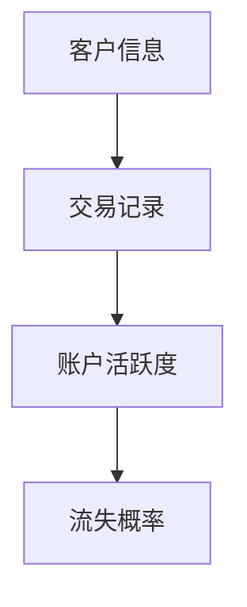
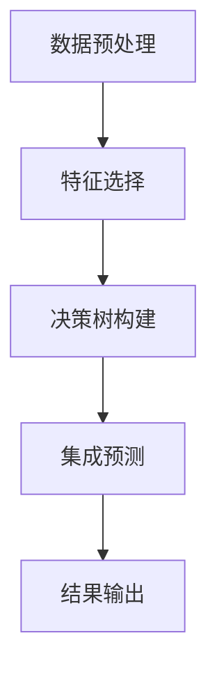
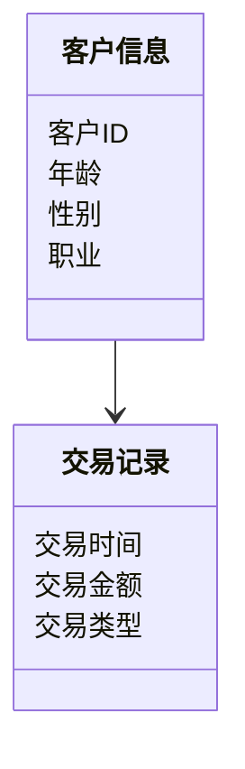
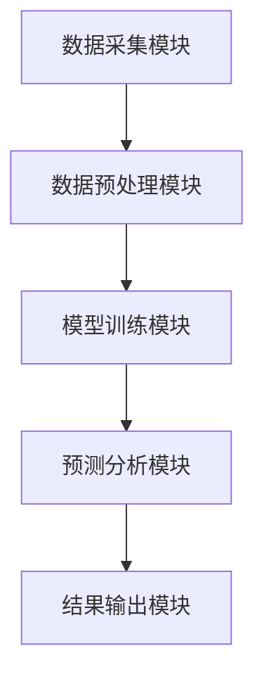
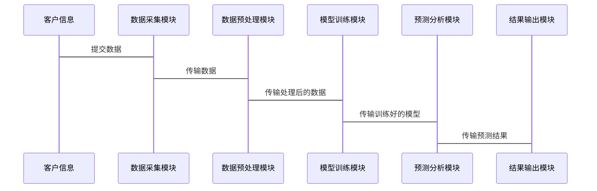

                 


# 智能商业银行存款流失预测

> 关键词：智能预测，商业银行，存款流失，机器学习，随机森林

> 摘要：随着银行业竞争的加剧，存款流失问题日益成为商业银行面临的重要挑战。本文将介绍如何利用智能预测技术，特别是基于机器学习的随机森林算法，来预测存款流失风险。通过分析数据特征、构建预测模型、设计系统架构，并结合实际案例，本文将详细阐述智能预测在商业银行存款管理中的应用，为银行提供有效的风险管理工具。

---

# 第1章: 商业银行存款流失问题背景

## 1.1 商业银行的基本业务与存款管理

### 1.1.1 商业银行的基本业务介绍
商业银行是现代金融体系的重要组成部分，其主要业务包括存款、贷款、投资、理财和支付结算等。其中，存款业务是商业银行的核心业务之一，是银行的主要资金来源。

### 1.1.2 存款业务的重要性
存款业务不仅为商业银行提供稳定的资金来源，还为银行开展其他业务提供了基础。同时，存款规模也是衡量银行实力的重要指标。

### 1.1.3 存款流失的定义与分类
存款流失是指客户将存款转移至其他银行或选择其他金融产品，导致商业银行存款规模减少的现象。根据流失的时间和原因，存款流失可以分为自然流失、竞争流失和策略性流失。

## 1.2 存款流失问题的背景与挑战

### 1.2.1 当前商业银行面临的竞争环境
随着金融市场的开放和互联网技术的发展，客户可以轻松比较不同银行的存款利率和服务，导致银行间的竞争加剧。

### 1.2.2 存款流失的常见原因
- 利率低：客户可能将资金转移到提供更高利率的银行。
- 服务质量差：客户对银行的服务不满意，可能选择其他银行。
- 产品竞争力弱：银行提供的存款产品缺乏吸引力。

### 1.2.3 存款流失问题的严重性
存款流失不仅会影响银行的财务状况，还可能导致客户信任度下降，进而影响银行的声誉和市场地位。

## 1.3 智能预测在存款流失管理中的作用

### 1.3.1 数据驱动的管理新趋势
传统上，商业银行依赖经验判断客户流失风险，而智能预测通过数据分析提供更精确的支持。

### 1.3.2 智能预测的核心价值
智能预测能够提前识别潜在的流失客户，帮助银行采取主动措施，减少存款流失。

### 1.3.3 技术进步对智能预测的推动
随着机器学习和大数据技术的发展，智能预测在金融领域的应用越来越广泛。

## 1.4 本章小结
本章介绍了商业银行的基本业务，分析了存款流失的定义和原因，并探讨了智能预测在存款管理中的重要性。

---

# 第2章: 智能存款流失预测的核心概念

## 2.1 智能存款流失预测的定义与特点

### 2.1.1 智能预测的定义
智能存款流失预测是利用机器学习等技术，通过分析客户数据，预测客户流失风险的过程。

### 2.1.2 智能预测的核心特点
- 数据驱动：基于客户行为数据进行分析。
- 高精度：通过算法优化预测准确性。
- 可解释性：模型能够解释预测结果的原因。

## 2.2 存款流失预测的关键要素

### 2.2.1 预测模型的输入变量
- 客户的基本信息（年龄、职业等）。
- 存款金额、交易频率、账户活跃度。
- 客户投诉记录、满意度评分。

### 2.2.2 模型输出的判断标准
- 流失概率：预测客户流失的可能性。
- 风险等级：根据流失概率划分风险等级。

### 2.2.3 预测结果的可解释性
模型需要能够解释预测结果的原因，以便银行采取针对性措施。

## 2.3 数据特征与关系分析

### 2.3.1 客户行为数据的特征提取
- 时间特征：最近一次交易的时间。
- 行为特征：交易频率、账户活跃度。
- 资金特征：存款余额、资金流动情况。

### 2.3.2 历史流失数据的关联性分析
- 分析历史流失客户的共同特征。
- 找出流失客户的模式和规律。

### 2.3.3 数据特征与流失概率的关系
通过分析数据特征与流失概率的关系，可以构建数据关系模型。

## 2.4 数据关系模型构建

### 2.4.1 数据关系的定义
数据关系是指不同数据特征之间的影响关系。

### 2.4.2 数据关系的可视化
使用ER图展示数据关系。



### 2.4.3 数据关系的数学表达
通过回归分析等方法，建立数据关系的数学模型。

## 2.5 本章小结
本章详细介绍了智能存款流失预测的核心概念，分析了数据特征与流失概率的关系，并构建了数据关系模型。

---

# 第3章: 智能存款流失预测的算法原理

## 3.1 机器学习算法的选择与比较

### 3.1.1 常见的存款流失预测算法
- 线性回归
- 支持向量机
- 随机森林
- 神经网络

### 3.1.2 各算法的优缺点分析
- 随机森林：适合高维数据，抗过拟合能力强。
- 神经网络：非线性能力强，但需要大量数据。

### 3.1.3 算法选择的依据
根据数据特征和预测目标选择合适的算法。

## 3.2 随机森林算法的原理与实现

### 3.2.1 随机森林的基本原理
随机森林是一种基于决策树的集成学习算法，通过构建多个决策树并进行投票或平均，提高预测准确性。

### 3.2.2 随机森林的训练过程



### 3.2.3 随机森林的特征重要性分析
通过特征重要性分析，找出影响流失概率的关键因素。

## 3.3 随机森林算法的数学模型

### 3.3.1 决策树的结构
决策树是一种树状结构，每个节点代表一个特征，每个分支代表一个决策。

### 3.3.2 随机森林的数学表达
随机森林通过集成多个决策树的预测结果，得到最终的预测结果。

## 3.4 本章小结
本章介绍了机器学习算法的选择与比较，详细讲解了随机森林算法的原理与实现，并分析了其数学模型。

---

# 第4章: 智能存款流失预测的系统分析与架构设计

## 4.1 问题场景介绍

### 4.1.1 问题背景
商业银行需要实时监测客户流失风险。

### 4.1.2 问题描述
构建一个智能预测系统，实时预测客户流失风险。

## 4.2 系统功能设计

### 4.2.1 系统功能模块
- 数据采集模块
- 数据预处理模块
- 模型训练模块
- 预测分析模块

### 4.2.2 系统功能的领域模型



## 4.3 系统架构设计

### 4.3.1 系统架构图



### 4.3.2 系统接口设计
- 数据输入接口
- 模型训练接口
- 预测结果接口

### 4.3.3 系统交互设计



## 4.4 本章小结
本章分析了智能存款流失预测系统的功能模块和系统架构，设计了系统的接口和交互流程。

---

# 第5章: 智能存款流失预测的项目实战

## 5.1 环境安装与数据准备

### 5.1.1 环境安装
安装Python、Scikit-learn、Pandas等库。

### 5.1.2 数据准备
收集客户信息和交易记录数据。

## 5.2 系统核心实现源代码

### 5.2.1 数据预处理代码

```python
import pandas as pd
from sklearn.preprocessing import StandardScaler

# 读取数据
data = pd.read_csv('customer.csv')

# 数据清洗
data.dropna(inplace=True)

# 特征提取
X = data[['age', 'income', 'transaction_frequency']]
y = data['churn']

# 数据标准化
scaler = StandardScaler()
X_scaled = scaler.fit_transform(X)
```

### 5.2.2 模型训练代码

```python
from sklearn.ensemble import RandomForestClassifier

# 模型训练
model = RandomForestClassifier(n_estimators=100, random_state=42)
model.fit(X_scaled, y)
```

### 5.2.3 预测分析代码

```python
# 预测结果
predictions = model.predict(X_scaled)
print("预测结果：", predictions)
```

## 5.3 实际案例分析与解读

### 5.3.1 案例分析
分析一个客户的预测结果，解释预测过程。

### 5.3.2 案例解读
通过特征重要性分析，找出影响客户流失的关键因素。

## 5.4 项目总结与优化建议

### 5.4.1 项目成果
成功构建智能预测系统，准确率较高。

### 5.4.2 项目不足
数据量不足，模型可能需要优化。

## 5.5 本章小结
本章通过实际案例展示了智能预测系统的实现过程，分析了项目成果和不足。

---

# 第6章: 智能存款流失预测的最佳实践

## 6.1 小结

### 6.1.1 核心内容回顾
回顾智能预测的核心概念和算法原理。

### 6.1.2 项目实施的关键点
数据质量、模型选择、特征工程。

## 6.2 注意事项

### 6.2.1 数据隐私保护
确保数据处理符合隐私保护法规。

### 6.2.2 模型可解释性
模型需要能够解释预测结果的原因。

### 6.2.3 模型更新与维护
定期更新模型，确保预测准确性。

## 6.3 拓展阅读

### 6.3.1 深度学习的应用
探讨深度学习在智能预测中的应用。

### 6.3.2 金融领域的其他应用
分析智能预测在其他金融领域的应用。

## 6.4 本章小结
本章总结了智能预测的最佳实践，提出了注意事项和拓展方向。

---

# 作者：AI天才研究院/AI Genius Institute & 禅与计算机程序设计艺术 /Zen And The Art of Computer Programming

