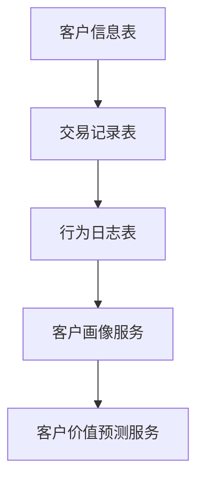

                 


```markdown
# 智能商业银行客户价值分析

## 关键词：智能商业银行，客户价值分析，人工智能，大数据，机器学习，数据分析

## 摘要：本文深入探讨智能商业银行客户价值分析的核心概念、算法原理、系统架构设计及项目实战，旨在通过数据分析与智能技术提升商业银行客户价值评估的精准性与效率。文章从背景介绍、理论框架、算法实现、系统设计到实际案例，系统地阐述了如何利用智能技术优化商业银行客户价值分析，为金融机构提供数据驱动的决策支持。

---

# 第一部分: 智能商业银行客户价值分析的背景与概念

## 第1章: 智能商业银行客户价值分析的背景

### 1.1 智能商业银行的背景与现状

#### 1.1.1 银行行业的数字化转型
随着互联网、大数据和人工智能技术的快速发展，传统商业银行正在经历数字化转型。银行从单纯的线下服务模式向线上化、智能化方向发展，客户体验和业务效率成为核心竞争力。

#### 1.1.2 智能技术在银行的应用
智能技术（如机器学习、自然语言处理、计算机视觉等）在银行业务中的应用日益广泛。智能客服、智能风控、智能投顾等场景的落地，推动了银行服务的智能化升级。

#### 1.1.3 客户价值分析的重要性
客户价值分析是商业银行优化资源配置、提升客户满意度和忠诚度的重要手段。通过分析客户行为和需求，银行可以制定精准的营销策略，提高客户转化率和留存率。

### 1.2 客户价值分析的定义与意义

#### 1.2.1 客户价值的定义
客户价值是指客户为银行创造或可能创造的经济价值，包括直接收入、潜在收入、客户生命周期价值等。客户价值分析的目的是识别高价值客户，优化资源配置，降低获客成本。

#### 1.2.2 客户价值分析在银行中的作用
客户价值分析帮助银行实现客户细分、精准营销、风险控制和客户关系管理。通过分析客户的行为数据，银行可以更好地理解客户需求，提供个性化服务。

#### 1.2.3 数据驱动的客户价值分析
基于数据的客户价值分析能够通过历史交易数据、行为数据和外部数据，构建客户画像，预测客户未来行为，从而实现精准营销和风险控制。

### 1.3 商业银行客户价值分析的现状与趋势

#### 1.3.1 当前商业银行客户分析的挑战
传统客户价值分析方法依赖于经验判断，存在主观性强、数据利用率低、模型泛化能力弱等问题。随着市场竞争加剧和客户需求多样化，传统方法难以满足精准营销的需求。

#### 1.3.2 智能技术如何解决这些问题
智能技术（如机器学习、大数据分析）能够提高客户价值分析的精准度和效率。通过挖掘海量数据，智能算法可以发现潜在客户价值，优化资源配置。

#### 1.3.3 未来发展趋势与机遇
未来的商业银行客户价值分析将更加智能化和个性化。基于AI的实时数据分析和动态客户画像，银行可以提供更加精准和个性化的服务，提升客户体验和满意度。

---

## 第2章: 客户价值分析的核心概念与理论

### 2.1 客户价值分析的核心概念

#### 2.1.1 客户生命周期
客户生命周期包括获取、成长、成熟、衰退和流失阶段。不同阶段的客户价值和行为特征不同，银行需要针对不同阶段的客户制定相应的策略。

#### 2.1.2 客户细分与分类
客户细分是将客户按某些特征（如收入、消费习惯、信用评分等）进行分类，以便制定差异化的服务策略。客户分类可以帮助银行识别高价值客户和潜在流失客户。

#### 2.1.3 客户行为分析
客户行为分析是通过分析客户的交易记录、访问记录、点击流数据等，了解客户的消费习惯、偏好和行为模式，从而预测客户行为。

### 2.2 数据分析基础

#### 2.2.1 数据采集与处理
数据采集包括从银行系统、外部数据源等渠道获取客户数据。数据处理包括数据清洗、特征提取、数据转换等步骤，为后续分析提供干净的数据集。

#### 2.2.2 数据分析方法
数据分析方法包括描述性分析、诊断性分析、预测性分析和规范性分析。在客户价值分析中，预测性分析（如客户价值预测）和诊断性分析（如客户流失分析）尤为重要。

#### 2.2.3 数据可视化
数据可视化是通过图表、仪表盘等形式直观展示数据分析结果。常见的可视化方法包括柱状图、折线图、散点图、热力图等。

### 2.3 客户价值分析的理论框架

#### 2.3.1 客户价值模型
客户价值模型是用于评估客户价值的数学模型。常见的模型包括RFM模型（基于客户的最近一次交易、交易频率和交易金额）、CVA模型（基于客户生命周期价值）等。

#### 2.3.2 数据挖掘与机器学习在客户价值分析中的应用
数据挖掘技术用于从海量数据中提取有价值的信息。机器学习算法（如聚类、分类、回归）用于客户细分、预测客户价值和识别高风险客户。

#### 2.3.3 实证分析与案例研究
通过实际案例分析，展示如何利用数据挖掘和机器学习技术进行客户价值分析，验证模型的准确性和实用性。

---

## 第3章: 客户价值分析的算法原理

### 3.1 常见的客户价值分析算法

#### 3.1.1 聚类分析
聚类分析用于将客户分成不同的群组，每个群组内的客户具有相似的特征。常用算法包括K-means、DBSCAN等。

#### 3.1.2 回归分析
回归分析用于预测客户的价值，如客户 lifetime value（CLV）的预测。线性回归、逻辑回归等算法常用于此类预测任务。

#### 3.1.3 决策树与随机森林
决策树是一种直观的分类和回归算法，适用于客户细分和分类。随机森林是一种基于决策树的集成算法，具有较高的准确性和鲁棒性。

### 3.2 聚类分析的实现

#### 3.2.1 K-means算法
K-means是一种经典的聚类算法，适用于客户细分。算法步骤包括初始化质心、计算距离、更新质心、重复迭代直到收敛。

#### 3.2.2 层次聚类
层次聚类是一种基于树状结构的聚类方法，适用于客户细分和层次化分析。算法步骤包括计算相似度矩阵、合并最相似的簇、构建树状结构。

#### 3.2.3 DBSCAN算法
DBSCAN是一种基于密度的聚类算法，适用于处理噪声数据。算法步骤包括计算每个点的密度、扩展高密度区域、合并相邻的高密度区域。

### 3.3 回归分析的实现

#### 3.3.1 线性回归
线性回归用于预测连续型变量，如客户价值。通过最小二乘法拟合回归线，评估模型的拟合优度和显著性。

#### 3.3.2 逻辑回归
逻辑回归用于分类任务，如客户 churn（流失）预测。通过sigmoid函数将线性回归输出转化为概率，评估模型的分类性能。

#### 3.3.3 线性回归的数学模型
线性回归的数学模型为：$$ y = \beta_0 + \beta_1 x_1 + \beta_2 x_2 + \dots + \beta_n x_n + \epsilon $$

### 3.4 决策树与随机森林的实现

#### 3.4.1 决策树算法
决策树算法包括ID3、C4.5、CART等。通过信息增益或基尼指数选择特征，构建决策树。

#### 3.4.2 随机森林算法
随机森林是一种集成算法，通过随机选择特征和样本，构建多棵决策树，通过投票或平均方式得到最终结果。

#### 3.4.3 决策树的优缺点
决策树优点：直观易懂、适合中小数据集、鲁棒性强。缺点：对噪声数据敏感、容易过拟合。

---

## 第4章: 系统分析与架构设计

### 4.1 系统分析

#### 4.1.1 问题场景介绍
商业银行客户价值分析系统需要处理海量数据，实时分析客户行为，预测客户价值，优化资源配置。

#### 4.1.2 项目介绍
本项目旨在开发一个基于机器学习的客户价值分析系统，帮助银行实现客户细分、精准营销和风险控制。

### 4.2 系统功能设计

#### 4.2.1 领域模型设计
领域模型设计包括客户信息表、交易记录表、行为日志表等实体，通过ER图展示各实体之间的关系。

#### 4.2.2 系统架构设计
系统架构采用分层架构，包括数据层、业务逻辑层和表现层。通过组件化设计，提高系统的可扩展性和可维护性。

#### 4.2.3 系统架构图


#### 4.2.4 系统接口设计
系统接口包括数据接口（数据导入、数据导出）、模型接口（训练模型、预测客户价值）、用户接口（数据可视化、结果查询）。

#### 4.2.5 系统交互流程
系统交互流程包括数据采集、数据预处理、模型训练、结果分析和可视化展示。

---

## 第5章: 项目实战

### 5.1 环境配置

#### 5.1.1 安装Python环境
安装Python 3.x，配置Jupyter Notebook、Pandas、NumPy、Scikit-learn、Matplotlib等库。

#### 5.1.2 数据获取与清洗
从银行系统获取客户数据，清洗缺失值、异常值，进行数据转换和特征提取。

### 5.2 核心实现

#### 5.2.1 数据预处理
使用Pandas进行数据清洗，特征工程包括标准化、分箱、特征选择等。

#### 5.2.2 模型训练
使用Scikit-learn训练聚类模型、回归模型和分类模型，评估模型性能，选择最优模型。

#### 5.2.3 模型部署
将训练好的模型部署到生产环境，通过API接口提供客户价值预测服务。

### 5.3 实际案例分析

#### 5.3.1 数据分析与建模
以某银行客户数据为例，进行客户细分和客户价值预测，展示模型的应用效果。

#### 5.3.2 模型评估与优化
通过交叉验证评估模型性能，调整参数优化模型，提高预测准确率。

#### 5.3.3 可视化展示
使用Matplotlib和Seaborn绘制客户画像、模型结果可视化，帮助银行更好地理解客户价值。

### 5.4 项目小结

#### 5.4.1 项目成果
通过项目实战，掌握了智能商业银行客户价值分析的核心技术，实现了客户细分和价值预测。

#### 5.4.2 经验总结
数据预处理是关键，模型选择和调优直接影响结果，可视化展示有助于结果解读和决策支持。

---

## 第6章: 总结与展望

### 6.1 全文总结

#### 6.1.1 核心内容回顾
本文系统地介绍了智能商业银行客户价值分析的背景、核心概念、算法原理、系统设计和项目实战，展示了如何利用智能技术提升客户价值分析的精准性和效率。

#### 6.1.2 本文的创新点
本文结合实际案例，详细讲解了机器学习算法在客户价值分析中的应用，提出了基于分层架构的系统设计方案。

### 6.2 未来展望

#### 6.2.1 当前存在的挑战
数据隐私保护、模型解释性、实时性等是当前智能商业银行客户价值分析面临的主要挑战。

#### 6.2.2 未来发展方向
随着AI技术的不断进步，未来的客户价值分析将更加智能化、个性化和实时化。基于深度学习的客户画像和实时行为分析将成为研究热点。

#### 6.2.3 最佳实践
建议银行在实际应用中注重数据隐私保护，选择合适的算法和模型，建立数据驱动的文化，培养数据分析人才。

---

# 附录: 常用工具与资源

## 附录A: Python数据分析工具

- Pandas: 数据处理与分析
- NumPy: 数组处理与计算
- Scikit-learn: 机器学习算法
- Matplotlib: 数据可视化

## 附录B: 开发环境配置

- 安装Python 3.8+
- 安装Jupyter Notebook
- 安装相关库：pip install numpy pandas scikit-learn matplotlib

## 附录C: 数据来源与处理

- 数据来源：银行内部数据、外部数据接口
- 数据清洗：处理缺失值、异常值
- 特征工程：标准化、分箱、特征选择

---

# 作者：AI天才研究院/AI Genius Institute & 禅与计算机程序设计艺术 /Zen And The Art of Computer Programming
```

