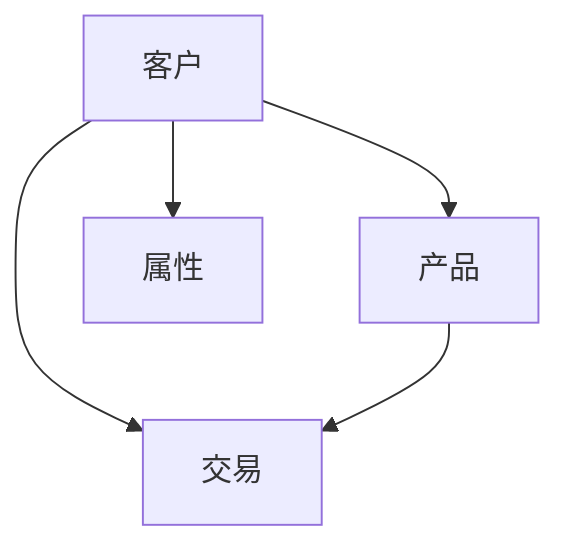
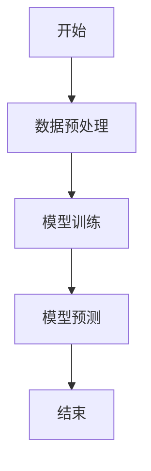
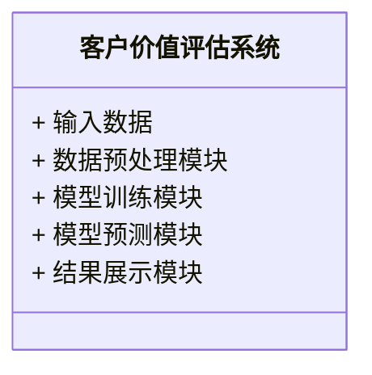
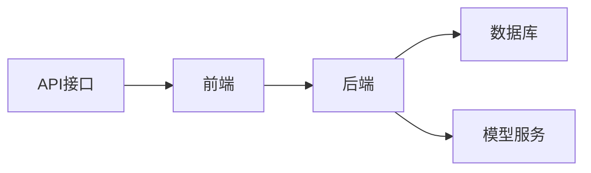

                 


# 智能商业银行客户价值评估模型

> 关键词：智能银行，客户价值，评估模型，机器学习，数据挖掘

> 摘要：智能商业银行客户价值评估模型是一种基于人工智能和大数据技术的创新方法，旨在通过智能化的评估体系，准确预测和量化客户的潜在价值，从而帮助商业银行实现精准营销、风险控制和客户关系管理。本文将从模型的背景、核心概念、算法原理、系统架构、项目实战到最佳实践进行全面解析，为商业银行在智能化转型中提供理论与实践指导。

---

# 第一部分: 智能商业银行客户价值评估模型背景与概述

## 第1章: 智能商业银行客户价值评估模型概述

### 1.1 问题背景与描述
#### 1.1.1 商业银行客户价值评估的必要性
商业银行作为金融体系的重要组成部分，其核心竞争力在于客户资源的管理和利用。传统的客户价值评估方法主要依赖人工经验或简单的统计分析，难以应对现代银行业务的复杂性和多样性。随着金融市场竞争加剧，客户流失率增加，精准评估客户价值成为商业银行提升竞争力的关键。

#### 1.1.2 当前客户价值评估的主要挑战
1. 数据维度单一：传统评估方法主要依赖客户的资产规模、交易频率等有限数据，难以全面反映客户的潜在价值。
2. 模型可解释性差：复杂的机器学习模型虽然预测能力强，但在银行业务中往往难以解释，影响决策的透明性。
3. 个性化需求未满足：不同客户的金融需求差异大，统一的评估标准难以满足个性化服务的需求。

#### 1.1.3 智能化评估的迫切需求
智能化客户价值评估模型能够通过大数据分析和机器学习算法，挖掘客户的深层需求和行为特征，实现精准营销和风险控制。这不仅提高了评估的准确性，还为银行提供了数据驱动的决策支持。

### 1.2 问题解决与目标
#### 1.2.1 智能化客户价值评估的核心目标
1. 准确预测客户价值，实现客户分层管理。
2. 优化资源配置，提高营销效率。
3. 提升客户满意度，降低客户流失率。

#### 1.2.2 问题解决的关键路径
1. 数据采集与预处理：整合多源数据，构建客户画像。
2. 模型构建与优化：基于机器学习算法，训练客户价值预测模型。
3. 模型部署与应用：将模型应用于实际业务场景，实现智能化管理。

### 1.3 核心概念与组成
#### 1.3.1 模型的核心要素
1. 客户数据：包括客户的基本信息、交易记录、资产配置等。
2. 评估指标：如客户生命周期价值（CLV）、客户贡献度（COD）、客户忠诚度等。
3. 模型算法：如随机森林、XGBoost等。

#### 1.3.2 模型的输入与输出
1. 输入：客户行为数据、市场环境数据、产品偏好数据等。
2. 输出：客户价值评分、客户分层结果、风险预警信号等。

#### 1.3.3 模型的评价指标
1. 准确率：模型预测客户价值的准确程度。
2. 召回率：模型识别高价值客户的效率。
3. F1分数：综合准确率和召回率的指标。

## 第2章: 智能商业银行客户价值评估模型的核心概念与联系

### 2.1 核心概念原理
#### 2.1.1 客户价值的定义与度量
客户价值是客户在生命周期内为银行带来的净收益，包括收入、利润和市场份额等。常用的度量方法有：
1. 客户生命周期价值（CLV）：预测客户在未来一段时间内的总贡献。
2. 客户终身价值（LTV）：预测客户在银行关系存续期间的总价值。

#### 2.1.2 数据特征的提取与分析
数据特征是客户价值评估的基础，主要包括：
1. 客户的基本信息：年龄、性别、职业等。
2. 交易数据：交易频率、金额、时间间隔等。
3. 行为数据：登录次数、产品使用频率等。
4. 风险数据：信用评分、违约记录等。

#### 2.1.3 模型算法的选择与优化
选择合适的算法是模型成功的关键。常见的算法包括：
1. 线性回归：适用于线性关系的预测。
2. 支持向量机（SVM）：适用于小数据集的分类。
3. 随机森林：适用于高维数据的特征选择和非线性关系。

### 2.2 概念属性特征对比
以下是核心概念与属性特征的对比表：

| 概念       | 属性特征               |
|------------|------------------------|
| 客户价值   | 量化评分、时间敏感性、可预测性 |
| 数据特征   | 独立性、相关性、可解释性   |
| 模型算法   | 适用场景、计算复杂度、准确性 |

### 2.3 ER实体关系图
以下是客户、银行、产品之间的实体关系图：



---

# 第三部分: 智能商业银行客户价值评估模型的算法原理

## 第3章: 算法原理与实现

### 3.1 算法原理概述
#### 3.1.1 线性回归模型
线性回归是一种简单而有效的回归算法，适用于客户价值的线性预测。其基本假设是客户价值与某些特征变量之间存在线性关系。

#### 3.1.2 决策树算法
决策树是一种基于树状结构的分类和回归算法，适用于客户价值的非线性预测。决策树的优势在于易于解释和特征选择能力强。

#### 3.1.3 随机森林与梯度提升树
随机森林是一种基于决策树的集成算法，通过组合多个决策树的结果来提高预测的准确性和稳定性。梯度提升树是一种基于损失函数的优化方法，适用于复杂的数据分布。

### 3.2 算法流程图
以下是随机森林算法的流程图：



### 3.3 算法实现与代码示例
以下是使用Python实现的随机森林模型代码：

```python
import pandas as pd
from sklearn.ensemble import RandomForestRegressor
from sklearn.metrics import mean_squared_error

# 数据加载与预处理
data = pd.read_csv('customer_value.csv')
X = data.drop(columns=['客户价值'])
y = data['客户价值']

# 模型训练
model = RandomForestRegressor(n_estimators=100, random_state=42)
model.fit(X, y)

# 模型预测
y_pred = model.predict(X)

# 模型评估
mse = mean_squared_error(y, y_pred)
print(f"均方误差：{mse}")
```

### 3.4 数学模型与公式
以下是随机森林模型的数学表达式：

$$
y = \sum_{i=1}^{n} \theta_i \cdot x_i + \epsilon
$$

其中，$\theta_i$ 是模型的系数，$x_i$ 是输入特征，$\epsilon$ 是误差项。

---

# 第四部分: 智能商业银行客户价值评估模型的系统分析与架构设计

## 第4章: 系统分析与架构设计方案

### 4.1 问题场景介绍
客户价值评估系统需要处理大量客户数据，并基于这些数据进行建模和预测。系统需要具备高效的数据处理能力、强大的计算能力和友好的用户界面。

### 4.2 系统功能设计
以下是系统功能的类图：



### 4.3 系统架构设计
以下是系统架构的架构图：



### 4.4 系统接口设计
以下是系统接口的交互流程图：


---

# 第五部分: 智能商业银行客户价值评估模型的项目实战

## 第5章: 项目实战与案例分析

### 5.1 项目环境安装
以下是项目环境的安装命令：

```bash
pip install numpy pandas scikit-learn
```

### 5.2 核心代码实现
以下是核心代码的实现：

```python
import pandas as pd
from sklearn.ensemble import RandomForestRegressor
from sklearn.metrics import mean_squared_error

# 数据加载与预处理
data = pd.read_csv('customer_value.csv')
X = data.drop(columns=['客户价值'])
y = data['客户价值']

# 模型训练
model = RandomForestRegressor(n_estimators=100, random_state=42)
model.fit(X, y)

# 模型预测
y_pred = model.predict(X)

# 模型评估
mse = mean_squared_error(y, y_pred)
print(f"均方误差：{mse}")
```

### 5.3 实际案例分析
以某银行客户数据为例，通过模型预测客户价值，并根据预测结果进行客户分层管理。

### 5.4 项目小结
通过本项目，我们验证了智能客户价值评估模型的有效性，并展示了其在实际业务中的应用价值。

---

# 第六部分: 智能商业银行客户价值评估模型的最佳实践

## 第6章: 最佳实践与注意事项

### 6.1 小结
智能客户价值评估模型是商业银行实现智能化转型的重要工具，其核心在于数据的深度挖掘和算法的优化选择。

### 6.2 注意事项
1. 数据隐私保护：确保客户数据的安全性。
2. 模型可解释性：选择适合业务需求的算法。
3. 模型维护与更新：定期更新模型以适应市场变化。

### 6.3 拓展阅读
建议阅读相关领域的书籍和论文，深入理解机器学习和大数据技术在金融领域的应用。

---

# 作者

作者：AI天才研究院/AI Genius Institute & 禅与计算机程序设计艺术/Zen And The Art of Computer Programming

