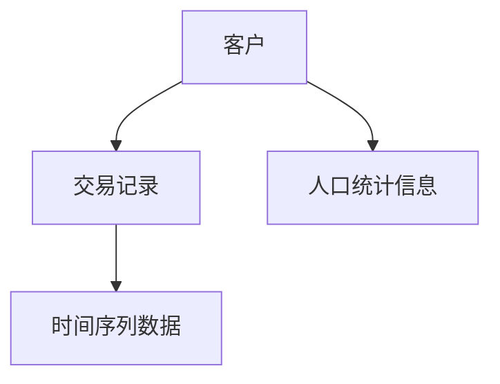
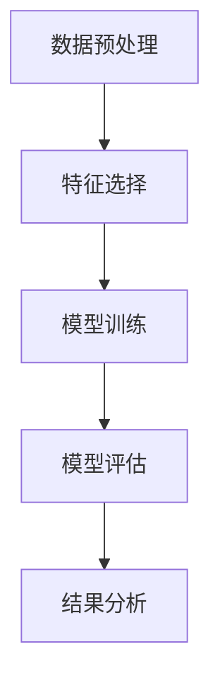
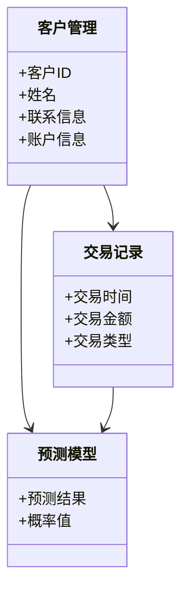
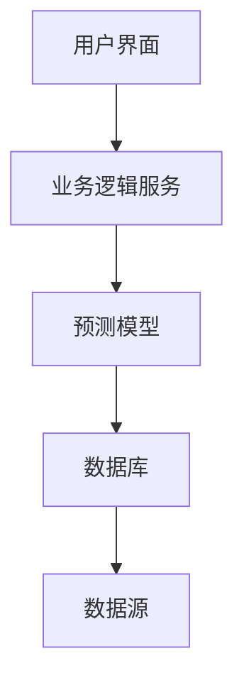
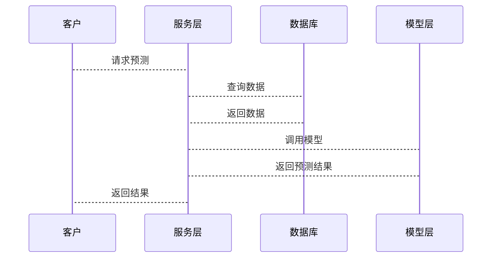

                 


# 智能商业银行客户流失预测

## 关键词：智能银行、客户流失、预测模型、机器学习、大数据分析

## 摘要

本文深入探讨了智能商业银行客户流失预测的核心问题，结合大数据分析和机器学习技术，详细阐述了预测模型的构建过程，从数据特征分析到算法选择，再到系统架构设计，最终通过项目实战展示解决方案。文章旨在帮助商业银行利用智能技术降低客户流失率，提升客户满意度和业务收益。

---

## 第一部分：背景介绍

### 第1章：问题背景

#### 1.1 客户流失的定义与影响
客户流失指的是客户不再使用银行服务，导致收入减少和市场份额流失。银行需通过预测模型提前识别高风险客户，采取措施降低流失率。

#### 1.2 问题解决方法
利用机器学习模型分析客户数据，预测流失风险，制定个性化策略。

#### 1.3 智能商业银行的特点
智能银行通过大数据和AI技术，实现精准营销和风险管理。

---

## 第二部分：核心概念与联系

### 第2章：核心概念与联系

#### 2.1 数据特征分析
客户属性包括年龄、职业、资产规模，行为特征如交易频率、渠道偏好，时间序列特征如最近交易时间。

#### 2.2 模型选择对比
| 模型 | 优点 | 缺点 |
|------|------|------|
| 随机森林 | 高准确性，处理非线性关系 | 对特征重要性解释较难 |
| XGBoost | 高效，适合大数据集 | 易过拟合 |
| 深度学习 | 高精度 | 计算资源需求大 |

#### 2.3 实体关系图


---

## 第三部分：算法原理讲解

### 第3章：算法原理与实现

#### 3.1 算法原理
- **随机森林**：集成学习，通过多个决策树投票结果，提高准确性和鲁棒性。
- **XGBoost**：基于树的提升方法，通过正则化和损失函数优化，防止过拟合。

#### 3.2 算法流程图


#### 3.3 Python实现
```python
import pandas as pd
from sklearn.ensemble import RandomForestClassifier
from sklearn.metrics import accuracy_score

# 数据预处理
data = pd.read_csv('customer_data.csv')
X = data.drop('churn', axis=1)
y = data['churn']

# 模型训练
model = RandomForestClassifier()
model.fit(X, y)

# 模型评估
预测 = model.predict(X)
准确率 = accuracy_score(y, 预测)
print(准确率)
```

#### 3.4 数学模型
- 概率公式：$$P(y=1) = \sum_{i=1}^{n} w_i \cdot I(f(x) \leq t_i)$$
- 损失函数：$$L = -\frac{1}{m}\sum_{i=1}^{m} [y_i \log(p_i) + (1 - y_i)\log(1 - p_i)]$$

---

## 第四部分：系统分析与架构设计

### 第4章：系统架构设计

#### 4.1 问题场景
商业银行需要实时监测客户行为，预测流失风险，并及时干预。

#### 4.2 系统功能设计


#### 4.3 系统架构图


#### 4.4 接口设计与交互


---

## 第五部分：项目实战

### 第5章：项目实战

#### 5.1 环境安装
安装Python、Pandas、Scikit-learn、XGBoost。

#### 5.2 核心代码实现
```python
import xgboost as xgb
from sklearn.model_selection import train_test_split

# 数据分割
X_train, X_test, y_train, y_test = train_test_split(X, y)

# XGBoost模型训练
model = xgb.XGBClassifier()
model.fit(X_train, y_train)

# 预测与评估
预测 = model.predict(X_test)
准确率 = accuracy_score(y_test, 预测)
print(准确率)
```

#### 5.3 案例分析
分析高风险客户，制定个性化保留策略。

#### 5.4 项目小结
详细说明项目实施步骤，总结经验和注意事项。

---

## 第六部分：总结与扩展

### 第6章：总结与扩展

#### 6.1 最佳实践
- 数据清洗和特征工程至关重要。
- 选择合适的模型和调参是关键。
- 实时监控和持续优化模型性能。

#### 6.2 小结
智能商业银行客户流失预测通过大数据和AI技术，帮助银行降低客户流失，提升竞争力。

#### 6.3 注意事项
- 数据隐私保护
- 模型解释性
- 实时性和可扩展性

#### 6.4 拓展阅读
推荐相关书籍和论文，深入学习客户流失预测和机器学习技术。

---

## 作者：AI天才研究院 & 禅与计算机程序设计艺术

---

通过以上结构，文章详细介绍了智能商业银行客户流失预测的各个方面，从理论到实践，帮助读者全面理解并掌握相关技术。

