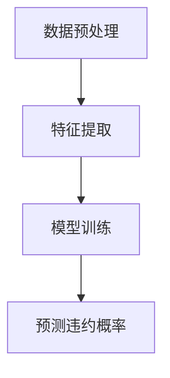
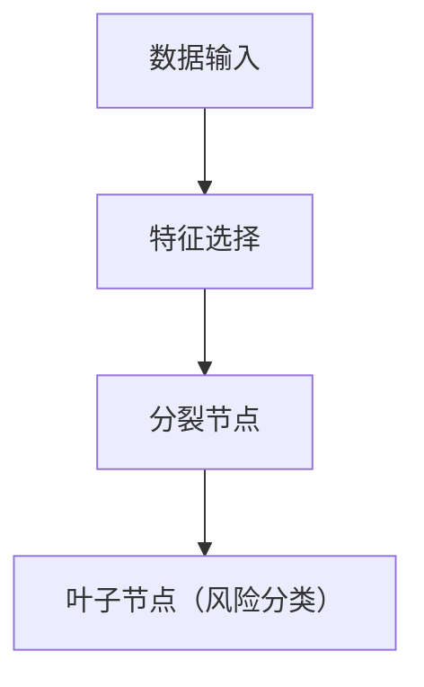
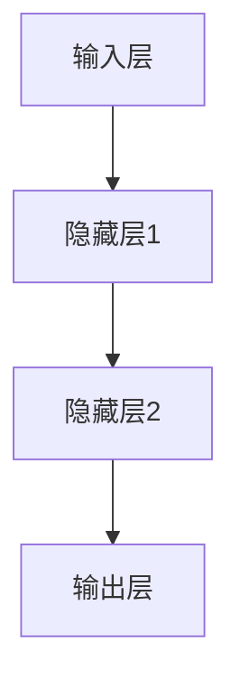
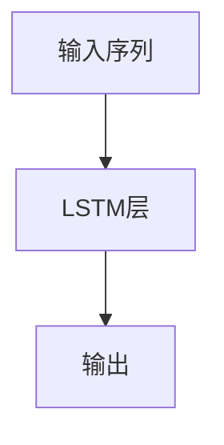
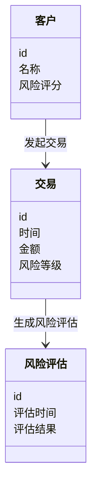
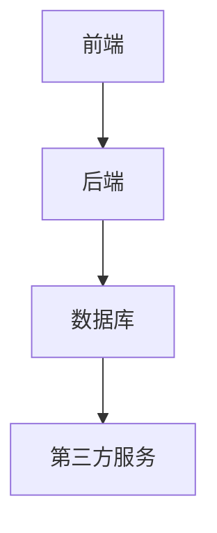
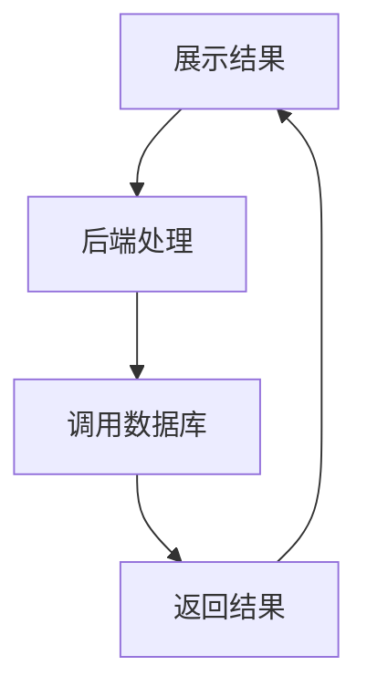

                 


# 目录大纲：《智能商业银行风险管理系统》

---

## 第一章：智能商业银行风险管理系统的背景与概述

### 1.1 商业银行风险管理的重要性

#### 1.1.1 风险管理的核心概念  
- 定义：风险管理是识别、评估和应对潜在风险的过程。  
- 重要性：保障银行资产安全，维护客户信任，确保银行稳健运行。  

#### 1.1.2 风险管理在商业银行中的作用  
- 保护银行资本：避免重大损失，维持资本充足性。  
- 维护客户信任：通过风险管理，提升客户对银行的信任度。  
- 促进稳健发展：通过有效管理风险，支持银行的长期发展。  

#### 1.1.3 智能化风险管理的必要性  
- 传统风险管理的局限性：依赖人工判断，效率低，覆盖面有限。  
- 智能化风险管理的优势：利用AI和大数据技术，提高风险识别和评估的效率与准确性。  

### 1.2 智能商业银行风险管理系统的定义与特点  

#### 1.2.1 智能商业银行风险管理系统的定义  
- 利用人工智能、大数据、区块链等技术，实现风险识别、评估和控制的自动化、智能化系统。  

#### 1.2.2 智能化风险管理的核心特点  
- **数据驱动**：基于海量数据进行分析和预测。  
- **实时性**：能够实时监控和响应风险事件。  
- **精准性**：通过机器学习模型，实现精准的风险评估和预测。  
- **自适应性**：系统能够根据市场变化和数据反馈，自动调整风险管理策略。  

#### 1.2.3 智能系统与传统风险管理的区别  
- **效率与速度**：智能系统大幅提高了风险评估和应对的速度。  
- **准确性与全面性**：通过数据分析，智能系统能够发现更多潜在风险。  
- **成本效益**：降低人工成本，提高风险管理效率。  

### 1.3 智能商业银行风险管理系统的应用前景  

#### 1.3.1 银行智能化转型的趋势  
- 技术进步推动银行向智能化方向发展。  
- 客户需求变化促使银行采用更先进的技术手段。  

#### 1.3.2 智能风险管理系统的潜在价值  
- 提高风险控制能力，降低银行损失。  
- 提升客户体验，通过智能化服务增强客户满意度。  
- 为银行创造更大的价值，通过精准的风险管理支持业务发展。  

#### 1.3.3 应用中的挑战与机遇  
- **挑战**：数据隐私、模型准确性、技术实现难度。  
- **机遇**：技术创新带来新的风险管理工具，推动银行转型升级。  

### 1.4 本章小结  
本章介绍了商业银行风险管理的重要性，详细阐述了智能商业银行风险管理系统的定义、特点以及其与传统风险管理的区别，最后探讨了其应用前景和面临的挑战与机遇。  

---

## 第二章：智能商业银行风险管理系统的核心概念与算法原理  

### 2.1 风险管理的核心要素  

#### 2.1.1 风险识别  
- **定义**：识别潜在风险的过程。  
- **方法**：通过数据分析、模型构建等方式，识别潜在风险点。  

#### 2.1.2 风险评估  
- **定义**：评估风险的影响程度和可能性。  
- **方法**：使用概率论、统计分析等方法进行评估。  

#### 2.1.3 风险控制  
- **定义**：制定和实施策略以降低风险影响。  
- **方法**：风险规避、风险转移、风险缓解等策略。  

### 2.2 智能化风险管理的关键技术  

#### 2.2.1 人工智能在风险管理中的应用  
- **机器学习**：用于风险分类、预测和识别。  
- **自然语言处理**：分析文本数据，识别潜在风险信号。  

#### 2.2.2 大数据技术在风险管理中的作用  
- **数据挖掘**：从海量数据中提取有价值的信息。  
- **实时分析**：实时监控和处理数据，快速响应风险事件。  

#### 2.2.3 区块链技术在风险管理中的潜力  
- **数据不可篡改性**：确保数据的真实性和完整性。  
- **分布式 ledger**：提高风险管理的透明度和效率。  

### 2.3 智能风险管理系统的架构分析  

#### 2.3.1 系统的输入与输出  
- **输入**：客户数据、交易记录、市场信息等。  
- **输出**：风险评估报告、风险预警信号、风险管理建议等。  

#### 2.3.2 系统的核心模块  
- **数据采集模块**：负责收集相关数据。  
- **风险评估模块**：利用机器学习模型进行风险评估。  
- **风险控制模块**：制定和实施风险控制策略。  

#### 2.3.3 系统的边界与外延  
- **边界**：系统与外部数据源、银行内部系统的接口。  
- **外延**：系统的扩展性，支持未来技术升级和功能扩展。  

### 2.4 核心概念对比分析  

#### 2.4.1 核心概念属性对比表  
| 核心概念 | 传统风险管理 | 智能化风险管理 |  
|----------|---------------|----------------|  
| 数据来源 | 有限的内部数据 | 海量内外部数据 |  
| 分析方式 | 人工分析为主 | 数据驱动的自动化分析 |  
| 效率 | 较低 | 高 |  

#### 2.4.2 ER实体关系图架构  
```mermaid
erd
  idris银行: 实体
    idris银行_客户: 客户
      idris银行_交易: 交易记录
        idris银行_风险: 风险评估
```

---

## 第三章：智能商业银行风险管理系统中的算法原理  

### 3.1 机器学习在风险管理中的应用  

#### 3.1.1 逻辑回归算法  
- **原理**：通过概率模型，预测客户违约的可能性。  
- **公式**：$$ P(Y=1|X) = \frac{e^{w \cdot X + b}}{1 + e^{w \cdot X + b}} $$  
- **流程图**：  


#### 3.1.2 决策树算法  
- **原理**：通过构建树状结构，分类客户风险等级。  
- **流程图**：  


### 3.2 深度学习在风险管理中的应用  

#### 3.2.1 神经网络算法  
- **原理**：通过多层神经网络，学习复杂的非线性关系。  
- **公式**：$$ y = \sigma(w \cdot x + b) $$  
  其中，σ为激活函数，如sigmoid函数。  
- **流程图**：  


#### 3.2.2 长短期记忆网络（LSTM）  
- **原理**：用于时间序列数据分析，捕捉长期依赖关系。  
- **公式**：$$ f_t = \sigma(W_{f} \cdot [h_{t-1}, x_t] + b_f) $$  
- **流程图**：  


### 3.3 算法的比较与选择  

#### 3.3.1 算法性能对比  
| 算法类型 | 优点 | 缺点 |  
|----------|------|------|  
| 逻辑回归 | 简单、易于解释 | 非线性关系处理能力有限 |  
| 决策树 | 易于解释、适合非数值型数据 | 易受噪声数据影响 |  
| 神经网络 | 强大学习能力 | 需要大量数据，计算复杂 |  
| LSTM | 适合时间序列数据 | 训练时间较长 |  

#### 3.3.2 选择合适的算法  
- 根据具体场景选择算法：  
  - 对于违约预测，逻辑回归和神经网络适用。  
  - 对于客户风险等级分类，决策树和随机森林适用。  

---

## 第四章：智能商业银行风险管理系统中的系统分析与架构设计  

### 4.1 系统分析  

#### 4.1.1 问题场景介绍  
- 银行面临的风险类型：信用风险、市场风险、操作风险等。  
- 传统风险管理的痛点：效率低、覆盖面有限、难以应对复杂风险。  

#### 4.1.2 项目介绍  
- 项目目标：构建智能商业银行风险管理系统。  
- 项目范围：覆盖银行主要业务领域，包括客户风险评估、交易风险监控等。  

### 4.2 系统功能设计  

#### 4.2.1 领域模型设计  


#### 4.2.2 系统架构设计  


### 4.3 系统接口设计  

#### 4.3.1 接口描述  
- **输入接口**：接收客户数据、交易记录等。  
- **输出接口**：提供风险评估结果、风险预警信息等。  

#### 4.3.2 接口交互流程图  


---

## 第五章：智能商业银行风险管理系统中的项目实战  

### 5.1 环境安装  

#### 5.1.1 安装Python  
- 使用Anaconda安装Python 3.8及以上版本。  

#### 5.1.2 安装相关库  
- 使用pip安装numpy、pandas、scikit-learn、tensorflow等。  

### 5.2 核心代码实现  

#### 5.2.1 逻辑回归模型实现  
```python
import numpy as np
from sklearn.linear_model import LogisticRegression

# 数据预处理
X = np.array([[1, 2], [3, 4], [5, 6]])
y = np.array([0, 1, 1])

# 训练模型
model = LogisticRegression()
model.fit(X, y)

# 预测
print(model.predict([[2, 3]]))
```

#### 5.2.2 神经网络模型实现  
```python
import tensorflow as tf

# 构建模型
model = tf.keras.Sequential([
    tf.keras.layers.Dense(64, activation='relu'),
    tf.keras.layers.Dense(1, activation='sigmoid')
])

# 编译模型
model.compile(optimizer='adam', loss='binary_crossentropy', metrics=['accuracy'])

# 训练模型
model.fit(X_train, y_train, epochs=10, batch_size=32)
```

### 5.3 代码解读与分析  

#### 5.3.1 逻辑回归代码解读  
- 数据预处理：将数据转化为适合模型输入的形式。  
- 模型训练：使用scikit-learn库中的LogisticRegression进行训练。  
- 模型预测：对新数据进行违约概率预测。  

#### 5.3.2 神经网络代码解读  
- 模型构建：使用Keras构建一个简单的神经网络模型。  
- 模型编译：指定优化器、损失函数和评估指标。  
- 模型训练：使用训练数据进行模型优化。  

### 5.4 实际案例分析  

#### 5.4.1 案例背景  
- 某银行客户数据，包括收入、信用评分、交易记录等。  
- 目标：预测客户违约概率。  

#### 5.4.2 数据分析与建模  
- 使用逻辑回归模型进行训练和预测。  
- 通过混淆矩阵评估模型性能。  

### 5.5 项目小结  
本章通过实际案例展示了智能商业银行风险管理系统的实现过程，包括环境安装、代码实现、模型训练和案例分析。  

---

## 第六章：智能商业银行风险管理系统中的最佳实践  

### 6.1 小结  

#### 6.1.1 核心内容总结  
- 智能商业银行风险管理系统的构建需要结合先进的技术手段，如人工智能和大数据分析。  
- 选择合适的算法和模型，能够显著提升风险管理的效率和准确性。  

#### 6.1.2 项目实施的关键点  
- 数据质量：确保数据的准确性和完整性。  
- 模型选择：根据具体场景选择合适的算法。  
- 系统架构：设计合理的系统架构，确保系统的稳定性和可扩展性。  

### 6.2 注意事项  

#### 6.2.1 数据隐私保护  
- 遵守相关法律法规，确保客户数据的安全性和隐私性。  
- 使用加密技术保护敏感数据。  

#### 6.2.2 模型的可解释性  
- 确保模型的可解释性，便于后续优化和调整。  
- 对复杂的模型进行解释性分析，确保结果的合理性。  

### 6.3 拓展阅读  

#### 6.3.1 推荐书籍  
- 《机器学习实战》  
- 《深度学习入门：基于Python》  

#### 6.3.2 在线资源  
- TensorFlow官方文档  
- PyTorch官方文档  

---

## 作者：AI天才研究院/AI Genius Institute & 禅与计算机程序设计艺术/Zen And The Art of Computer Programming

