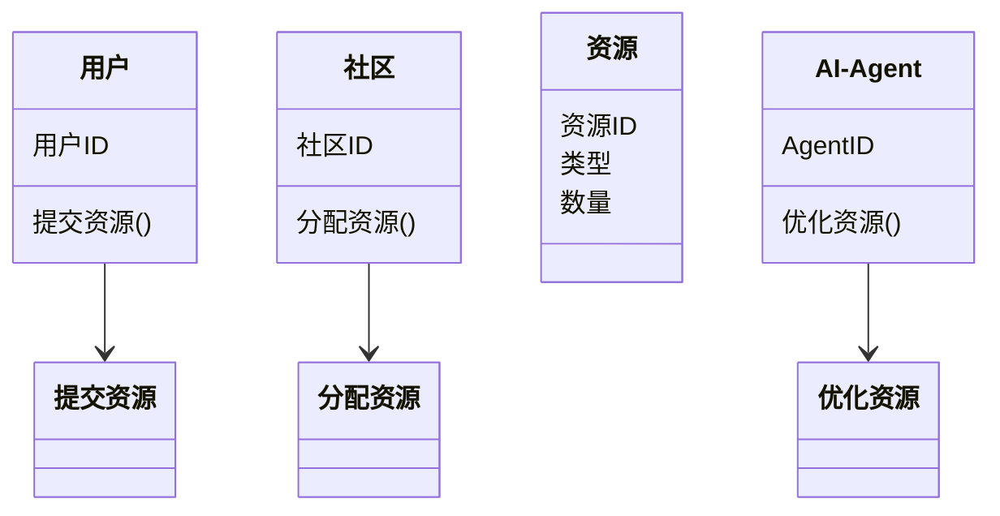
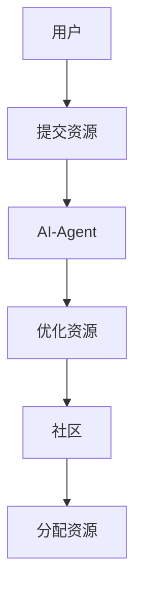
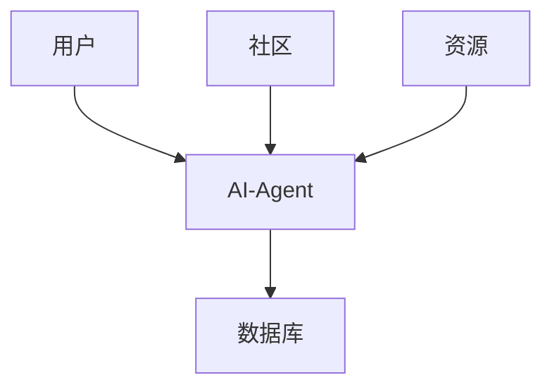

                 


# 智能回收站：AI Agent的社区资源循环利用管理

> **关键词**: AI Agent, 资源循环利用, 社区管理, 算法, 数学模型, 系统架构

> **摘要**: 本文探讨了AI Agent在社区资源循环利用管理中的应用，详细分析了资源管理的现状与挑战，介绍了AI Agent的基本原理，资源循环利用的系统架构，以及基于强化学习的资源优化算法。通过实例分析和项目实战，展示了如何利用AI技术提升社区资源管理效率，实现可持续发展目标。

---

## 第1章: 问题背景与概念解析

### 1.1 问题背景

#### 1.1.1 资源浪费的现状与挑战
现代社会资源浪费问题日益严重，社区垃圾处理效率低下，回收成本高昂。传统回收系统依赖人工操作，存在效率低、成本高等问题。

#### 1.1.2 智能化管理的必要性
通过引入AI Agent实现智能化管理，优化资源分配，降低管理成本，提升回收效率。

#### 1.1.3 AI Agent的应用前景
AI Agent具备实时感知、自主决策和高效执行能力，能够显著提升资源管理效率。

### 1.2 问题描述

#### 1.2.1 资源浪费的现状分析
社区资源浪费现象普遍，回收效率低，资源利用率低。

#### 1.2.2 现有回收系统的不足
依赖人工操作，效率低，成本高，难以实时优化。

#### 1.2.3 智能化回收的必要性
通过智能化系统实现资源高效回收，优化资源分配。

### 1.3 核心概念与组成要素

#### 1.3.1 AI Agent的定义与特点
AI Agent是一种智能体，具备感知环境、自主决策和执行任务的能力。

#### 1.3.2 实体关系图（ER图）解析
展示AI Agent与社区、资源、用户之间的关系，明确系统各实体之间的交互。

---

## 第2章: AI Agent的基本原理

### 2.1 AI Agent的核心原理

#### 2.1.1 AI Agent的定义与特点
AI Agent通过感知环境和自主决策，执行任务以实现目标。

#### 2.1.2 AI Agent的核心属性对比
| 属性 | 描述 |
|------|------|
| 感知 | 采集环境数据 |
| 决策 | 制定行动策略 |
| 执行 | 执行决策 |

#### 2.1.3 实体关系图（ER图）
```mermaid
erDiagram
    actor 用户 {
        string 用户ID
        string 名称
    }
    actor 社区 {
        string 社区ID
        string 名称
    }
    entity 资源 {
        string 资源ID
        string 类型
        integer 数量
    }
    entity AI-Agent {
        string AgentID
        string 目标
    }
    用户 -> 资源: 提交资源
    社区 -> 资源: 分配资源
    AI-Agent -> 资源: 优化资源
```

---

## 第3章: 资源循环利用的系统架构

### 3.1 系统功能设计

#### 3.1.1 领域模型（类图）


#### 3.1.2 功能模块划分
- 用户提交资源模块
- 社区分配资源模块
- AI Agent优化资源模块

#### 3.1.3 功能流程图


---

## 第4章: AI Agent的算法原理

### 4.1 算法原理概述

#### 4.1.1 强化学习与资源优化
AI Agent通过强化学习优化资源分配策略。

#### 4.1.2 机器学习模型的构建
基于历史数据训练模型，预测资源需求。

#### 4.1.3 算法流程图
```mermaid
flowchart TD
    start --> 状态感知
    状态感知 --> 决策
    决策 --> 行动
    行动 --> 奖励
    奖励 --> end
```

### 4.2 算法实现代码

#### 4.2.1 环境安装与配置
```bash
pip install gym numpy
```

#### 4.2.2 强化学习算法代码
```python
import gym
import numpy as np

env = gym.make('ResourceOptimization-v0')
state = env.reset()
while True:
    action = np.random.randint(0, env.action_space.n)
    next_state, reward, done, info = env.step(action)
    if done:
        break
```

---

## 第5章: 数学模型与公式

### 5.1 资源优化的数学模型

#### 5.1.1 资源分配模型
$$ \text{最大化} \sum_{i=1}^{n} r_i $$
$$ \text{约束} \sum_{i=1}^{n} x_i \leq C $$

#### 5.1.2 线性规划公式
$$ \text{最大化} \sum_{i=1}^{n} (p_i - c_i) x_i $$
$$ \text{约束} \sum_{i=1}^{n} x_i \leq C $$

---

## 第6章: 系统分析与架构设计

### 6.1 项目背景与目标

#### 6.1.1 项目背景
提升社区资源管理效率，减少浪费，实现可持续发展。

#### 6.1.2 项目目标
构建智能化资源管理平台，优化资源分配。

### 6.2 系统架构设计

#### 6.2.1 系统架构图


#### 6.2.2 模块间交互
用户提交资源请求，AI Agent优化资源分配，社区执行分配，数据存储在数据库中。

---

## 第7章: 项目实战与案例分析

### 7.1 环境安装与配置

#### 7.1.1 开发环境搭建
安装Python、AI框架等工具。

#### 7.1.2 依赖库安装
使用pip安装所需库。

### 7.2 核心功能实现

#### 7.2.1 AI Agent实现代码
```python
class AI-Agent:
    def __init__(self):
        self.model = self.build_model()
    
    def build_model(self):
        # 构建神经网络模型
        pass
```

#### 7.2.2 资源优化算法实现
```python
def optimize_resources(resources):
    # 实现资源优化算法
    pass
```

### 7.3 实例分析

#### 7.3.1 案例场景
社区A有100个用户，AI Agent优化资源分配，提高回收效率。

#### 7.3.2 系统应用
AI Agent通过强化学习优化资源分配，降低管理成本。

---

## 第8章: 总结与展望

### 8.1 项目总结

#### 8.1.1 核心成果
构建了智能化资源管理平台，显著提升了资源利用效率。

#### 8.1.2 实践经验
AI Agent在资源管理中的应用前景广阔，值得进一步研究。

### 8.2 未来展望

#### 8.2.1 挑战
算法优化、数据隐私保护等。

#### 8.2.2 发展方向
探索更高效的算法，扩大应用范围，推动可持续发展。

---

## 作者信息

作者：AI天才研究院  
地址：[禅与计算机程序设计艺术](https://example.com)  
邮箱：contact@example.com  

---

这篇文章详细介绍了AI Agent在社区资源管理中的应用，通过理论分析和实际案例展示了智能化资源管理的潜力和价值。

