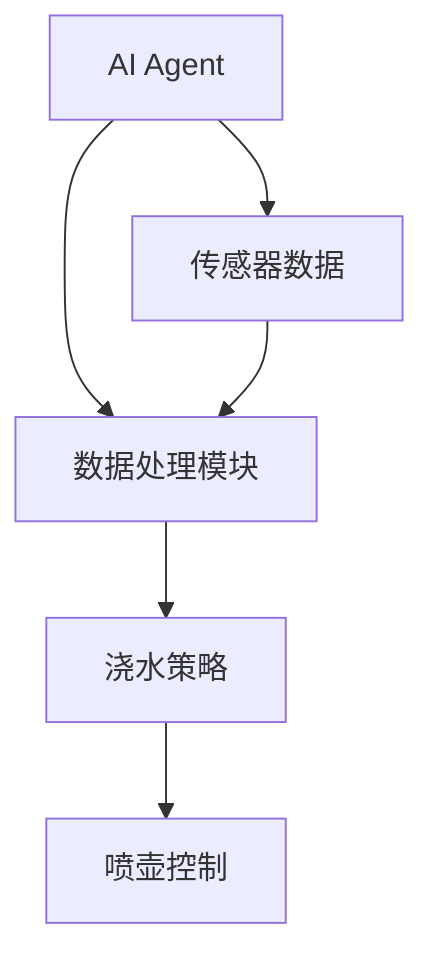

                 

# 智能园艺喷壶：AI Agent的植物浇水优化

> 关键词：智能园艺喷壶、AI Agent、植物浇水优化、物联网技术、浇水模型、数学公式、系统架构设计

> 摘要：本文深入探讨了智能园艺喷壶的设计与实现，通过AI Agent和物联网技术的结合，优化植物浇水管理。文章从背景与概念出发，详细讲解了AI Agent与物联网技术的核心原理，分析了智能浇水系统的算法与数学模型，设计了系统的架构方案，并通过项目实战展示了具体的实现过程。

---

# 第一部分: 智能园艺喷壶的背景与概念

# 第1章: 智能园艺喷壶的背景与问题背景

## 1.1 问题背景

### 1.1.1 园艺浇水的痛点与挑战
园艺浇水是植物生长管理的重要环节，但传统浇水方式存在以下痛点：
- **人工依赖**：需要手动监测土壤湿度、光照强度等参数，耗费大量时间和精力。
- **浇水不精准**：固定时间浇水可能导致水分浪费或植物缺水。
- **环境变化影响**：不同季节、天气条件下，植物的水分需求发生变化，人工调整困难。

### 1.1.2 传统浇水方式的局限性
传统浇水方式主要依赖人工操作，存在以下问题：
- **效率低下**：人工浇水耗时耗力，尤其是在大规模种植场景下。
- **精准度不足**：无法根据实时环境数据（如温度、湿度、光照）动态调整浇水策略。
- **资源浪费**：过度浇水可能导致水资源浪费，甚至引发根部病害。

### 1.1.3 智能化浇水的需求与趋势
随着物联网（IoT）和人工智能（AI）技术的快速发展，智能化浇水成为趋势：
- **自动化管理**：通过传感器和AI算法实现自动监测和控制。
- **精准浇水**：基于实时数据动态调整浇水策略，确保植物健康生长。
- **资源节约**：通过优化浇水时间和量，减少水资源浪费。

## 1.2 问题描述

### 1.2.1 植物浇水的智能化需求
智能浇水系统需要满足以下需求：
- **实时监测**：采集土壤湿度、光照强度、温度等环境数据。
- **智能决策**：基于数据进行分析，制定最优浇水策略。
- **远程控制**：通过物联网设备远程启动和调整浇水设备。

### 1.2.2 不同植物的浇水特性分析
不同植物对水分的需求差异较大，例如：
- **多肉植物**：耐旱，浇水频率低。
- **热带植物**：需水量大，浇水频率高。
- **蔬菜作物**：需水量随生长阶段变化。

### 1.2.3 智能浇水系统的功能目标
智能浇水系统的核心目标是：
- **自动监测**：通过传感器实时采集环境数据。
- **智能决策**：基于AI算法优化浇水策略。
- **精准控制**：通过物联网设备实现精准浇水。

## 1.3 问题解决与优化

### 1.3.1 AI Agent在浇水优化中的作用
AI Agent（智能体）通过以下方式优化浇水：
- **数据采集与分析**：实时采集并分析环境数据，识别浇水需求。
- **决策优化**：基于历史数据和实时数据，优化浇水策略。
- **动态调整**：根据环境变化动态调整浇水参数。

### 1.3.2 物联网技术的应用
物联网技术在智能浇水系统中的应用包括：
- **传感器网络**：采集土壤湿度、光照、温度等数据。
- **数据传输**：通过无线通信技术（如Wi-Fi、蓝牙）传输数据。
- **远程控制**：通过物联网设备远程控制喷壶。

### 1.3.3 数据驱动的浇水策略
数据驱动的浇水策略通过以下步骤实现：
1. 采集环境数据。
2. 分析数据，预测植物的水分需求。
3. 根据预测结果调整浇水时间和量。

## 1.4 边界与外延

### 1.4.1 系统的边界条件
智能浇水系统的边界条件包括：
- **传感器范围**：仅限于监测土壤湿度、光照强度和温度。
- **控制范围**：仅限于喷壶的开启和关闭。
- **环境限制**：系统适用于室内外环境，但不支持极端天气条件。

### 1.4.2 功能的外延与扩展
系统功能的外延包括：
- **远程监控**：通过手机APP实时查看浇水情况。
- **数据记录**：记录历史浇水数据，便于分析和优化。
- **扩展支持**：支持多种类型传感器和喷壶设备。

### 1.4.3 系统的适用场景与限制
系统的适用场景包括：
- **家庭园艺**：适合家庭用户管理室内植物。
- **农业大棚**：适用于大规模农业种植场景。
- **户外花园**：适合管理户外花园植物。

## 1.5 核心概念与组成

### 1.5.1 智能园艺喷壶的核心要素
智能园艺喷壶的核心要素包括：
- **AI Agent**：负责数据处理和决策。
- **物联网设备**：包括传感器和执行器。
- **浇水策略**：基于数据的优化策略。

### 1.5.2 系统组成与功能模块
系统组成包括：
- **传感器模块**：采集环境数据。
- **数据处理模块**：分析数据并制定浇水策略。
- **控制模块**：控制喷壶的开启和关闭。

### 1.5.3 系统的结构与逻辑关系
系统的结构和逻辑关系如下：

## 1.6 本章小结

---

接下来的章节将详细讲解AI Agent与物联网技术的核心原理，分析智能浇水系统的算法与数学模型，设计系统的架构方案，并通过项目实战展示具体的实现过程。

