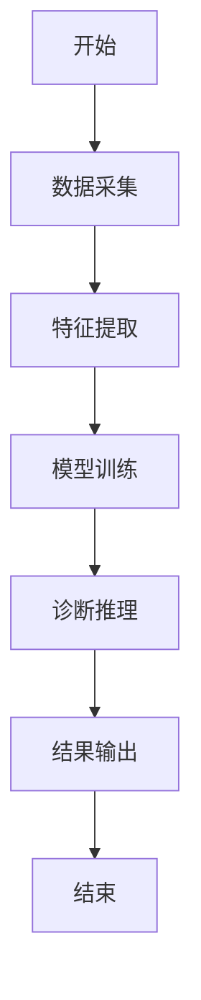
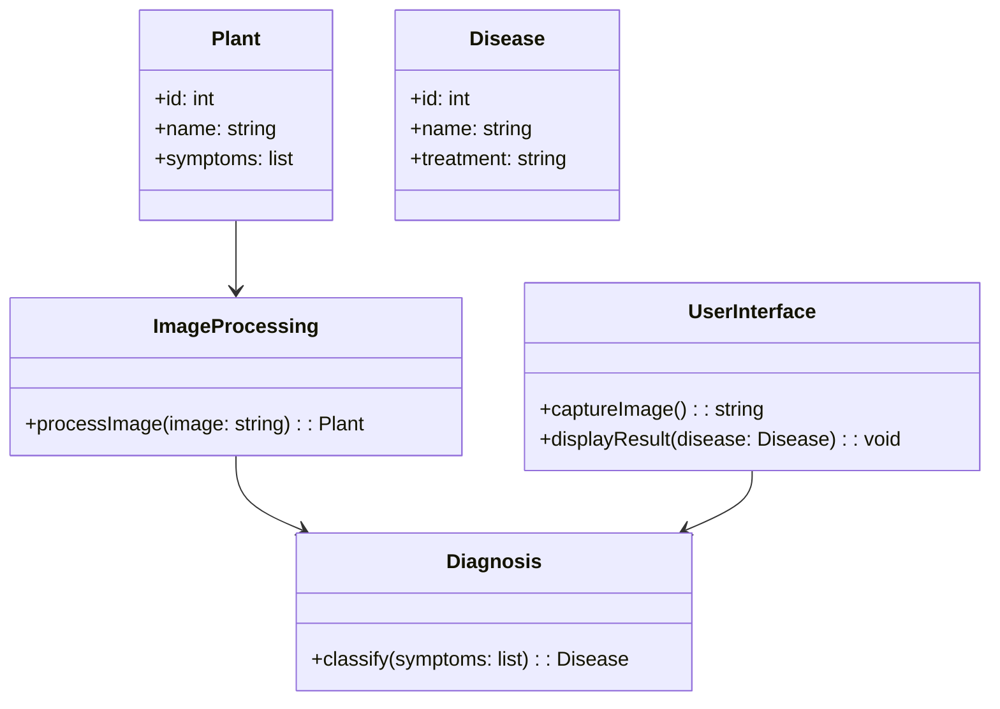

                 


# 智能园艺工具：AI Agent的植物病虫害诊断

> 关键词：智能园艺工具，AI Agent，植物病虫害，诊断，算法，系统架构

> 摘要：本文详细探讨了AI Agent在植物病虫害诊断中的应用，从背景介绍到算法设计，再到系统架构和项目实战，全面解析了智能园艺工具的核心原理和实际应用。

---

## 第一部分: 智能园艺工具与AI Agent的背景介绍

### 第1章: 植物病虫害诊断的背景与挑战

#### 1.1 植物病虫害诊断的背景
##### 1.1.1 现代农业中的病虫害问题
在现代农业生产中，病虫害问题一直是影响作物产量和质量的重要因素。传统的病虫害诊断方法依赖于人工观察和经验判断，这种方法效率低下且容易受到主观因素的影响。随着科技的进步，利用人工智能（AI）技术进行病虫害诊断成为了一种新的趋势。

##### 1.1.2 传统病虫害诊断方法的局限性
传统方法主要依靠人工观察，存在以下问题：
- **效率低**：人工诊断耗时长，尤其是在大面积种植的情况下，效率难以满足需求。
- **准确性有限**：受诊断人员经验和技术水平的影响，诊断结果可能存在误差。
- **成本高**：需要大量的人力和时间投入，增加了农业生产成本。

##### 1.1.3 智能化诊断的需求与趋势
随着人工智能技术的快速发展，智能化诊断成为解决传统方法局限性的有效手段。AI Agent（智能体）通过整合计算机视觉、机器学习和自然语言处理等技术，能够快速、准确地识别病虫害症状，为农业生产提供高效、可靠的诊断服务。

---

#### 1.2 AI Agent在园艺领域的应用潜力
##### 1.2.1 AI Agent的基本概念与特点
AI Agent是一种智能体，能够在特定环境中感知信息、处理数据并做出决策。其特点包括：
- **自主性**：能够在没有人工干预的情况下独立运行。
- **反应性**：能够根据环境变化实时调整行为。
- **学习能力**：通过机器学习算法不断优化诊断模型。

##### 1.2.2 AI Agent在植物病虫害诊断中的优势
AI Agent在病虫害诊断中的优势体现在以下几个方面：
- **高效性**：能够快速处理大量数据，提高诊断效率。
- **准确性**：通过机器学习算法，诊断结果更加精确。
- **可扩展性**：能够适用于不同类型的植物和病虫害。

##### 1.2.3 智能园艺工具的未来发展
随着技术的进步，智能园艺工具将在农业领域发挥越来越重要的作用。未来的趋势包括：
- **智能化升级**：进一步提升诊断的准确性和效率。
- **多技术融合**：结合物联网、大数据等技术，构建更完善的农业生态系统。
- **用户友好性**：开发更易用的界面，方便农民和园艺爱好者使用。

---

### 第2章: 智能园艺工具的核心概念与问题描述

#### 2.1 智能园艺工具的定义与组成
##### 2.1.1 核心概念与组成要素
智能园艺工具是一个集成了AI Agent的系统，主要由以下部分组成：
- **数据采集模块**：负责采集植物的图像、环境数据等信息。
- **数据处理模块**：对采集的数据进行预处理和特征提取。
- **诊断模块**：利用机器学习算法对病虫害进行分类和诊断。
- **决策模块**：根据诊断结果提供相应的处理建议。

##### 2.1.2 智能园艺工具的功能模块
智能园艺工具的功能模块包括：
- **图像采集与处理**：通过摄像头采集植物图像，并进行预处理。
- **病虫害分类**：利用分类算法识别病虫害类型。
- **诊断报告生成**：自动生成诊断报告并提供处理建议。

##### 2.1.3 工具的边界与外延
智能园艺工具的边界主要集中在病虫害诊断功能，外延则包括与诊断相关的数据采集、处理和报告生成等过程。

---

#### 2.2 植物病虫害诊断的核心问题
##### 2.2.1 病虫害诊断的关键要素
植物病虫害诊断的关键要素包括：
- **症状识别**：识别植物的外观变化，如颜色变化、斑点等。
- **病原体识别**：识别病虫害的病原体类型。
- **环境因素**：考虑环境因素对病虫害的影响。

##### 2.2.2 症状识别与分类的挑战
症状识别与分类的挑战主要体现在：
- **数据多样性**：不同类型的病虫害症状差异较大，数据多样性强。
- **数据噪声**：图像中可能存在噪声，影响诊断的准确性。
- **模型泛化能力**：需要模型具有较强的泛化能力，以应对不同环境下的诊断需求。

##### 2.2.3 数据采集与处理的难点
数据采集与处理的难点包括：
- **数据质量**：采集的数据可能存在不完整或不清晰的问题。
- **特征提取**：如何提取有效的特征，直接影响诊断的准确性。

---

## 第二部分: AI Agent的核心原理与算法设计

### 第3章: AI Agent的核心原理与算法基础

#### 3.1 AI Agent的基本原理
##### 3.1.1 信息感知与数据采集
AI Agent通过摄像头等设备采集植物的图像数据，并通过传感器采集环境数据（如温度、湿度等）。

##### 3.1.2 症状分析与特征提取
AI Agent对采集到的图像进行预处理（如去噪、增强等），提取植物的症状特征（如颜色、形状等）。

##### 3.1.3 病虫害诊断与决策推理
AI Agent利用机器学习算法对提取的特征进行分类，诊断出病虫害类型，并根据诊断结果提供相应的处理建议。

---

#### 3.2 常见算法原理与流程图
##### 3.2.1 分类算法原理
分类算法是AI Agent的核心算法之一。常用的分类算法包括支持向量机（SVM）、随机森林（Random Forest）和卷积神经网络（CNN）。

##### 3.2.2 回归算法原理
回归算法用于预测病虫害的严重程度，常用的回归算法包括线性回归、岭回归和贝叶斯回归。

##### 3.2.3 聚类算法原理
聚类算法用于将相似的病虫害症状归为一类，常用的聚类算法包括K-means和层次聚类。

##### 3.2.4 算法流程图（Mermaid）


---

#### 3.3 算法实现的数学模型与公式
##### 3.3.1 分类算法的数学模型
支持向量机（SVM）的数学模型如下：
$$
\text{最大化} \quad \frac{1}{2} \|w\|^2
$$
$$
\text{约束} \quad y_i (w \cdot x_i + b) \geq 1, \quad i=1,2,\ldots,n
$$

##### 3.3.2 回归算法的数学模型
线性回归的数学模型如下：
$$
y = \beta_0 + \beta_1 x + \epsilon
$$
其中，$\epsilon$ 是误差项。

---

## 第三部分: 系统分析与架构设计

### 第4章: 智能园艺工具的系统架构设计

#### 4.1 系统功能设计
##### 4.1.1 领域模型类图（Mermaid）


#### 4.2 系统架构设计（Mermaid）


#### 4.3 系统接口设计
##### 4.3.1 数据采集接口
```python
def capture_image():
    # 通过摄像头采集图像
    return image_path
```

##### 4.3.2 诊断接口
```python
def diagnose(image_path):
    # 调用AI Agent进行诊断
    return diagnosis_result
```

##### 4.3.3 用户界面接口
```python
def show_result(diagnosis_result):
    # 显示诊断结果
    pass
```

---

## 第四部分: 项目实战

### 第5章: 项目实战与代码实现

#### 5.1 环境安装
需要安装的依赖包括：
- Python 3.8+
- OpenCV
- TensorFlow
- scikit-learn

#### 5.2 核心代码实现
##### 5.2.1 数据采集模块
```python
import cv2

def capture_image():
    cap = cv2.VideoCapture(0)
    ret, frame = cap.read()
    if ret:
        cv2.imwrite("plant_image.jpg", frame)
        cap.release()
        return "plant_image.jpg"
    else:
        cap.release()
        return None
```

##### 5.2.2 病虫害分类模块
```python
import tensorflow as tf
from tensorflow.keras.models import load_model

def classify_image(image_path):
    model = load_model("disease_model.h5")
    image = cv2.imread(image_path)
    image = cv2.resize(image, (224, 224))
    image = image / 255.0
    image = image.reshape(1, 224, 224, 3)
    prediction = model.predict(image)
    predicted_class = prediction[0].argmax()
    return predicted_class
```

#### 5.3 代码解读与分析
##### 5.3.1 数据采集模块
- 使用OpenCV库采集图像，并保存为JPEG格式。

##### 5.3.2 病虫害分类模块
- 加载预训练的模型，对图像进行预处理，并进行分类预测。

---

## 第五部分: 总结与展望

### 第6章: 总结与展望

#### 6.1 最佳实践 tips
- 数据预处理是关键，确保数据质量。
- 模型调参可以提高诊断准确率。

#### 6.2 小结
智能园艺工具通过AI Agent实现了高效的病虫害诊断，为现代农业生产提供了有力支持。

#### 6.3 注意事项
- 数据隐私问题需要注意。
- 系统的可扩展性和稳定性需要进一步优化。

#### 6.4 拓展阅读
- 推荐阅读《机器学习实战》和《深度学习入门》等书籍。

---

作者：AI天才研究院/AI Genius Institute & 禅与计算机程序设计艺术 /Zen And The Art of Computer Programming

