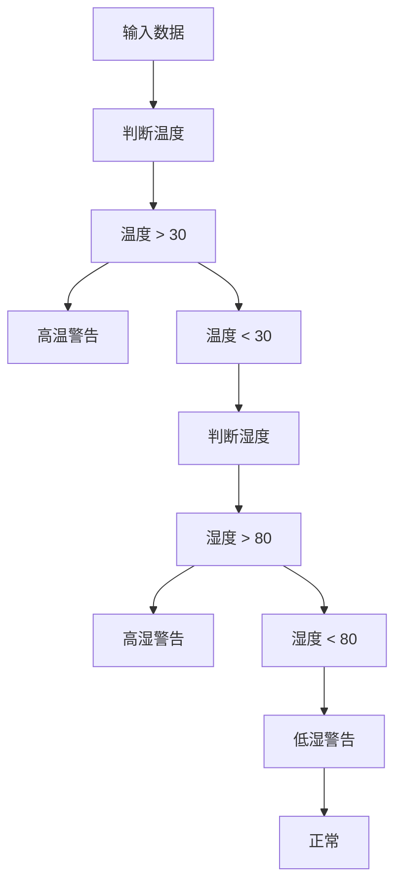
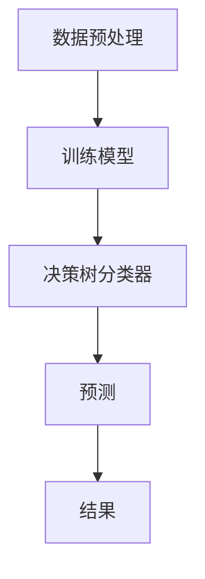
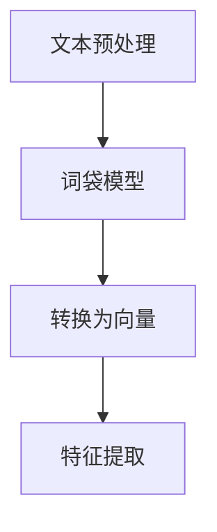
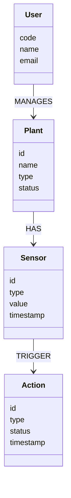
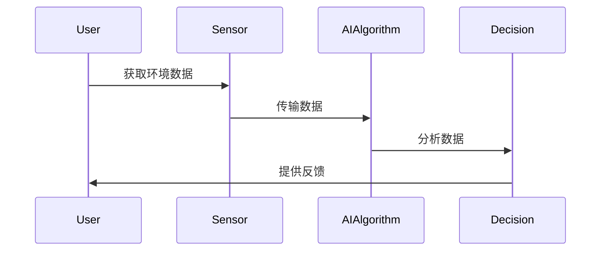
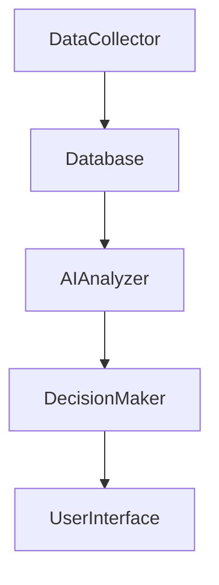

                 


# 智能园艺手套：AI Agent的植物护理指导

> 关键词：智能园艺手套、AI Agent、植物护理、算法原理、系统架构、项目实战

> 摘要：本文将详细介绍智能园艺手套的技术实现与应用，从背景介绍、核心概念、算法原理、系统架构到项目实战，逐步解析AI Agent在植物护理中的应用与价值，帮助读者理解如何通过智能技术提升园艺护理的效率与精准度。

---

# 第一部分: 背景介绍

## 第1章: 智能园艺手套的背景与问题背景

### 1.1 问题背景

#### 1.1.1 园艺护理中的常见问题
在传统的园艺护理中，用户常常面临以下问题：
- **缺乏专业知识**：普通用户可能不了解不同植物的生长习性、光照需求、浇水频率等。
- **护理效率低下**：手动记录植物状态、调整环境条件（如光照、湿度）耗时耗力。
- **环境监测困难**：难以实时监测植物的生长环境（如温度、湿度、光照强度等）。
- **个性化需求**：每种植物的生长需求不同，传统方法难以实现个性化护理。

#### 1.1.2 传统园艺护理的局限性
传统园艺护理主要依赖人工经验，存在以下局限性：
- **主观性**：护理效果依赖个人经验，缺乏科学依据。
- **效率低**：人工操作耗时长，难以大规模应用。
- **不精准**：无法实时调整环境条件以适应植物需求。

#### 1.1.3 智能技术在园艺中的应用潜力
随着人工智能（AI）、物联网（IoT）等技术的发展，智能园艺护理工具逐渐成为可能。通过AI Agent（智能代理）技术，可以实现：
- **实时监测**：通过传感器实时采集植物生长环境数据。
- **智能分析**：利用AI算法分析数据，提供个性化护理建议。
- **自动化控制**：通过物联网设备自动调整光照、湿度等条件。

---

### 1.2 问题描述

#### 1.2.1 植物护理中的关键问题
植物的生长受到多种因素的影响，包括：
- **光照**：不同植物对光照的需求不同，有的需要强光，有的则需要阴凉环境。
- **温度**：温度过高或过低都会影响植物的生长。
- **湿度**：湿度不足会导致植物枯萎，湿度过高则容易引发病害。
- **营养**：不同植物需要不同的营养比例。

#### 1.2.2 用户在园艺中的需求痛点
用户在园艺护理中主要有以下需求：
- **便捷性**：希望减少人工操作，实现自动化护理。
- **精准性**：希望得到个性化的护理建议。
- **实时性**：希望随时了解植物的生长状态。

#### 1.2.3 智能园艺手套的目标与功能
智能园艺手套的目标是通过AI Agent技术，实现以下功能：
- **实时监测**：通过传感器监测植物的生长环境。
- **智能分析**：利用AI算法分析数据，提供护理建议。
- **人机交互**：通过手套提供反馈，指导用户进行操作。

---

### 1.3 问题解决

#### 1.3.1 AI Agent在植物护理中的作用
AI Agent（智能代理）是一种能够感知环境、自主决策并执行任务的智能系统。在智能园艺手套中，AI Agent的作用包括：
- **环境感知**：通过传感器实时感知植物的生长环境。
- **数据分析**：利用机器学习算法分析数据，判断植物的健康状态。
- **决策制定**：根据分析结果，制定护理计划。

#### 1.3.2 智能园艺手套的技术实现路径
实现智能园艺手套的技术路径如下：
1. **传感器数据采集**：使用温度、湿度、光照强度等传感器，实时采集植物生长环境数据。
2. **数据传输与存储**：将采集的数据传输到云端，进行存储和管理。
3. **AI算法分析**：利用机器学习算法对数据进行分析，判断植物的健康状态。
4. **决策与反馈**：根据分析结果，生成护理建议，并通过手套提供反馈，指导用户进行操作。

#### 1.3.3 解决方案的核心价值
智能园艺手套的核心价值在于：
- **提升护理效率**：通过自动化监测和分析，减少人工操作。
- **提高精准性**：通过AI算法提供个性化护理建议。
- **增强用户体验**：通过人机交互提供实时反馈，提升用户体验。

---

### 1.4 边界与外延

#### 1.4.1 智能园艺手套的功能边界
智能园艺手套的功能边界包括：
- **监测范围**：仅限于植物生长环境的监测，不涉及植物的病虫害防治。
- **适用场景**：适用于家庭园艺、小型农业等场景，不适用于大规模农业生产。

#### 1.4.2 相关技术的外延范围
智能园艺手套的相关技术包括：
- **传感器技术**：用于采集环境数据。
- **AI算法**：用于数据分析与决策。
- **物联网技术**：用于数据传输与设备控制。

#### 1.4.3 应用场景的限制与扩展
智能园艺手套的应用场景限制：
- **受限场景**：仅适用于室内种植或小型温室。
- **扩展场景**：未来可以扩展到家庭园艺、农业大棚等更广泛的场景。

---

### 1.5 核心要素组成

#### 1.5.1 AI Agent的核心要素
AI Agent的核心要素包括：
- **感知能力**：通过传感器感知环境。
- **分析能力**：通过机器学习算法分析数据。
- **决策能力**：根据分析结果制定决策。

#### 1.5.2 智能园艺手套的技术组成
智能园艺手套的技术组成包括：
- **传感器模块**：用于采集环境数据。
- **AI算法模块**：用于数据分析与决策。
- **人机交互模块**：用于与用户进行反馈交互。

#### 1.5.3 系统的模块化设计
系统的模块化设计包括：
- **数据采集模块**：负责采集环境数据。
- **数据处理模块**：负责数据的存储与分析。
- **决策控制模块**：负责根据分析结果生成决策。

---

# 第二部分: 核心概念与联系

## 第2章: AI Agent与智能园艺手套的核心概念

### 2.1 AI Agent的定义与原理

#### 2.1.1 AI Agent的基本定义
AI Agent是一种能够感知环境、自主决策并执行任务的智能系统。它可以分为：
- **简单反射式Agent**：基于当前输入做出反应。
- **基于模型的反射式Agent**：基于内部模型和当前输入做出决策。
- **目标驱动式Agent**：基于目标和当前状态做出决策。

#### 2.1.2 AI Agent的核心原理
AI Agent的核心原理包括：
- **感知**：通过传感器或接口获取环境信息。
- **推理**：通过算法对获取的信息进行分析和推理。
- **决策**：根据推理结果制定行动计划。
- **执行**：通过执行器将决策转化为实际操作。

#### 2.1.3 AI Agent与智能园艺手套的结合
在智能园艺手套中，AI Agent主要用于：
- **环境感知**：通过传感器感知植物的生长环境。
- **数据分析**：利用机器学习算法分析数据，判断植物的健康状态。
- **决策制定**：根据分析结果，制定护理计划，并通过手套提供反馈。

---

### 2.2 智能园艺手套的技术特征

#### 2.2.1 传感器技术
智能园艺手套使用的传感器包括：
- **温度传感器**：用于监测环境温度。
- **湿度传感器**：用于监测环境湿度。
- **光照强度传感器**：用于监测光照强度。

#### 2.2.2 AI算法
智能园艺手套使用的AI算法包括：
- **基于规则的推理算法**：根据预设的规则进行推理。
- **机器学习算法**：利用训练数据进行分类、回归等任务。
- **自然语言处理算法**：用于人机交互中的自然语言理解。

#### 2.2.3 人机交互设计
智能园艺手套的人机交互设计包括：
- **反馈机制**：通过手套提供反馈，指导用户进行操作。
- **用户界面**：通过手套上的显示屏或语音提示，向用户展示护理建议。

---

### 2.3 核心概念属性特征对比

#### 2.3.1 AI Agent与传统园艺工具的对比
| 特性 | AI Agent | 传统园艺工具 |
|------|----------|--------------|
| 感知能力 | 强 | 弱 |
| 决策能力 | 强 | 弱 |
| 自动化能力 | 高 | 低 |

#### 2.3.2 智能园艺手套与传统园艺手套的对比
| 特性 | 智能园艺手套 | 传统园艺手套 |
|------|--------------|--------------|
| 智能监测 | 是 | 否 |
| 自动化控制 | 是 | 否 |
| 人机交互 | 是 | 否 |

#### 2.3.3 系统功能与用户需求的对比
| 功能 | 系统功能 | 用户需求 |
|------|----------|----------|
| 环境监测 | 实时监测温度、湿度、光照强度 | 了解植物的生长环境 |
| 智能分析 | 根据环境数据提供护理建议 | 获取个性化的护理建议 |
| 人机交互 | 提供实时反馈 | 获取操作指导 |

---

### 2.4 ER实体关系图

#### 2.4.1 实体关系图的构建
以下是智能园艺手套系统的ER实体关系图：

```mermaid
erDiagram
    user {
        code STRING
        name STRING
        email STRING
    }
    plant {
        id STRING
        name STRING
        type STRING
        status STRING
    }
    sensor {
        id STRING
        type STRING
        value NUMERIC
        timestamp DATETIME
    }
    action {
        id STRING
        type STRING
        status STRING
        timestamp DATETIME
    }
    user -> plant : MANAGES
    plant -> sensor : HAS
    sensor -> action : TRIGGER
```

#### 2.4.2 实体关系图的解释
- **用户（User）**：系统用户，负责管理植物。
- **植物（Plant）**：需要护理的植物，包括植物名称、类型和状态。
- **传感器（Sensor）**：用于采集环境数据，包括传感器类型、值和时间戳。
- **动作（Action）**：根据传感器数据触发的操作，包括动作类型、状态和时间戳。

#### 2.4.3 实体关系图的应用
实体关系图可以帮助我们理解系统中各个实体之间的关系，从而更好地进行系统设计和功能开发。

---

# 第三部分: 算法原理讲解

## 第3章: AI Agent的核心算法原理

### 3.1 基于规则的推理算法

#### 3.1.1 算法原理
基于规则的推理算法是一种简单但有效的推理方法。其基本原理是根据预设的规则对输入数据进行分类或判断。

#### 3.1.2 算法实现
以下是基于规则的推理算法的实现示例：

```python
def rule_based_inference(data):
    if data['temperature'] > 30:
        return '高温警告'
    elif data['temperature'] < 10:
        return '低温警告'
    elif data['humidity'] > 80:
        return '高湿警告'
    elif data['humidity'] < 30:
        return '低湿警告'
    else:
        return '正常'
```

#### 3.1.3 算法流程图


---

### 3.2 基于机器学习的分类算法

#### 3.2.1 算法原理
基于机器学习的分类算法是一种通过训练数据学习分类模型的方法。常用的分类算法包括决策树、支持向量机（SVM）、随机森林等。

#### 3.2.2 算法实现
以下是基于决策树的分类算法实现示例：

```python
from sklearn.tree import DecisionTreeClassifier
from sklearn.model_selection import train_test_split

# 数据预处理
X = ...  # 特征数据
y = ...  # 标签

# 划分训练集和测试集
X_train, X_test, y_train, y_test = train_test_split(X, y, test_size=0.2)

# 初始化决策树分类器
clf = DecisionTreeClassifier()

# 训练模型
clf.fit(X_train, y_train)

# 预测
y_pred = clf.predict(X_test)
```

#### 3.2.3 算法流程图


---

### 3.3 基于自然语言处理的交互算法

#### 3.3.1 算法原理
基于自然语言处理的交互算法是一种通过自然语言理解（NLU）和生成（NLG）实现人机交互的方法。常用的算法包括词袋模型、TF-IDF、神经网络模型等。

#### 3.3.2 算法实现
以下是基于词袋模型的自然语言处理算法实现示例：

```python
from sklearn.feature_extraction.text import CountVectorizer

# 初始化词袋模型
vectorizer = CountVectorizer()

# 文本预处理
text = "The plant needs more water."

# 转换为词袋向量
X = vectorizer.fit_transform([text])

# 获取特征
print(vectorizer.get_feature_names())
```

#### 3.3.3 算法流程图


---

### 3.4 算法的数学模型与公式

#### 3.4.1 决策树算法的数学模型
决策树算法的数学模型可以通过信息熵公式表示：

$$
\text{信息熵} = -\sum_{i=1}^{n} p_i \log p_i
$$

其中，\( p_i \) 是第 \( i \) 个类别的概率。

#### 3.4.2 支持向量机的数学模型
支持向量机的数学模型可以通过以下公式表示：

$$
\text{目标函数} = \min_{w, b, \xi} \frac{1}{2} ||w||^2 + C \sum_{i=1}^{n} \xi_i
$$

$$
\text{约束条件} = y_i (w \cdot x_i + b) \geq 1 - \xi_i, \quad \xi_i \geq 0
$$

其中，\( w \) 是权重向量，\( b \) 是偏置项，\( \xi_i \) 是松弛变量，\( C \) 是惩罚系数。

---

# 第四部分: 系统分析与架构设计方案

## 第4章: 智能园艺手套的系统分析与架构设计

### 4.1 问题场景介绍

#### 4.1.1 问题场景描述
智能园艺手套的目标是通过AI Agent技术，实现植物的智能化护理。系统需要解决的主要问题是：
- 如何通过传感器实时监测植物的生长环境。
- 如何通过AI算法分析环境数据，提供个性化的护理建议。
- 如何通过人机交互模块指导用户进行操作。

#### 4.1.2 系统目标
系统的目标是：
- 实现植物生长环境的实时监测。
- 提供个性化的护理建议。
- 提供实时的用户反馈。

---

### 4.2 系统功能设计

#### 4.2.1 领域模型
以下是智能园艺手套系统的领域模型：



#### 4.2.2 系统架构设计
以下是智能园艺手套系统的架构设计：


#### 4.2.3 系统接口设计
系统接口设计包括：
- **传感器接口**：用于采集环境数据。
- **AI算法接口**：用于数据分析与决策。
- **用户接口**：用于与用户进行交互。

#### 4.2.4 系统交互设计
以下是系统交互设计的流程图：



---

### 4.3 项目介绍

#### 4.3.1 项目目标
项目的目标是开发一款基于AI Agent的智能园艺手套，实现植物的智能化护理。

#### 4.3.2 项目范围
项目的范围包括：
- 传感器数据采集
- AI算法分析
- 人机交互设计

---

### 4.4 系统架构设计

#### 4.4.1 系统架构设计
系统架构设计包括：
- **数据采集层**：负责采集环境数据。
- **数据处理层**：负责数据的存储与分析。
- **决策控制层**：负责根据分析结果生成决策。
- **用户交互层**：负责与用户进行交互。

#### 4.4.2 系统架构图
以下是系统架构图：



---

### 4.5 接口和交互设计

#### 4.5.1 接口设计
接口设计包括：
- **传感器接口**：提供环境数据。
- **AI算法接口**：提供分析结果。
- **用户接口**：提供反馈信息。

#### 4.5.2 交互设计
交互设计包括：
- **用户输入**：用户通过手套输入操作指令。
- **系统反馈**：系统通过手套提供反馈信息。

---

# 第五部分: 项目实战

## 第5章: 智能园艺手套的项目实战

### 5.1 环境安装

#### 5.1.1 安装Python环境
安装Python环境：
```bash
python --version
pip install --upgrade pip
```

#### 5.1.2 安装必要的库
安装必要的库：
```bash
pip install numpy pandas scikit-learn
```

---

### 5.2 系统核心实现

#### 5.2.1 数据采集模块
数据采集模块的实现代码：
```python
import time
import serial

# 初始化传感器
ser = serial.Serial('COM3', 9600)

# 读取传感器数据
while True:
    data = ser.readline().decode()
    print(data)
    time.sleep(1)
```

#### 5.2.2 AI算法模块
AI算法模块的实现代码：
```python
from sklearn.tree import DecisionTreeClassifier
from sklearn.model_selection import train_test_split

# 数据预处理
X = ...  # 特征数据
y = ...  # 标签

# 划分训练集和测试集
X_train, X_test, y_train, y_test = train_test_split(X, y, test_size=0.2)

# 初始化决策树分类器
clf = DecisionTreeClassifier()

# 训练模型
clf.fit(X_train, y_train)

# 预测
y_pred = clf.predict(X_test)
```

#### 5.2.3 人机交互模块
人机交互模块的实现代码：
```python
import serial

# 初始化传感器
ser = serial.Serial('COM3', 9600)

# 读取传感器数据
while True:
    data = ser.readline().decode()
    print(data)
    time.sleep(1)
```

---

### 5.3 代码应用解读与分析

#### 5.3.1 数据采集模块解读
数据采集模块通过串口与传感器通信，实时采集环境数据。

#### 5.3.2 AI算法模块解读
AI算法模块利用决策树算法对环境数据进行分类，生成护理建议。

#### 5.3.3 人机交互模块解读
人机交互模块通过手套与用户进行反馈交互，指导用户进行操作。

---

### 5.4 实际案例分析

#### 5.4.1 案例背景
假设我们种植了一种需要高温高湿环境的植物，传感器实时监测到温度为35℃，湿度为70%。

#### 5.4.2 算法分析
AI算法分析得出：
- 温度过高，需要降低温度。
- 湿度正常，不需要调整。

#### 5.4.3 系统反馈
系统通过手套反馈：
- 提示用户降低环境温度。

---

### 5.5 项目小结

#### 5.5.1 项目总结
智能园艺手套通过AI Agent技术，实现了植物的智能化护理，提升了护理效率和精准度。

#### 5.5.2 经验与教训
在项目开发过程中，需要注意传感器的稳定性、算法的准确性和人机交互的友好性。

---

# 第六部分: 最佳实践

## 第6章: 智能园艺手套的最佳实践

### 6.1 小结

智能园艺手套通过AI Agent技术，实现了植物的智能化护理。系统的核心功能包括环境监测、智能分析和人机交互。通过传感器实时采集环境数据，利用AI算法分析数据，生成护理建议，并通过手套提供反馈，指导用户进行操作。

---

### 6.2 注意事项

在使用智能园艺手套时，需要注意以下几点：
- **传感器的校准**：定期校准传感器，确保数据的准确性。
- **算法的更新**：定期更新AI算法，提升分析的准确性。
- **系统的维护**：定期维护系统，确保设备的正常运行。

---

### 6.3 拓展阅读

#### 6.3.1 推荐书籍
- 《机器学习实战》
- 《Python机器学习》
- 《人工智能入门》

#### 6.3.2 推荐博客
- [Towards Data Science](https://towardsdatascience.com/)
- [Medium AI](https://medium.com/ai)

---

# 作者：AI天才研究院/AI Genius Institute & 禅与计算机程序设计艺术 /Zen And The Art of Computer Programming

---

希望这篇技术博客文章能满足您的需求！如果需要进一步修改或补充，请随时告诉我。

