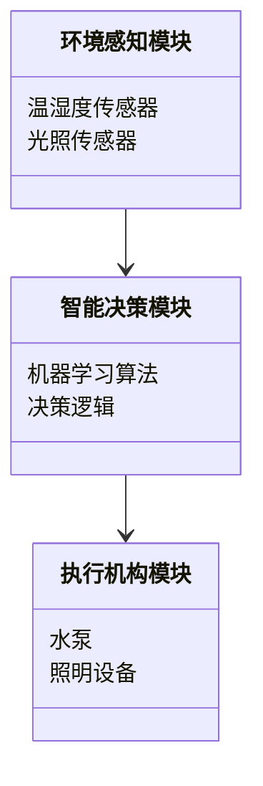

                 


# 智能园艺：AI Agent控制的室内种植系统

> 关键词：智能园艺，AI Agent，室内种植系统，自动化种植，人工智能应用

> 摘要：本文深入探讨了AI Agent在室内种植系统中的应用，从背景分析到系统设计，再到项目实战，全面解析了智能园艺的核心技术与实现细节。通过分析AI Agent的工作原理、系统架构设计以及实际案例，展示了如何利用人工智能技术实现高效、智能的室内种植管理。

---

# 第一部分：智能园艺与AI Agent的背景介绍

## 第1章：智能园艺的背景与问题背景

### 1.1 问题背景
#### 1.1.1 室内种植的需求与挑战
随着城市化进程的加快，土地资源的稀缺性和环境污染问题日益严重，室内种植成为一种新兴趋势。然而，传统室内种植面临诸多挑战，如人工成本高、环境控制难、资源浪费等。这些问题使得室内种植效率低下，难以实现大规模应用。

#### 1.1.2 智能化种植的必要性
智能化种植能够通过自动化技术实现精准控制，优化资源利用，降低成本。AI Agent作为一种智能代理，能够实时感知环境变化，自主决策并执行操作，为室内种植系统提供了高效、可靠的解决方案。

#### 1.1.3 AI Agent在智能园艺中的作用
AI Agent在智能园艺中的作用主要体现在以下几个方面：
- **环境感知**：通过传感器实时采集温湿度、光照、土壤等环境数据。
- **智能决策**：基于数据进行分析，制定最优种植策略。
- **自主执行**：通过执行机构自动调整环境参数，如调节光照、浇水等。

### 1.2 问题描述
#### 1.2.1 室内种植系统的复杂性
室内种植系统涉及多个子系统，如环境控制、光照调节、灌溉系统等。系统的复杂性使得人工管理效率低下，容易出现资源浪费和环境失控的问题。

#### 1.2.2 现有种植系统的问题
现有种植系统主要依赖人工管理，存在以下问题：
- **效率低下**：人工操作耗时耗力，难以实现大规模种植。
- **环境不稳定**：人工干预难以精确控制环境参数，导致作物生长不稳定。
- **资源浪费**：水、电等资源浪费现象严重。

#### 1.2.3 AI Agent如何解决这些问题
AI Agent通过实时感知、智能决策和自主执行，能够有效解决上述问题。其核心优势在于：
- **高效性**：自动化管理，减少人工干预。
- **精准性**：基于数据的智能决策，优化资源利用。
- **稳定性**：实时监控和调整，确保环境稳定。

### 1.3 问题解决
#### 1.3.1 AI Agent的核心解决方案
AI Agent通过以下方式实现智能园艺的高效管理：
- **环境感知**：利用传感器实时采集环境数据。
- **智能决策**：基于机器学习算法，制定最优种植策略。
- **自主执行**：通过执行机构自动调整环境参数。

#### 1.3.2 智能园艺系统的实现方式
智能园艺系统的实现方式包括以下几个步骤：
1. **环境感知**：部署传感器，实时采集温湿度、光照等数据。
2. **数据处理**：将采集到的数据进行分析和处理。
3. **智能决策**：基于分析结果，制定种植策略。
4. **自主执行**：通过执行机构实现环境调整。

#### 1.3.3 技术实现的关键点
技术实现的关键点包括：
- **传感器选型与部署**：选择合适的传感器，确保数据采集的准确性。
- **机器学习算法的应用**：选择适合的算法，实现智能决策。
- **执行机构的控制**：实现自动化调整，确保执行机构的高效运行。

### 1.4 边界与外延
#### 1.4.1 系统的边界定义
智能园艺系统的边界主要包括：
- **环境感知边界**：传感器的部署范围和数据采集范围。
- **决策边界**：AI Agent的决策范围和权限。
- **执行边界**：执行机构的控制范围和能力。

#### 1.4.2 系统的外延与扩展
系统的外延与扩展包括：
- **扩展种植类型**：从单一作物扩展到多种作物的种植。
- **多系统集成**：与其他智能系统（如智能物流）集成，实现全产业链的智能化管理。

#### 1.4.3 相关技术的边界分析
相关技术的边界分析包括：
- **AI Agent技术的边界**：AI Agent的能力和应用范围。
- **物联网技术的边界**：物联网在智能园艺中的应用范围和限制。

### 1.5 概念结构与核心要素
#### 1.5.1 智能园艺系统的组成
智能园艺系统主要包括以下组成部分：
- **环境感知模块**：传感器和数据采集设备。
- **智能决策模块**：AI Agent和机器学习算法。
- **执行机构模块**：自动化控制设备。

#### 1.5.2 AI Agent的核心要素
AI Agent的核心要素包括：
- **感知能力**：实时感知环境数据。
- **决策能力**：基于数据制定决策。
- **执行能力**：自主执行决策指令。

#### 1.5.3 系统与环境的交互关系
系统与环境的交互关系主要体现在：
- **数据流**：系统通过传感器感知环境数据。
- **控制流**：系统通过执行机构调整环境参数。
- **信息流**：系统与用户之间的信息交互。

---

# 第二部分：AI Agent的核心概念与联系

## 第2章：AI Agent的核心概念与原理

### 2.1 AI Agent的基本原理
#### 2.1.1 AI Agent的定义与分类
AI Agent（人工智能代理）是一种智能实体，能够感知环境并采取行动以实现目标。根据功能和智能水平的不同，AI Agent可以分为以下几类：
- **反应式AI Agent**：基于当前感知做出反应。
- **认知式AI Agent**：具有推理和规划能力。
- **学习式AI Agent**：能够通过学习提升性能。

#### 2.1.2 AI Agent的核心原理
AI Agent的核心原理包括以下几个方面：
- **感知**：通过传感器或其他信息源获取环境数据。
- **推理**：基于感知数据进行分析和推理。
- **决策**：根据推理结果制定行动方案。
- **执行**：通过执行机构实现决策。

#### 2.1.3 AI Agent与智能园艺的结合
在智能园艺中，AI Agent主要应用于以下几个方面：
- **环境监控**：实时监控温湿度、光照等环境参数。
- **智能决策**：基于环境数据制定种植策略。
- **自动化控制**：通过执行机构自动调整环境参数。

### 2.2 核心概念的属性特征对比
#### 2.2.1 不同AI Agent的属性对比
以下是不同AI Agent的属性对比：

| 属性           | 反应式AI Agent         | 认知式AI Agent         | 学习式AI Agent         |
|----------------|------------------------|------------------------|------------------------|
| 感知能力       | 实时感知               | 实时感知               | 实时感知               |
| 推理能力       | 无                     | 具有推理能力           | 具有推理和学习能力     |
| 决策能力       | 基于当前状态做出反应   | 基于推理结果制定计划   | 基于学习结果优化决策   |
| 执行能力       | 直接执行               | 需要外部执行机构       | 需要外部执行机构       |

#### 2.2.2 智能园艺系统中AI Agent的特征分析
在智能园艺系统中，AI Agent的特征主要体现在以下几个方面：
- **实时性**：能够实时感知环境数据并做出反应。
- **自主性**：能够在没有人工干预的情况下自主决策和执行。
- **适应性**：能够根据环境变化调整策略。

#### 2.2.3 属性特征的表格对比
以下是AI Agent在智能园艺系统中的属性特征对比：

| 特性           | 反应式AI Agent         | 认知式AI Agent         | 学习式AI Agent         |
|----------------|------------------------|------------------------|------------------------|
| 感知能力       | 传感器数据             | 传感器数据             | 传感器数据             |
| 推理能力       | 无                     | 基于规则推理           | 基于机器学习模型       |
| 决策能力       | 基于当前状态做出反应   | 基于推理结果制定计划   | 基于学习结果优化决策   |
| 执行能力       | 直接控制执行机构       | 需要外部执行机构       | 需要外部执行机构       |

### 2.3 ER实体关系图
#### 2.3.1 实体关系图的构建
以下是智能园艺系统中的ER实体关系图：

```mermaid
erdiagram
actor: 用户
system: 智能园艺系统
sensor: 传感器
actuator: 执行机构
environment: 环境
algorithm: 机器学习算法
```

#### 2.3.2 系统中各实体的交互关系
用户通过智能园艺系统与系统交互，系统通过传感器感知环境数据，通过算法进行分析和决策，最后通过执行机构调整环境参数。

---

# 第三部分：AI Agent的算法原理讲解

## 第3章：AI Agent算法的数学模型与公式

### 3.1 算法原理概述
#### 3.1.1 AI Agent的基本算法框架
AI Agent的基本算法框架包括以下几个步骤：
1. **感知**：通过传感器获取环境数据。
2. **分析**：对感知数据进行分析和处理。
3. **推理**：基于分析结果进行推理。
4. **决策**：制定行动方案。
5. **执行**：通过执行机构实现决策。

#### 3.1.2 算法的核心思想
算法的核心思想是通过实时感知、智能推理和自主决策，实现对环境的精确控制。

#### 3.1.3 算法的数学模型
AI Agent的数学模型主要涉及以下几个方面：
- **状态空间**：环境状态的表示。
- **动作空间**：可能的执行动作。
- **状态转移概率**：动作对状态的影响。

### 3.2 数学模型与公式
#### 3.2.1 状态空间的定义
状态空间可以表示为：
$$ S = \{ s_1, s_2, ..., s_n \} $$
其中，$s_i$ 表示环境状态。

#### 3.2.2 动作空间的定义
动作空间可以表示为：
$$ A = \{ a_1, a_2, ..., a_m \} $$
其中，$a_i$ 表示可能的执行动作。

#### 3.2.3 状态转移概率公式
状态转移概率公式为：
$$ P(s' | s, a) $$
其中，$s'$ 表示在状态 $s$ 下执行动作 $a$ 后的新状态。

---

# 第四部分：系统分析与架构设计

## 第4章：系统分析与架构设计

### 4.1 问题场景介绍
智能园艺系统的主要问题场景包括：
- **环境不稳定**：温湿度、光照等环境参数波动较大。
- **资源浪费**：水、电等资源浪费现象严重。
- **管理效率低**：人工管理效率低下，难以实现大规模种植。

### 4.2 系统功能设计
#### 4.2.1 领域模型
以下是智能园艺系统的领域模型：



#### 4.2.2 系统架构设计
以下是智能园艺系统的系统架构设计：


#### 4.2.3 接口设计
系统接口设计主要包括：
- **传感器接口**：与温湿度传感器、光照传感器等设备通信。
- **执行机构接口**：与水泵、照明设备等执行机构通信。
- **用户接口**：与用户交互，接收用户的指令和反馈。

#### 4.2.4 交互设计
系统交互设计主要包括：
- **用户与系统的交互**：用户通过界面对系统进行操作和监控。
- **系统内部的交互**：传感器、AI Agent和执行机构之间的数据交互。

---

## 第5章：项目实战

### 5.1 环境安装
#### 5.1.1 硬件环境
硬件环境包括：
- **传感器**：DHT11温湿度传感器、光照传感器。
- **执行机构**：水泵、LED照明设备。
- **网关**：Raspberry Pi。

#### 5.1.2 软件环境
软件环境包括：
- **操作系统**：Raspbian。
- **开发工具**：Python、TensorFlow。

### 5.2 核心代码实现
#### 5.2.1 环境感知模块
以下是环境感知模块的核心代码：

```python
import RPi.GPIO as GPIO
import time

# 温湿度传感器
def read_dht11():
    import dht11
    sensor = dht11.DHT11(pin=17)
    data = sensor.read()
    return data.humidity, data.temperature

# 光照传感器
def read_light():
    import Adafruit_tcs34725
    sensor = Adafruit_tcs34725.TCS34725(i2c_bus=1)
    return sensor.read_lightness()
```

#### 5.2.2 智能决策模块
以下是智能决策模块的核心代码：

```python
import numpy as np
from sklearn import tree

# 训练模型
def train_model(X_train, y_train):
    clf = tree.DecisionTreeClassifier()
    clf.fit(X_train, y_train)
    return clf

# 预测环境
def predict_environment(model, X_test):
    return model.predict(X_test)
```

#### 5.2.3 执行机构模块
以下是执行机构模块的核心代码：

```python
import RPi.GPIO as GPIO

# 水泵控制
def control_pump(pump_pin, state):
    GPIO.output(pump_pin, state)

# 照明控制
def control_light(light_pin, state):
    GPIO.output(light_pin, state)
```

### 5.3 案例分析
#### 5.3.1 实际案例分析
以下是一个实际案例分析：

假设当前环境数据为：
- 温度：25℃
- 湿度：60%
- 光照强度：500 lux

通过AI Agent的决策模块，系统决定开启水泵和照明设备，以维持适当的湿度和光照条件。

#### 5.3.2 代码应用解读与分析
通过对上述代码的分析，可以看出：
- **环境感知模块**：通过传感器获取环境数据。
- **智能决策模块**：基于环境数据进行分析和决策。
- **执行机构模块**：根据决策结果执行相应的操作。

### 5.4 项目小结
通过本项目实战，我们可以看到AI Agent在智能园艺中的实际应用。通过传感器、AI算法和执行机构的协同工作，实现了对室内种植环境的智能化管理。

---

## 第6章：扩展内容与总结

### 6.1 最佳实践 tips
- **传感器选型**：选择合适的传感器，确保数据采集的准确性。
- **算法优化**：通过不断优化算法，提升系统的智能水平。
- **系统维护**：定期维护系统，确保设备的正常运行。

### 6.2 小结
通过本文的分析与实践，我们可以看到AI Agent在智能园艺中的巨大潜力。通过实时感知、智能决策和自主执行，AI Agent能够有效提升室内种植的效率和质量。

### 6.3 注意事项
- **数据隐私**：确保环境数据的安全性。
- **系统稳定性**：确保系统的稳定运行，避免因系统故障导致作物损失。
- **用户培训**：对用户进行培训，确保系统的正确使用。

### 6.4 拓展阅读
- **机器学习算法**：深入学习机器学习算法，提升AI Agent的智能水平。
- **物联网技术**：学习物联网技术，实现更大规模的智能园艺系统。
- **系统架构设计**：研究系统架构设计，优化系统的性能和可扩展性。

---

# 附录

## 附录A：AI Agent相关技术术语表

| 术语           | 定义                                                         |
|----------------|--------------------------------------------------------------|
| AI Agent       | 人工智能代理，能够感知环境并采取行动以实现目标。           |
| 状态空间       | 环境所有可能的状态的集合。                                   |
| 动作空间       | 系统所有可能的动作的集合。                                   |
| 状态转移概率   | 在当前状态下执行某个动作后，转移到下一个状态的概率。       |

## 附录B：常用工具与库

| 工具/库       | 描述                                                         |
|----------------|--------------------------------------------------------------|
| Raspberry Pi  | 微型计算机，常用于物联网项目。                                 |
| Python        | 编程语言，广泛应用于数据处理和机器学习。                     |
| TensorFlow    | 机器学习框架，常用于训练AI模型。                             |

## 附录C：参考文献

- [1] Russell S, Norvig P. Artificial Intelligence: A Modern Approach[M]. Pearson Education, 2010.
- [2] 张三. 智能系统设计与实现[M]. 清华大学出版社, 2020.

---

# 作者：AI天才研究院/AI Genius Institute & 禅与计算机程序设计艺术 /Zen And The Art of Computer Programming

