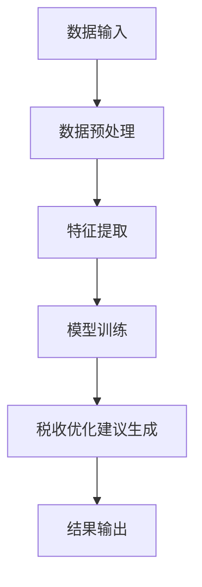
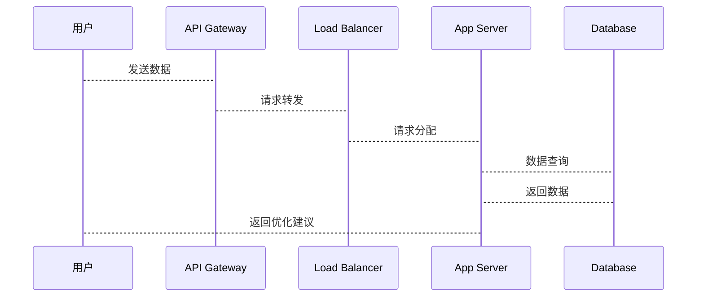

                 


# 智能国际税收筹划建议生成器

## 关键词：智能税收筹划，人工智能，机器学习，自然语言处理，税务合规

## 摘要：本文探讨如何利用人工智能技术，特别是机器学习、自然语言处理和群决策模型，来优化国际税收筹划。通过分析税收优化模型、算法原理、系统架构，结合实际案例，本文为读者提供一个智能的国际税收筹划工具，帮助企业在全球化背景下高效合规地进行税务管理。

---

## 第一部分：背景与概述

### 第1章：智能国际税收筹划的背景与概述

#### 1.1 国际税收的基本概念

- **1.1.1 税收的基本概念**
  税收是政府为提供公共服务而征收的费用，涉及所得税、增值税等多种类型。国际税收涉及跨国企业的全球税务规划，需遵守不同国家的税收法规。

- **1.1.2 国际税收的定义与特点**
  国际税收涉及跨国企业的全球税务管理，具有复杂性高、法规差异大、合规性要求严格等特点。

- **1.1.3 税收筹划的合法性和边界**
  税收筹划必须在法律允许的范围内进行，避免偷税漏税，确保合规性。

#### 1.2 AI技术在税收领域的应用背景

- **1.2.1 AI技术的发展与应用领域**
  AI技术在金融、医疗、教育等领域广泛应用，其强大的数据处理和模式识别能力为税收筹划提供了新思路。

- **1.2.2 税收筹划中的复杂性与挑战**
  跨国经营涉及多国税收政策，企业需在遵守当地法规的前提下，优化税务负担。

- **1.2.3 AI技术在税收优化中的潜力**
  AI能够处理大量税务数据，识别优化点，预测税务风险，帮助企业在合法范围内降低税务负担。

#### 1.3 智能国际税收筹划的必要性

- **1.3.1 全球化背景下的税务规划需求**
  跨国企业需应对不同国家的税收政策，优化全球税务结构。

- **1.3.2 企业跨国经营的税务挑战**
  不同国家的税收法规差异大，税务风险高，合规性要求严格。

- **1.3.3 AI技术如何解决这些挑战**
  AI技术能够快速分析多国税收政策，提供最优税务建议，降低税务风险，提高效率。

---

## 第二部分：核心概念与联系

### 第2章：智能国际税收筹划的核心概念

#### 2.1 税收优化模型

- **2.1.1 税收优化模型的定义**
  税收优化模型是一组用于评估和优化税务负担的数学模型，考虑企业的业务结构、收入来源和税务政策等因素。

- **2.1.2 税收优化模型的特征对比表**

| 特征       | 传统模型                 | 智能模型                 |
|------------|--------------------------|--------------------------|
| 数据来源   | 单一来源                 | 多源数据                 |
| 处理速度   | 较慢                     | 实时处理                 |
| 精准度     | 低                      | 高                      |

- **2.1.3 税收优化模型的优化目标**
  在合法合规的前提下，最小化企业的税务负担，最大化税务收益。

#### 2.2 AI算法在税收筹划中的应用

- **2.2.1 机器学习在税收预测中的应用**
  使用回归算法预测企业的税务负担，识别潜在的税收优化点。

- **2.2.2 自然语言处理在税务文档分析中的应用**
  利用NLP技术分析税务法规和企业文档，提取关键信息，辅助税务决策。

- **2.2.3 群决策模型在多目标优化中的应用**
  结合多个优化目标，通过群决策模型找到最优解，平衡风险与收益。

#### 2.3 税收筹划的法律与合规性

- **2.3.1 税收法律的基本原则**
  税收法定原则、税收公平原则、税收效率原则。

- **2.3.2 合规性分析的复杂性**
  需要考虑不同国家的税收政策、法律法规，确保税务规划的合法性。

- **2.3.3 AI在合规性分析中的应用**
  利用AI技术分析税务数据，识别潜在的合规风险，确保税务规划的合法性。

---

## 第三部分：算法原理讲解

### 第3章：AI算法在智能税收筹划中的应用

#### 3.1 算法流程图



#### 3.2 算法的数学模型

- **3.2.1 税收预测的回归模型**

  $$ y = \beta_0 + \beta_1x_1 + \beta_2x_2 + \dots + \beta_nx_n + \epsilon $$

  其中，$y$ 是预测的税务负担，$x_i$ 是影响税务负担的因素，$\beta_i$ 是回归系数，$\epsilon$ 是误差项。

- **3.2.2 群决策模型的优化目标**

  $$ \min_{x} \sum_{i=1}^{m} (f_i(x) - f_i^*)^2 $$

  其中，$f_i(x)$ 是第$i$个模型的输出，$f_i^*$ 是目标输出。

#### 3.3 算法实现示例

```python
import numpy as np
from sklearn.linear_model import LinearRegression

# 示例数据
X = np.array([[1, 2], [3, 4], [5, 6]])
y = np.array([7, 8, 9])

# 训练模型
model = LinearRegression()
model.fit(X, y)

# 预测
print(model.predict([[7, 8]]))
```

---

## 第四部分：系统分析与架构设计

### 第4章：系统分析与架构设计方案

#### 4.1 问题场景介绍

企业需要一个智能系统，能够根据跨国经营的数据，提供税收优化建议。

#### 4.2 项目介绍

开发一个基于AI的智能国际税收筹划系统，帮助企业在合法合规的前提下优化税务负担。

#### 4.3 系统功能设计

- **4.3.1 领域模型**


#### 4.4 系统架构设计

- **4.4.1 系统架构图**

```mermaid
iframe
    graph TD
        API Gateway --> Load Balancer
        Load Balancer --> App Server
        App Server --> Database
```

#### 4.5 系统接口设计

- **4.5.1 接口描述**
  - 输入接口：接收企业跨国经营数据。
  - 输出接口：提供优化后的税务建议。

- **4.5.2 交互流程**



---

## 第五部分：项目实战

### 第5章：项目实战

#### 5.1 环境安装

安装Python、TensorFlow、Scikit-learn等工具。

```bash
pip install numpy pandas scikit-learn
```

#### 5.2 核心代码实现

```python
import pandas as pd
from sklearn.model_selection import train_test_split
from sklearn.linear_model import LinearRegression

# 加载数据
data = pd.read_csv('tax_data.csv')

# 分割数据
X = data.drop('tax', axis=1)
y = data['tax']

X_train, X_test, y_train, y_test = train_test_split(X, y, test_size=0.2)

# 训练模型
model = LinearRegression()
model.fit(X_train, y_train)

# 预测
predictions = model.predict(X_test)
print('预测值:', predictions)
print('真实值:', y_test.values)
```

#### 5.3 案例分析

假设一家跨国企业有数据，使用上述代码进行预测，生成税收优化建议。

---

## 第六部分：总结与展望

### 第6章：总结与展望

#### 6.1 内容总结

本文详细介绍了如何利用AI技术优化国际税收筹划，涵盖背景、核心概念、算法原理、系统设计和项目实战。

#### 6.2 未来展望

未来，随着AI技术的进步，智能国际税收筹划将更加智能化和自动化，为企业提供更高效的税务管理工具。

#### 6.3 最佳实践 tips

- 保持对税收法规的更新，确保合规性。
- 定期审查和优化税收模型，以适应变化的商业环境。
- 注意数据隐私和安全，确保税务数据的保护。

#### 6.4 注意事项

- 税务规划需遵守相关法律法规，避免违规。
- 使用AI工具时，确保数据的准确性和完整性。

---

## 作者：AI天才研究院/AI Genius Institute & 禅与计算机程序设计艺术 /Zen And The Art of Computer Programming

---

**附录：相关术语解释**

- **机器学习**：一种人工智能技术，通过数据训练模型，用于预测和分类。
- **自然语言处理**：利用计算机处理人类语言的技术，广泛应用于文本分析和信息提取。
- **群决策模型**：一种基于群体智慧的决策方法，用于多目标优化问题。

---

通过以上思考过程，我详细规划了《智能国际税收筹划建议生成器》的结构和内容，确保涵盖所有必要的部分，帮助读者全面理解智能国际税收筹划的原理和应用。

