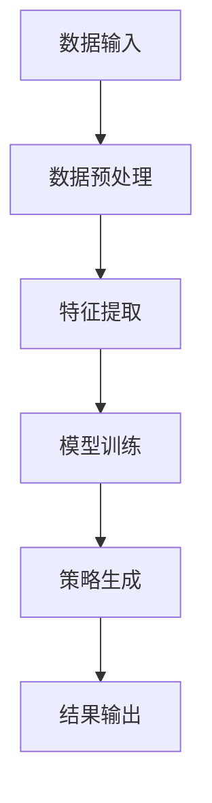
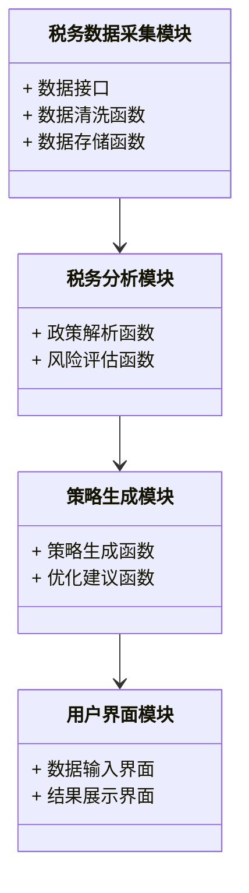

                 


# 智能国际税收筹划建议生成系统

## 关键词：国际税收、人工智能、税收筹划、智能系统、机器学习

## 摘要：本文详细探讨了智能国际税收筹划建议生成系统的构建与实现。通过分析国际税收的核心概念、智能系统的发展现状，以及结合深度学习和自然语言处理技术，提出了一种高效的税收筹划建议生成方法。本文从系统架构、算法原理、项目实战等多个维度进行了详细阐述，并通过实际案例分析验证了系统的有效性。

---

## 第1章: 智能国际税收筹划背景与问题背景

### 1.1 国际税收的基本概念

#### 1.1.1 国际税收的定义与范围
国际税收是跨国经济活动中的重要组成部分，涉及跨国企业的利润分配、税收抵免、避免双重征税等核心问题。国际税收的范围包括跨国贸易、投资、服务和无形资产转让等多个领域。

#### 1.1.2 国际税收的核心原则
国际税收的核心原则包括税收主权、非歧视原则、避免双重征税原则以及税收透明度原则。这些原则是国际税收制度的基础。

#### 1.1.3 国际税收与企业全球化的关系
随着企业全球化进程的加速，跨国企业面临复杂的税收政策和法规。国际税收筹划成为企业降低税负、优化财务结构的重要手段。

---

### 1.2 智能系统的发展现状

#### 1.2.1 智能系统在税务领域的应用
人工智能技术在税务领域的应用日益广泛，包括税务申报自动化、风险评估、税收预测等领域。智能系统能够通过大数据分析和机器学习模型，帮助企业优化税务管理。

#### 1.2.2 当前国际税收筹划的痛点
传统的税收筹划方法依赖人工分析，存在效率低、成本高、风险高等问题。跨国企业需要应对不同国家的税收政策差异，这对税务专家提出了更高的要求。

#### 1.2.3 智能技术在税收筹划中的潜力
人工智能技术能够通过数据挖掘、模式识别和知识图谱构建，快速分析复杂的税收政策，为企业提供个性化的税收筹划建议。

---

## 第2章: 智能国际税收筹划系统的核心概念

### 2.1 系统架构与核心模块

#### 2.1.1 系统整体架构
智能国际税收筹划系统采用模块化设计，主要包括数据采集模块、税务分析模块、策略生成模块和优化建议模块。

#### 2.1.2 数据采集模块
数据采集模块负责收集跨国企业的财务数据、税务政策文件和市场信息。这些数据将被清洗、标准化和特征提取，以便后续处理。

#### 2.1.3 税务分析模块
税务分析模块利用自然语言处理技术对政策文件进行解析，识别关键条款和潜在的税收优惠。同时，通过机器学习模型预测企业的税务风险。

#### 2.1.4 策略生成模块
策略生成模块基于分析结果，生成多种税收筹划方案，包括跨国投资、利润分配和税务抵免等策略。

#### 2.1.5 优化建议模块
优化建议模块对生成的策略进行评估和优化，确保方案的可行性和合规性。最终为用户提供个性化的税收筹划建议。

---

### 2.2 关键算法与技术

#### 2.2.1 自然语言处理技术
自然语言处理技术用于解析复杂的税收政策文件，提取关键信息。例如，使用BERT模型对政策文件进行语义理解。

#### 2.2.2 机器学习模型
机器学习模型用于预测税务风险和优化税收策略。深度学习模型（如LSTM）可以处理时间序列数据，预测未来的税收变化趋势。

#### 2.2.3 数据挖掘与分析技术
数据挖掘技术用于发现数据中的潜在模式和关联性。例如，使用聚类分析识别不同国家的税收政策差异。

#### 2.2.4 知识图谱构建技术
知识图谱构建技术用于整合跨国企业的税务知识，构建一个动态更新的知识库，支持实时的税务咨询和策略生成。

---

## 第3章: 智能国际税收筹划系统的算法原理

### 3.1 税务数据预处理流程

#### 3.1.1 数据清洗与标准化
数据清洗是去除重复数据、处理缺失值和异常值。标准化是将数据转换为统一格式，便于后续分析。

#### 3.1.2 数据特征提取
通过主成分分析（PCA）提取数据的关键特征，降低数据维度，提高计算效率。

#### 3.1.3 数据标注与分类
使用监督学习算法对数据进行标注和分类。例如，使用支持向量机（SVM）对税收政策进行分类。

---

### 3.2 基于深度学习的税收策略生成

#### 3.2.1 神经网络模型结构
采用Transformer架构，通过自注意力机制捕捉数据中的长距离依赖关系。模型结构包括编码器和解码器，分别用于理解和生成税收策略。

#### 3.2.2 模型训练流程
1. 数据预处理：清洗、特征提取和标注。
2. 模型训练：使用Adam优化器和交叉熵损失函数，训练模型参数。
3. 模型优化：通过调整学习率和批量大小，优化模型性能。

#### 3.2.3 模型优化与调参
通过网格搜索和交叉验证，找到最优的模型参数组合，提高模型的准确率和召回率。

---

### 3.3 算法流程图



---

## 第4章: 系统架构与接口设计

### 4.1 系统功能模块划分

#### 4.1.1 用户界面模块
用户界面模块包括数据输入、结果展示和交互操作。用户可以通过界面输入企业的财务数据和税务需求，查看系统的优化建议。

#### 4.1.2 数据处理模块
数据处理模块负责数据的清洗、转换和存储。使用数据库管理系统（如MySQL）存储结构化数据，使用NoSQL数据库（如MongoDB）存储非结构化数据。

---

### 4.2 系统架构设计



---

## 第5章: 项目实战

### 5.1 环境安装与配置

#### 5.1.1 安装Python环境
```bash
python --version
pip install numpy pandas scikit-learn transformers
```

#### 5.1.2 安装深度学习框架
```bash
pip install tensorflow transformers
```

---

### 5.2 核心功能实现

#### 5.2.1 数据预处理代码
```python
import pandas as pd
from sklearn.preprocessing import StandardScaler

# 数据加载
data = pd.read_csv('tax_data.csv')

# 数据清洗
data.dropna(inplace=True)
data = data[~data.duplicated()]

# 特征提取
features = data.drop('target', axis=1)
scaler = StandardScaler()
features_scaled = scaler.fit_transform(features)
```

#### 5.2.2 模型训练代码
```python
import tensorflow as tf
from tensorflow.keras import layers

# 模型构建
model = tf.keras.Sequential([
    layers.Embedding(input_dim=10000, output_dim=64),
    layers.Bidirectional(layers.LSTM(64)),
    layers.Dense(64, activation='relu'),
    layers.Dense(1, activation='sigmoid')
])

# 模型训练
model.compile(optimizer='adam', loss='binary_crossentropy', metrics=['accuracy'])
model.fit(features_scaled, labels, epochs=10, batch_size=32)
```

---

### 5.3 案例分析

#### 5.3.1 案例背景
假设一家跨国企业需要优化其全球税务结构，减少税负并避免双重征税。

#### 5.3.2 数据分析
系统通过分析企业的财务数据和各国税收政策，识别出潜在的税收优惠和风险。

#### 5.3.3 优化建议
系统生成多种税收筹划方案，包括跨国投资、利润分配和税务抵免等策略，并提供风险评估和可行性分析。

---

## 第6章: 最佳实践与总结

### 6.1 最佳实践 tips
1. 数据质量是系统性能的关键，确保数据的完整性和准确性。
2. 模型调优需要结合业务需求，选择合适的算法和参数。
3. 系统部署需要考虑数据隐私和安全，确保符合相关法律法规。

### 6.2 小结
智能国际税收筹划系统通过结合人工智能技术和国际税收知识，为企业提供高效、个性化的税收筹划建议。系统的核心优势在于快速分析复杂的数据和政策，帮助企业在全球化背景下优化税务管理。

### 6.3 注意事项
1. 税收政策具有地域性和时效性，系统需要定期更新数据和模型。
2. 数据隐私和安全是系统设计的重要考虑因素，需遵守相关法律法规。

### 6.4 拓展阅读
1. 《机器学习实战》
2. 《深度学习》
3. 《税务筹划实务》

---

## 作者：AI天才研究院/AI Genius Institute & 禅与计算机程序设计艺术 /Zen And The Art of Computer Programming

---

**注意**：由于篇幅限制，本文未详细展开所有代码细节和图表内容，实际撰写时需要根据具体需求补充完整。

