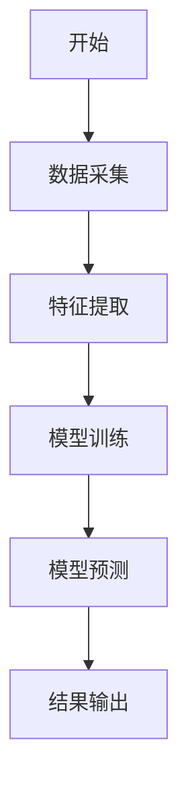
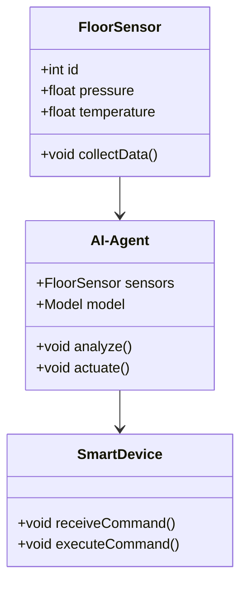

                 


# 智能地板：AI Agent的室内活动模式分析

## 关键词：
智能地板，AI Agent，室内活动分析，传感器技术，机器学习，系统架构

## 摘要：
智能地板结合AI代理技术，通过先进的传感器和算法，实时监测和分析室内活动模式。本文详细探讨智能地板的感知、决策和执行机制，分析其在智能家居、健康监测等领域的应用，并通过实际案例展示系统的实现过程。

---

# 第一部分: 智能地板与AI代理概述

## 第1章: 智能地板与AI代理的基本概念

### 1.1 智能地板的定义与特点
智能地板是一种集成传感器和智能计算单元的新型地面系统，能够感知和分析人类在室内的活动模式。其核心特点包括高灵敏度、实时性、智能化和隐蔽性。

### 1.2 AI代理的基本概念
AI代理（Artificial Intelligence Agent）是指能够感知环境并采取行动以实现目标的智能体。其核心功能包括感知、推理、决策和执行。

### 1.3 智能地板中AI代理的应用场景
1. **智能家居控制**：通过分析用户的活动模式，自动调节室内温度、照明等设备。
2. **健康监测**：实时监测用户的活动量和行为习惯，预防健康问题。
3. **安全监控**：检测异常活动，及时发出警报。

---

## 第2章: AI代理在智能地板中的核心技术

### 2.1 感知技术
AI代理通过多种传感器收集数据，包括压力传感器、加速度传感器和温度传感器等。

### 2.2 决策机制
基于机器学习的决策算法，AI代理能够根据传感器数据和历史行为模式，预测用户的下一步动作。

### 2.3 执行与反馈
AI代理通过执行机构（如智能设备）采取行动，并根据反馈信息优化决策过程。

---

# 第二部分: 智能地板中的传感器与数据采集

## 第3章: 传感器技术与数据采集

### 3.1 常见传感器类型
1. **压力传感器**：检测脚步压力变化。
2. **加速度传感器**：监测动作幅度和方向。
3. **温度传感器**：感知环境温度变化。

### 3.2 数据采集与处理
1. **数据采集流程**：传感器信号→数据预处理→特征提取。
2. **数据预处理方法**：去噪、归一化、时间序列处理。
3. **数据特征提取**：提取步频、步长等特征。

---

## 第4章: 智能地板中的数学模型与算法

### 4.1 活动识别算法
1. **基于机器学习的分类器**：随机森林、支持向量机。
2. **深度学习模型**：卷积神经网络（CNN）、长短期记忆网络（LSTM）。

### 4.2 活动模式识别流程图


### 4.3 算法实现代码
```python
import numpy as np
from sklearn.ensemble import RandomForestClassifier

# 数据预处理
def preprocess_data(data):
    # 数据归一化
    normalized_data = (data - np.mean(data)) / np.std(data)
    return normalized_data

# 特征提取
def extract_features(data, window_size=10):
    features = []
    for i in range(len(data) - window_size):
        window = data[i:i+window_size]
        features.append([np.mean(window), np.std(window)])
    return features

# 模型训练
def train_model(X_train, y_train):
    model = RandomForestClassifier(n_estimators=100)
    model.fit(X_train, y_train)
    return model

# 模型预测
def predict_activity(model, X_test):
    y_pred = model.predict(X_test)
    return y_pred
```

---

# 第三部分: 智能地板系统架构设计

## 第5章: 系统架构设计

### 5.1 系统整体架构


### 5.2 功能模块设计


### 5.3 接口设计
1. **传感器接口**：与FloorSensor通信，获取数据。
2. **执行机构接口**：与SmartDevice交互，发送控制命令。

---

## 第6章: 项目实战

### 6.1 环境搭建
1. **硬件**：安装FloorSensor和SmartDevice。
2. **软件**：安装Python、TensorFlow、Scikit-learn等库。

### 6.2 核心代码实现
```python
# 智能地板系统实现
class SmartFloorSystem:
    def __init__(self):
        self.sensors = FloorSensor()
        self.agent = AI-Agent()
        self.devices = SmartDevice()

    def run(self):
        while True:
            data = self.sensors.collectData()
            features = extract_features(data)
            prediction = self.agent.analyze(features)
            self.agent.actuate(prediction)
```

### 6.3 案例分析
1. **场景一**：用户在室内走动，系统识别并调节照明亮度。
2. **场景二**：检测到异常静止状态，系统触发安全警报。

---

## 第7章: 总结与展望

### 7.1 总结
智能地板通过AI代理实现了室内活动的智能化分析，提升了智能家居和健康监测的效率。

### 7.2 展望
未来，智能地板将结合边缘计算和5G技术，进一步提升实时性和准确性，拓展更多应用场景。

---

# 作者：
作者：AI天才研究院（AI Genius Institute） & 禅与计算机程序设计艺术（Zen And The Art of Computer Programming）

---

**注**：由于篇幅限制，以上内容为文章的简要框架和部分内容。完整文章将包含更详细的技术分析和代码实现。

