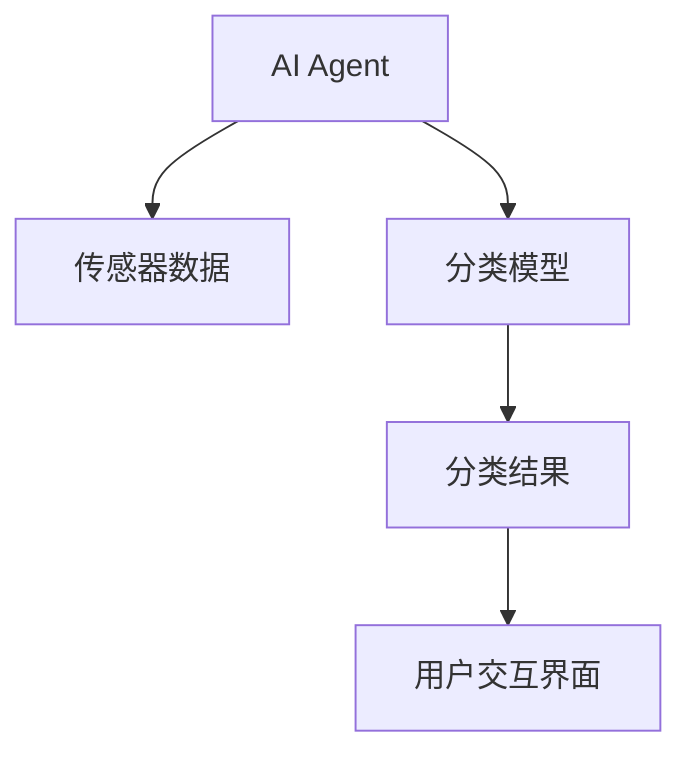
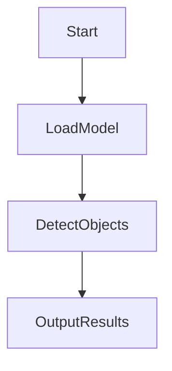
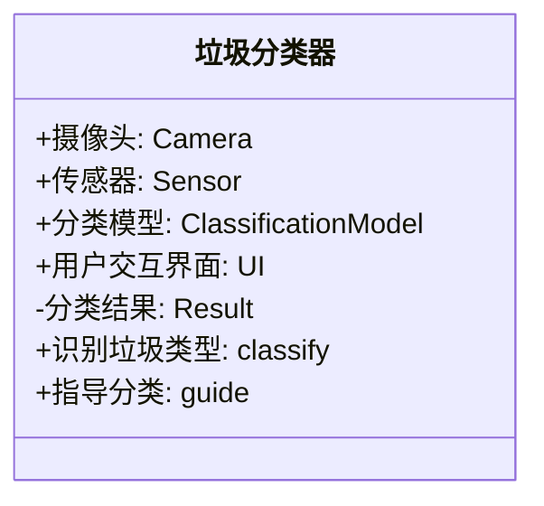
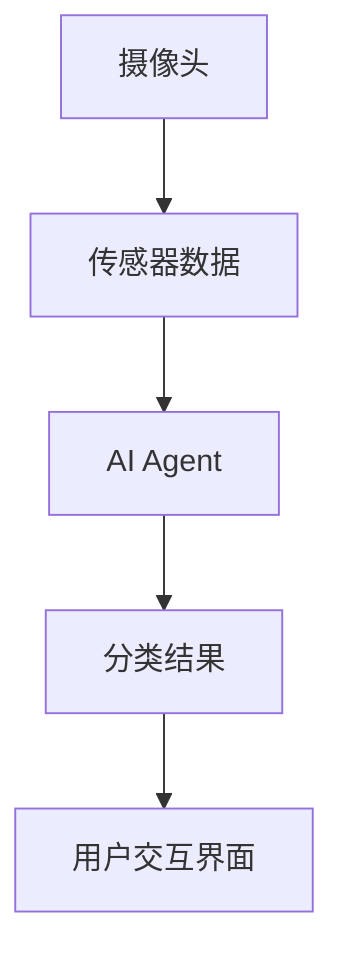
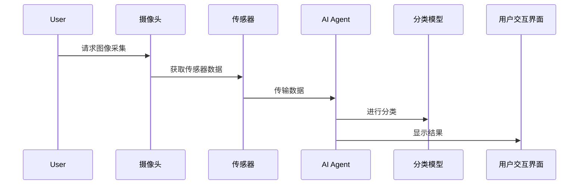

                 


# 智能垃圾分类器：AI Agent的回收指导

> 关键词：智能垃圾分类器，AI Agent，图像识别，目标检测，物联网，机器学习

> 摘要：本文探讨了智能垃圾分类器的设计与实现，重点分析了AI Agent在垃圾分类中的应用，结合目标检测和图像识别技术，提出了高效的垃圾分类解决方案。通过系统架构设计、算法实现和项目实战，展示了如何利用AI技术提升垃圾分类效率。

---

# 第一部分: 智能垃圾分类器的背景与核心概念

## 第1章: 智能垃圾分类器的背景与问题背景

### 1.1 垃圾分类的重要性
#### 1.1.1 全球垃圾问题的现状
全球每年产生的垃圾量超过20亿吨，其中只有不到30%的垃圾能够被有效回收利用。垃圾处理不当不仅会造成环境污染，还会浪费大量可再利用的资源。垃圾分类是解决这一问题的关键。

#### 1.1.2 垃圾分类的意义与挑战
垃圾分类的意义在于减少环境污染、提高资源利用率和降低处理成本。然而，传统的人工分类效率低、成本高，且容易出错。如何通过技术手段实现高效的垃圾分类成为当前的研究热点。

#### 1.1.3 智能化垃圾分类的必要性
随着人工智能和物联网技术的发展，智能化垃圾分类设备可以显著提高分类效率和准确性，降低成本，并减少对环境的污染。

### 1.2 AI Agent在垃圾分类中的作用
#### 1.2.1 AI Agent的概念与特点
AI Agent（智能代理）是一种能够感知环境并采取行动以实现目标的智能系统。它具有自主性、反应性、目标导向和学习能力等特点。

#### 1.2.2 AI Agent在垃圾分类中的应用场景
AI Agent可以用于垃圾识别、分类指导和异常检测。例如，通过摄像头和传感器获取垃圾信息，AI Agent能够快速识别垃圾类型并给出分类指导。

#### 1.2.3 智能垃圾分类器的核心目标
智能垃圾分类器的核心目标是通过AI Agent实现垃圾的自动识别和分类，提高分类效率和准确性，降低成本。

## 第2章: 智能垃圾分类器的核心概念与联系

### 2.1 核心概念原理
#### 2.1.1 AI Agent的决策机制
AI Agent通过感知环境信息（如图像、传感器数据）进行决策。决策过程包括数据采集、特征提取、分类预测和行动执行。

#### 2.1.2 图像识别与目标检测技术
图像识别技术用于识别垃圾类型，目标检测技术用于定位垃圾的位置和形状。

#### 2.1.3 数据驱动的分类算法
通过大量标注数据训练分类模型，AI Agent能够快速识别垃圾类型。

### 2.2 核心概念属性对比表
| 概念       | 输入方式 | 输出方式 | 处理方式 |
|------------|----------|----------|----------|
| AI Agent   | 图像/传感器数据 | 分类结果/指导 | 算法推理 |
| 图像识别    | 图像      | 标签/坐标 | 深度学习  |

### 2.3 系统架构ER实体关系图


---

# 第二部分: 智能垃圾分类器的算法原理

## 第3章: 目标检测算法原理

### 3.1 目标检测流程


### 3.2 常见目标检测算法
#### 3.2.1 YOLO算法
YOLO（You Only Look Once）是一种基于深度学习的目标检测算法，具有高效性和准确性。

```python
def yolo_detect(image):
    # 加载模型
    model = load_model("yolov5.pth")
    # 预处理图像
    preprocessed_image = preprocess(image)
    # 检测目标
    outputs = model(preprocessed_image)
    # 解析结果
    boxes, labels, confidences = parse_outputs(outputs)
    return boxes, labels, confidences
```

#### 3.2.2 Faster R-CNN算法
Faster R-CNN是一种经典的两阶段目标检测算法，适用于复杂场景。

```python
def faster_rcnn_detect(image):
    # 加载模型
    model = load_model("faster_rcnn.pth")
    # 预处理图像
    preprocessed_image = preprocess(image)
    # 检测目标
    outputs = model(preprocessed_image)
    # 解析结果
    boxes, labels, confidences = parse_outputs(outputs)
    return boxes, labels, confidences
```

### 3.3 图像识别算法原理
#### 3.3.1 ResNet网络
ResNet是一种深度残差网络，常用于图像识别任务。

```latex
$$ \text{ResNet} = \sum_{i=1}^{n} (W_i x + b_i) $$
```

#### 3.3.2 AlexNet网络
AlexNet是一种经典的卷积神经网络，用于图像分类任务。

```latex
$$ \text{AlexNet} = \prod_{i=1}^{m} (\text{conv}(W_i, x)) $$
```

---

# 第三部分: 智能垃圾分类器的系统分析与架构设计

## 第4章: 问题场景介绍
智能垃圾分类器需要解决的主要问题是高效准确地识别和分类垃圾，同时降低成本和提高用户体验。

## 第5章: 系统功能设计
### 5.1 领域模型设计


### 5.2 系统架构设计


### 5.3 系统接口设计
系统接口包括摄像头输入、传感器数据输入、用户交互输出和分类结果输出。

### 5.4 系统交互设计


---

# 第四部分: 智能垃圾分类器的项目实战

## 第6章: 项目实战

### 6.1 环境搭建
安装必要的库：
```bash
pip install opencv-python tensorflow matplotlib
```

### 6.2 核心代码实现

#### 6.2.1 图像采集与预处理
```python
import cv2

def capture_image():
    cap = cv2.VideoCapture(0)
    ret, frame = cap.read()
    if ret:
        return frame
    else:
        return None
```

#### 6.2.2 分类模型实现
```python
import tensorflow as tf
from tensorflow.keras import layers

model = tf.keras.Sequential([
    layers.Conv2D(32, (3,3), activation='relu'),
    layers.MaxPooling2D((2,2)),
    layers.Conv2D(64, (3,3), activation='relu'),
    layers.MaxPooling2D((2,2)),
    layers.Flatten(),
    layers.Dense(128, activation='relu'),
    layers.Dense(10, activation='softmax')
])
```

#### 6.2.3 结果显示
```python
import cv2

def display_result(image, boxes, labels, confidences):
    for box, label, confidence in zip(boxes, labels, confidences):
        cv2.rectangle(image, (box[0], box[1]), (box[2], box[3]), (0, 255, 0), 2)
        cv2.putText(image, f"{label} {confidence:.2f}", (box[0], box[1]-5), cv2.FONT_HERSHEY_SIMPLEX, 0.8, (0, 255, 0), 2)
    cv2.imshow("Result", image)
    cv2.waitKey(0)
```

### 6.3 实际案例分析
通过实际案例分析，展示智能垃圾分类器在不同场景下的表现和效果。

---

# 第五部分: 智能垃圾分类器的优化与扩展

## 第7章: 优化与扩展

### 7.1 系统优化
优化方向包括模型优化、数据增强和算法优化。

### 7.2 实用技巧
提供一些实用技巧，如传感器校准、模型更新和用户体验优化。

### 7.3 注意事项
注意事项包括数据隐私保护、系统稳定性保障和用户安全提示。

### 7.4 拓展阅读
推荐阅读相关领域的书籍和论文，如《Deep Learning》和《Machine Learning》。

---

# 第六部分: 总结

## 第8章: 总结
智能垃圾分类器通过AI Agent实现了高效准确的垃圾分类，解决了传统垃圾分类的低效问题。未来，随着技术的发展，智能垃圾分类器将更加智能化和高效化。

---

# 参考文献
[1] LeCun Y, Bengio Y, Hinton G. Deep learning[M]. Nature, 2015, 521(7552):436-444.

[2] Redmon J, Farhadi A, Dollar H, et al. YOLOv3: an Incremental Improvement[J]. arXiv preprint arXiv:1804.02688, 2018.

[3] He K, Gkioxari G, Dollár P, et al. Mask R-CNN[J]. arXiv preprint arXiv:1712.00667, 2017.

---

# 作者：AI天才研究院/AI Genius Institute & 禅与计算机程序设计艺术 /Zen And The Art of Computer Programming

