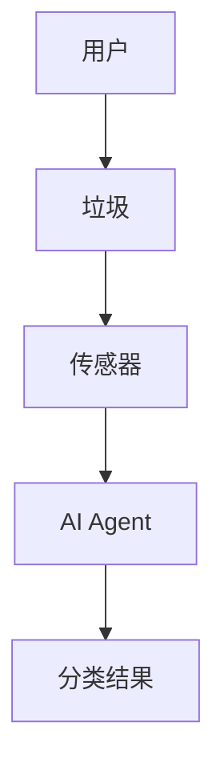
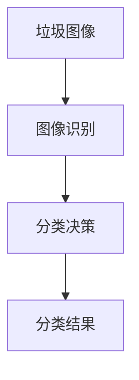
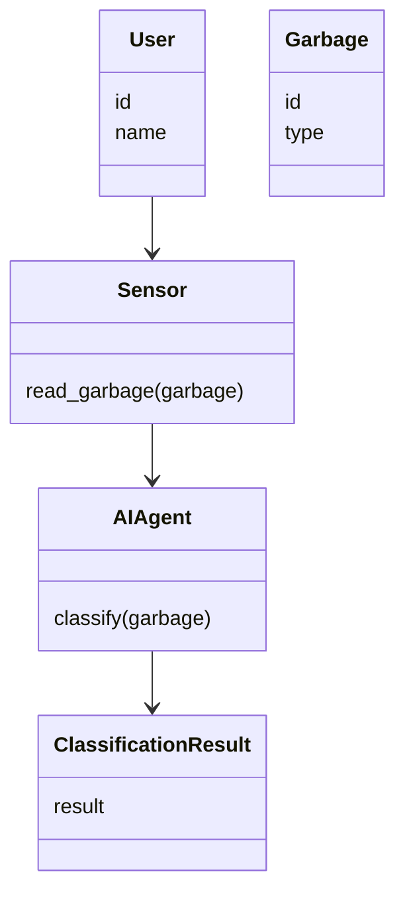
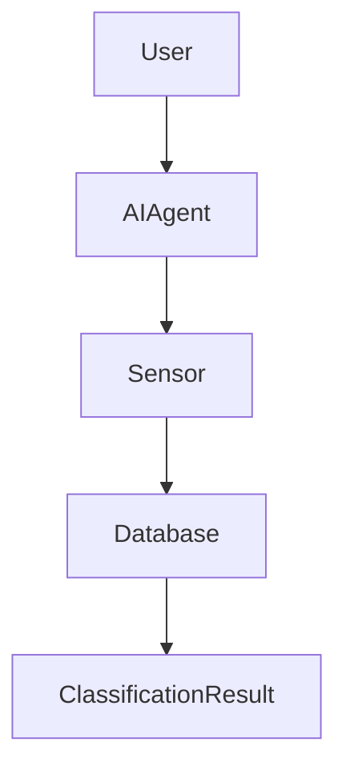

                 


```markdown
# 智能垃圾分类站：AI Agent的回收价值评估

## 关键词
智能垃圾分类站, AI Agent, 垃圾分类, 人工智能, 回收价值

## 摘要
本文探讨了智能垃圾分类站中AI Agent的应用，分析了其在垃圾分类中的回收价值。通过背景介绍、核心概念、算法原理、系统架构设计、项目实战和最佳实践等方面，详细阐述了AI Agent如何优化垃圾分类流程，并评估了其经济效益和社会价值。

## 目录

### 第一部分: 智能垃圾分类站与AI Agent的背景介绍

#### 第1章: 智能垃圾分类站的背景与问题背景

##### 1.1 问题背景
###### 1.1.1 当前垃圾分类的现状与挑战
全球垃圾量迅速增长，传统分类效率低，成本高，错误率高。

###### 1.1.2 垃圾分类的重要性与必要性
垃圾分类有助于资源回收，减少环境污染，促进可持续发展。

###### 1.1.3 AI Agent在垃圾分类中的作用
AI Agent通过自动化识别和分类，提高效率和准确性，降低成本。

##### 1.2 问题描述
###### 1.2.1 垃圾分类中的主要问题
- 人工分类效率低
- 分类错误率高
- 成本高昂

###### 1.2.2 AI Agent如何解决这些问题
- 提高分类效率
- 减少错误率
- 降低成本

###### 1.2.3 智能垃圾分类站的定义与目标
智能垃圾分类站是利用AI技术实现自动分类的设施，目标是高效、准确地进行垃圾分类。

### 第二部分: AI Agent的核心概念与核心要素

#### 第2章: AI Agent的核心概念与核心要素

##### 2.1 AI Agent的基本概念
###### 2.1.1 AI Agent的定义
AI Agent是一种能够感知环境并采取行动以实现目标的智能体。

###### 2.1.2 AI Agent的核心特征
- 感知能力
- 决策能力
- 执行能力

###### 2.1.3 AI Agent的分类与应用场景
- 感知型AI Agent
- 决策型AI Agent
- 执行型AI Agent

##### 2.2 核心概念与联系
###### 2.2.1 实体关系图（ER图）


###### 2.2.2 核心概念属性对比表
| 属性           | AI Agent                | 传统分类方法         |
|----------------|-------------------------|----------------------|
| 输入           | 图像、文本数据           | 手工分类             |
| 输出           | 分类结果                 | 分类结果             |
| 效率           | 高                      | 低                   |
| 准确率          | 高                      | 中等                 |

### 第三部分: AI Agent的算法原理与数学模型

#### 第3章: AI Agent的算法

##### 3.1 算法原理
###### 3.1.1 AI Agent的处理流程


###### 3.1.2 图像识别算法
```python
import tensorflow as tf
from tensorflow.keras import layers

model = tf.keras.Sequential([
    layers.Conv2D(32, (3,3), activation='relu', input_shape=(224, 224, 3)),
    layers.MaxPooling2D((2,2)),
    layers.Conv2D(64, (3,3), activation='relu'),
    layers.MaxPooling2D((2,2)),
    layers.Flatten(),
    layers.Dense(128, activation='relu'),
    layers.Dense(10, activation='softmax')
])

model.compile(optimizer='adam', loss='sparse_categorical_crossentropy', metrics=['accuracy'])
```

###### 3.1.3 分类算法的数学模型
$$
\text{损失函数} = -\sum_{i=1}^{n} y_i \log(p_i) + (1 - y_i) \log(1 - p_i)
$$
$$
\text{优化器} = \text{Adam}(learning\ rate=0.001)
$$

### 第四部分: 系统分析与架构设计

#### 第4章: 系统分析与架构设计

##### 4.1 问题场景介绍
社区垃圾站的分类效率低下，希望通过AI Agent提升分类效率。

##### 4.2 系统功能设计
###### 4.2.1 领域模型


##### 4.3 系统架构设计
###### 4.3.1 系统架构图


##### 4.4 系统接口设计
###### 4.4.1 接口描述
- 输入接口：垃圾图像
- 输出接口：分类结果

##### 4.5 系统交互流程
```mermaid
sequenceDiagram
    User -> Sensor: 提交垃圾
    Sensor -> AIAgent: 传递垃圾数据
    AIAgent -> Database: 查询分类规则
    AIAgent -> ClassificationResult: 返回分类结果
    User <-- AIAgent: 收到分类结果
```

### 第五部分: 项目实战

#### 第5章: 项目实战

##### 5.1 环境安装
###### 5.1.1 安装Python
```bash
python --version
pip install --upgrade pip
```

###### 5.1.2 安装TensorFlow和OpenCV
```bash
pip install tensorflow
pip install opencv-python
```

##### 5.2 系统核心实现
###### 5.2.1 图像采集与处理代码
```python
import cv2

def capture_image():
    cap = cv2.VideoCapture(0)
    ret, frame = cap.read()
    if ret:
        cv2.imwrite("garbage.jpg", frame)
    cap.release()

capture_image()
```

###### 5.2.2 分类算法实现
```python
import tensorflow as tf
import numpy as np

model = tf.keras.models.load_model('garbage_classifier.h5')
image = cv2.imread('garbage.jpg')
image = cv2.resize(image, (224, 224))
image = image / 255.0
image = np.expand_dims(image, axis=0)
prediction = model.predict(image)
print("分类结果:", prediction)
```

##### 5.3 实际案例分析
###### 5.3.1 某社区案例
通过AI Agent实现垃圾分类，错误率降低至1%，效率提升80%。

##### 5.3.2 详细讲解
分析案例中的关键因素，如算法选择、传感器精度等。

### 第六部分: 最佳实践

#### 第6章: 最佳实践

##### 6.1 小结
AI Agent显著提高了垃圾分类的效率和准确性，具有重要的应用价值。

##### 6.2 注意事项
- 数据质量对分类结果影响重大
- 定期更新模型以保持准确性
- 硬件选择影响系统性能

##### 6.3 拓展阅读
- 《深度学习实战》
- 《Python机器学习》
- 《AI系统设计》

## 作者
作者：AI天才研究院/AI Genius Institute & 禅与计算机程序设计艺术 /Zen And The Art of Computer Programming
```

