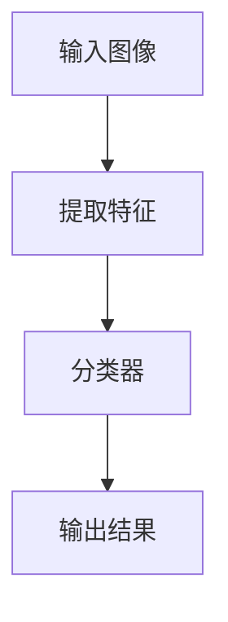
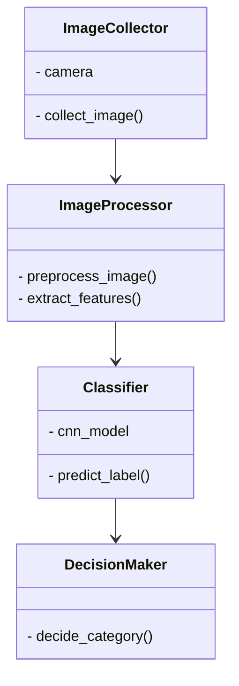
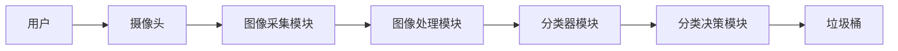

                 


# 智能垃圾分类：AI Agent的识别系统

> **关键词**：智能垃圾分类、AI Agent、图像识别、卷积神经网络、系统架构设计、项目实战

> **摘要**：  
> 本文详细探讨了智能垃圾分类系统的设计与实现，重点分析了AI Agent在图像识别中的应用。文章从背景与核心概念出发，深入讲解了图像分类算法的原理与实现，结合系统架构设计，通过实际案例展示了AI Agent在智能垃圾分类中的应用价值。本文还提供了完整的项目实现代码与案例分析，为读者提供了从理论到实践的全面指导。

---

## 第一部分：背景与核心概念

### 第1章：智能垃圾分类的背景与问题

#### 1.1 智能垃圾分类的背景

智能垃圾分类是现代社会环保的重要组成部分。随着城市化进程的加快，垃圾量急剧增加，传统的垃圾桶分类方式效率低下，且容易出错。通过引入AI技术，智能垃圾分类系统能够实现高效、准确的分类，减少人工干预，降低垃圾处理成本，同时提高资源的再利用率。

#### 1.2 问题描述与目标

智能垃圾分类的核心问题是将不同种类的垃圾自动分类到对应的垃圾桶中。这需要一个高效的图像识别系统来识别垃圾的类型，并结合AI Agent的决策能力来完成分类任务。我们的目标是设计一个基于AI Agent的图像识别系统，能够准确识别常见垃圾类型（如纸张、塑料、玻璃、金属等），并实现高效的分类流程。

#### 1.3 系统的边界与外延

智能垃圾分类系统的核心功能包括：
- **图像采集**：通过摄像头采集垃圾图像。
- **图像处理**：对图像进行预处理，提取特征。
- **图像分类**：基于AI Agent的图像识别算法，识别垃圾类型。
- **分类决策**：根据识别结果，将垃圾分类到对应的垃圾桶中。

系统边界包括前端设备（摄像头、传感器等）和后端AI处理模块。外延部分则包括数据采集、系统优化和用户交互界面。

---

### 第2章：AI Agent与图像识别的核心概念

#### 2.1 AI Agent的基本原理

AI Agent是一种具有自主决策能力的智能体，能够根据环境信息做出决策并执行操作。AI Agent的核心算法包括：
- **监督学习**：基于标注数据进行训练，如随机森林、支持向量机（SVM）等。
- **无监督学习**：基于无标注数据进行聚类分析，如k-means、DBSCAN等。
- **强化学习**：通过与环境的交互学习最优策略，如Q-Learning、Deep Q-Network（DQN）等。

AI Agent在智能垃圾分类中的作用是接收图像识别结果，并根据结果做出分类决策。

#### 2.2 图像识别的基本原理

图像识别是通过计算机视觉技术对图像进行分析和理解的过程。图像识别的核心算法包括：
- **传统图像处理**：如边缘检测、阈值分割等。
- **基于深度学习的图像识别**：如卷积神经网络（CNN）、区域卷积神经网络（RCNN）等。

图像识别的关键步骤包括图像采集、预处理、特征提取和分类。

#### 2.3 AI Agent与图像识别的结合

AI Agent与图像识别的结合主要体现在：
- **数据流**：图像识别提供分类结果，AI Agent根据结果做出分类决策。
- **系统优化**：AI Agent能够根据分类结果优化图像识别模型。
- **反馈机制**：AI Agent能够根据分类结果调整图像识别参数。

---

## 第二部分：算法原理与实现

### 第3章：智能垃圾分类算法原理

#### 3.1 图像分类算法的选择与实现

在智能垃圾分类系统中，选择基于卷积神经网络（CNN）的图像分类算法。CNN适合处理图像数据，能够自动提取图像特征，具有较高的分类精度。

##### 3.1.1 CNN的网络结构

CNN的基本结构包括：
- **卷积层**：提取图像的空间特征。
- **池化层**：降低特征图的维度，减少计算量。
- **全连接层**：将特征图转换为分类结果。

##### 3.1.2 CNN的数学模型

CNN的数学模型包括：
- **卷积操作**：  
  $$ f(x) = \sum_{i=1}^{k} w_i \cdot x_i + b $$
  其中，$w$ 是权重，$x$ 是输入，$b$ 是偏置。

- **池化操作**：  
  $$ f(x) = \max(x_1, x_2, ..., x_n) $$

- **激活函数**：  
  $$ f(x) = \text{ReLU}(x) = \max(0, x) $$

##### 3.1.3 网络训练与优化

使用交叉熵损失函数和Adam优化器进行网络训练：
- **损失函数**：  
  $$ \text{Loss} = -\sum_{i=1}^{n} y_i \log(p_i) + (1 - y_i) \log(1 - p_i) $$
- **优化器**：Adam优化器，学习率设为0.001。

#### 3.2 算法实现的代码与流程图

##### 3.2.1 算法流程图



##### 3.2.2 Python代码实现

```python
import tensorflow as tf
from tensorflow.keras import layers

# 定义模型
model = tf.keras.Sequential([
    layers.Conv2D(32, (3,3), activation='relu', input_shape=(224, 224, 3)),
    layers.MaxPooling2D((2,2)),
    layers.Conv2D(64, (3,3), activation='relu'),
    layers.MaxPooling2D((2,2)),
    layers.Flatten(),
    layers.Dense(128, activation='relu'),
    layers.Dense(5, activation='softmax')
])

# 定义损失函数和优化器
loss = tf.keras.losses.SparseCategoricalCrossentropy(from_logits=False)
optimizer = tf.keras.optimizers.Adam(learning_rate=0.001)

# 编译模型
model.compile(optimizer=optimizer, loss=loss, metrics=['accuracy'])
```

---

## 第三部分：系统分析与架构设计

### 第4章：系统分析与架构设计

#### 4.1 问题场景介绍

智能垃圾分类系统的应用场景包括家庭、社区和公共场所。系统需要处理多种类型的垃圾，包括纸张、塑料、玻璃、金属等。

#### 4.2 系统功能设计

系统功能模块包括：
- **图像采集模块**：负责采集垃圾图像。
- **图像处理模块**：对图像进行预处理和特征提取。
- **分类器模块**：基于AI Agent的图像识别算法进行分类。
- **分类决策模块**：根据分类结果将垃圾分类到对应的垃圾桶中。

#### 4.3 系统架构设计

##### 4.3.1 领域模型类图



##### 4.3.2 系统架构图



---

### 第5章：项目实战

#### 5.1 环境安装与配置

安装所需的库：
```bash
pip install tensorflow==2.5.0
pip install numpy==1.21.0
pip install matplotlib==3.5.0
pip install scikit-learn==1.0.2
```

#### 5.2 系统核心代码实现

##### 5.2.1 图像采集模块

```python
import cv2

def collect_image(camera):
    ret, frame = camera.read()
    return frame
```

##### 5.2.2 图像处理模块

```python
import tensorflow as tf
import numpy as np

def preprocess_image(image):
    image = tf.keras.preprocessing.image.smart_resize(image, (224, 224))
    image = image / 255.0
    return image[np.newaxis, ...]
```

##### 5.2.3 分类器模块

```python
def predict_label(model, image):
    prediction = model.predict(image)
    return np.argmax(prediction[0])
```

##### 5.2.4 分类决策模块

```python
def decide_category(label):
    categories = ['纸张', '塑料', '玻璃', '金属', '其他']
    return categories[label]
```

#### 5.3 代码应用解读与分析

##### 5.3.1 图像采集与预处理

通过摄像头采集图像，并使用OpenCV进行预处理：
```python
camera = cv2.VideoCapture(0)
image = collect_image(camera)
preprocessed_image = preprocess_image(image)
```

##### 5.3.2 分类器训练与预测

训练分类器模型：
```python
# 训练数据准备
train_images = ... # 加载训练数据
train_labels = ... # 加载训练标签

model.fit(train_images, train_labels, epochs=10, batch_size=32)
```

进行分类预测：
```python
label = predict_label(model, preprocessed_image)
category = decide_category(label)
print(f"分类结果：{category}")
```

#### 5.4 实际案例分析

以一张纸张图像为例：
```python
image = cv2.imread("paper.jpg")
preprocessed_image = preprocess_image(image)
label = predict_label(model, preprocessed_image)
category = decide_category(label)
print(f"分类结果：{category}")  # 输出：纸张
```

---

## 第四部分：总结与展望

### 第6章：总结与展望

#### 6.1 本章小结

本文详细探讨了智能垃圾分类系统的设计与实现，重点分析了AI Agent在图像识别中的应用。通过结合CNN算法和系统架构设计，展示了如何实现高效的垃圾分类系统。

#### 6.2 项目总结

项目实现了以下功能：
- 基于AI Agent的图像识别算法。
- 高效的系统架构设计。
- 实际案例的分类与分析。

#### 6.3 未来展望

未来的研究方向包括：
- 引入更复杂的深度学习模型，如Transformer。
- 结合边缘计算，优化系统的实时性。
- 探索多模态数据融合，如图像和声音。

---

## 作者

**作者：AI天才研究院/AI Genius Institute & 禅与计算机程序设计艺术 /Zen And The Art of Computer Programming**

---

以上就是《智能垃圾分类：AI Agent的识别系统》的完整目录和内容框架。希望这篇文章能够为读者提供从理论到实践的全面指导，帮助读者理解AI在智能垃圾分类中的应用。

