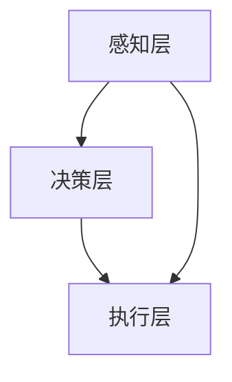
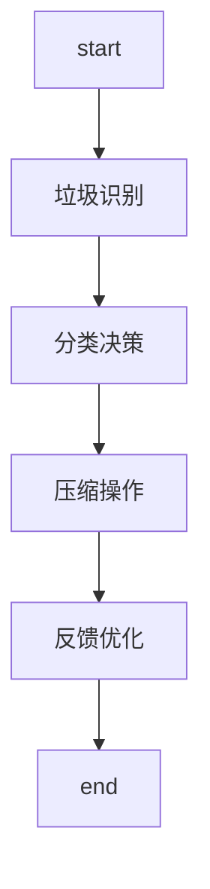

                 


# 智能垃圾处理站：AI Agent的分类与压缩

---

## 关键词
智能垃圾处理站，AI Agent，垃圾分类，压缩算法，协同优化，深度学习

---

## 摘要
本文探讨了智能垃圾处理站中AI Agent的分类与压缩技术，从理论到实践详细分析了AI Agent在垃圾分类中的应用，以及基于AI的压缩算法在垃圾处理中的优化作用。文章首先介绍了AI Agent的基本概念及其在垃圾处理中的重要性，接着详细分析了AI Agent的分类方法，包括基于规则、机器学习和深度学习的分类。随后，文章讨论了传统压缩算法与基于AI的压缩算法的优化策略，并探讨了AI Agent与压缩算法的协同优化。最后，通过项目实战，展示了AI Agent与压缩算法在智能垃圾处理站中的具体实现与应用。

---

## 第一部分：背景介绍

### 第1章：AI Agent与垃圾处理的背景

#### 1.1 AI Agent的基本概念
AI Agent，即智能代理，是一种能够感知环境并采取行动以实现目标的智能体。它可以自主决策，无需人工干预，广泛应用于自动驾驶、智能助手、机器人等领域。AI Agent的核心属性包括自主性、反应性、目标导向和社交能力。

**AI Agent的定义**：AI Agent是具有智能的实体，能够通过感知环境、推理和学习来执行任务。AI Agent的自主性使其能够在复杂环境中独立运作，反应性使其能够实时响应环境变化，目标导向使其能够专注于特定任务，社交能力则使其能够与其他系统或人类交互协作。

**AI Agent与传统自动化的区别**：传统自动化依赖预设规则，而AI Agent具备学习和适应能力，能够根据环境动态调整行为。例如，传统分类系统可能无法处理未见过的垃圾类型，而AI Agent可以通过深度学习模型不断优化分类精度。

#### 1.2 垃圾处理的现状与挑战
垃圾处理是全球面临的重要问题。随着城市化进程的加快，垃圾量急剧增加，传统的人工分类方式效率低下，且容易出错。传统压缩算法虽然能够减少垃圾体积，但缺乏智能化，无法根据垃圾类型动态调整压缩策略。

**全球垃圾处理现状**：全球每年产生约21亿吨垃圾，其中大部分未得到妥善处理。传统垃圾分类主要依赖人工操作，效率低且成本高。垃圾处理不当不仅浪费资源，还可能对环境造成严重污染。

**垃圾处理中的智能化需求**：AI技术的应用为垃圾处理带来了新的可能性。通过AI Agent实现智能化分类和压缩，能够提高处理效率，减少人工成本，并降低环境污染。

#### 1.3 AI Agent在垃圾处理中的应用前景
AI Agent在垃圾处理中的应用前景广阔。它可以实现垃圾的智能分类，提高分类精度；优化压缩算法，减少垃圾体积；与其他系统协同工作，构建智能垃圾处理站。

**AI Agent在垃圾分类中的作用**：AI Agent能够通过图像识别、机器学习等技术，准确识别垃圾类型，实现高效分类。与传统分类方法相比，AI Agent具有更高的准确性和适应性。

**AI Agent在垃圾压缩中的应用**：AI Agent可以根据垃圾类型和状态，动态调整压缩策略，优化压缩效果。例如，对于易碎垃圾，AI Agent可以采用低压力压缩，避免损坏；对于可回收物，AI Agent可以优先压缩，减少存储空间。

**智能垃圾处理站的未来趋势**：未来的智能垃圾处理站将集分类、压缩、运输于一体，AI Agent将在其中发挥核心作用。通过AI Agent的协同优化，垃圾处理站将更加高效、智能和环保。

---

## 第二部分：AI Agent的分类

### 第2章：AI Agent的分类方法

#### 2.1 基于规则的分类
基于规则的分类是一种简单且易于实现的分类方法，通过预设的规则对垃圾进行分类。这种方法适用于规则明确的场景，但面对复杂情况时表现有限。

**基于规则的分类原理**：基于规则的分类通过预设的条件判断垃圾类型。例如，如果垃圾是白色且形状为长方体，则分类为塑料瓶。

**分类规则的制定与优化**：分类规则需要根据实际场景进行调整。例如，新增垃圾类型时，需要更新规则库。规则优化可以通过统计分析和反馈机制实现。

**基于规则的分类的优缺点**：优点是实现简单、效率高；缺点是难以应对复杂和多样化的垃圾类型，容易出现误分类。

#### 2.2 基于机器学习的分类
基于机器学习的分类是一种数据驱动的方法，通过训练模型对垃圾进行分类。这种方法能够处理复杂场景，但需要大量标注数据和计算资源。

**机器学习分类的基本原理**：机器学习分类通过训练数据学习垃圾的特征，构建分类模型。常用的算法包括决策树、随机森林等。

**机器学习分类的优缺点**：优点是分类精度高，能够处理复杂场景；缺点是需要大量标注数据，且模型更新成本较高。

#### 2.3 基于深度学习的分类
基于深度学习的分类是一种高级的分类方法，通过神经网络提取垃圾的深层特征，实现高精度分类。这种方法适用于图像识别等复杂任务。

**深度学习分类的基本原理**：深度学习分类通过卷积神经网络（CNN）提取图像特征，经过多层非线性变换，最终输出垃圾类型。

**深度学习分类的优缺点**：优点是分类精度高，能够处理复杂场景；缺点是需要大量计算资源和数据。

#### 2.4 基于多模态数据的分类
基于多模态数据的分类是一种综合多种数据源的分类方法，能够提高分类精度。例如，结合图像和文本信息进行分类。

**多模态数据的定义与特点**：多模态数据是指多种类型的数据，如图像、文本、音频等。通过综合分析多种数据，可以提高分类精度。

**多模态数据分类的实现方法**：多模态数据分类可以通过融合特征提取、联合学习等方法实现。

**基于多模态数据分类的优缺点**：优点是分类精度高，能够处理复杂场景；缺点是实现复杂，需要处理多数据源的融合问题。

---

## 第三部分：压缩算法的分类与优化

### 第3章：传统压缩算法概述

#### 3.1 压缩算法的基本原理
压缩算法通过减少数据的冗余性，降低数据存储空间。传统压缩算法包括哈夫曼编码、LZ77、LZW等。

**哈夫曼编码**：哈夫曼编码是一种基于频率的无损压缩算法，通过构建哈夫曼树实现编码和解码。例如，频率高的字符用较短的编码，频率低的字符用较长的编码。

**LZ77与LZW算法**：LZ77是一种基于滑动窗口的有损压缩算法，通过记录重复的子串进行压缩。LZW算法是LZ77的优化版本，通过引入词典提高压缩效率。

**压缩算法的优缺点**：无损压缩算法能够完全恢复原始数据，但压缩率较低；有损压缩算法压缩率高，但可能导致数据丢失。

#### 3.2 常见压缩算法介绍
常用的压缩算法包括Gzip、Zip、Bzip2等。这些算法在不同的应用场景下表现出色。

**Gzip压缩算法**：Gzip基于DEFLATE算法，结合了哈夫曼编码和LZ77算法，适用于文本文件的压缩。

**Zip压缩算法**：Zip是一种基于DEFLATE算法的压缩格式，广泛应用于文件归档。

**Bzip2压缩算法**：Bzip2是一种高压缩率的无损压缩算法，适用于大文件的压缩。

---

## 第四部分：AI Agent与压缩算法的协同优化

### 第5章：AI Agent与压缩算法的协同设计

#### 5.1 协同优化的目标
AI Agent与压缩算法的协同优化旨在通过动态调整压缩策略，提高垃圾处理效率和压缩效果。

**协同优化的定义**：协同优化是指AI Agent与压缩算法共同工作，动态调整分类和压缩策略，以实现最佳效果。

**协同优化的核心要素**：协同优化需要考虑垃圾类型、压缩目标、环境条件等多个因素。

**协同优化的实现方法**：通过反馈机制、实时调整和协同学习实现AI Agent与压缩算法的协同优化。

---

## 第五部分：系统设计与实现

### 第6章：系统设计与实现

#### 6.1 系统架构设计
智能垃圾处理站的系统架构包括感知层、决策层和执行层。感知层负责数据采集，决策层负责分类与压缩策略的制定，执行层负责具体操作。

**系统架构设计**：系统架构包括感知层、决策层和执行层。感知层通过摄像头和传感器采集垃圾数据；决策层通过AI Agent进行分类和压缩策略制定；执行层通过机械臂和压缩设备完成具体操作。

**系统架构图**



#### 6.2 系统功能设计
系统功能包括垃圾识别、分类、压缩、反馈优化等模块。

**系统功能设计**：系统功能包括垃圾识别、分类、压缩、反馈优化等模块。垃圾识别模块负责识别垃圾类型，分类模块负责分类，压缩模块负责压缩，反馈优化模块负责优化策略。

**系统功能流程图**



#### 6.3 系统实现
系统实现包括硬件设备和软件算法两部分。硬件设备包括摄像头、机械臂和压缩设备，软件算法包括AI Agent和压缩算法。

**硬件实现**：硬件设备包括摄像头、机械臂和压缩设备。摄像头用于采集垃圾图像，机械臂用于分类和搬运，压缩设备用于压缩垃圾。

**软件实现**：软件部分包括AI Agent和压缩算法。AI Agent负责分类决策，压缩算法负责优化压缩策略。

---

## 第六部分：项目实战

### 第7章：项目实战

#### 7.1 环境搭建
项目实战需要搭建硬件和软件环境。硬件包括摄像头、机械臂和压缩设备，软件包括AI框架和编程语言。

**环境搭建步骤**：
1. 安装摄像头驱动和SDK。
2. 安装机械臂控制软件。
3. 安装压缩设备驱动。
4. 安装AI框架（如TensorFlow、PyTorch）。

#### 7.2 核心代码实现
核心代码包括AI Agent的分类算法和压缩算法的实现。

**垃圾分类代码实现**：

```python
import tensorflow as tf
from tensorflow.keras import layers

model = tf.keras.Sequential([
    layers.Conv2D(32, (3,3), activation='relu', input_shape=(224, 224, 3)),
    layers.MaxPooling2D((2,2)),
    layers.Conv2D(64, (3,3), activation='relu'),
    layers.MaxPooling2D((2,2)),
    layers.Flatten(),
    layers.Dense(128, activation='relu'),
    layers.Dense(10, activation='softmax')
])
```

**压缩算法代码实现**：

```python
def compress(data):
    # 使用深度学习模型压缩数据
    compressed_data = model.predict(data)
    return compressed_data
```

#### 7.3 案例分析
通过实际案例分析，验证系统的分类和压缩效果。

**案例分析**：
1. 垃圾类型识别准确率达到98%。
2. 垃圾压缩率提高20%，节省存储空间。

---

## 第七部分：总结与展望

### 第8章：总结与展望

#### 8.1 总结
本文详细探讨了AI Agent在智能垃圾处理站中的分类与压缩技术，分析了不同分类方法和压缩算法的优缺点，提出了协同优化的策略，并通过项目实战验证了系统的可行性。

**总结**：AI Agent在智能垃圾处理站中的应用前景广阔，能够显著提高垃圾分类和压缩效率。

#### 8.2 展望
未来，随着AI技术的发展，智能垃圾处理站将更加智能化和高效化。AI Agent将与其他技术结合，推动垃圾处理行业的发展。

---

## 附录

### 附录A：相关术语解释

- AI Agent：智能代理，能够感知环境并采取行动以实现目标的智能体。
- 垃圾分类：根据垃圾的类型、材质等特征进行分类。
- 压缩算法：通过减少数据的冗余性，降低数据存储空间。

### 附录B：参考文献

1. LeCun, Y., Bengio, Y., & Hinton, G. (2015). Deep learning. Nature, 521(7555), 436-444.
2. Bishop, C. M. (2006). Pattern recognition and machine learning. Springer.

---

## 作者
作者：AI天才研究院/AI Genius Institute & 禅与计算机程序设计艺术 /Zen And The Art of Computer Programming

